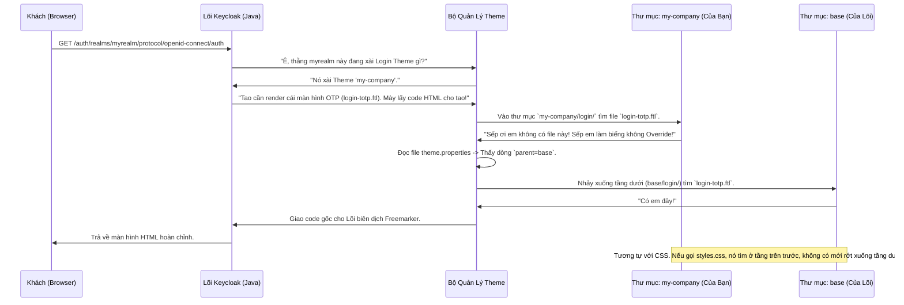

# Lesson 1: Kiến Trúc Kế Thừa Giao Diện (Theme Architecture)

> [!NOTE]
> **Category:** Theory & Practical (Lý thuyết & Thực hành)
> **Goal:** Hiểu sâu về cấu trúc của một Theme trong Keycloak. Nắm được nguyên lý "Inheritance" (Kế thừa) - cách Keycloak lắp ghép các file từ Theme gốc (`base`) với Theme của bạn để tạo ra sản phẩm cuối cùng. Biết cách định nghĩa file `theme.properties`.

## 1. Lý thuyết chuyên sâu (Detailed Theory)

### 1.1. Bốn Loại Giao Diện Của Hệ Sinh Thái
Khi nhắc đến "Theme" trong Keycloak, người ta thường nghĩ ngay đến màn hình Đăng Nhập. Nhưng thực tế, Keycloak có tới 4 mảng giao diện riêng biệt mà bạn có thể "độ chế":
1. **Login Theme:** Tất cả các màn hình liên quan đến Đăng nhập, Đăng ký, Quên mật khẩu, Nhập OTP, Xác thực Email, Báo lỗi,... (Đây là nơi bạn sẽ làm việc 90% thời gian).
2. **Account Theme:** Cổng thông tin cá nhân của người dùng (nơi họ tự đổi pass, cập nhật số điện thoại, xem lịch sử đăng nhập). Nằm ở đường dẫn: `/realms/{realm-name}/account/`.
3. **Admin Theme:** Giao diện Admin Console của chính Keycloak (Màn hình mà bạn đang dùng để cấu hình). Bạn hoàn toàn có thể đổi logo Keycloak thành logo công ty bạn ngay tại đây (Dành cho việc bán lại sản phẩm - White Label).
4. **Email Theme:** Layout của các bức thư gửi đi (Email OTP, Reset Password link).

### 1.2. Nguyên Lý Kế Thừa Xếp Lớp (Inheritance Mechanism)
Keycloak cung cấp sẵn một Theme gốc tên là `base` (Chứa 100% logic HTML Freemarker gốc nhưng không có CSS màu mè) và một Theme tên là `keycloak` (Kế thừa từ `base` và đắp thêm CSS cho đẹp).

**Luật Cấm Kỵ:** KHÔNG BAO GIỜ được mở thư mục `base` của Keycloak ra và sửa trực tiếp vào code gốc! (Khi nâng cấp phiên bản Keycloak, mọi thứ bạn sửa sẽ bốc hơi).

**Cách Làm Chuẩn Xác:** 
Bạn tạo ra một thư mục Theme của riêng mình (VD: `my-company-theme`). Trong thư mục đó, bạn tạo file `theme.properties` và chỉ định: `parent=base`. 
Sau đó, bạn chỉ tạo ra đúng những file bạn muốn Ghi Đè (Override). Ví dụ bạn muốn sửa màn hình Đăng Nhập, bạn chỉ tạo duy nhất 1 file `login/login.ftl`.
Lúc chạy, Keycloak sẽ xếp hình như sau: Nó chắp file `login.ftl` của bạn, đè lên file `login.ftl` của thằng `base`, nhưng những file khác như `register.ftl` (Bạn không tạo) thì nó sẽ lấy nguyên xi của thằng `base` đem ra xài! Quá trình này gọi là **Fallback**. Nhờ vậy, Theme của bạn cực kỳ nhẹ và không bao giờ bị lỗi thời khi Update Keycloak!

---

## 2. Luồng nội bộ & Cơ chế cấp thấp (Internal Workflow & Low-level Mechanisms)

Hành Trình Oanh Cáp Bọc Thép Của Quá Trình Kết Xuất Giao Diện:

---

## 3. Thực hành tốt nhất & Bảo mật (Best Practices & Security)

> [!TIP]
> **Tuyệt Đỉnh Tẩy Khách Mạng Bọc Thép (Nghệ Thuật Nhúng File Tĩnh Sạch Sẽ)**
> **Sai Lầm Khi Chèn Trực Tiếp File Tĩnh:** Lập trình viên Front-end hay có thói quen copy một cục file `style.css` và `logo.png` bỏ chung vào thư mục `login/` cùng chỗ với file `.ftl`, rồi trong code HTML viết: `<link href="style.css">`. Khi chạy, màn hình Đen Thui vì 404 Not Found!
> **Sự Thật Về Resource Mapping Của Keycloak:** 
> Keycloak là một ứng dụng bảo mật cao. Nó CẤM người dùng truy cập trực tiếp vào các thư mục chứa file Logic (`.ftl`). Chỉ có thư mục con có tên là `resources` (hoặc cấu hình trong properties) mới được phép Phơi Ra Ngoài Internet (Expose) để trình duyệt có thể tải về (CSS, JS, Fonts, Images).
> **Cách Làm Chuẩn:**
> 1. Trong thư mục Theme của bạn, tạo một thư mục con tên là `resources`.
> 2. Bỏ `css/style.css` và `img/logo.png` vào đó.
> 3. Trong file `.ftl`, bạn phải dùng biến môi trường đặc biệt của Freemarker để chỉ đường dẫn: 
>    `<link href="${url.resourcesPath}/css/style.css" rel="stylesheet" />`
>    ``
> Lúc này Keycloak sẽ tự động biến chữ `${url.resourcesPath}` thành một đường dẫn bảo mật siêu dài có gắn Cache-Busting Version (Ví dụ: `/resources/x1y2z/login/my-company/css/style.css`) để chống Trình duyệt lưu Cache cũ!

---

## 4. Câu hỏi Phỏng vấn (Interview Questions)

**1. Sếp Yêu Cầu Em Triển Khai Cái Theme `my-company` Lên Máy Chủ Linux Của Công Ty. Em Copy Thư Mục Đó Quăng Trực Tiếp Vào Đường Dẫn `/opt/keycloak/themes/` Và Restart Khởi Động Lại. Nó Chạy Rất Tốt. Nhưng Trưởng Phòng DevOps Lại Chửi Em Sấp Mặt Vì Tội "Deploy Mất Dạy". Tại Sao Trưởng Phòng Lại Chửi Em, Và Cách Deploy Đỉnh Cao Bằng File `.jar` Sẽ Như Thế Nào?**
- **Senior:** Dạ Thưa Sếp, Trưởng Phòng Chửi Là Đúng Bài Ạ!
  - **Tội Ác Ném Thư Mục (Hot-Deploy Bằng Thư Mục):** Ném nguyên xi Thư mục vào `/opt/keycloak/themes/` chỉ dùng cho Môi Trường Lập Trình (Dev). Ở môi trường Production chạy trên Kubernetes hay Docker Swarm có hàng chục Node máy chủ, mỗi lần Update Theme em phải SSH bằng tay vào từng máy ném thư mục vào à? Quá phi khoa học và không đúng luồng CI/CD (Continuous Integration).
  - **Chân Lý Đóng Gói (Jar Deployment):** Keycloak cho phép Đóng Gói toàn bộ Thư Mục Theme đó thành 1 file Thực Thi Duy Nhất (`.jar`). Bằng cách:
    1. Tạo một dự án Maven rỗng. Bỏ Thư mục Theme vào `src/main/resources/theme/`.
    2. Viết thêm 1 file đăng ký ở `META-INF/keycloak-themes.json` nội dung: `{"themes": [{"name" : "my-company", "types": [ "login", "email" ]}]}`.
    3. Gõ `mvn clean package` -> Đẻ ra file `my-company-theme.jar`.
    4. Cầm file Jar này ném vào thư mục `/opt/keycloak/providers/`.
  - **Lợi Ích Cốt Lõi:** Lúc này Theme được đối xử như một SPI Provider Java xịn sò! Em có thể ném File Jar đó lên Nexus, kéo bằng Dockerfile `COPY my-company-theme.jar /opt/keycloak/providers/`, rồi build lại Image `kc.sh build` (Cực Kỳ Chuẩn Quarkus Native). Chạy vạn dặm trên Kubernetes mượt mà, Immutable (Bất Biến) 100%!

---

## 5. Tài liệu tham khảo (References)
- **Keycloak Documentation:** Server Developer Guide - Themes.
