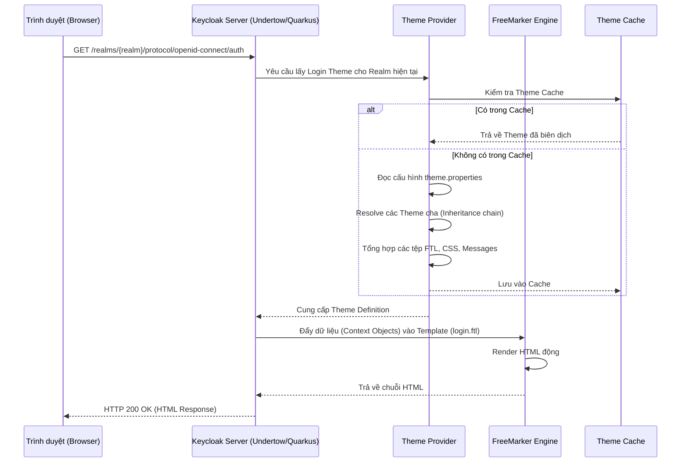

> [!NOTE]
> **Category:** Theory (Lý thuyết)
> **Goal:** Hiểu sâu về kiến trúc nội bộ của hệ thống Theme trong Keycloak, cách thức Keycloak xử lý giao diện người dùng và cơ chế phân cấp kế thừa (Inheritance) của Theme.

## 1. Lý thuyết chuyên sâu (Detailed Theory)
Keycloak cung cấp một hệ thống Theme (Chủ đề) mạnh mẽ cho phép tuỳ biến hoàn toàn giao diện người dùng như trang đăng nhập (Login), trang quản lý tài khoản (Account), bảng điều khiển quản trị (Admin) và email. Thay vì phải sửa đổi mã nguồn gốc, nhà phát triển có thể tạo ra các Theme độc lập.
Kiến trúc Theme của Keycloak dựa trên việc kết hợp **FreeMarker Template Engine (FTL)** cho việc render mã HTML động, cùng với các tệp tĩnh (CSS, JS, hình ảnh) và các tệp ngôn ngữ (Messages/I18N) để hỗ trợ đa ngôn ngữ.

**Các loại Theme chính trong Keycloak:**
- **Login:** Giao diện cho quá trình đăng nhập, đăng ký, quên mật khẩu, OTP.
- **Account:** Giao diện quản lý tài khoản cá nhân cho end-user.
- **Admin:** Giao diện quản trị của Keycloak (Admin Console).
- **Email:** Các template cho email gửi đi (ví dụ: xác thực email, reset mật khẩu).
- **Welcome:** Trang chào mừng khi mới cài đặt Keycloak.

**Cơ chế Kế thừa (Inheritance):**
Keycloak Theme hỗ trợ tính năng kế thừa cực kỳ tiện lợi. Một Theme có thể kế thừa từ một Theme khác (thường là theme mặc định `base` hoặc `keycloak`). Việc này giúp bạn chỉ cần ghi đè (override) những tệp cần thiết thay vì phải copy toàn bộ mã nguồn của theme gốc.

## 2. Luồng nội bộ & Cơ chế cấp thấp (Internal Workflow & Low-level Mechanisms)

Dưới đây là luồng xử lý của Keycloak khi một Request yêu cầu hiển thị trang đăng nhập.



**Giải thích luồng cấp thấp:**
1. Khi có HTTP Request đến URL xác thực, Keycloak xác định Realm và xem Realm đó đang được cấu hình sử dụng Theme nào.
2. `ThemeManager` tiến hành khởi tạo Theme. Nó sẽ duyệt qua tệp `theme.properties`. Nếu có khai báo `parent=keycloak`, nó sẽ đệ quy lấy các tệp từ theme `keycloak` và sau đó là theme `base`.
3. Nếu môi trường Production (Cache được bật), Keycloak sẽ cache lại cây thư mục theme này để tối ưu IO.
4. Keycloak thu thập các Object liên quan đến Context (như thông tin Realm, Client, URL endpoints) và truyền vào FreeMarker Engine.
5. FreeMarker dịch tệp `.ftl` thành HTML thuần dựa trên các biến truyền vào.

## 3. Thực hành tốt nhất & Bảo mật (Best Practices & Security)
- **Không bao giờ sửa trực tiếp theme `base` hoặc `keycloak`**: Đây là mã nguồn mặc định của hệ thống. Nếu bạn sửa trực tiếp, khi nâng cấp version Keycloak, mọi thay đổi sẽ bị ghi đè và mất đi. Luôn tạo một custom theme riêng và kế thừa từ theme `base`.
- **Bảo mật XSS trong FreeMarker**: FreeMarker mặc định có cơ chế escape HTML để chống Cross-Site Scripting (XSS). Tuy nhiên, nếu bạn sử dụng chỉ thị in raw (ví dụ `?no_esc`), bạn phải tự đảm bảo đầu vào đã được sanitize.
- **Tối ưu Cache trong Production**: 
  > [!IMPORTANT]
  > Trong môi trường Development, hãy tắt Theme Cache để có thể thấy thay đổi ngay lập tức sau mỗi lần lưu tệp. Trong môi trường Production, **BẮT BUỘC** phải bật Theme Cache để tránh Overhead khi Keycloak liên tục đọc tệp từ ổ cứng.

## 4. Cấu hình minh họa thực tế (Configuration Examples)

**Tắt Cache khi phát triển (Development):**
Khởi chạy Keycloak với tham số build để tắt cache hoặc cấu hình trong file:
```bash
# Đối với Keycloak Quarkus (Version >= 17)
bin/kc.sh start-dev --spi-theme-static-max-age=-1 --spi-theme-cache-themes=false --spi-theme-cache-templates=false
```

**Cấu trúc thư mục của một Custom Theme:**
```text
themes/
└── my-custom-theme/
    ├── login/
    │   ├── theme.properties    # Định nghĩa cấu hình theme (kế thừa, import css)
    │   ├── login.ftl           # Ghi đè trang đăng nhập
    │   └── resources/
    │       ├── css/
    │       │   └── style.css   # CSS tùy chỉnh
    │       └── img/
    │           └── logo.png    # Hình ảnh tùy chỉnh
    └── email/
        ├── theme.properties
        └── messages/
            └── messages_vi.properties # Ghi đè đa ngôn ngữ
```

**Nội dung cơ bản của tệp `theme.properties`:**
```properties
parent=keycloak
import=common/keycloak
styles=css/style.css css/extra.css
meta=viewport==width=device-width,initial-scale=1
```

## 5. Trường hợp ngoại lệ (Edge Cases)
- **Theme vỡ layout sau khi nâng cấp Keycloak**: Keycloak thỉnh thoảng thay đổi cấu trúc của DOM hoặc các biến FreeMarker trong theme `base` giữa các Major Versions. Nếu custom theme của bạn ghi đè toàn bộ tệp `.ftl` cũ, nó có thể gặp lỗi. **Cách khắc phục**: Chỉ ghi đè các tệp thực sự cần thiết, cố gắng sử dụng CSS để thay đổi hiển thị thay vì sửa đổi sâu vào cấu trúc HTML nếu không bắt buộc. Đọc kỹ Release Notes khi nâng cấp.
- **Lỗi không tìm thấy file Messages**: Khi thêm ngôn ngữ mới (ví dụ tiếng Việt), nếu tệp `messages_vi.properties` bị lỗi encoding (không phải UTF-8), Keycloak sẽ hiển thị lỗi "?key?" trên giao diện.

## 6. Câu hỏi Phỏng vấn (Interview Questions)
1. **[Junior]** Làm thế nào để tạo một custom theme trong Keycloak mà không phải viết lại toàn bộ HTML?
   *Đáp án*: Sử dụng cơ chế kế thừa (Inheritance). Tạo thư mục theme mới, tạo tệp `theme.properties` và thiết lập biến `parent=base` hoặc `parent=keycloak`. Chỉ ghi đè (override) những tệp `.ftl` hoặc CSS cần thiết.
2. **[Junior]** Tại sao khi tôi thay đổi nội dung file CSS trong custom theme nhưng tải lại trình duyệt không thấy có tác dụng?
   *Đáp án*: Có thể do trình duyệt đang cache (cần Hard Refresh / Clear Cache) hoặc Keycloak Theme Cache đang được bật. Trong môi trường Dev, cần truyền các tham số `--spi-theme-cache-themes=false` để vô hiệu hóa cache.
3. **[Senior]** FreeMarker Template trong Keycloak có thể gọi trực tiếp các Java class hay truy cập vào Database được không?
   *Đáp án*: Không. Kiến trúc Keycloak giới hạn Context Objects truyền vào FreeMarker. Để lấy dữ liệu từ Database (ví dụ thuộc tính custom của User), bạn phải lấy qua các đối tượng đã được Keycloak expose sẵn (như `user.attributes`), hoặc nếu thiếu, phải viết Custom SPI (ví dụ custom Authenticator) để đẩy thêm dữ liệu vào Freemarker Context.
4. **[Senior]** Làm thế nào để triển khai Custom Theme vào môi trường Production an toàn và tự động hóa?
   *Đáp án*: Không sao chép thư mục thủ công. Đóng gói theme thành một file `.jar` (bao gồm `META-INF/keycloak-themes.json`) và copy file `.jar` đó vào thư mục `providers/` của Keycloak, sau đó chạy lệnh `kc.sh build` để tối ưu hóa.
5. **[Senior]** Khi có Request vào trang đăng nhập, bằng cách nào Keycloak xác định được đang cần hiển thị Theme bằng ngôn ngữ (locale) nào?
   *Đáp án*: Keycloak xét theo thứ tự ưu tiên: Tham số `ui_locales` trên URL Request (từ OIDC/OAuth2 protocol) -> Cookie `KEYCLOAK_LOCALE` -> Cấu hình User preferred locale (nếu người dùng đã từng đăng nhập và lưu trong DB) -> Căn cứ vào Header `Accept-Language` của trình duyệt -> Cuối cùng fallback về Default Locale cấu hình trong Realm.

## 7. Tài liệu tham khảo (References)
- [Keycloak Server Developer Guide - Themes](https://www.keycloak.org/docs/latest/server_development/#_themes)
- [FreeMarker Java Template Engine Documentation](https://freemarker.apache.org/docs/index.html)
