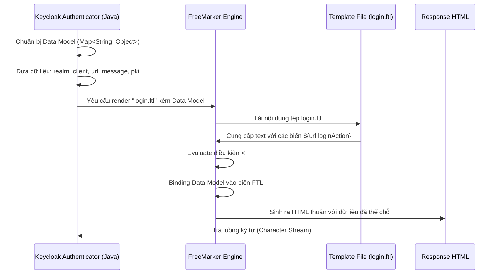

> [!NOTE]
> **Category:** Theory (Lý thuyết)
> **Goal:** Nắm vững cách thức hoạt động của FreeMarker Template Engine (FTL) trong Keycloak, cú pháp cơ bản và cách tương tác với dữ liệu bối cảnh (Context Objects).

## 1. Lý thuyết chuyên sâu (Detailed Theory)
**FreeMarker (FTL)** là một Java-based template engine mạnh mẽ. Vai trò chính của nó là sinh ra mã văn bản (thường là HTML, XML, hoặc text thuần túy) dựa trên các tệp mẫu (templates) và dữ liệu cung cấp từ backend Java.
Trong Keycloak, FreeMarker là bộ não đằng sau quá trình Server-side rendering cho các luồng: Login (Đăng nhập, đăng ký), Admin Console (phiên bản cũ) và Email (Nội dung email gửi cho người dùng).
Khi thiết kế Custom Theme, chúng ta ít khi phải viết Java. Thay vào đó, Keycloak nhồi các đối tượng Java (như Realm Model, User Model, thông báo lỗi, danh sách nhà cung cấp định danh) vào một "Data Model". FreeMarker sẽ lấy Data Model này, kết hợp với các tệp `.ftl` do người dùng tự viết để xuất ra trang HTML hoàn chỉnh.

**Đặc điểm nổi bật của FreeMarker:**
- Cú pháp chặt chẽ: Dùng cặp ngoặc `<# ... >` cho các chỉ thị (directives) và `${ ... }` để nội suy biến (interpolation).
- Khả năng Macro (Hàm dùng chung): Hỗ trợ tái sử dụng mã HTML ở nhiều nơi.
- Built-in hỗ trợ đa ngôn ngữ và format chuỗi cực kỳ mạnh mẽ.

## 2. Luồng nội bộ & Cơ chế cấp thấp (Internal Workflow & Low-level Mechanisms)

Dưới đây là cơ chế cấp thấp khi Keycloak thực hiện Render HTML bằng FreeMarker cho Form Login:



**Giải thích:**
1. Khi một trang (như Đăng nhập) cần hiển thị, Keycloak Java Code sẽ tạo ra một Hash Map chứa hàng tá biến bối cảnh.
2. Form URL được sinh ra bằng Java và đẩy vào map với key là `url`.
3. Thông báo lỗi được đẩy vào map với key là `message`.
4. FreeMarker đọc tệp `login.ftl`. Nó nội suy biến `${url.loginAction}` và thay thế thành giá trị URL thật (ví dụ: `/realms/master/login-actions/...`).
5. Kết quả cuối cùng là một chuỗi HTML được ném về phía Client.

## 3. Thực hành tốt nhất & Bảo mật (Best Practices & Security)
- **Null Safety**: FreeMarker rất nghiêm ngặt. Nếu bạn gọi `${myVariable}` mà biến đó là null hoặc không tồn tại, nó sẽ ném ra exception và trang sẽ sập (Lỗi HTTP 500). 
  > [!IMPORTANT]
  > Luôn sử dụng toán tử Default value `${myVariable!'Default Text'}` hoặc kiểm tra tồn tại `<#if myVariable??>` để tránh lỗi Null.
- **Escape tự động XSS**: Keycloak đã kích hình tính năng auto-escaping của FreeMarker. Mọi chuỗi biến in ra `${user.firstName}` chứa thẻ `<script>` đều bị mã hóa thành `&lt;script&gt;`. Không dùng chỉ thị `?no_esc` trừ khi bạn kiểm soát 100% dữ liệu gốc.
- **Dùng Macro (Template layout)**: Tái sử dụng layout gốc (như header, footer) bằng cách sử dụng các macro `<@layout.registrationLayout>` đã có sẵn trong theme `base`, thay vì chèn code HTML thủ công ở mọi file `.ftl`.

## 4. Cấu hình minh họa thực tế (Configuration Examples)

**Cú pháp FTL thường gặp trong Theme Keycloak:**

1. **Hiển thị giá trị biến và đa ngôn ngữ (I18N):**
```html
<!-- Dùng biến từ object -->
<form action="${url.loginAction}" method="post">
<!-- Dùng msg() function để lấy text từ properties file đa ngôn ngữ -->
<label>${msg("usernameOrEmail")}</label>
<input type="text" name="username" value="${(login.username!'')}" />
```

2. **Kiểm tra Null và rẽ nhánh điều kiện:**
```html
<#if message?has_content>
    <div class="alert alert-${message.type}">
        <!-- Hiển thị nội dung lỗi nếu có -->
        ${message.summary}
    </div>
</#if>

<!-- Kiểm tra object có tồn tại thuộc tính không -->
<#if realm.registrationAllowed?? && realm.registrationAllowed>
    <span><a href="${url.registrationUrl}">${msg("doRegister")}</a></span>
</#if>
```

3. **Vòng lặp (Hiển thị danh sách Identity Providers):**
```html
<#if social.providers??>
    <ul class="provider-list">
    <#list social.providers as p>
        <li><a href="${p.loginUrl}" id="zocial-${p.alias}">${p.displayName}</a></li>
    </#list>
    </ul>
</#if>
```

## 5. Trường hợp ngoại lệ (Edge Cases)
- **Biến không được expose**: Rất nhiều lúc bạn muốn lấy email của người dùng hiển thị ra màn hình Login, nhưng `${user.email}` lại lỗi Null. Lý do: Tại màn hình Login ban đầu, người dùng chưa đăng nhập, nên object `user` không tồn tại trong Data Model. Phải bắt buộc hiểu rõ ở file `ftl` nào thì đối tượng nào (Context) có sẵn để truy cập.
- **Syntax Error làm Crash toàn bộ UI**: Một thiếu sót nhỏ như quên đóng ngoặc `</#if>` hoặc sai cú pháp trong `login.ftl` sẽ khiến trang lỗi hiển thị toàn bộ màn hình trắng hoặc thông báo "Unexpected error". **Khắc phục**: Xem log của Keycloak server (console log) để biết FreeMarker đang báo lỗi ở dòng số mấy.

## 6. Câu hỏi Phỏng vấn (Interview Questions)
1. **[Junior]** Sự khác biệt giữa `${variable}` và `${variable!}` trong FreeMarker là gì?
   *Đáp án*: `${variable}` sẽ gây lỗi (Exception) và dừng render nếu biến `variable` mang giá trị null hoặc không tồn tại. `${variable!}` (dấu chấm than) là toán tử default, nếu biến null, nó sẽ in ra chuỗi rỗng (không in gì cả) mà không văng lỗi.
2. **[Junior]** Làm sao để dịch chữ "Sign In" ra tiếng Việt trong file FTL của Keycloak?
   *Đáp án*: Không hardcode "Đăng nhập" vào file FTL. Thay vào đó dùng `${msg("doLogIn")}` trong FTL. Sau đó khai báo key `doLogIn=Đăng nhập` trong file `messages_vi.properties` của thư mục theme.
3. **[Senior]** Khi muốn thêm một biến dữ liệu Custom từ Database (mà mặc định Keycloak không cấp) vào màn hình FTL, bạn làm thế nào?
   *Đáp án*: Không thể gọi thẳng DB từ FTL. Phải viết một Custom SPI (ví dụ Custom Authenticator Form hoặc Custom FormAction bằng Java). Trong đoạn mã Java, truy vấn DB và đẩy giá trị vào form context bằng cách gọi `context.form().setAttribute("myCustomVar", value)`. Sau đó trong FTL, mới có thể gọi `${myCustomVar}`.
4. **[Senior]** Làm thế nào để bypass cơ chế Auto-escaping (bảo vệ XSS) của FreeMarker nếu muốn render HTML thô từ một biến?
   *Đáp án*: Sử dụng `?no_esc`. Ví dụ `${myHtmlString?no_esc}`. Tuy nhiên, cách này rủi ro cao, phải đảm bảo chuỗi `myHtmlString` được sanitize từ backend Java.
5. **[Senior]** Layout Macro (`<@layout.registrationLayout>`) hoạt động như thế nào trong Theme Keycloak?
   *Đáp án*: Keycloak định nghĩa sẵn một tệp `template.ftl` làm file bộ khung. Layout macro cho phép các tệp con (như `login.ftl`, `register.ftl`) kế thừa khung sườn này (như nạp thẻ `<head>`, body background) và chỉ "nhét" phần nội dung form riêng biệt vào các vùng (nested blocks) được định nghĩa sẵn, giúp giảm trùng lặp mã code (DRY principle).

## 7. Tài liệu tham khảo (References)
- [FreeMarker Template Engine Manual](https://freemarker.apache.org/docs/index.html)
- [Keycloak Official Docs - Server Developer - Custom Themes](https://www.keycloak.org/docs/latest/server_development/#_themes)
