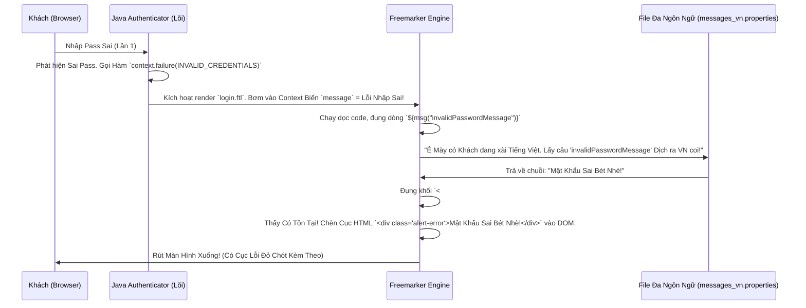

# Lesson 2: Nội Suy Dữ Liệu Bằng Freemarker (Freemarker Templates)

> [!NOTE]
> **Category:** Theory & Practical (Lý thuyết & Thực hành)
> **Goal:** Lột bỏ lớp vỏ bọc đáng sợ của `.ftl`. Khám phá cách Lõi Java của Keycloak "bơm" dữ liệu (Tên người dùng, Lời báo lỗi, Đường dẫn POST Form) vào trong file HTML thông qua các biến nội suy của Freemarker Engine.

## 1. Lý thuyết chuyên sâu (Detailed Theory)

### 1.1. Freemarker Là Cái Quái Gì?
Freemarker là một Template Engine của Java. Nhiệm vụ của nó giống y hệt như JSP, hay Blade (của Laravel PHP), hay Jinja (của Python).
Nó lấy một cái Khung xương HTML (`.ftl`), nhìn thấy chỗ nào có lệnh `<#if>` hoặc biến `${xyz}`, nó sẽ thế dữ liệu thật (được lấy ra từ Java Backend) vào chỗ đó, và nôn ra một trang HTML thuần túy 100% gửi xuống Trình duyệt của Khách hàng. 
Trình duyệt HOÀN TOÀN KHÔNG BIẾT Freemarker là gì, nó chỉ nhìn thấy HTML. Vì thế, bạn đừng dại dột viết lệnh Javascript bằng hàm của Freemarker! (JS chạy ở phía Client, Freemarker chạy xong xuôi ở phía Server Server-side Rendering rồi).

### 1.2. Mổ Bụng Cấu Trúc File `login.ftl` Của Lõi Keycloak
Khi bạn copy file `login.ftl` từ thư mục `base/login/` về thư mục của bạn để chỉnh sửa, bạn sẽ thấy nó không có thẻ `<html>`, `<body>`, `<head>` gì cả! Mã của nó bắt đầu bằng một cục rất kinh khủng:

```freemarker
<#import "template.ftl" as layout>
<@layout.registrationLayout displayMessage=!messagesPerField.existsError('username','password') displayInfo=realm.password && realm.registrationAllowed && !registrationDisabled; section>
    <#if section = "header">
        ${msg("loginAccountTitle")}
    <#elseif section = "form">
        <!-- Mã HTML chứa Thẻ Form Đăng Nhập Của Bạn Nằm Ở Đây -->
        <form id="kc-form-login" onsubmit="login.disabled = true; return true;" action="${url.loginAction}" method="post">
           ... <input id="username" class="${properties.kcInputClass!}" name="username" /> ...
        </form>
    </#if>
</@layout.registrationLayout>
```

**Bí Mật Của Macros (`<#import>` và `<@layout>`):**
Keycloak dùng Kỹ Thuật Đóng Khung Layout (Giống kiểu Master Page trong ASP.NET).
File `template.ftl` (nằm ở gốc) chính là file bọc ngoài cùng, chứa các thẻ `<html>`, `<head>`, nhúng thẻ `<link css>` và vẽ cái Box màu Trắng bọc bên ngoài.
File `login.ftl` chỉ đóng vai trò "Điền Ruột". Nó gọi lệnh `<@layout.registrationLayout ... ; section>` để cầu xin Layout bọc nó lại.
Cái biến `section` là Khớp Nối (Placeholder). Khi Layout gọi "Điền phần Header đi", khối `<#if section = "header">` của bạn sẽ được chèn vào. Khi Layout gọi "Điền phần Form đi", thẻ `<form>` của bạn sẽ hiện ra.

**Làm Chủ Hoàn Toàn (Đập Đi Xây Lại 100%):**
Nếu Sếp chê: *"Cái khung trắng trắng nằm giữa màn hình của Keycloak xấu quá. Xóa hết làm lại giao diện Đăng Nhập Tràn Viền cho anh!"*
Cách làm: BẠN HÃY XÓA TOÀN BỘ CÁI LỆNH `<#import>` KÌA ĐI! Vứt sạch sành sanh! Hãy tự gõ lại thẻ `<!DOCTYPE html> <html> <head>...` từ con số 0 trong file `login.ftl` của bạn! Bọn Freemarker không ép bạn phải xài Layout của nó. Bạn có quyền làm Chủ Bầu Trời!
Tuy nhiên, hãy cẩn trọng! Bạn phải tự tay gắn những biến chết người như: URL của Form Action, Biến Cảnh Báo Lỗi,... nếu không form sẽ bấm không chạy!

---

## 2. Luồng nội bộ & Cơ chế cấp thấp (Internal Workflow & Low-level Mechanisms)

Hành Trình Oanh Cáp Bọc Thép Của Việc Bơm Dữ Liệu Lỗi (Error Message) Bằng Đa Ngôn Ngữ:



---

## 3. Thực hành tốt nhất & Bảo mật (Best Practices & Security)

> [!CAUTION]
> **Tuyệt Đỉnh Tẩy Khách Mạng Bọc Thép (Thảm Họa Chết Bấm Nút Submit Chạy Báo Lỗi 404)**
> **Tội Ác Gõ Cứng (Hard Code) Đường Dẫn Action Của Form:** Rất nhiều Lập trình viên Front-end khi cắt HTML bằng React hoặc Bootstrap, họ dọn dẹp file `login.ftl` sạch bóng, xong họ copy nguyên cục HTML tĩnh đập vào. Và thẻ form họ để nguyên sinh: `<form action="/login" method="post">`.
> **Hậu Quả Chết Lạc Lối:** 
> Khi chạy trên Server thật, Bấm Nút Đăng Nhập -> Màn Hình báo Lỗi HTTP 404 Căng Đét! Luồng Authentication của Keycloak bị nứt toác!
> **Biện Pháp Sống Còn Cấp Thần Thánh:**
> Luồng Đăng Nhập Của Keycloak Là Một Máy Trạng Thái Động (Dynamic State Machine). Mã Sinh Ra Token Thay Đổi Từng Milisec Theo Từng Luồng! Đường dẫn POST dữ liệu về KHÔNG BAO GIỜ LÀ CỐ ĐỊNH!
> Bắt Buộc, Sống Chết Gì Cũng Bắt Buộc, Thuộc Tính `action` Của Thẻ `<form>` Đăng Nhập Phải Được In Ra Bằng Biến Động Của Freemarker:
> `<form id="kc-form-login" action="${url.loginAction}" method="post">`
> 
> Tương Tự, Đường Dẫn Quên Mật Khẩu Cũng Phải Lấy Từ Biến Động:
> `<a href="${url.loginResetCredentialsUrl}">Quên Pass Phải Không Cục Cưng?</a>`
> Nếu Mất Các Biến Này, Màn Hình Đăng Nhập Của Bạn Coi Như Phế Vật! Chỉ Là Cục Gạch Trưng Bày Đẹp Nhìn Chứ Không Sài Được!

---

## 4. Câu hỏi Phỏng vấn (Interview Questions)

**1. Sếp Đưa Cho Em 1 Bộ HTML/CSS Của Giao Diện Đăng Nhập (Do Đội UX/UI Thiết Kế Cực Kỳ Đẹp, Đầy Đủ Ảnh Nền, Nút Bấm Có Viền Neon). Sếp Yêu Cầu Gắn Vào Keycloak. Em Sẽ Làm Các Bước Thế Nào Để Không Bị Lạc Giữa Đống Code Freemarker Rối Rắm Của Keycloak?**
- **Senior:** Dạ Thưa Sếp, Em Có Quy Trình Đập Đi Xây Lại Xương Cốt Cực Kỳ Khoa Học Như Sau:
  - **Bước 1 (Lấy Khung Lõi Chuẩn):** Bất Kể Đội Design Cắt HTML Đẹp Tới Đâu, Bọn Họ Cắt Bằng Cấu Trúc Tĩnh. Em Sẽ Không Nhét Code Bọn Họ Vào Thẳng Keycloak Mà Làm Ngược Lại! Em Mở File `base/login/login.ftl` Lên, Copy Nguyên Xi Nó Về Theme Của Mình Làm Cái Xương Khung Để Giữ An Toàn Tuyệt Đối Cho Mấy Biến Động (url.loginAction, message.error...).
  - **Bước 2 (Xẻ Thịt Bỏ Cốt Layout):** Em Sẽ Vứt Cái Thẻ `<@layout.registrationLayout>` Rườm Rà Ra Khỏi File. Bắt Đầu Gõ Lại Thẻ `<!DOCTYPE html><html>...` Từ Đầu Của File.
  - **Bước 3 (Nhúng Đồ Trang Sức Của Đội Design):** Em Bê File `style.css` Và Ảnh Neon Của Đội Design Ném Vào Thư Mục `resources/` Của Theme. Trong Mã `head`, Gọi Đường Dẫn Chuẩn Của Keycloak Kéo CSS Về: `<link href="${url.resourcesPath}/css/style-cua-design.css" />`.
  - **Bước 4 (Khâu Da Bọc Thịt - Lồng Ghép):** Đây Là Bước Mất Máu Nhất. Em Lôi Cái Thẻ `<form>` Cực Đẹp Của Design Vứt Vào Code. NHƯNG, Bắt Buộc Phải Sửa Lại Tên Biến Name Chống Móm Của Keycloak! Cụ Thể: Thẻ Nhập Tài Khoản BẮT BUỘC Phải Là `<input name="username">`. Thẻ Nhập Mật Khẩu BẮT BUỘC Phải Là `<input name="password">`. Nút Submit Thì Giữ Nguyên. Lấy Biến Báo Lỗi Khối `<#if message?has_content>` Nhét Vào Ngay Trên Nút Submit Lấy Cái Div Alert Đỏ Của Design Khỏa Lấp Vào.
  - Xong! Test Thử Cổng Trực Tiếp Trên Trình Duyệt! Form Tuyệt Đẹp Mượt Mà Đạt Đỉnh Của Chóp Mà Không Chết Bất Cứ Khớp Nối Backend Nào!

---

## 5. Tài liệu tham khảo (References)
- **Apache Freemarker Manual:** Học cú pháp cơ bản (`<#list>`, `<#if>`, `${}`) tại trang chủ Freemarker.org. Nó rất dễ và giống mọi ngôn ngữ Template khác.
