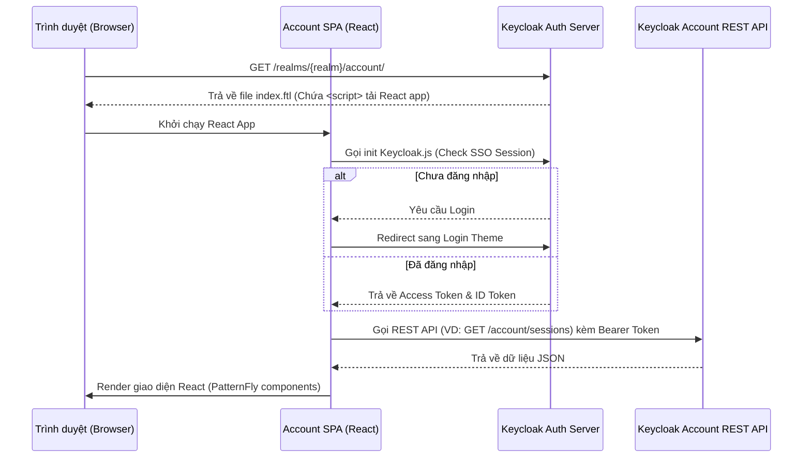

> [!NOTE]
> **Category:** Theory (Lý thuyết)
> **Goal:** Tìm hiểu cấu trúc và kiến trúc của Account Console v2 và v3 trong Keycloak, cách thức nó được xây dựng bằng công nghệ Frontend (React/PatternFly) và cách tùy biến.

## 1. Lý thuyết chuyên sâu (Detailed Theory)
**Account Console** là giao diện tự phục vụ (self-service) dành cho người dùng cuối (End-User) trong Keycloak. Tại đây, người dùng có thể đổi mật khẩu, cập nhật thông tin cá nhân, cấu hình xác thực đa yếu tố (MFA - OTP), quản lý các phiên đăng nhập (Sessions) và xem các ứng dụng đã cấp quyền (Consent).
Khác với giao diện Login chủ yếu render HTML từ server thông qua FreeMarker, **Account Console** từ bản Keycloak mới được xây dựng như một ứng dụng **Single Page Application (SPA)**.
- **Account Console V2:** Được xây dựng bằng React và thư viện UI PatternFly 4. Mặc dù vẫn có một file `index.ftl` gốc để boot ứng dụng, nhưng phần lớn logic UI chạy trên trình duyệt (Client-side) và gọi REST API về backend.
- **Account Console V3:** Nâng cấp sử dụng PatternFly 5 và cải tiến mạnh mẽ về hiệu năng, được thiết kế dưới dạng React component linh hoạt hơn, nhưng triết lý SPA vẫn không đổi.

Việc tùy biến Account Console phức tạp hơn so với Login Theme vì bạn không chỉ thay đổi HTML/CSS tĩnh, mà có thể phải ghi đè các React Components hoặc ít nhất là cung cấp custom CSS/chỉnh sửa nội dung JSON để định cấu hình UI tĩnh.

## 2. Luồng nội bộ & Cơ chế cấp thấp (Internal Workflow & Low-level Mechanisms)

Quá trình boot của Account Console diễn ra như một ứng dụng React chuẩn kết hợp với cơ chế OIDC (OpenID Connect) để lấy Session.



**Giải thích:**
1. Khi truy cập vào URL `/account`, Keycloak backend trả về một bộ khung tĩnh `index.ftl` có nhúng các file JavaScript (bundle) của Account Console.
2. Trình duyệt tải JS và khởi chạy React Application.
3. React App sử dụng Keycloak JS Adapter để kiểm tra trạng thái xác thực. Nếu chưa có phiên, nó sẽ trigger luồng Authorization Code Flow sang trang Login.
4. Sau khi đăng nhập thành công, React App lấy được Access Token và gọi các endpoint REST API nội bộ của Keycloak (bắt đầu bằng `/realms/{realm}/account/`) để lấy dữ liệu profile, sessions, và hiển thị động lên màn hình.

## 3. Thực hành tốt nhất & Bảo mật (Best Practices & Security)
- **Tùy biến ở mức cấu hình trước khi động vào Code**: Keycloak cung cấp file `theme.properties` cho account theme, nơi bạn có thể tiêm (inject) các file CSS tùy chỉnh. Đa phần các yêu cầu đổi màu sắc (Branding) có thể thực hiện bằng cách override CSS variables của PatternFly mà không cần build lại React app.
- **Bảo vệ Access Token**: Vì Account Console là một SPA, Token nằm ở trình duyệt. Keycloak tự động quản lý bảo mật thông qua thư viện adapter chuẩn và sử dụng các cơ chế bảo mật (như SameSite cookies, CSRF protection).
- **Cẩn trọng khi override file gốc**: 
  > [!WARNING]
  > Tùy biến sâu Account Console V2/V3 (bằng cách fork source code React của Keycloak) có rủi ro bảo trì (maintenance) khổng lồ khi nâng cấp version Keycloak. Nếu bắt buộc, hãy dùng phương pháp Extension hoặc Inject custom React bundles.

## 4. Cấu hình minh họa thực tế (Configuration Examples)

**Tùy biến CSS cơ bản cho Account Console:**
Thay vì viết lại React App, chúng ta tạo một custom theme kế thừa Account V3 và inject CSS riêng.
Cấu trúc:
```text
themes/
└── my-account-theme/
    └── account/
        ├── theme.properties
        └── resources/
            └── css/
                └── custom-account.css
```

File `theme.properties`:
```properties
parent=keycloak.v3
import=common/keycloak
styles=css/custom-account.css
```

File `custom-account.css` (Ghi đè biến CSS của PatternFly):
```css
/* Đổi màu chủ đạo (Primary Color) của giao diện sang màu đỏ */
:root {
  --pf-v5-global--primary-color--100: #cc0000;
  --pf-v5-global--primary-color--200: #990000;
}

/* Ẩn logo mặc định của Keycloak nếu cần */
.pf-v5-c-brand {
    display: none !important;
}
```

## 5. Trường hợp ngoại lệ (Edge Cases)
- **CORS Error khi Account Console gọi API**: Nếu bạn cấu hình Account Theme để gọi một External API (VD: lấy điểm thưởng của user từ hệ thống khác), bạn sẽ gặp lỗi CORS vì trình duyệt chặn do khác domain. **Khắc phục**: Phải cấu hình API Gateway của bên thứ 3 cho phép nguồn (origin) của Keycloak, hoặc viết Backend Proxy.
- **Tương thích ngược (Backward Compatibility)**: Khi nâng cấp từ Keycloak cũ (dùng Account V1 - HTML thuần) lên phiên bản mới (Account V2/V3 - SPA React), các custom FTL cũ của Account V1 sẽ hoàn toàn bị phớt lờ. Cần phải đập đi làm lại phần CSS/UI theo kiến trúc mới.

## 6. Câu hỏi Phỏng vấn (Interview Questions)
1. **[Junior]** Sự khác biệt lớn nhất về mặt công nghệ giữa Login Theme và Account Theme (từ bản V2) trong Keycloak là gì?
   *Đáp án*: Login Theme được Server-side render bằng FreeMarker (FTL) trả về HTML thẳng từ server. Account Theme V2/V3 là một ứng dụng Client-side (SPA) viết bằng React gọi REST API từ Keycloak backend.
2. **[Junior]** Tôi muốn thay đổi logo ở Account Console, tôi có cần phải biết React không?
   *Đáp án*: Không bắt buộc. Có thể sử dụng file `theme.properties` để inject một file custom CSS, trong đó dùng CSS để ẩn logo cũ và thay background-image cho class CSS tương ứng.
3. **[Senior]** Quá trình Account Console SPA giao tiếp với Account API của Keycloak được bảo mật như thế nào, tránh bị attacker giả mạo request?
   *Đáp án*: SPA sử dụng Access Token dưới dạng Bearer Header khi gọi Account API. Cùng với đó, Keycloak áp dụng cấu hình CORS chặt chẽ cho endpoint API này, đảm bảo chỉ có origin của chính Keycloak (hoặc các web origin được khai báo cho account client) mới được phép fetch dữ liệu.
4. **[Senior]** Làm thế nào để thêm một trang menu (tab) mới hoàn toàn vào Account Console V3?
   *Đáp án*: Khó làm với config tĩnh. Cần sử dụng cơ chế mở rộng (Extension mechanism) của Keycloak Account UI. Trong Keycloak bản mới, có thể cung cấp các file `app.js` được khai báo trong `theme.properties` để inject thêm Component vào React Router của Account Console gốc.
5. **[Senior]** Giải thích lý do Keycloak chọn chuyển đổi Account Console từ FTL sang React/SPA?
   *Đáp án*: Trải nghiệm người dùng (UX) tốt hơn (không phải tải lại cả trang khi click chuyển tab), dễ dàng tích hợp thư viện UI hiện đại (PatternFly), giảm tải render cho Server (Server chỉ trả về JSON via API thay vì parse HTML file), và tách biệt rõ ràng giữa logic backend và frontend.

## 7. Tài liệu tham khảo (References)
- [Keycloak Account Console Extension Guide](https://www.keycloak.org/docs/latest/server_development/#_account)
- [PatternFly Framework Documentation](https://www.patternfly.org/)
