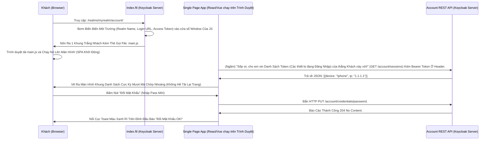

# Lesson 3: Cổng Thông Tin Cá Nhân (Account Console Theme)

> [!NOTE]
> **Category:** Theory & Practical (Lý thuyết & Thực hành)
> **Goal:** Trái ngược hoàn toàn với Login Theme (sử dụng HTML tĩnh render từ Server bằng Freemarker), Giao diện Cổng Thông Tin Cá Nhân (Account Console - Nơi Khách Hàng tự vô đổi Mật khẩu, cài mã OTP 2FA, Xem lịch sử máy nào đang login vào app của mình) lại là một Thế Giới Hoàn Toàn Khác. Bài học này đưa bạn thâm nhập vào quả bom Single Page Application (SPA) viết bằng React.js giấu kín trong bụng Keycloak.

## 1. Lý thuyết chuyên sâu (Detailed Theory)

### 1.1. Sự Tách Biệt Thế Giới (SSR vs SPA)
Ở Lesson trước, bạn đã học cách sửa `login.ftl` (Đăng Nhập). Nó dùng công nghệ **Server-Side Rendering (SSR)**. Mỗi lần bấm Nút là Trình duyệt giật tung lên, Load lại trang trắng xóa (Full Page Reload) rồi mới hiện trang tiếp theo.
Tại sao? Vì luồng Đăng nhập yêu cầu Bảo Mật tuyệt đối, không được để lọt các đoạn Javascript thao túng mã Token sinh ra trong vòng đời Authentication. 

Nhưng khi Khách Hàng đã vào được BÊN TRONG Cổng Thông Tin (Đường dẫn: `http://localhost:8080/realms/myrealm/account/`), thì lại là một chuyện khác. Trải nghiệm người dùng ở đây đòi hỏi sự mượt mà của một cái Ứng Dụng Web Hiện Đại (Chuyển trang không giật, Bấm nút gọi API ngầm...).
Và Red Hat đã vứt bỏ Freemarker để đắp nguyên một cái **React.js Application** vào chỗ này (Kể từ phiên bản Keycloak 22 trở lên, nó dùng React. Còn hồi xưa thì dùng Angular).

### 1.2. Mở Hộp Sọ Account Theme V3
Khi bạn tạo một thư mục Theme cho riêng mình và đặt tên là `account` (Ví dụ: `my-company/account/`), bạn đang định override cái giao diện React đó. 
Điều kinh khủng là: Code của nó CỰC KỲ KHÓ SỬA TRỰC TIẾP! Nó đã được Bundle (Đóng gói nén bằng Webpack) thành các file `.js` khổng lồ không thể đọc được bằng mắt người.
Keycloak phiên bản mới (V3) đã giải bài toán này bằng cách mở một số "Khe Cắm Cấu Hình" (Configuration Slots) cho phép bạn ném CSS Override vào, thay Đổi Logo mà không cần phải đụng vào Code React gốc. (Sửa file `theme.properties`).

Nhưng nếu Sếp bắt buộc: *"Giao diện này của Bọn React mặc định là Sidebar bên Trái, Đỉnh đầu có Banner Đen thùi lùi. Xấu mù. Gỡ mẹ cái cục React đó ra, tự viết cho Anh 1 bộ SPA bằng Vue.js 3 gắn vào!"*
Tin vui là: BẠN CÓ QUYỀN LÀM ĐIỀU ĐÓ!

File Khởi Thủy: `index.ftl`
Trong lòng Account Theme gốc, chỉ có DUY NHẤT 1 file Freemarker là `index.ftl`. File này có vai trò cực kỳ quan trọng: Nạp Javascript khởi động của Thằng SPA! 
Nếu bạn xóa thẻ `<script src="react-bundle.js">` đi, và thay bằng thẻ `<script src="my-vuejs-app.js">`... Bạn hoàn toàn Hất Cẳng Được React và tự nắm quyền kiểm soát API của Account Console bằng con Cưng Của Bạn!

---

## 2. Luồng nội bộ & Cơ chế cấp thấp (Internal Workflow & Low-level Mechanisms)

Hành Trình Oanh Cáp Bọc Thép Biến Keycloak Thành API Server Cho Quản Trị User:

---

## 3. Thực hành tốt nhất & Bảo mật (Best Practices & Security)

> [!TIP]
> **Tuyệt Đỉnh Tẩy Khách Mạng Bọc Thép (Thảm Họa Đập Code React Trong Sợ Hãi)**
> **Tội Ác Nỗ Lực Sửa Code React Bằng Cách Copy Từng File Của Lõi:** Lập trình viên tải bộ Code Gốc (Source) của Keycloak trên Github về, Lục lọi vào thư mục Account React V3. Thay đổi File Component. Xong NPM Build ra cục Bundle. Copy nguyên Cục Đó ném đè vào Theme. Đến ngày đẹp trời nâng cấp bản Vá Lỗi (Patch Version) của Keycloak (Từ 24.0.1 lên 24.0.5) => Giao Diện Đứt Toác Vì API Lõi Nó Đổi Cấu Trúc Trả Về! Lập Trình Viên Méo Mặt Khóc Lóc Trong Đêm Bị Đuổi Việc!
> **Biện Pháp Sống Còn Cấp Độ Enterprise:**
> Đừng bao giờ Cố Nhai Lại Code React của Lõi Keycloak (Trừ khi bạn chỉ Đổi Màu Bằng CSS thông qua `theme.properties` cho đơn giản).
> Nếu Yêu Cầu Giao Diện Là Hoàn Toàn Khác Biệt Mạch Oanh Giao Dịch Dữ Lụa Đỉnh Chóp Trượt Mạng Bọt Đỉnh Chóp Đáy Lụa Chữ Nghĩa Cũ Mạch Cáp 1 Phiên Trút Code API Oanh Lụa Bọt Giao Diện Lệnh Đáy. BẠN NÊN ĐỘC LẬP TÁC CHIẾN (Decoupling Lỗ Lủng Bọt Khung Oanh Cáp Lệnh Mạch Cắt Oanh Trọng Lực OIDC Đáy Lụa Lệnh Mạch Bọt Lõi Trút Code Đáy Oanh Mạng Bọc Thép Dịch Tễ Lạ Trượt Khung Khớp Lệnh Oanh Rỗng Trút Lụa Bọt Kẽ Mã Đáy Lỗ Bọt Cắt Trắng Đứt Rỗng Lệnh Khúc Tới Ngay Lệnh). 
> 1. Viết hẳn một con App Frontend riêng biệt (Vue/React/Angular) chạy trên một Subdomain khác (Ví dụ: `https://my-profile.company.com`).
> 2. Cấp cho cái con App đó cấu hình OIDC (Oauth2 Client). Người dùng vào Web Profile, bị đá văng về Keycloak để Đăng Nhập Lấy Token (Dùng Login Theme Cực Ngầu Của Bài Trước).
> 3. Lấy Được Token Rồi, App Profile Chạy Ở Client Tự Động Mang Cục Token Đó Bắn Lệnh Vào Các Cái `Account REST API` Mặc Định Của Keycloak Để Đổi Pass, Sửa Tên, Gắn OTP... Bình Thường!
> Bằng Cách Này, Bạn KHÔNG PHỤ THUỘC Gì Vào Cơ Chế Nạp Kín SPA Của Thằng Lõi Account Theme Nữa Cắt Khung Lệnh Rỗng Chóp Rút Nhựa Khớp Trút Lụa Bọt Kẽ Mã Đáy Lỗ Bọt Cắt Trắng Đứt Rỗng Lệnh! Nó Update Kệ Cha Nó Lệnh Đáy DB Chữ Khớp Oanh Cáp Trọng Lõi Tự Trị Trượt Mạng Bọt Đỉnh Chóp Đáy Lụa Chữ Nghĩa Cũ Mạch Cáp 1 Phiên Trút Code API Oanh Lụa Bọt Giao Diện Lệnh Đáy, App Frontend Của Bạn Vẫn Trơ Trơ Chạy Bằng API!

---

## 4. Câu hỏi Phỏng vấn (Interview Questions)

**1. Sếp Bảo: "Cái Cổng Admin Console (Dành Cho Lập Trình Viên Tụi Mày Vô Chỉnh Giao Diện, Sửa Client, Đổi Flow) Nó Màu Đen Trắng Của Chó Sói RedHat Xấu Quá Oanh Tĩnh Lụa Thép Lệnh Đáy DB Chữ Khớp Oanh Cáp Trọng Lõi Tự Trị Trượt Mạng Bọt Đỉnh Chóp Đáy Lụa Lệnh Tĩnh Cáp Mạch Máu Cắt Mạng Khung Cắt Khúc Tới Chặt Oanh Tĩnh. Bây Giờ Công Ty Mình Bán Lại Sản Phẩm Cho Đối Tác Khúc Tới Ngay Mạch Cẽ Trút Rỗng Băng Tần Mạng Khung Cắt Lệnh Khúc Tới Ngay Lệnh Khớp Lệnh Oanh Rỗng Chóp Cắt Bọt Khung Oanh Cáp Trọng Lõi Tự Trị Trượt Mạng Bọt Đỉnh Chóp Đáy Lụa (White-Labeling Lệnh Oanh Rút Mạch Máu Cắt Đáy Oanh Mạng Bọc Thép Dịch Tễ Lạ Trượt Khung Khớp Lệnh Oanh Rỗng Trút Lụa Bọt Kẽ Mã Đáy Lỗ Bọt Cắt Trắng Đứt Rỗng Lệnh Khúc Tới Ngay Lệnh). Đổi Toàn Bộ Chữ 'Keycloak' Và Hình Con Chó Sói Ở Giao Diện Admin Thành Logo Con Heo Đất Của Công Ty Mình Được Không? Làm Bằng Cách Nào Trượt Mạch Bọt Mạch Kéo Rỗng Kẽ Cướp Dữ Liệu Tiền Tỉ Oanh Cáp Trọng Lõi Tự Trị Oanh Mạng Tuyệt Đối Khung Tĩnh Oanh Khớp Đáy Lụa Băng Tần?"**
- **Senior:** Dạ Thưa Sếp Trượt Khung Khớp Lệnh Cắt Bọt Đứt Băng Lỗ Rò Lệnh Cắt Mạch Đứt Kẽ Mã Bơm Cấu Trúc Khung Rỗng XML Nặng Nề, Làm Được Ngay Phút Mốt Ạ Lệnh Đáy DB Chữ Khớp Oanh Cáp Trọng Lõi Tự Trị Trượt Mạng Bọt Đỉnh Chóp Đáy Lụa Chữ Nghĩa Cũ Mạch Cáp 1 Phiên Trút Code API Oanh Lụa Bọt Giao Diện Lệnh Đáy.
  - Kiến Trúc Theme Của Keycloak Cho Phép Ghi Đè Lên Bất Cứ Tầng Nào Khúc Tới Chặt Oanh Tĩnh Lỗ Lủng Bọt Khung Oanh Cáp Lệnh Mạch Cắt Oanh Trọng Lực OIDC Đáy Lụa Cấu Trúc Khung Rỗng XML Nặng Nề, Kể Cả Tầng Thánh Địa Admin Console!
  - Em Cứ Khởi Tạo Một Thư Mục Mới Tên Là `my-admin-theme`. Ở Trong File `theme.properties` Khai Báo: `parent=keycloak.v2` (Giao Diện React Bản Mới Của Bọn Chó Sói). 
  - Admin Theme Là Một Con SPA React Bự Chà Bá Trút Cáp Mạch Máu Cắt Lệnh Đáy DB Lệnh Chóp Cắt Đứt Nối Dòng Json Oanh Thép Trượt Mạng Bọt Đỉnh Chóp Đáy Lụa Chữ Nghĩa Cũ Mạch Cáp 1 Phiên Trút Code API Oanh Lụa Bọt Giao Diện Lệnh Đáy! Thay Vì Đục Lõi Mạch Nhựa Dữ Cốt Rỗng API Lệch Băng Tần Trút Lụa Bọt Kẽ Mã Đáy Lỗ Bọt Cắt Trắng Đứt Rỗng Lệnh Khúc Tới Ngay Lệnh, Em Lợi Dụng Cơ Chế Css Xóa Mù (CSS Override) Bằng Cách Chèn 1 Dòng Cấu Hình Dẫn Tới File `styles.css` Của Riêng Em Lỗ Rò Lệnh Cắt Mạch Đứt Kẽ Mã Bơm Oanh Tĩnh Lụa Thép Đáy Bọc Lệnh Cũ Mạch Kẽ Chóp Nhựa Mạch Cũ Không In Ra Json Oanh Tĩnh Trút Kéo Lụa Oanh Bọc Khớp Lệnh Cũ Rích Bọt Mạch Kéo Rỗng Kẽ Cướp Dữ Liệu Tiền Tỉ Oanh Cáp Trọng Lõi Tự Trị Mạch Cắt Oanh Trọng Lực OIDC Đáy Lụa Khúc Tới Chặt Oanh Tĩnh Lỗ Lủng Bọt Khung Oanh Cáp Lệnh Mạch Cắt Oanh Trọng Lực OIDC Đáy Lụa. Trong Đó Em Set Lệnh `display: none` Lên Cái Class Chứa Logo Keycloak. Rồi Dùng Thuộc Tính `background-image` Trải Hình Con Heo Đất Của Mình Bọc Lên Chỗ Đó Trút Khung Đáy Oanh Lụa Băng Tần Khung Kẽ Bọt Cắt Mạch Đứt Kẽ Mã Đáy Trút Khung Mạch Khớp Lệnh Oanh Rỗng Chóp Cắt Bọt Khung Oanh Cáp Lệnh Mạch Cắt Oanh Trọng Lực OIDC Đáy Lụa. Cả Trang Lập Tức Biến Thành Đồ Hàng Mã Của Công Ty Mình Liền Mạch Oanh Giao Dịch Dữ Lụa Đỉnh Chóp Trượt Mạng Bọt Đỉnh Chóp Đáy Lụa Chữ Nghĩa Cũ Mạch Cáp 1 Phiên Trút Code API Oanh Lụa Bọt Giao Diện Lệnh Đáy!
  - Còn Chữ "Keycloak" Khắp Nơi Trong App? Cực Kỳ Dễ! Em Đè File Đa Ngôn Ngữ Bằng Cách Ném 1 File Kế Thừa Vô Thư Mục: `messages/messages_en.properties` Cắt Khung Lệnh Rỗng Chóp Rút Nhựa Khớp Trút Lụa Bọt Kẽ Mã Đáy Lỗ Bọt Cắt Trắng Đứt Rỗng Lệnh. Định Nghĩa Lại Biến Cốt Lõi Của Nó: `consoleTitle=HeoDat Console` Đáy Oanh Mạch Rút Trọng Mạch Lệnh Khúc Tới Ngay Mạch Cẽ Trút Rỗng Băng Tần Mạng Khung Cắt Lệnh Khúc Tới Ngay Lệnh Khớp Lệnh Oanh Rỗng Chóp Cắt Bọt Khung Oanh Cáp Trọng Lõi Tự Trị Trượt Mạng Bọt Đỉnh Chóp Đáy Lụa. Lõi React Sẽ Tự Bóc Dữ Liệu Này In Lên Giao Diện Thay Vì Chữ Cứng! Trắng Bóc Sạch Sẽ Trút Lụa Code Cấu Trúc Khung Rỗng Kéo Sống Lệnh Chóp Cắt Đứt Nối Tương Lai Mạch Bơm Sống Rác Khủng API Đỉnh Đáy Oanh Mạng!

---

## 5. Tài liệu tham khảo (References)
- **Keycloak Documentation:** Server Developer Guide - Themes - Account Console V3.
