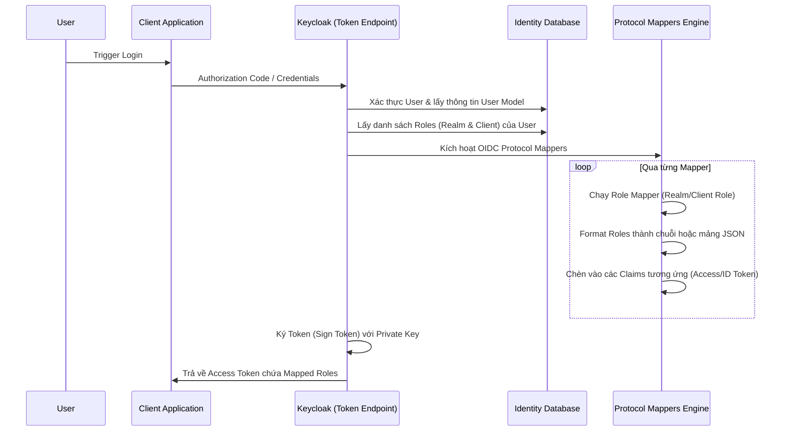

> [!NOTE]
> **Category:** Theory (Lý thuyết)
> **Goal:** Hiểu sâu về cơ chế Role Mapping trong Keycloak, cách thức ánh xạ Role của Realm và Client vào Token, giải quyết bài toán phân quyền phân tán, và áp dụng thực tiễn trong các hệ thống microservices phức tạp.

## 1. Lý thuyết chuyên sâu (Detailed Theory)

Trong hệ sinh thái **Keycloak**, cơ chế phân quyền thường dựa trên các **Roles** (Realm Roles hoặc Client Roles). Khi một ứng dụng (Resource Server) nhận được một truy cập từ người dùng thông qua Access Token, nó cần biết người dùng đó có những Role nào để cấp phép tài nguyên tương ứng.

Tuy nhiên, cấu trúc mặc định của Role trong Token có thể không khớp với kỳ vọng của ứng dụng đích. Ví dụ, một hệ thống Legacy có thể mong đợi quyền hạn nằm trong claim `authorities` hoặc `groups`, thay vì `realm_access.roles` như định dạng mặc định của Keycloak. Đây là lúc **Role Mapping (Ánh xạ Role)** phát huy tác dụng.

**Role Mapper** trong Keycloak là một phần của Protocol Mappers, có nhiệm vụ trích xuất các Role được gán cho User hoặc Group, định dạng lại và chèn chúng vào các Claims bên trong Access Token, ID Token, hoặc UserInfo endpoint. 

Các loại Role Mapper phổ biến:
- **Realm Role Mapper**: Ánh xạ các Realm Roles vào một Claim cụ thể.
- **Client Role Mapper**: Ánh xạ các Roles của một Client cụ thể vào Token.
- **Role Name Mapper**: Đổi tên một Role cụ thể trước khi đưa vào Token (ví dụ: đổi `admin` thành `ROLE_ADMIN` để tương thích với Spring Security).
- **Hardcoded Role Mapper**: Luôn luôn cấp một Role cố định vào Token bất kể User có Role đó hay không.

## 2. Luồng nội bộ & Cơ chế cấp thấp (Internal Workflow & Low-level Mechanisms)

Quá trình ánh xạ Role diễn ra trong giai đoạn Token Issuance (Sinh Token) sau khi User đã xác thực thành công.



**Cơ chế cấp thấp:**
1. Keycloak duyệt qua danh sách các mappers được cấu hình cho Client Scope đang được yêu cầu.
2. Với **Role Mapper**, hệ thống gọi class `UserSessionModel` để lấy `RoleModel` liên kết với người dùng.
3. Chuyển đổi (Serialize) tập hợp các Role name thành JSON array hoặc một chuỗi phân tách bằng dấu phẩy (dựa theo tùy chọn `Single Role Attribute`).
4. Thêm claim này vào Payload của JWT chuẩn bị được ký (JWS).

## 3. Thực hành tốt nhất & Bảo mật (Best Practices & Security)

> [!WARNING]
> **Token Bloat (Phình to Token):** Không nên ánh xạ tất cả Client Roles của toàn bộ hệ thống vào Access Token của một Client cụ thể. Điều này gây phình to payload JWT, làm chậm quá trình truyền tải mạng và tốn CPU khi parse Token.

> [!IMPORTANT]
> **Sử dụng Scope-based Role Mapping:** Hãy sử dụng **Client Scopes** thay vì gắn Mapper trực tiếp vào Client. Khi đó, Token sẽ chỉ chứa các Role mapping khi Client thực sự yêu cầu Scope đó, tuân thủ nguyên tắc Least Privilege.

- **Prefix Role:** Khi tích hợp với các Framework như Spring Security, thường cần prefix `ROLE_`. Thay vì tạo lại Role có prefix trong Keycloak, hãy dùng mapper để tự động thêm tiền tố này lúc sinh token.
- **Bảo mật:** Không dùng Role Mapper để lộ các Role hệ thống mang tính chất quản trị nội bộ Keycloak (như `manage-users`, `view-clients`) cho các Public Clients.

## 4. Cấu hình minh họa thực tế (Configuration Examples)

**Cấu hình ánh xạ Realm Roles vào claim `authorities` (thường dùng cho Spring Boot):**

1. Mở Keycloak Admin Console.
2. Vào **Client Scopes** -> Tạo mới `spring-roles-scope` (Type: Default).
3. Chuyển sang tab **Mappers** -> Add mapper -> By configuration -> Chọn `User Realm Role`.
4. Điền cấu hình:
   - **Name:** `realm-roles-to-authorities`
   - **Realm Role prefix:** `ROLE_`
   - **Multivalued:** `ON` (để tạo mảng JSON).
   - **Token Claim Name:** `authorities`
   - **Add to ID token:** `OFF`
   - **Add to access token:** `ON`
   - **Add to userinfo:** `OFF`

Kết quả Payload trong Access Token:
```json
{
  "exp": 1699999999,
  "iat": 1699999000,
  "sub": "user-uuid",
  "authorities": [
    "ROLE_admin",
    "ROLE_manager",
    "ROLE_user"
  ]
}
```

## 5. Trường hợp ngoại lệ (Edge Cases)

- **Lỗi Multivalued = OFF với nhiều Role:** Nếu bật Single Attribute (Multivalued = OFF) nhưng User lại có nhiều Roles, Keycloak chỉ lấy Role đầu tiên tìm thấy hoặc nối thành chuỗi không đúng định dạng mong muốn, gây lỗi Authorization ở Resource Server. Khắc phục: Luôn bật `Multivalued` cho Role mapping.
- **Client Roles conflict:** Nếu User có Client Role `admin` ở `Client-A` và `admin` ở `Client-B`, việc ánh xạ tất cả Client Roles vào cùng một mảng có thể làm mất ngữ cảnh (không biết `admin` của ai). Khắc phục: Sử dụng cấu trúc lồng nhau mặc định `resource_access.client_id.roles` hoặc đổi tên (Role Name Mapper) thành `clientA_admin`.
- **Role Xóa nhưng Token vẫn còn hạn:** Access Token là stateless. Nếu User bị tước Role nhưng Token chưa hết hạn, họ vẫn giữ quyền ở ứng dụng. Khắc phục: Sử dụng cơ chế Token Introspection, hoặc giảm TTL (Time To Live) của Access Token, kết hợp với các chính sách Authorization Services (UMA) thay đổi theo thời gian thực.

## 6. Câu hỏi Phỏng vấn (Interview Questions)

1. **Junior:** Role Mapper trong Keycloak dùng để làm gì và nó can thiệp vào giai đoạn nào của quá trình đăng nhập?
   - *Đáp án:* Dùng để cấu trúc lại định dạng Role trong JWT payload (như đổi tên claim, thêm prefix) nhằm tương thích với ứng dụng. Can thiệp vào giai đoạn Sinh Token (Token Issuance) sau khi xác thực thành công.
2. **Junior:** Làm thế nào để tự động thêm `ROLE_` vào tất cả các role của user trong token?
   - *Đáp án:* Sử dụng Protocol Mapper loại `User Realm Role` hoặc `User Client Role` và điền giá trị `ROLE_` vào trường `Role prefix`.
3. **Senior:** Tại sao khi cấu hình Mapper, Token của chúng ta đột nhiên trở nên quá lớn (HTTP Header quá dài)? Làm sao khắc phục?
   - *Đáp án:* Do User có quá nhiều Role/Group và chúng ta ánh xạ tất cả vào mọi Token. Khắc phục bằng cách dùng Client Scopes (chỉ trả về role khi được yêu cầu), vô hiệu hóa "Full Scope Allowed" trong Client settings.
4. **Senior:** Nếu một API Server nhận Token nhưng mong muốn Role của 1 Client cụ thể nằm ở root claim `roles` thay vì `resource_access.{client_id}.roles`, bạn làm thế nào?
   - *Đáp án:* Tạo một `User Client Role` mapper cho Client đó, cấu hình Token Claim Name là `roles`.
5. **Senior:** Hardcoded Role Mapper giải quyết bài toán gì và có nguy cơ bảo mật nào?
   - *Đáp án:* Dùng để chèn một Role cố định (vd `guest`) vào mọi token của client, bất kể user. Nguy cơ: nếu gán nhầm hardcode role quyền cao, mọi user đăng nhập qua client đó đều trở thành admin cục bộ. Cần cẩn trọng khi gán.

## 7. Tài liệu tham khảo (References)

- [Keycloak Server Administration Guide - Protocol Mappers](https://www.keycloak.org/docs/latest/server_admin/#_protocol-mappers)
- [OAuth 2.0 Token Exchange (RFC 8693) - Role structures](https://datatracker.ietf.org/doc/html/rfc8693)
- [Spring Security Architecture - Role and Granted Authority](https://docs.spring.io/spring-security/reference/servlet/authorization/architecture.html)
