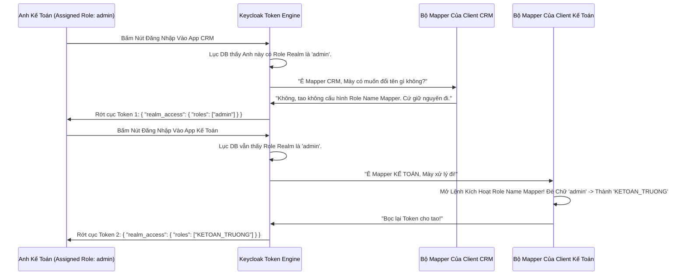

# Lesson 1: Đánh Tráo Danh Tính (Role Name Mapper)

> [!NOTE]
> **Category:** Theory & Practical (Lý thuyết & Thực hành)
> **Goal:** Học cách sử dụng `Role Name Mapper` để đổi tên các Role (Quyền) khi chúng được đính kèm vào Access Token. Đây là một thủ thuật cực kỳ quan trọng khi bạn dùng Keycloak làm Trung Tâm Xác Thực cho nhiều Ứng dụng con (Microservices) khác nhau, và mỗi Ứng dụng lại định nghĩa một bộ tên Role khác nhau.

## 1. Lý thuyết chuyên sâu (Detailed Theory)

### 1.1. Vấn Đề Bất Đồng Ngôn Ngữ Phân Quyền
Hãy tưởng tượng bạn có 1 Cỗ máy Keycloak phục vụ cho 2 hệ thống:
1. **Hệ thống CRM (Đồ mới viết):** Yêu cầu user phải có Role tên là `admin` thì mới cho xóa khách hàng.
2. **Hệ thống Kế Toán (Đồ cổ 15 năm):** Yêu cầu user phải có Role tên là `KETOAN_TRUONG` thì mới cho xóa phiếu thu.

Trên Keycloak, bạn chỉ tạo đúng 1 Realm Role tên là `admin` và gán cho Anh Kế Toán Trưởng.
- Khi Anh Kế Toán vào CRM, cục Token chứa Role `admin` -> Chạy ngon lành!
- Nhưng khi Anh Kế Toán vọt sang hệ thống Kế Toán đồ cổ, mang theo cục Token chứa Role `admin`. Hệ thống Cổ Đại nhìn vào Token, ngơ ngác: *"Admin là thằng ôn nào? Tao chỉ biết KETOAN_TRUONG thôi!"* -> Thế là nó Báo Lỗi 403 Forbidden chặn cổ Anh Kế Toán!

Giải pháp tồi tệ: Bạn lên Keycloak tạo thêm 1 Role rác là `KETOAN_TRUONG` rồi gán thêm cho Ảnh. (Làm vậy thì rác DB Keycloak, vì một người mang 2 Role chức năng y hệt nhau).
**Giải pháp Đỉnh Cao: Dùng Role Name Mapper!**

### 1.2. Role Name Mapper Hoạt Động Ra Sao?
Bạn vào cấu hình của cái Client `He-Thong-Ke-Toan` trên Keycloak (Tab Client Scopes). Thêm một Mapper loại `Role Name Mapper`.
Bạn cấu hình:
- **Role:** `admin`
- **New Role Name:** `KETOAN_TRUONG`

Điều gì sẽ xảy ra? 
- Database Keycloak vẫn Gọn Gàng, chỉ có đúng Role `admin`.
- Khi cấp Token cho cái App CRM, Keycloak nhét chữ `admin`.
- Khi cấp Token cho cái App Kế Toán, Mapper này sẽ Can Thiệp. Nó thấy chữ `admin` chuẩn bị chui vào Token, nó lập tức dùng Phép Thuật "Đánh Tráo Cột Mốc" biến chữ `admin` thành chữ `KETOAN_TRUONG` ngay bên TRONG lòng Cục Token đó! 
- Hệ thống Kế Toán Cổ Đại bóc Token ra, thấy chữ `KETOAN_TRUONG` -> Mừng rỡ cho qua! Chuyện Tình Cổ Tích Đã Cứu Rỗi Kiến Trúc Hệ Thống!

---

## 2. Luồng nội bộ & Cơ chế cấp thấp (Internal Workflow & Low-level Mechanisms)

Hành Trình Oanh Cáp Bọc Thép Biến Hình Lệnh Bài Phân Quyền:

---

## 3. Thực hành tốt nhất & Bảo mật (Best Practices & Security)

> [!CAUTION]
> **Tuyệt Đỉnh Tẩy Khách Mạng Bọc Thép (Thảm Họa Béo Phì Token - JWT Bloat)**
> **Tội Ác Ném Tất Cả Role Vào Token Của Mọi Ứng Dụng:** Mặc định, Keycloak có một cái Client Scope ẩn tên là `roles`. Cái Scope này có chức năng: Gom TẤT CẢ các Role mà User đang có (Kể cả Realm Role lẫn Client Role của hàng chục App khác) đập hết vào trong bụng cục Access Token! 
> **Hậu Quả Chết Lạc Lối:** 
> Giám Đốc Công Ty có quyền hạn ở 50 phần mềm khác nhau. Cục Token của Giám Đốc chứa mảng Array lên tới 500 cái Roles! Cục Token phình to ra 15 Kilobytes! Mỗi lần Giám Đốc gọi HTTP API, cục Header Authorization to chà bá đó chui qua đường truyền. Nặng băng thông! Và nguy hiểm nhất: Nginx / Tomcat Server đôi khi cấu hình `Max-Header-Size` là 8KB. Gói tin API của Giám Đốc đập vào tường Nginx vỡ nát -> Lỗi 431 Request Header Fields Too Large! Giám Đốc Bị Cấm Cửa Mọi Nơi Dù Pass Đúng!
> **Biện Pháp Sống Còn Cấp Thần Thánh (Lọc Trọng Tâm):**
> Đừng bao giờ cho phép Token Béo Phì. Ở cấp độ Enterprise:
> 1. Vào Tab Client Scopes của Realm -> Bấm vào cái scope `roles` -> Chọn Tab Mappers -> Tìm cái Mapper tên là `realm roles` hoặc `client roles`.
> 2. CHẶN KHÔNG CHO NÓ GOM RÁC: Bạn có quyền tắt luôn cái mapper mặc định này đi, Không cho nó nhồi tự động nữa.
> 3. CHỈ CHO CÁI GÌ CẦN CHO: Ở từng Client cụ thể, bạn mới tạo một cái Mapper loại `Role List` riêng biệt, hoặc dùng chức năng Scope của Client để gán đích danh chỉ những Role nào liên quan đến App đó mới được lọt vào Token! Nhờ vậy, cục Token của Giám Đốc đi vào App Kế Toán chỉ có đúng 2 Role Kế toán (Vài Byte), đi vào App CRM chỉ có đúng 1 Role CRM! Nhanh, Gọn, Bảo Mật!

---

## 4. Câu hỏi Phỏng vấn (Interview Questions)

**1. Em Hiểu Thế Nào Về Biến `realm_access` Và `resource_access` Nằm Trong Bụng Của Cục Access Token Keycloak? Đứa Dev Backend Phía Dưới App Node.JS Nó Viết Lệnh `token.realm_access.roles.includes('admin')` Để Phân Quyền. Theo Quan Điểm Bảo Mật Của Em Có Ổn Không?**
- **Senior:** Dạ Câu Này Chính Là Cái Bẫy Tử Thần Trong Kiến Trúc Phân Quyền Bằng Microservices! 
  - **Sự Khác Biệt:** 
    - `realm_access`: Chứa danh sách các Roles ở mức độ Toàn Cục (Realm Roles). Cấp độ này thằng nào cũng thấy.
    - `resource_access`: Chứa danh sách các Roles rải rác theo từng Tên Client Cụ Thể (Client Roles). Cấp độ này có tính bao đóng cục bộ.
  - **Đánh Giá Lệnh Code Của Đứa Dev Node.js:** Việc nó lấy `realm_access` để check Role là CỰC KỲ SAI LẦM BẤT LƯƠNG Ạ!
    - Nếu Công ty có 10 phần mềm (10 Clients). Cả 10 phần mềm đều đẻ ra 1 Role Realm là `admin`. 
    - Ông Nguyễn Văn A là Admin của hệ thống Thư Viện Sách (Được gán Realm Role `admin`). 
    - Khi Ổng đăng nhập qua cái App Kế Toán (Ổng chả có quyền khỉ gì ở Kế toán cả). Nhưng vì App Node.js Kế toán check `token.realm_access.roles.includes('admin')`. Nó thấy có chữ 'admin' (Của Thư viện ném qua), nó Vênh Mặt Cho Phép Ổng Sửa Báo Cáo Tài Chính Luôn! Vỡ Nợ Công Ty!
  - **Cách Fix Triệt Để Chống Leo Thang Đặc Quyền (Privilege Escalation):**
    - Bọn Em Sẽ ÉP Buộc Phải Thiết Kế Client Roles (Tuyệt đối hạn chế dùng Realm Roles cho Logic App Dưới Cùng).
    - Client `KETOAN-APP` đẻ ra Role `app-admin`. 
    - Code Node.js Dưới Backend BẮT BUỘC Phải Bóc Đúng Hang Ổ: `token.resource_access['KETOAN-APP'].roles.includes('app-admin')`.
    - Bằng cách này, dù ông A có là Ngọc Hoàng Thượng Đế ở Realm Access, mà trong Resource Access của KETOAN-APP không có tên ổng, thì ổng vẫn là con kiến hôi! Bảo Mật Lớp Trong Lớp Khép Kín Tuyệt Đối Ạ!

---

## 5. Tài liệu tham khảo (References)
- **Keycloak Documentation:** Server Administration Guide - Protocol Mappers - Role Name Mapper.
