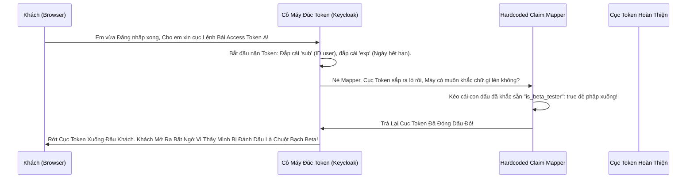

# Lesson 2: Đóng Dấu Tử Bất Biến (Hardcoded Claims)

> [!NOTE]
> **Category:** Theory & Practical (Lý thuyết & Thực hành)
> **Goal:** Học cách sử dụng Mapper loại `Hardcoded Claim`. Một công cụ nhỏ bé nhưng có võ, giúp bạn "Nhúng" (Inject) một dữ liệu Tĩnh không bao giờ thay đổi vào trong ruột của Token. Rất có ích để truyền cờ hiệu (Flags), định danh Nguồn gốc, hoặc các Version thông số API cho hệ thống Backend nhận diện.

## 1. Lý thuyết chuyên sâu (Detailed Theory)

### 1.1. Hardcoded Claim Là Gì?
Đúng như tên gọi của nó (Hardcode - Code cứng). Loại Mapper này không thèm quan tâm User là ai, Tên gì, Sinh năm bao nhiêu. Cứ hễ Keycloak cấp phát Token cho cái Client đó, Mapper này sẽ đè đầu cưỡi cổ nhét thẳng một cục JSON Key-Value do bạn gõ cứng trên Giao Diện Admin vào Token.

Ví dụ: Bạn cấu hình Hardcoded Claim:
- **Token Claim Name:** `tenant_id`
- **Claim Value:** `viettel_telecom`
- **Claim JSON Type:** `String`

Bùm! Hàng ngàn cục Access Token cấp ra cho khách hàng sẽ đều có chung một cái đuôi: `"tenant_id": "viettel_telecom"`.

### 1.2. Ứng Dụng Thực Tế (Use Cases)
Tuy Đơn giản nhưng Mapper này chữa được rất nhiều căn bệnh Trầm Kha của Kiến Trúc Chuyển Mạch (Routing):
1. **Phân Luồng Tenant Ở API Gateway:** Bạn có 1 API Gateway (Kong/Apisix) đứng chặn trước Backend. Bạn muốn những ai đăng nhập từ Client A thì sẽ bị đẩy luồng (Route) sang Server A. Những ai từ Client B sẽ văng sang Server B. Bạn chỉ cần Gắn Hardcoded Claim `route_target = "server_A"` vào Client A. API Gateway chỉ cần bóc Token ra, đọc được chữ "server_A" là Tự Động Định Tuyến Mượt Mà!
2. **Khai Báo Cấp Độ Nhạy Cảm Của Client:** Đánh dấu Client Web thì `risk_level = "HIGH"`, Client Intranet Nội bộ thì `risk_level = "LOW"`. Backend đọc biến này để tự quyết định có đòi hỏi OTP ở khúc sau hay không!

---

## 2. Luồng nội bộ & Cơ chế cấp thấp (Internal Workflow & Low-level Mechanisms)

Hành Trình Oanh Cáp Bọc Thép Của Việc Tiêm Dữ Liệu Tĩnh:

---

## 3. Thực hành tốt nhất & Bảo mật (Best Practices & Security)

> [!TIP]
> **Tuyệt Đỉnh Tẩy Khách Mạng Bọc Thép (Thảm Họa Kiểu Dữ Liệu JSON Lệch Pha)**
> **Sai Lầm Khi Đúc Khuôn Khác Hệ Gen:** Cậu Lập Trình Viên Backend viết code Node.JS check điều kiện thế này: `if (token.is_beta_tester === true) { ... }`. Nghĩa là code backend kỳ vọng cái Biến `is_beta_tester` phải là loại **BOOLEAN** (Chữ true/false không nằm trong ngoặc kép).
> Lên giao diện Keycloak, Cậu ta tạo cái Hardcoded Claim, nhập Claim Name là `is_beta_tester`, Claim Value nhập chữ `true`. Nhưng Cậu ta vô tình quên chỉnh cái ô **Claim JSON Type**. Theo mặc định, Keycloak để là `String`! 
> **Hậu Quả Chết Lạc Lối:** 
> Cục Token sinh ra mang hình hài: `"is_beta_tester": "true"` (Có ngoặc kép). Rớt xuống Backend Node.js, câu lệnh `=== true` Lập Tức So Sánh Chuỗi Với Boolean Bằng False! Toàn Bộ Khách Hàng Beta Tester Bị Cấm Cửa, Ứng Dụng Chết Ngắc Chỉ Vì Một Cặp Ngoặc Kép Oan Nghiệt!
> **Biện Pháp Sống Còn Cấp Độ Tinh Vi:**
> Khi tạo BẤT CỨ Mapper nào (Đặc biệt là Hardcoded Mapper và User Attribute Mapper), bắt buộc đôi mắt bạn phải Dán Chặt Vào cái Ô Dropdown **Claim JSON Type**. 
> - Muốn Trả về Số? Chọn `long` hoặc `int`. (Sẽ ra `"age": 18`).
> - Muốn Trả về Đúng/Sai? Chọn `boolean`. (Sẽ ra `"is_active": true`).
> - Muốn Trả về JSON lồng nhau? Chọn `JSON`. 
> Sai một Li (Kiểu Dữ Liệu), Đi Một Dặm (Logic Backend Sụp Đổ)!

---

## 4. Câu hỏi Phỏng vấn (Interview Questions)

**1. Công Ty Mình Có 1 Tính Năng Đặc Biệt Tên Là "Super_Dashboard". Tính Năng Này Chỉ Dành Riêng Cho Đội Ngũ Nhân Viên Ở Chi Nhánh "Hà Nội". Sếp Bảo Em Gắn Hardcoded Claim `branch="HaNoi"` Cho Một Cái Client `HN-Dashboard`. Sau Đó Bất Cứ Ai Đăng Nhập Bằng Cái Client Này, Lấy Cục Token Đó Mang Đi Gọi API Thì Sẽ Được Xem Super_Dashboard. Thiết Kế Vậy Có Hở Sườn Không Em?**
- **Senior:** Dạ Sếp Bày Mưu Thế Này Là Hại Chết Lập Trình Viên Tụi Em Rồi Ạ! Chết Khét Lẹt Luôn Mức Độ P1 (Nghiêm Trọng Nhất)!
  - **Sự Ngây Thơ Của Thiết Kế:** Hardcoded Claim Gắn Trên Client Cố Định, Nghĩa Là NÓ CHỈ QUAN TÂM CLIENT ĐÓ LÀ GÌ, CHỨ NÓ ĐẾCH QUAN TÂM THẰNG USER ĐANG NGỒI TRƯỚC MÁY LÀ THẰNG NÀO!
  - **Kịch Bản Xâm Nhập (Hacker Xơi Tái):** Một Thằng Nhân Viên Tép Riu Ở Chi Nhánh "Cà Mau". Nó Cố Tình Mở Trình Duyệt Vào Đường Link Đăng Nhập Của Cái App `HN-Dashboard`. Nó Gõ Tên Đăng Nhập, Mật Khẩu (Của Thằng Cà Mau Cùi Bắp) Vào! Keycloak Kéo Cục Token Ra... Theo Đúng Lệnh Của Hardcoded Mapper, Keycloak Nhắm Mắt Đóng Phập Con Dấu `branch="HaNoi"` Vào Bụng Cái Token Của Thằng Cà Mau Đó! Thằng Cà Mau Cầm Token Chạy Xuống Đáy Backend... Backend Mở Mắt Lên Nhìn Thấy Cột Mốc Mù `branch="HaNoi"`... Lập Tức Cung Kính Mở Cửa Super_Dashboard Cho Thằng Cà Mau Xơi Tái Mọi Dữ Liệu!
  - **Bài Học Máu:** Tuyệt Đối Không Dùng Hardcoded Claim Để Định Đoạt Quyền Lực Hoặc Xác Thực Định Danh Người Dùng! Hardcoded Claim Chỉ Dùng Để Đánh Dấu THUỘC TÍNH TĨNH CỦA CÁI ỨNG DỤNG ĐÓ (Ví Dụ: Version App, Nguồn Nước Nào, Loại Máy Chủ Nào). Để Phân Định Nhân Viên Nào Ở Hà Nội, Phải Dùng Gắn Thuộc Tính (User Attribute) Vào Thẳng User Hoặc Gắn Group Của User Đó Chứ Không Thể Gắn Trên Client Một Cách Vô Hồn Lông Lốc Như Vậy Được Ạ!

---

## 5. Tài liệu tham khảo (References)
- **Keycloak Documentation:** Server Administration Guide - OIDC Token Mappers.
