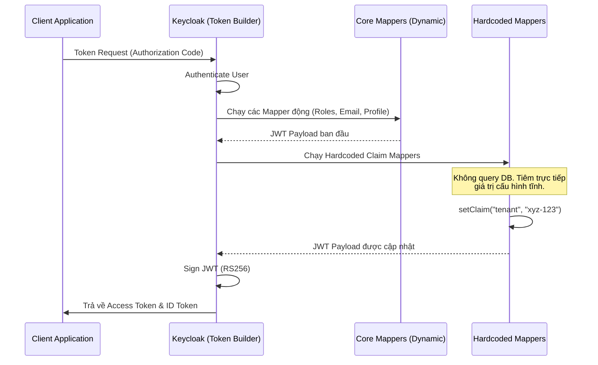

> [!NOTE]
> **Category:** Theory (Lý thuyết)
> **Goal:** Nắm vững khái niệm, mục đích và cơ chế của Hardcoded Claims Mapper, hiểu rõ cách chèn các giá trị tĩnh (static) vào JWT, đồng thời nhận diện các rủi ro bảo mật đi kèm.

## 1. Lý thuyết chuyên sâu (Detailed Theory)

Trong hệ thống Identity and Access Management (IAM), Token (như Access Token, ID Token) thường chứa các Claims (thông tin) được trích xuất động từ hồ sơ người dùng (User Attributes, Roles, Groups). 

Tuy nhiên, có nhiều tình huống Resource Server hoặc các hệ thống bên thứ ba yêu cầu một **Claim cố định** cho mọi token được phát hành thông qua một ứng dụng (Client) cụ thể, bất kể người dùng là ai. Ví dụ:
- Ứng dụng A khi gọi sang API B luôn phải mang một Header/Claim: `"tenant_id": "global-partner"`.
- Một hệ thống Legacy bắt buộc phải có trường `"user_type": "standard"` trong JWT dù Keycloak không lưu trữ thuộc tính này.
- Cấp một quyền (role) mặc định (`"role": "guest"`) cho tất cả người dùng đăng nhập qua một public portal.

Đây là lúc **Hardcoded Claim Mapper** (hoặc Hardcoded Role Mapper) được sử dụng. Cơ chế này bỏ qua việc truy vấn Database (người dùng không cần có thuộc tính đó), nó hoạt động như một bộ lọc (filter) tiêm trực tiếp (inject) một chuỗi (string), số (number), boolean, hoặc JSON cố định vào Token Payload trước khi ký.

## 2. Luồng nội bộ & Cơ chế cấp thấp (Internal Workflow & Low-level Mechanisms)

Quá trình tiêm Hardcoded Claim diễn ra rất nhanh do không cần I/O truy xuất cơ sở dữ liệu.



**Cơ chế cấp thấp:**
1. Keycloak Core xây dựng đối tượng `IDToken` hoặc `AccessToken` (bản chất là một HashMap lưu trữ các key-value).
2. Khi lặp qua danh sách Mappers, với loại `Hardcoded claim`, Keycloak đọc cấu hình Mapper từ cache của Realm.
3. Sử dụng phương thức `token.getOtherClaims().put(claimName, claimValue)` để chèn dữ liệu trực tiếp.
4. Quá trình này hỗ trợ các kiểu dữ liệu cơ bản (String, Integer, Long, Boolean) và JSON structure (bằng cách phân tách chuỗi khóa bằng dấu chấm, ví dụ: `address.country`).

## 3. Thực hành tốt nhất & Bảo mật (Best Practices & Security)

> [!WARNING]
> **Rủi ro leo thang đặc quyền (Privilege Escalation):** Tuyệt đối không dùng Hardcoded Role/Claim để cấp phát các quyền quản trị (admin rights). Nếu Mapper này được gán nhầm vào một Public Client hoặc một Client Scope chung, bất kỳ ai đăng nhập cũng sẽ sở hữu đặc quyền đó.

> [!IMPORTANT]
> **Ưu tiên Client Scopes:** Luôn cấu hình Hardcoded Claims bên trong một **Client Scope** cụ thể thay vì gắn trực tiếp vào Client. Thiết lập Scope này ở dạng `Optional`. Điều này cho phép Client chủ động yêu cầu claim này khi cần thông qua tham số `scope`, giảm kích thước Token trong các giao dịch không cần thiết.

- **Hiệu suất:** Hardcoded Mappers cực kỳ nhẹ và nhanh. Nếu có một thuộc tính chung cho toàn bộ User của một hệ thống, hãy dùng Hardcoded Claim thay vì update hàng triệu User Attributes trong DB.
- **Sử dụng cho Multi-tenancy giả lập:** Có thể dùng Hardcoded Claim mapper gắn vào từng Client riêng biệt để định danh Tenant ID cho Resource Server phía sau.

## 4. Cấu hình minh họa thực tế (Configuration Examples)

**Bài toán:** Bạn cần chèn một giá trị cố định `"environment": "production"` và `"max_upload_size": 500` vào Access Token.

1. Truy cập **Client Scopes** -> Chọn hoặc tạo scope `api-configs`.
2. Mở tab **Mappers** -> Add mapper -> By configuration.
3. Chọn **Hardcoded claim**.
4. Cấu hình cho Environment:
   - **Name:** `inject-env-claim`
   - **Token Claim Name:** `environment`
   - **Claim value:** `production`
   - **Claim JSON Type:** `String`
   - **Add to access token:** `ON`
5. Lặp lại bước 3-4 cho Upload Size:
   - **Name:** `inject-upload-limit`
   - **Token Claim Name:** `max_upload_size`
   - **Claim value:** `500`
   - **Claim JSON Type:** `int`
   - **Add to access token:** `ON`

**Kết quả JWT Payload:**
```json
{
  "exp": 1700000000,
  "sub": "b2c3d4...",
  "environment": "production",
  "max_upload_size": 500
}
```

## 5. Trường hợp ngoại lệ (Edge Cases)

- **Xung đột Claim Name (Claim Overriding):** Nếu Hardcoded Claim sử dụng chung tên (ví dụ `email`) với một Mapper động (User Attribute), mapper nào chạy sau sẽ đè giá trị của mapper trước. Keycloak không đảm bảo thứ tự thực thi nghiêm ngặt giữa các mapper cùng loại, do đó, **không bao giờ** dùng Hardcoded Claim trùng tên với các thuộc tính OIDC tiêu chuẩn (`sub`, `email`, `preferred_username`).
- **Sai kiểu dữ liệu (Data Type Mismatch):** Nếu Resource Server dùng Strongly-typed parsing (ví dụ Golang struct mong muốn `max_upload_size` là `int`), nhưng trong Keycloak bạn quên đổi `Claim JSON Type` thành `int` (để mặc định là `String`), thì JSON tạo ra là `"max_upload_size": "500"`. Điều này sẽ làm crash ứng dụng parse Token.
- **Phân cấp JSON sâu:** Muốn tạo object cấu trúc `{"app_config": {"theme": "dark"}}`, hãy đặt Token Claim Name là `app_config.theme`. Nếu không, JSON sẽ bị dẹt (flat).

## 6. Câu hỏi Phỏng vấn (Interview Questions)

1. **Junior:** Hardcoded Claim Mapper khác với User Attribute Mapper như thế nào?
   - *Đáp án:* User Attribute Mapper lấy dữ liệu động từ database tương ứng với từng người dùng. Hardcoded Claim Mapper cung cấp cùng một giá trị tĩnh cố định cho tất cả mọi token được sinh ra.
2. **Junior:** Làm sao để cấu hình một Hardcoded Claim mang kiểu dữ liệu là số nguyên (Integer) thay vì chuỗi (String)?
   - *Đáp án:* Khi cấu hình Mapper, cần thay đổi trường `Claim JSON Type` từ `String` (mặc định) sang `int` hoặc `long`.
3. **Senior:** Nếu bạn muốn tích hợp Keycloak với 3 hệ thống Legacy khác nhau. Mỗi hệ thống yêu cầu một Hardcoded "Source_ID" riêng biệt trong JWT, nhưng chúng dùng chung 1 Realm Keycloak. Cách thiết kế tốt nhất là gì?
   - *Đáp án:* Không gán Mapper ở cấp Realm. Tạo 3 Client riêng biệt cho 3 hệ thống. Ở mỗi Client, tạo các Client-specific Mappers chứa Hardcoded Claim tương ứng. Hoặc tạo 3 Client Scopes, gán Optional cho các Client và yêu cầu ứng dụng truyền đúng `scope` parameter khi gọi authorize.
4. **Senior:** Hardcoded Role Mapper có thể gây ra lỗ hổng bảo mật nào trong môi trường Microservices dùng chung Keycloak?
   - *Đáp án:* Nếu tạo một Hardcoded Role mapper gán quyền `admin` và vô tình gắn vào Default Client Scopes cấp Realm, MỌI token phát hành ra cho MỌI ứng dụng trong hệ thống đều sẽ mang quyền `admin`, dẫn tới leo thang đặc quyền toàn hệ thống (Global Privilege Escalation).
5. **Senior:** Điều gì xảy ra khi Hardcoded Claim Name trùng với một thuộc tính mặc định của OAuth2/OIDC như `sub` hay `iss`?
   - *Đáp án:* Việc ghi đè các Reserved Claims có thể làm hỏng logic xác thực của các thư viện OIDC (như kiểm tra Issuer URL hay User ID), dẫn tới token bị chối bỏ (Validation Failure) tại API Gateway hoặc Resource Server.

## 7. Tài liệu tham khảo (References)

- [Keycloak Official Docs: Hardcoded Mappers](https://www.keycloak.org/docs/latest/server_admin/#_hardcoded_mappers)
- [RFC 7519: JSON Web Token (JWT) - Standard Claims](https://datatracker.ietf.org/doc/html/rfc7519#section-4.1)
- [OWASP REST Security Cheat Sheet - Token Data](https://cheatsheetseries.owasp.org/cheatsheets/REST_Security_Cheat_Sheet.html)
