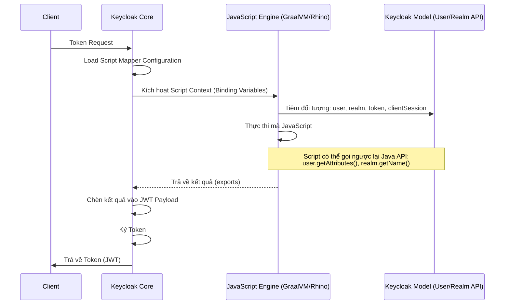

> [!NOTE]
> **Category:** Theory (Lý thuyết)
> **Goal:** Nắm vững kiến trúc, cách hoạt động của Script Mappers (JavaScript/Rhino) trong Keycloak. Hiểu cách tùy biến sâu Token payload bằng mã lập trình, các hạn chế kỹ thuật và rủi ro bảo mật đi kèm.

## 1. Lý thuyết chuyên sâu (Detailed Theory)

Mặc dù Keycloak cung cấp rất nhiều Mappers mặc định (như User Attribute, Role, Hardcoded), đôi khi logic nghiệp vụ để chèn dữ liệu vào Token cực kỳ phức tạp. Ví dụ:
- Bạn cần nối chuỗi `first_name` và `last_name` thành `full_name`.
- Cần thực hiện các phép toán điều kiện (if-else): Nếu User thuộc Group A thì lấy Claim X, nếu thuộc Group B thì lấy Claim Y.
- Cần tính toán (Math) tuổi dựa trên ngày sinh trong thuộc tính.

**Script Mapper** ra đời để giải quyết những bài toán này. Nó cho phép quản trị viên hoặc lập trình viên viết trực tiếp các đoạn mã JavaScript để thao tác (manipulate) trên Token ngay tại thời điểm nó được sinh ra (Token Issuance). 

**Nền tảng thực thi:** Keycloak không sử dụng Node.js hay V8 engine để chạy script. Nó sử dụng **Nashorn** (trong các bản Java cũ) hoặc **Rhino/GraalVM JavaScript** (trong Java mới). Điều này có nghĩa là bạn đang chạy JavaScript trên JVM, bạn có quyền truy cập vào các đối tượng Java (Java classes, Keycloak API objects) cung cấp sẵn trong Context.

## 2. Luồng nội bộ & Cơ chế cấp thấp (Internal Workflow & Low-level Mechanisms)

Quá trình thực thi Script Mapper phức tạp và tốn kém tài nguyên (CPU) hơn so với các mapper thông thường do phải khởi tạo môi trường Scripting Engine.



**Cơ chế Binding Context (Các biến môi trường có sẵn trong Script):**
Khi script được chạy, Keycloak tự động chèn (inject) các đối tượng (Java Objects) sau vào global scope của JavaScript:
- `user`: Đối tượng `UserModel`.
- `realm`: Đối tượng `RealmModel`.
- `token`: Đối tượng Token (thường là `OIDCIDToken` hoặc `AccessToken`).
- `userSession`: Đối tượng `UserSessionModel`.
- `keycloakSession`: Đối tượng `KeycloakSession`.

Để xuất giá trị ra ngoài claim, biến `exports` phải được gán giá trị cuối cùng.

## 3. Thực hành tốt nhất & Bảo mật (Best Practices & Security)

> [!CAUTION]
> **Rủi ro Remote Code Execution (RCE) / Lỗ hổng Sandbox:** Script Mapper cho phép thực thi mã tùy ý trên máy chủ Keycloak. Dù Keycloak chạy trong Sandbox, nếu Sandbox có lỗ hổng (như các CVE của Rhino/Nashorn), kẻ tấn công có thể thoát Sandbox và chiếm quyền điều khiển Server (RCE). Vì lý do này, Keycloak đã **VÔ HIỆU HÓA MẶC ĐỊNH (Disabled by default)** tính năng Scripts trong các phiên bản mới.

> [!WARNING]
> **Performance Bottleneck (Nghẽn cổ chai hiệu năng):** Script engine chạy chậm hơn Native Java Mappers hàng chục lần. Nếu hệ thống có hàng ngàn login/giây, Script Mapper sẽ gây ngốn CPU cực mạnh.

**Best Practices:**
1. **Tránh sử dụng nếu có thể:** Luôn luôn tìm cách sử dụng các Native Mappers hoặc viết Java Custom Mappers (Deploy qua file .jar) thay vì dùng Script Mapper.
2. **Kích hoạt an toàn:** Nếu bắt buộc phải dùng (Profile: `preview` hoặc `scripts`), không bao giờ để quyền Upload Script cho các Admin cấp thấp (Realm Admin).
3. **Cache & Tối ưu logic:** Mã JS phải cực kỳ tối ưu, tránh các vòng lặp lớn, không nên xử lý chuỗi quá lớn. Không bao giờ thử gọi mạng ngoài (HTTP Call) từ bên trong script mapper vì nó sẽ block luồng xử lý của Keycloak.

## 4. Cấu hình minh họa thực tế (Configuration Examples)

**Lưu ý:** Để dùng Script Mapper trong Keycloak (Quarkus), bạn phải khởi động với cờ:
`kc.sh start --features=scripts`

**Kịch bản:** Tạo claim `greeting` có giá trị `Xin chào, [First Name]!`. Nếu không có tên, trả về `Xin chào, Khách!`.

1. Vào **Client Scopes** -> `profile` -> **Mappers**.
2. Add mapper -> **By configuration** -> **Script Mapper**.
3. Điền cấu hình:
   - **Name:** `greeting-script`
   - **Token Claim Name:** `greeting`
   - **Claim JSON Type:** `String`
   - **Add to access token:** `ON`
   - **Script:**
   ```javascript
   var firstName = user.getFirstName();
   if (firstName === null || firstName.trim() === "") {
       exports = "Xin chào, Khách!";
   } else {
       exports = "Xin chào, " + firstName + "!";
   }
   ```
   *(Lưu ý: `user` là một đối tượng `UserModel` của Java, nên bạn phải dùng phương thức Getter `getFirstName()` thay vì `user.firstName`).*

## 5. Trường hợp ngoại lệ (Edge Cases)

- **Biến `exports` không tương thích:** Nếu `exports` được gán bằng một mảng hoặc đối tượng JSON phức tạp không tương thích với Java Jackson Serializer, Keycloak sẽ bắn lỗi HTTP 500 khi cố gắng sinh token. Cần serialize bằng `JSON.stringify()` hoặc trả về List chuẩn của Java (`new java.util.ArrayList()`).
- **NullPointerException:** Khi gọi `user.getFirstAttribute("phone")` mà người dùng không có thuộc tính đó, Java API sẽ trả về `null`. Nếu bạn gọi thêm `.toString()` hay `.length` trên giá trị `null` này trong JS, script sẽ văng lỗi `NullPointerException` (từ JVM) làm sập quá trình login. Phải luôn check null.
- **Mất Context trong Offline Tokens:** Script Mapper có thể chạy khi Refresh Token offline (lúc này UserSession bị giới hạn). Việc cố gắng lấy session attributes hoặc các thông tin client có thể gây lỗi.

## 6. Câu hỏi Phỏng vấn (Interview Questions)

1. **Junior:** Script Mapper khác gì với các Mapper thông thường, và nó dùng ngôn ngữ gì?
   - *Đáp án:* Script Mapper cho phép viết logic động để thao tác payload thay vì cấu hình tĩnh. Nó dùng ngôn ngữ JavaScript, được biên dịch và thực thi bởi JavaScript Engine trên Java (như Rhino, GraalVM).
2. **Junior:** Tại sao tính năng Script Mapper lại bị Keycloak tắt theo mặc định?
   - *Đáp án:* Do các lo ngại về bảo mật (nguy cơ RCE qua lỗ hổng sandbox) và hiệu năng suy giảm nghiêm trọng khi lượng đăng nhập lớn.
3. **Senior:** Bạn được giao cấu hình một Script Mapper để lấy dữ liệu từ một API bên ngoài vào Token. Bạn có làm không? Tại sao?
   - *Đáp án:* Không. Việc gọi HTTP request đồng bộ (synchronous) từ trong Script Mapper sẽ chặn thread đang xử lý Token Issuance của Keycloak. Dẫn đến thread pool bị cạn kiệt và sập Server (Denial of Service). Cách đúng là dùng Custom Java Event Listener hoặc SPI để làm việc đó bất đồng bộ, hoặc giải quyết ở tầng Gateway.
4. **Senior:** Tại sao khi viết mã trong Script Mapper, `user.username` lại lỗi `undefined`, mà phải gọi `user.getUsername()`?
   - *Đáp án:* Vì đối tượng `user` được chèn vào Script Engine không phải là một Object JavaScript (JSON), mà là một đối tượng Java thuần túy (`org.keycloak.models.UserModel`). Do đó, phải sử dụng đúng cú pháp gọi Method của Java thông qua cơ chế Java-JS Interoperability.
5. **Senior:** Giải pháp thay thế tốt nhất, an toàn và hiệu năng cao nhất cho Script Mapper là gì?
   - *Đáp án:* Phát triển một Custom Protocol Mapper bằng Java (implement `ProtocolMapper` SPI), đóng gói thành file `.jar` và deploy vào thư mục `providers` của Keycloak. Cách này cho hiệu suất native và bảo mật tối đa.

## 7. Tài liệu tham khảo (References)

- [Keycloak Server Administration - Script Mappers](https://www.keycloak.org/docs/latest/server_admin/#_script_mappers)
- [Keycloak SPI Documentation - Custom Mappers](https://www.keycloak.org/docs/latest/server_development/#_protocol_mapper_spi)
- [GraalVM JavaScript Implementation](https://www.graalvm.org/javascript/)
