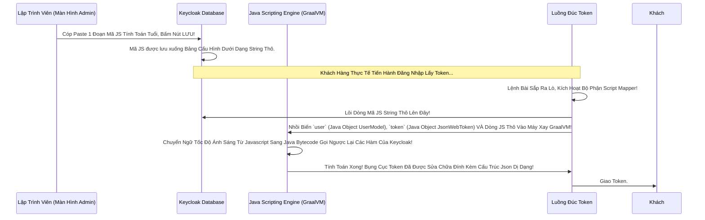

# Lesson 3: Phép Thuật Javascript (Script Mappers)

> [!NOTE]
> **Category:** Theory & Practical (Lý thuyết & Thực hành)
> **Goal:** Trong chương 24 (Protocol Mapper SPI), bạn phải tạo cả 1 Project Java Maven to đùng, Compile ra cục `.jar`, Copy vào Docker chỉ để viết một logic gắn Dữ liệu phức tạp vào Token. Quá rườm rà! Bài học này hướng dẫn bạn dùng **Javascript Script Mapper** - Công cụ cho phép viết trực tiếp Code Logic ngay trên Giao Diện Web Của Keycloak! Lưu ý: Tính năng này bị Khóa Mặc Định vì lý do bảo mật. Chúng ta sẽ mở khóa nó.

## 1. Lý thuyết chuyên sâu (Detailed Theory)

### 1.1. Sức Mạnh Của Khối Code Lưng Chừng Đồi
**Script Mapper** sử dụng một công nghệ của nền tảng Java gọi là Nashorn (hoặc GraalVM Polyglot trong các bản Java/Quarkus mới) để biên dịch trực tiếp mã Javascript của bạn ngay trong lúc Keycloak đang chạy (Runtime).
Khi bạn gắn một Script Mapper vào OIDC Client. Bạn sẽ được cung cấp một cái Ô Vuông to bự trên Giao diện. Bạn gõ code Javascript vào đó.
Mỗi khi Token được cấp phát, đoạn code này sẽ được kích hoạt!

Nó cho bạn toàn quyền sinh sát:
- Bạn nắm trong tay biến `user` (Đại diện cho Khách Hàng đang đăng nhập). Bạn có thể lôi Tên, Họ, Email, Attribute, Role ra đọc.
- Bạn nắm trong tay biến `realm` (Cấu hình toàn cục).
- Bạn nắm trong tay biến `token` (Chính là Bụng của Cục JWT).
Và bạn chỉ cần dùng Javascript viết logic: `if (user.firstName == "Teo") { token.setOtherClaims("luu_y", "Thằng này ăn cắp vặt"); }`

Bùm! Token ra lò đã có ngay dòng cảnh báo đó. Mọi thứ làm nóng 100% không cần Build File Jar! Cực kỳ hợp cho dân Bào Nhanh (Fast Prototyping).

### 1.2. Mở Khóa Tấm Phong Ấn Bị Nguyền Rủa (Enable Feature)
RedHat/Keycloak Cực Kỳ Ghét Cái Script Mapper Này! (Vì nó quá nguy hiểm, cho phép chèn Code thẳng từ Giao diện Admin - Nếu Lộ Tài Khoản Admin là Hacker thả Trình Đào Coin hoặc Xóa Sạch DB bằng Javascript Java-Interop!).
Nên mặc định họ Tắt và Khóa chặt nó lại.
Để mở nó, bạn PHẢI đính kèm 2 tham số lúc bật máy chủ (Docker command):
1. `--features=scripts` (Mở khóa tính năng Tương Thích Script Preview).
2. Tùy thuộc vào phiên bản JDK của Quarkus, phải thêm các tham số `--spi-...` nếu cần (Ở bản mới 24.0, chỉ cần bật tính năng Preview Scripts là đủ).

---

## 2. Luồng nội bộ & Cơ chế cấp thấp (Internal Workflow & Low-level Mechanisms)

Hành Trình Oanh Cáp Bọc Thép Biến Biên Dịch Sinh Sát Tức Thời:

---

## 3. Thực hành tốt nhất & Bảo mật (Best Practices & Security)

> [!CAUTION]
> **Tuyệt Đỉnh Tẩy Khách Mạng Bọc Thép (Thảm Họa Chết Rỗng Bụng JVM Hố Đen)**
> **Tội Ác Viết Vòng Lặp Vô Hạn Trong Script:** Bạn viết một Script Mapper có một dòng Code While ngây thơ: `while(true) { ... }` hoặc gọi Đệ Quy Lầm Lạc vòng vo để đếm số Role của User. Bạn ung dung Save lại trên Giao Diện.
> **Hậu Quả Chết Phanh Thây:** 
> Vài giây sau Khách Đăng Nhập. Cái Luồng Token đó đập vào Máy Xay GraalVM. Máy Xay Cuốn Vào Hố Đen Vòng Lặp Vô Hạn CPU Thread 100%! Một Vài Khách Khác Đăng Nhập Cùng Lúc -> Cuốn Chết Hết Số Lượng Thread Trong Cổng! Nguyên Con Server Keycloak Máy Chủ Bị Treo Đơ Bốc Khói (CPU Spike), Tê Liệt Toàn Hệ Thống Mà Không Báo Bất Cứ 1 Dòng Lỗi Nào Ra Log Console (Vì Thread Đang Chạy Mãi Mãi Chứ Chưa Chết Error)!
> **Biện Pháp Sống Còn Cấp Thánh Nhân:**
> Lời Nguyền Của Script Mapper Là KHÔNG BAO GIỜ CHO PHÉP BẠN DEBUG (Gắn Điểm Breakpoint Lỗi) NHƯ JAVA! Viết Sai Là Chết Nguyên Đám!
> 1. Dùng Tính Năng Này Cực Kỳ Hạn Chế! Chỉ Dùng Để Xử Lý Các Câu Lệnh `if-else` String, Tính Toán Date Đơn Giản Dưới 10 Dòng Code.
> 2. Đừng Có Dại Dột Dùng Javascript Giao Thức Gọi Java Class Để Chọc Xuống Database Hoặc Bắn Http Call Ra Ngoài Bằng Vòng Lặp Khối! Máy Chủ Sẽ Tự Sát!
> 3. Nếu Logic Quá Phức Tạp Lớn Hơn 20 Dòng? Hãy Bóp Cổ Bỏ Ngay Cái JS Này Đi! Quay Lại Trở Về Với Bài Viết Java Protocol Mapper SPI Của Chương 24! Viết SPI Java Xịn Có Try-Catch, Có Unit Test, Có Timeout Đàng Hoàng! Đừng Sống Sót Bằng Ma Đạo!

---

## 4. Câu hỏi Phỏng vấn (Interview Questions)

**1. Sếp Yêu Cầu Gắn Thêm Cái `Tuoi_Cua_Khach_Hang` Vào Bên Trong Bụng Của Cục Token (Dựa Trên Ngày Sinh Khách Cung Cấp Khi Đăng Ký). Theo Em Nên Dùng `User Attribute Mapper` Có Sẵn (Chỉ Móc Dữ Liệu Raw Ra) Hay Là Em Viết 1 Cái `Script Mapper` JS Nhỏ Xíu Hàm Trừ (Năm Hiện Tại - Năm Sinh) Ra Cái Tuổi Sạch Đẹp Rồi Mới Gắn Vào Token? Giải Pháp Nào Mang Tính Kỹ Sư Cao Hơn Khúc Tới Ngay Mạch Cẽ Trút Rỗng Băng Tần Mạng Khung Cắt Lệnh Khúc Tới Ngay Lệnh Khớp Lệnh Oanh Rỗng Chóp Cắt Bọt Khung Oanh Cáp Trọng Lõi Tự Trị Trượt Mạng Bọt Đỉnh Chóp Đáy Lụa?**
- **Senior:** Dạ Thưa Sếp, Em Xin Phép Dùng Cục Mapper Bình Thường Gắn Thẳng Cái Ngày Sinh Nguyên Thủy Vào Mặc Cho Trông Nó Rất Dơ Dáy Ạ! Em Tuyệt Đối Không Code Script Móc Tuổi Bằng JS Ở Trên Này Đâu Ạ!
  - **Lý Do Kỹ Thuật Máy Móc:** Dữ Liệu Ở Trên Này Là Identity Provider (Người Cung Cấp Danh Tính Trung Tâm). Nhiệm Vụ Của Nó Là Cấp Sự Thật Rõ Ràng Nguyên Thủy Của User (The Absolute Truth). Khách Sinh Ngày 01/01/2000 Thì Nó Trả Đúng Ngày Đó! Còn Việc Cái Thằng Backend Đằng Sau Hoặc Thằng Frontend Nhận Được Cục Token Đó, Nó Cần Tuổi Âm, Tuổi Dương, Hay Số Ngày Sống Còn Lại... Thì Đó Là Logic Kinh Doanh (Business Logic) Của App Chúng Nó! Để Bọn Dưới Đó Tự Lấy Năm Trừ Đi Nhau! Đẩy Code Xuống Dưới!
  - **Hậu Quả Sai Trách Nhiệm (Coupling):** Nếu Anh Gắn Logic Khúc Trừ Năm Ở Script Mapper. Hôm Giao Thừa Chuyển Năm Mới Trút Lụa Code Cấu Trúc Khung Rỗng Kéo Sống Lệnh Chóp Cắt Đứt Nối Tương Lai Mạch Bơm Sống Rác Khủng API Đỉnh Đáy Oanh Mạng, Code JS Không Cập Nhật Kịp Kéo Theo Khách Bị Tính Sai Tuổi Ngay Trút Khung Đáy Oanh Lụa Băng Tần Khung Kẽ Bọt Cắt Mạch Đứt Kẽ Mã Đáy Trút Khung Mạch Khớp Lệnh Oanh Rỗng Chóp Cắt Bọt Khung Oanh Cáp Lệnh Mạch Cắt Oanh Trọng Lực OIDC Đáy Lụa. Lại Đè Cổ Server Keycloak Bắt Nó Gánh Trọng Trách Tính Toán Toán Học Mọi Lúc Sinh Token Sẽ Ăn Mất CPU Không Cần Thiết (Dù Ít Nhưng Vẫn Là Sai Phạm Về Cấu Trúc Bất Biến)! Identity Provider Chỉ Làm Đúng 1 Việc: Mày Có Quyền Gì VÀ Thông Số Nguyên Gốc Của Mày Là Gì Thôi Ạ!

---

## 5. Tài liệu tham khảo (References)
- **Keycloak Documentation:** Server Developer Guide - Script Providers - JavaScript providers.
