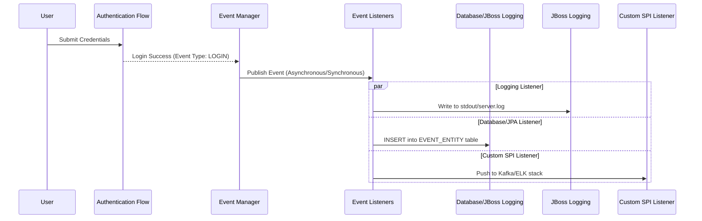

# Bài học 1: Event Logging trong Keycloak

> [!NOTE]
> **Category:** Theory (Lý thuyết)
> **Goal:** Hiểu sâu về kiến trúc Event Logging của Keycloak, cách theo dõi User Events, Admin Events, và tầm quan trọng của việc lưu trữ lịch sử để kiểm toán (Audit) và bảo mật.

## 1. Lý thuyết chuyên sâu (Detailed Theory)
Trong hệ thống Identity and Access Management (IAM), việc nắm bắt "ai đã làm gì, vào lúc nào, và từ đâu" là tối quan trọng để đáp ứng tính Compliance và Security. Keycloak phân loại Event Logging thành hai loại cơ bản:
1. **User Events (Login Events):** Ghi lại các hoạt động của End-User (như Login, Logout, Register, Code to Token exchange, Refresh Token, Reset Password).
2. **Admin Events:** Ghi lại mọi hành vi thay đổi cấu hình (Configuration Changes) từ phía Quản trị viên trên Admin Console hoặc thông qua Admin REST API (ví dụ: tạo Realm mới, sửa thông tin Client, xóa User).

Mặc định, Keycloak không lưu trữ các Events này trong Database để tối ưu hóa hiệu suất (Performance). Tuy nhiên, khi hệ thống cần thực hiện Forensic Analysis (Phân tích pháp y) hoặc Audit (Kiểm toán), việc cấu hình `Event Store` lưu giữ nhật ký là điều bắt buộc.

## 2. Luồng nội bộ & Cơ chế cấp thấp (Internal Workflow & Low-level Mechanisms)
Quá trình ghi nhận một User Login Event trong Keycloak tuân theo mô hình **Event Listener**.


**Giải thích:**
- Khi User xác thực thành công, luồng Authentication kích hoạt `Event Manager`.
- `Event Manager` đóng gói dữ liệu thành một đối tượng `Event` (chứa `userId`, `clientId`, `ipAddress`, `realmId`, v.v.).
- Đối tượng này được đẩy qua các `EventListener` đã được kích hoạt. Keycloak hỗ trợ `jboss-logging` (ghi log ra file/console) và `jpa` (lưu vào Database). Người dùng cũng có thể viết các Custom SPI để đẩy trực tiếp sang Apache Kafka hoặc RabbitMQ.

## 3. Thực hành tốt nhất & Bảo mật (Best Practices & Security)
> [!IMPORTANT]
> **Event Expiration (Thời gian hết hạn):** Luôn cấu hình `Expiration` (ví dụ: 30-90 ngày) cho các sự kiện trong Database. Không xóa thủ công. CSDL (Database) sẽ phình to rất nhanh nếu hệ thống có lưu lượng cao, dẫn tới hiện tượng "Out of Disk Space".

> [!WARNING]
> **Data Privacy (Quyền riêng tư dữ liệu):** Cân nhắc cẩn thận khi sử dụng tùy chọn `Include Representation` trong Admin Events. Nó sẽ ghi lại toàn bộ nội dung JSON của payload mà admin gửi lên. Nó có thể làm lộ các thông tin nhạy cảm (như mật khẩu được set cho User) nếu Event Database không được mã hóa.

## 4. Cấu hình minh họa thực tế (Configuration Examples)
Để bật lưu trữ sự kiện trong Database (JPA) và console thông qua biến môi trường hoặc file `keycloak.conf`:

```properties
# Trong keycloak.conf
# Chỉ định các Event Listeners
spi-events-listener-jboss-logging-success-level=info
spi-events-listener-jboss-logging-error-level=error
```
Trên Admin Console (UI):
- Vào Realm -> **Realm Settings** -> **Events**
- Bật công tắc `Save Events` (User Events).
- Đặt `Expiration` thành 30 ngày.
- Bật công tắc `Save Events` cho **Admin Events**.
- Để tiết kiệm dung lượng, trong mục "Saved Types", chỉ chọn những loại sự kiện cốt lõi như `LOGIN`, `LOGIN_ERROR`, `LOGOUT`, `REGISTER`.

## 5. Trường hợp ngoại lệ (Edge Cases)
- **High Throughput Bottleneck:** Khi có hàng ngàn đăng nhập mỗi giây, việc sử dụng JPA Event Listener (Ghi vào CSDL quan hệ) tạo ra thắt cổ chai (Bottleneck) lớn về I/O.
  - *Khắc phục:* Tắt JPA listener. Tự phát triển `Custom Event Listener SPI` xuất log ra định dạng JSON vào Console, sau đó sử dụng Fluentd/Logstash (ELK Stack) để thu thập log không đồng bộ.
- **Clock Skew (Lệch thời gian):** Nếu thời gian hệ thống của Keycloak node không được đồng bộ hóa (NTP sync), các Event sẽ có Timestamp sai lệch, gây khó khăn cho việc tra cứu log bảo mật.

## 6. Câu hỏi Phỏng vấn (Interview Questions)
1. **[Junior]** Keycloak chia các Event thành những nhóm chính nào? (User Events và Admin Events).
2. **[Junior]** Tùy chọn `Include Representation` trong Admin Events dùng để làm gì?
3. **[Senior]** Làm thế nào để giảm tải cho Database khi bật tính năng lưu Event trong một hệ thống Keycloak chịu tải cao?
4. **[Senior]** Nêu cách kết nối Keycloak Event với một hệ thống SIEM (Security Information and Event Management) bên ngoài.
5. **[Senior]** Phân tích rủi ro bảo mật nếu bạn bật "Include Representation" cho mọi Admin Event mà không kiểm soát quyền truy cập vào Database log.

## 7. Tài liệu tham khảo (References)
- [Keycloak Official Documentation - Auditing and Events](https://www.keycloak.org/docs/latest/server_admin/#_events)
- [RFC 2104: HMAC: Keyed-Hashing for Message Authentication (Tham khảo về tính toàn vẹn của audit logs)](#)
- [OWASP Logging Cheat Sheet](https://cheatsheetseries.owasp.org/cheatsheets/Logging_Cheat_Sheet.html)
