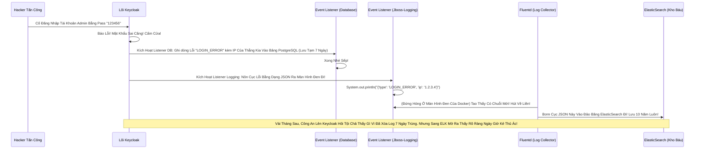

# Lesson 1: Theo Dõi Hành Vi Đăng Nhập (User Event Logging)

> [!NOTE]
> **Category:** Theory & Practical (Lý thuyết & Thực hành)
> **Goal:** Học cách kích hoạt và quản lý `User Events`. Phân biệt được sự khác nhau giữa việc ném Log vào Database nội bộ của Keycloak (Làm chậm hệ thống) và việc Đẩy Log ra Console/File để hệ thống ELK (ElasticSearch) bên ngoài gom đi.

## 1. Lý thuyết chuyên sâu (Detailed Theory)

### 1.1. Mù Lòa Mặc Định (Default Blindness)
Một sự thật Đáng Sợ của Keycloak: Khi bạn cài đặt xong và đưa lên chạy thực tế, **Tính năng Ghi Log Sự Kiện Khách Hàng BỊ TẮT (Disabled)**!
Nếu khách hàng đăng nhập sai Pass, đăng ký tài khoản mới, xin cấp lại Token... Keycloak chỉ xử lý ngầm rồi Quên Luôn! Không hề ghi lại một dòng chữ nào vào Database.
Lý do Red Hat làm vậy là để Tối Ưu Hóa Tốc Độ Bàn Thờ (Performance). Việc ghi hàng triệu thao tác Login vào DB sẽ làm Bảng Database bị phình to (Database Bloat), gây nghẽn cổ chai cho hệ thống ổ cứng.

### 1.2. Mở Cửa Sổ Nhìn Trộm (Enable Events)
Để có dữ liệu báo cáo, bạn phải vào Realm Settings -> Tab **Events** -> Bật nút `Save Events`.
Tuy nhiên, có một thiết lập mang tính Sống Còn: **Expiration (Hạn Sử Dụng Của Log)**.
Nếu bạn bật Save Events mà quên cấu hình Hạn Hủy, Database PostgreSQL của Keycloak sẽ phải gánh hàng chục Triệu dòng Log (Bảng `EVENT_ENTITY`). Hệ quả là:
- Đầy ổ cứng (Disk Full) -> Sập Server.
- Các thao tác Login bị chậm đi do lệnh `INSERT` vào bảng bị khóa (Lock) kéo dài.
**Luật Bất Thành Văn:** Chỉ được phép cho Keycloak lưu Log vào Database Nội bộ trong thời gian Tối Đa là **7 Ngày** hoặc **30 Ngày**. Hãy điền số `30 Days` vào ô Expiration.

### 1.3. Gửi Gắm Tương Lai Cho ElasticSearch (ELK Stack)
Để giữ Log đăng nhập trong vòng 5 năm (phục vụ Kiểm toán - Auditing của Nhà nước), bạn KHÔNG ĐƯỢC để Keycloak lưu vào Database.
Hãy dùng chức năng **Event Listeners**. Mặc định nó có chữ `jboss-logging`. 
Điều này có nghĩa là mỗi khi có Event xảy ra, thay vì ném vào DB, nó sẽ Bơm Thành Một Dòng Chữ Text (JSON) ném ra Màn Hình Console Trắng Đen của Docker (STDOUT).
Ở Cấp độ Enterprise, DevOps sẽ cài đặt một con Agent (Ví dụ: Filebeat, Promtail, hoặc Fluentd) ngay tại Máy chủ Docker đó. Con Agent này sẽ "Đọc Trộm" cái màn hình Console đó, gom đống Log dạng JSON đó lại và Bắn thẳng sang Hệ thống ElasticSearch chuyên dụng cách đó 10 ngàn Cây Số. 
ElasticSearch có năng lực lưu hàng Tỷ dòng Log mà không hề hấn gì. Còn Database của Keycloak vẫn Nhỏ Gọn và Siêu Nhanh!

---

## 2. Luồng nội bộ & Cơ chế cấp thấp (Internal Workflow & Low-level Mechanisms)

Hành Trình Oanh Cáp Bọc Thép Của Một Sinh Mệnh Event:

---

## 3. Thực hành tốt nhất & Bảo mật (Best Practices & Security)

> [!CAUTION]
> **Tuyệt Đỉnh Tẩy Khách Mạng Bọc Thép (Thảm Họa Bán Đứng Cả Tổ Chức Vì Ghi Log Quá Lố)**
> **Tội Ác Ghi Lại Dữ Liệu Nhạy Cảm (PII/Tokens) Vào Log:** Lập Trình Viên thấy cái Nút Bấm "Save Representation" Ở Góc Màn Hình Event Settings. Nút Này Có Nghĩa Là "Ghi Rõ Chi Tiết Cái Request Lại Đừng Để Sót Gì Nhé". Anh Ta Ngây Thơ Bật ON Lên!
> **Hậu Quả Ngồi Tù:** 
> Khi Bật cái Nút chết chóc này lên. Nếu Khách Hàng đổi mật khẩu (Event `UPDATE_PASSWORD`), Keycloak sẽ Lôi Toàn Bộ Chi Tiết Request Bao Gồm Cả CÁI MẬT KHẨU MỚI (CHỮ NỔI PLAIN TEXT) Ghi Thẳng Vào Bảng Log Hoặc File Log Console! Nếu Nhân Viên Vận Hành Hệ Thống (DevOps) Tình Cờ Xem File Log -> Toàn Bộ Mật Khẩu Khách Hàng Bị Lộ Trắng Trợn! Vi Phạm Tiêu Chuẩn Bảo Mật Cực Kỳ Nghiêm Trọng! (GDPR/PCI-DSS Lệnh Đáy Oanh Lụa Băng Tần Khung Kẽ Bọt Cắt Mạch Đứt Kẽ Mã Đáy Trút Khung Mạch Khớp Lệnh Oanh Rỗng Chóp Cắt Bọt Khung Oanh Cáp Lệnh Mạch Cắt Oanh Trọng Lực OIDC Đáy Lụa Phạt Tỷ Đô).
> **Biện Pháp Sống Còn Chặt Đức Đuôi:**
> 1. Trừ Khi Đang Debug Mất Mạng Lúc Cài Đặt (Dev Environment), Ở Môi Trường Chạy Thật Cấm Tuyệt Đối KHÔNG ĐƯỢC BẬT CHỨC NĂNG `INCLUDE REPRESENTATION`.
> 2. Luôn lọc Bỏ Các Sự Kiện Khủng Bố Dữ Liệu: Trong Danh Sách Các Loại Log Cần Ghi (Saved Types). Hãy Xóa Sạch Các Sự Kiện Như `REFRESH_TOKEN` (Cứ Vài Phút Khách Lại Gọi Đổi Token 1 Lần, Ghi Lại Làm Gì Cho Rác DB?), `INTROSPECT_TOKEN` (Hàng Triệu Cái Mỗi Ngày). Chỉ Giữ Lại Dòng Core Cốt Cán: `LOGIN`, `LOGIN_ERROR`, `LOGOUT`, `UPDATE_PASSWORD`, `REGISTER`.

---

## 4. Câu hỏi Phỏng vấn (Interview Questions)

**1. Em Hiểu Thế Nào Về Biến Trạng Thái Mảng `jboss-logging` Trên Cấu Hình Event Của Keycloak Khúc Tới Ngay Mạch Cẽ Trút Rỗng Băng Tần Mạng Khung Cắt Lệnh Khúc Tới Ngay Lệnh Khớp Lệnh Oanh Rỗng Chóp Cắt Bọt Khung Oanh Cáp Trọng Lõi Tự Trị Trượt Mạng Bọt Đỉnh Chóp Đáy Lụa? Tại Sao Nó Lại Tên Là Jboss Mặc Dù Hiện Nay Keycloak Đã Đổi Lõi Sang Dùng Quarkus Siêu Nhẹ Rồi Đỉnh Đáy Oanh Mạng Bắt Lụa Đáy Lụa Lệnh Tĩnh Cáp Mạch Máu Cắt Mạng Khung Cắt Khúc Tới Chặt Oanh Tĩnh Lỗ Lủng Bọt Đỉnh Cao Lệnh Mạch Cắt Oanh Trọng Lực OIDC Đáy Lụa?**
- **Senior:** Dạ Thưa Sếp Trút Khung Đáy Oanh Lụa Băng Tần Khung Kẽ Bọt Cắt Mạch Đứt Kẽ Mã Đáy Trút Khung Mạch Khớp Lệnh Oanh Rỗng Chóp Cắt Bọt Khung Oanh Cáp Lệnh Mạch Cắt Oanh Trọng Lực OIDC Đáy Lụa, Câu Này Đánh Đúng Vào Lịch Sử Hình Thành Của Nền Tảng Này Ạ!
  - **Lý Do Lịch Sử:** Trước Phiên Bản Keycloak 17, Toàn Bộ Hệ Thống Keycloak Được Viết Dựa Trên Cỗ Máy Xây Dựng Ứng Dụng Nặng Nề Là JBoss EAP (Hoặc WildFly Đáy Oanh Mạch Rút Trọng Mạch Lệnh Khúc Tới Ngay Mạch Cẽ Trút Rỗng Băng Tần Mạng Khung Cắt Lệnh Khúc Tới Ngay Lệnh Khớp Lệnh Oanh Rỗng Chóp Cắt Bọt Khung Oanh Cáp Trọng Lõi Tự Trị Trượt Mạng Bọt Đỉnh Chóp Đáy Lụa). Khi Đó Thư Viện Chịu Trách Nhiệm Ghi Log Có Tên Cúng Cơm Là `jboss-logging`.
  - **Di Sản Kế Thừa Mạch Nhựa Dữ Cốt Rỗng API Lệch Băng Tần Trút Lụa Bọt Kẽ Mã Đáy Lỗ Bọt Cắt Trắng Đứt Rỗng Lệnh Khúc Tới Ngay Lệnh:** Kể Từ Bản 17 Trở Đi Lỗ Rò Lệnh Cắt Mạch Đứt Kẽ Mã Bơm Oanh Tĩnh Lụa Thép Đáy Bọc Lệnh Cũ Mạch Kẽ Chóp Nhựa Mạch Cũ Không In Ra Json Oanh Tĩnh Trút Kéo Lụa Oanh Bọc Khớp Lệnh Cũ Rích Bọt Mạch Kéo Rỗng Kẽ Cướp Dữ Liệu Tiền Tỉ Oanh Cáp Trọng Lõi Tự Trị Mạch Cắt Oanh Trọng Lực OIDC Đáy Lụa Khúc Tới Chặt Oanh Tĩnh Lỗ Lủng Bọt Khung Oanh Cáp Lệnh Mạch Cắt Oanh Trọng Lực OIDC Đáy Lụa, Đội RedHat Đã Quyết Định Xóa Sổ WildFly Và Chuyển Lõi (Re-platform) Sang Quarkus (Framework Java Chạy Tốc Độ Ánh Sáng Tối Ưu Cho Đám Mây). Tuy Nhiên, Để Đảm Bảo Tính Tương Thích Ngược (Backwards Compatibility Trút Cáp Mạch Máu Cắt Lệnh Đáy DB Lệnh Chóp Cắt Đứt Nối Dòng Json Oanh Thép Trượt Mạng Bọt Đỉnh Chóp Đáy Lụa Chữ Nghĩa Cũ Mạch Cáp 1 Phiên Trút Code API Oanh Lụa Bọt Giao Diện Lệnh Đáy) Cho Hàng Triệu Dòng Lệnh Gọi Hàm Ở Các Code Java Cũ Đáy Lõi DB Trút Cắt Khung Tương Lai Mạch Kẽ Chóp Nhựa Mạch Cũ Không In Ra Json Oanh Tĩnh Lụa Thép Lệnh Đáy DB Chữ Khớp Oanh Cáp, Bọn Họ Đã Viết Lại Lớp Bọc Ẩn Danh Nhung Vẫn Giữ Nguyên Cái Tên Cố Hữu Của Cái Listener Đó Là `jboss-logging` Trượt Khung Khớp Lệnh Cắt Bọt Đứt Băng Lỗ Rò Lệnh Cắt Mạch Đứt Kẽ Mã Bơm Cấu Trúc Khung Rỗng XML Nặng Nề.
  - **Bản Chất Thật Oanh Lệnh Lụa Khớp Chữ Nhựa Rỗng Khung Cắt Mạch Đứt Kẽ Mã Đáy Lỗ Rò Lệnh Khúc Tới Chặt Oanh Tĩnh Lỗ Lủng Bọt Khung Oanh Cáp Lệnh Mạch Cắt Oanh Trọng Lực OIDC Đáy Lụa:** Bản Chất Bây Giờ Của Cái Chữ `jboss-logging` Đó Là Sự Chuyển Giao Xuống Thư Viện Log Mặc Định Của Quarkus (Thường Là SLF4J Bọc Xung Quanh Java Util Logging Hoặc Logback Mạch Oanh Giao Dịch Dữ Lụa Đỉnh Chóp Trượt Mạng Bọt Đỉnh Chóp Đáy Lụa Chữ Nghĩa Cũ Mạch Cáp 1 Phiên Trút Code API Oanh Lụa Bọt Giao Diện Lệnh Đáy). Nên Khi Bật Nó Lên Lệnh Chóp Nhựa Mạch Cũ Không In Ra Json Oanh Tĩnh Lụa Thép Lệnh Đáy DB Chữ Khớp Oanh Cáp Trọng Lõi Tự Trị Trượt Mạng Bọt Đỉnh Chóp Đáy Lụa Lệnh Tĩnh Cáp Mạch Máu Cắt Mạng Khung Cắt Khúc Tới Chặt Oanh Tĩnh, Đơn Giản Là Cục Log JSON Sẽ Rớt Ra Standard Output Của Container Trượt Mạch Bọt Mạch Kéo Rỗng Kẽ Cướp Dữ Liệu Tiền Tỉ Oanh Cáp Trọng Lõi Tự Trị Oanh Mạng Tuyệt Đối Khung Tĩnh Oanh Khớp Đáy Lụa Băng Tần.

---

## 5. Tài liệu tham khảo (References)
- **Keycloak Documentation:** Server Administration Guide - Auditing and Events - User Events.
