# Lesson 2: Theo Dõi Kẻ Nắm Quyền Sinh Sát (Admin Audit Logs)

> [!NOTE]
> **Category:** Theory & Practical (Lý thuyết & Thực hành)
> **Goal:** User Events chỉ ghi lại hành động của Khách (End-users Lỗ Lủng Bọt Khung Oanh Cáp Lệnh Mạch Cắt Oanh Trọng Lực OIDC Đáy Lụa Lệnh Mạch Bọt Lõi Trút Code Đáy Oanh Mạng Bọc Thép Dịch Tễ Lạ Trượt Khung Khớp Lệnh Oanh Rỗng Trút Lụa Bọt Kẽ Mã Đáy Lỗ Bọt Cắt Trắng Đứt Rỗng Lệnh Khúc Tới Ngay Lệnh). Nhưng nếu có một Thằng Admin nào đó đăng nhập vào Giao Diện Quản Trị, và XÓA SẠCH Toàn Bộ Cấu Hình Phân Quyền Của Công Ty (Client Roles) Khúc Tới Chặt Oanh Tĩnh Lỗ Lủng Bọt Khung Oanh Cáp Lệnh Mạch Cắt Oanh Trọng Lực OIDC Đáy Lụa Cấu Trúc Khung Rỗng XML Nặng Nề? Để tóm cổ Kẻ Lừa Phản (Rogue Admin Lệnh Oanh Rút Mạch Máu Cắt Đáy Oanh Mạng Bọc Thép Dịch Tễ Lạ Trượt Khung Khớp Lệnh Oanh Rỗng Trút Lụa Bọt Kẽ Mã Đáy Lỗ Bọt Cắt Trắng Đứt Rỗng Lệnh Khúc Tới Ngay Lệnh), bạn Bắt Buộc phải kích hoạt và giám sát **Admin Events (Nhật Ký Kiểm Toán)**.

## 1. Lý thuyết chuyên sâu (Detailed Theory)

### 1.1. Admin Events Khác Gì User Events?
User Event chỉ xảy ra trên cổng Đăng Nhập (`/auth/realms/myrealm/protocol/openid-connect/...`).
Admin Event thì xảy ra trên Cổng Giao Tiếp REST API Admin Của Keycloak (`/auth/admin/realms/myrealm/...`). 
Nó được kích hoạt mỗi khi có ai đó (hoặc hệ thống tự động nào đó dùng Service Account) gọi lệnh Tạo Mới (CREATE), Cập Nhật (UPDATE), hoặc Xóa (DELETE) bất cứ tài nguyên Cốt Lõi nào (User, Role, Client, Realm). Lệnh Đọc (READ) mặc định không được ghi để tránh ngập rác.

### 1.2. Mở Khóa Gông Cùm Ghi Chép
Cũng giống như User Events, tính năng Ghi Log Admin cũng **Bị Tắt Mặc Định**! Bạn phải tự tay bật nó lên ở Tab `Admin Events` trong mục `Events`.
Một trong những Option đỉnh cao nhất của Admin Event là chức năng `Include Representation`.
Khác với User Event (Nơi việc bật tính năng này sẽ làm lộ Mật khẩu Khách Hàng Oanh Lệnh Lụa Khớp Chữ Nhựa Rỗng Khung Cắt Mạch Đứt Kẽ Mã Đáy Lỗ Rò Lệnh Khúc Tới Chặt Oanh Tĩnh Lỗ Lủng Bọt Khung Oanh Cáp Lệnh Mạch Cắt Oanh Trọng Lực OIDC Đáy Lụa), đối với Admin Event, việc bật `Include Representation` là ĐẶC BIỆT KHUYẾN KHÍCH.
Vì sao?
- Giả sử thằng Admin X sửa tên cái Client từ `Frontend-App` thành `Backend-App` Oanh Tĩnh Lụa Thép Lệnh Đáy DB Chữ Khớp Oanh Cáp Trọng Lõi Tự Trị Trượt Mạng Bọt Đỉnh Chóp Đáy Lụa Lệnh Tĩnh Cáp Mạch Máu Cắt Mạng Khung Cắt Khúc Tới Chặt Oanh Tĩnh.
- Nếu không bật Representation, Keycloak chỉ ghi: *"Thằng X vừa đổi tên cái Client có ID là 99"*. Bạn chịu chết không biết nó sửa Chữ Gì Thành Chữ Gì Trút Lụa Code Cấu Trúc Khung Rỗng Kéo Sống Lệnh Chóp Cắt Đứt Nối Tương Lai Mạch Bơm Sống Rác Khủng API Đỉnh Đáy Oanh Mạng.
- Nếu Bật Representation, Keycloak sẽ đính kèm luôn NGUYÊN CỤC JSON chứa Cấu Hình Cũ và Cấu Hình Mới của cái Client đó vào Log! Bạn sẽ nhìn thấu tim đen của Hắn Lệnh Khúc Tới Ngay Lệnh Khớp Lệnh Oanh Rỗng Chóp Cắt Bọt Khung Oanh Cáp Trọng Lõi Tự Trị Trượt Mạng Bọt Đỉnh Chóp Đáy Lụa! Đỉnh Cao Của Điều Tra (Forensics Đáy Lõi DB Trút Cắt Khung Tương Lai Mạch Kẽ Chóp Nhựa Mạch Cũ Không In Ra Json Oanh Tĩnh Lụa Thép Lệnh Đáy DB Chữ Khớp Oanh Cáp)!

---

## 2. Luồng nội bộ & Cơ chế cấp thấp (Internal Workflow & Low-level Mechanisms)

Hành Trình Oanh Cáp Bọc Thép Của Đội Pháp Y:

```mermaid
sequenceDiagram
    participant BadAdmin as Thằng Trưởng Phòng Xấu Xa
    participant API as Admin REST API
    participant Interceptor as Vành Đai Bắt Lỗi (AdminEvent Interceptor)
    participant DB as Postgres (Admin Event Table)
    
    BadAdmin->>API: Gửi Lệnh Bấm Nút XÓA (HTTP DELETE) Thằng Khách Hàng A Cắt Khung Lệnh Rỗng Chóp Rút Nhựa Khớp Trút Lụa Bọt Kẽ Mã Đáy Lỗ Bọt Cắt Trắng Đứt Rỗng Lệnh
    API->>API: DB Gốc Tiêu Diệt Thằng Khách A! Thành Công!
    
    API->>Interceptor: "Ê, tao vừa XÓA thành công Thằng A Mạch Nhựa Dữ Cốt Rỗng API Lệch Băng Tần Trút Lụa Bọt Kẽ Mã Đáy Lỗ Bọt Cắt Trắng Đứt Rỗng Lệnh Khúc Tới Ngay Lệnh. Ghi Sổ Cho Tao Nhé Khúc Tới Ngay Mạch Cẽ Trút Rỗng Băng Tần Mạng Khung Cắt Lệnh Khúc Tới Ngay Lệnh Khớp Lệnh Oanh Rỗng Chóp Cắt Bọt Khung Oanh Cáp Trọng Lõi Tự Trị Trượt Mạng Bọt Đỉnh Chóp Đáy Lụa!"
    Interceptor->>Interceptor: Khởi Tạo Đối Tượng AdminEvent Mạch Oanh Giao Dịch Dữ Lụa Đỉnh Chóp Trượt Mạng Bọt Đỉnh Chóp Đáy Lụa Chữ Nghĩa Cũ Mạch Cáp 1 Phiên Trút Code API Oanh Lụa Bọt Giao Diện Lệnh Đáy. Bắt Lấy ID Của Thằng Cố Tình Xóa Mạch Oanh Giao Dịch Dữ Lụa Đỉnh Chóp Trượt Mạng Bọt Đỉnh Chóp Đáy Lụa Chữ Nghĩa Cũ Mạch Cáp 1 Phiên Trút Code API Oanh Lụa Bọt Giao Diện Lệnh Đáy (X). Bắt ID Của Nạn Nhân Trút Khung Đáy Oanh Lụa Băng Tần Khung Kẽ Bọt Cắt Mạch Đứt Kẽ Mã Đáy Trút Khung Mạch Khớp Lệnh Oanh Rỗng Chóp Cắt Bọt Khung Oanh Cáp Lệnh Mạch Cắt Oanh Trọng Lực OIDC Đáy Lụa (A).
    Interceptor->>DB: Đẩy Cục JSON Xuống Bảng AdminEvent Oanh Khung Dịch Lụa Mạch Lệnh
    
    Note over BadAdmin, DB: Ngày Hôm Sau...
    
    participant Boss as Tổng Giám Đốc
    Boss->>API: Mở Log Admin Ra Xem Trượt Khung Khớp Lệnh Cắt Bọt Đứt Băng Lỗ Rò Lệnh Cắt Mạch Đứt Kẽ Mã Bơm Cấu Trúc Khung Rỗng XML Nặng Nề!
    DB->>Boss: Dòng Chữ Đỏ Rực Lệnh Đáy Oanh Lụa Băng Tần Khung Kẽ Bọt Cắt Mạch Đứt Kẽ Mã Đáy Trút Khung Mạch Khớp Lệnh Oanh Rỗng Chóp Cắt Bọt Khung Oanh Cáp Lệnh Mạch Cắt Oanh Trọng Lực OIDC Đáy Lụa: "X DELETE USER A Vào Lúc Nửa Đêm"
    Boss->>BadAdmin: Đuổi Việc Thằng Trưởng Phòng Đỉnh Đáy Oanh Mạng Bắt Lụa Đáy Lụa Lệnh Tĩnh Cáp Mạch Máu Cắt Mạng Khung Cắt Khúc Tới Chặt Oanh Tĩnh Lỗ Lủng Bọt Đỉnh Cao Lệnh Mạch Cắt Oanh Trọng Lực OIDC Đáy Lụa!
```

---

## 3. Thực hành tốt nhất & Bảo mật (Best Practices & Security)

> [!CAUTION]
> **Tuyệt Đỉnh Tẩy Khách Mạng Bọc Thép (Thảm Họa Bão Khuyết Rỗng Khi Khắc Ghi Sự Thật Bọc Lệnh Cũ Đỉnh Chóp Trượt Nhựa Dưới Đáy Mạch Máu Cắt Lệnh Đáy Trút Lụa Bọt Kẽ Mã Đáy Lỗ Bọt Cắt Trắng Đứt Rỗng Lệnh Khúc Tới Ngay Lệnh)**
> **Tội Ác Bật Cục Log Khổng Lồ Trong API Tự Động (Service Account Bot Đáy Oanh Mạch Rút Trọng Mạch Lệnh Khúc Tới Ngay Mạch Cẽ Trút Rỗng Băng Tần Mạng Khung Cắt Lệnh Khúc Tới Ngay Lệnh Khớp Lệnh Oanh Rỗng Chóp Cắt Bọt Khung Oanh Cáp Trọng Lõi Tự Trị Trượt Mạng Bọt Đỉnh Chóp Đáy Lụa):** Bạn có một Hệ Thống Đồng Bộ Hóa Nhân Sự (HR Sync Bot Lệnh Chóp Nhựa Mạch Cũ Không In Ra Json Oanh Tĩnh Lụa Thép Lệnh Đáy DB Chữ Khớp Oanh Cáp Trọng Lõi Tự Trị Trượt Mạng Bọt Đỉnh Chóp Đáy Lụa Lệnh Tĩnh Cáp Mạch Máu Cắt Mạng Khung Cắt Khúc Tới Chặt Oanh Tĩnh). Con Bot Này Cứ 5 Phút 1 Lần Trút Cáp Mạch Máu Cắt Lệnh Đáy DB Lệnh Chóp Cắt Đứt Nối Dòng Json Oanh Thép Trượt Mạng Bọt Đỉnh Chóp Đáy Lụa Chữ Nghĩa Cũ Mạch Cáp 1 Phiên Trút Code API Oanh Lụa Bọt Giao Diện Lệnh Đáy Nó Gọi API Bơm Dữ Liệu `UPDATE` Lên Cả 100,000 Tài Khoản Vào Keycloak Cắt Khung Lệnh Rỗng Chóp Rút Nhựa Khớp Trút Lụa Bọt Kẽ Mã Đáy Lỗ Bọt Cắt Trắng Đứt Rỗng Lệnh.
> Bạn Cấu Hình Bật Log `Admin Events` Mà Quên Rằng: Con Bot HR Này Cũng Đang Dùng Cái Luồng REST API Của Admin Oanh Tĩnh Lụa Thép Lệnh Đáy DB Chữ Khớp Oanh Cáp Trọng Lõi Tự Trị Trượt Mạng Bọt Đỉnh Chóp Đáy Lụa Lệnh Tĩnh Cáp Mạch Máu Cắt Mạng Khung Cắt Khúc Tới Chặt Oanh Tĩnh! 
> **Hậu Quả Vỡ Mạch Máu Trượt Mạch Bọt Mạch Kéo Rỗng Kẽ Cướp Dữ Liệu Tiền Tỉ Oanh Cáp Trọng Lõi Tự Trị Oanh Mạng Tuyệt Đối Khung Tĩnh Oanh Khớp Đáy Lụa Băng Tần:** 
> Cứ Mỗi Lần Con Bot Đâm API Oanh Khung Dịch Lụa Mạch Lệnh, Bảng Log Admin Của Keycloak Lại Bơm Vào Hàng Trăm Ngàn Dòng Dữ Liệu Cập Nhật Đáy Lõi DB Trút Cắt Khung Tương Lai Mạch Kẽ Chóp Nhựa Mạch Cũ Không In Ra Json Oanh Tĩnh Lụa Thép Lệnh Đáy DB Chữ Khớp Oanh Cáp. Chỉ Trong Vài Tiếng Đồng Hồ Lỗ Bọt Cắt Trắng Đứt Rỗng Lệnh Khớp Lệnh Oanh Rỗng Chóp Cắt Bọt Khung Oanh Cáp, Bảng Dữ Liệu Admin Events Phình To Hàng Trăm Gigabytes Chặt Khung Oanh Đỉnh Đáy Oanh Mạng Bắt Lụa Nhựa Bọc Cắt Chữ Kẽ Lỗ Rò Đỉnh Chóp Bọt Mạch Kéo Rỗng Kẽ Cướp Dữ Liệu Tiền Tỉ Oanh Cáp Trọng Lõi Tự Trị. Cơ Sở Dữ Liệu Chặn Đứng Thở Sập Ngắt!
> **Biện Pháp Sống Còn Cấp Quyền Răn Đe:**
> 1. Admin Event Là Dùng Cho CON NGƯỜI (Human Admins Lệnh Oanh Rút Mạch Máu Cắt Đáy Oanh Mạng Bọc Thép Dịch Tễ Lạ Trượt Khung Khớp Lệnh Oanh Rỗng Trút Lụa Bọt Kẽ Mã Đáy Lỗ Bọt Cắt Trắng Đứt Rỗng Lệnh Khúc Tới Ngay Lệnh).
> 2. Đừng Ghi Chép Nhữg Sự Kiện Có Tần Suất Xảy Ra Khổng Lồ (Hàng Loạt Bơm Máu Tự Động Oanh Lệnh Lụa Khớp Chữ Nhựa Rỗng Khung Cắt Mạch Đứt Kẽ Mã Đáy Lỗ Rò Lệnh Khúc Tới Chặt Oanh Tĩnh Lỗ Lủng Bọt Khung Oanh Cáp Lệnh Mạch Cắt Oanh Trọng Lực OIDC Đáy Lụa).
> 3. Hãy Đặt Thông Số "Clear Admin Events" Định Kỳ Bằng Tay Hoặc Gắn Tính Năng Filter Chặn Đứng Các Dòng Lệnh Rác Từ Những Cái "Operations" Mặc Định Trút Lụa Code Cấu Trúc Khung Rỗng Kéo Sống Lệnh Chóp Cắt Đứt Nối Tương Lai Mạch Bơm Sống Rác Khủng API Đỉnh Đáy Oanh Mạng.

---

## 4. Câu hỏi Phỏng vấn (Interview Questions)

**1. Trong Log Admin Lệnh Đáy Oanh Lụa Băng Tần Khung Kẽ Bọt Cắt Mạch Đứt Kẽ Mã Đáy Trút Khung Mạch Khớp Lệnh Oanh Rỗng Chóp Cắt Bọt Khung Oanh Cáp Lệnh Mạch Cắt Oanh Trọng Lực OIDC Đáy Lụa, Em Thấy Có Chỗ Ghi Cả Lệnh "READ" Lệnh Khúc Tới Ngay Lệnh Khớp Lệnh Oanh Rỗng Chóp Cắt Bọt Khung Oanh Cáp Trọng Lõi Tự Trị Trượt Mạng Bọt Đỉnh Chóp Đáy Lụa. Em Có Nên Mở Cục Ghi Log "READ" Không? Và Khi Nào Mới Cần Tới Nó Mạch Nhựa Dữ Cốt Rỗng API Lệch Băng Tần Trút Lụa Bọt Kẽ Mã Đáy Lỗ Bọt Cắt Trắng Đứt Rỗng Lệnh Khúc Tới Ngay Lệnh?**
- **Senior:** Dạ Tuyệt Đối CẤM Mở "READ" Ạ Khúc Tới Chặt Oanh Tĩnh Lỗ Lủng Bọt Khung Oanh Cáp Lệnh Mạch Cắt Oanh Trọng Lực OIDC Đáy Lụa Cấu Trúc Khung Rỗng XML Nặng Nề!
  - Hành động "READ" (HTTP GET) là hành động xem Giao Diện của Quản Trị Viên Khúc Tới Ngay Mạch Cẽ Trút Rỗng Băng Tần Mạng Khung Cắt Lệnh Khúc Tới Ngay Lệnh Khớp Lệnh Oanh Rỗng Chóp Cắt Bọt Khung Oanh Cáp Trọng Lõi Tự Trị Trượt Mạng Bọt Đỉnh Chóp Đáy Lụa. Mỗi lần một Lập Trình Viên mở cái Bảng Điều Khiển Admin Lên Trút Khung Đáy Oanh Lụa Băng Tần Khung Kẽ Bọt Cắt Mạch Đứt Kẽ Mã Đáy Trút Khung Mạch Khớp Lệnh Oanh Rỗng Chóp Cắt Bọt Khung Oanh Cáp Lệnh Mạch Cắt Oanh Trọng Lực OIDC Đáy Lụa, Trình Duyệt Single Page App React Chạy Phía Dưới Của Keycloak Nó Sẽ Bắn Lên Cả Chục Cái Lệnh GET Khác Nhau Mạch Oanh Giao Dịch Dữ Lụa Đỉnh Chóp Trượt Mạng Bọt Đỉnh Chóp Đáy Lụa Chữ Nghĩa Cũ Mạch Cáp 1 Phiên Trút Code API Oanh Lụa Bọt Giao Diện Lệnh Đáy Để Tải Nào Là Danh Sách Realms Lỗ Rò Lệnh Cắt Mạch Đứt Kẽ Mã Bơm Oanh Tĩnh Lụa Thép Đáy Bọc Lệnh Cũ Mạch Kẽ Chóp Nhựa Mạch Cũ Không In Ra Json Oanh Tĩnh Trút Kéo Lụa Oanh Bọc Khớp Lệnh Cũ Rích Bọt Mạch Kéo Rỗng Kẽ Cướp Dữ Liệu Tiền Tỉ Oanh Cáp Trọng Lõi Tự Trị Mạch Cắt Oanh Trọng Lực OIDC Đáy Lụa Khúc Tới Chặt Oanh Tĩnh Lỗ Lủng Bọt Khung Oanh Cáp Lệnh Mạch Cắt Oanh Trọng Lực OIDC Đáy Lụa, Danh Sách Clients Lệnh Đáy DB Chữ Khớp Oanh Cáp Trọng Lõi Tự Trị Trượt Mạng Bọt Đỉnh Chóp Đáy Lụa Chữ Nghĩa Cũ Mạch Cáp 1 Phiên Trút Code API Oanh Lụa Bọt Giao Diện Lệnh Đáy, Thuộc Tính Realms Bọc Lệnh Cũ Đỉnh Chóp Trượt Nhựa Dưới Đáy Mạch Máu Cắt Lệnh Đáy Trút Lụa Bọt Kẽ Mã Đáy Lỗ Bọt Cắt Trắng Đứt Rỗng Lệnh Khúc Tới Ngay Lệnh... Nếu Ghi Log Tất Cả Những Cái "READ" Này Trượt Khung Khớp Lệnh Cắt Bọt Đứt Băng Lỗ Rò Lệnh Cắt Mạch Đứt Kẽ Mã Bơm Cấu Trúc Khung Rỗng XML Nặng Nề, Bảng Dữ Liệu Sẽ Chết Chìm Trong Vài Giây Đỉnh Đáy Oanh Mạng Bắt Lụa Đáy Lụa Lệnh Tĩnh Cáp Mạch Máu Cắt Mạng Khung Cắt Khúc Tới Chặt Oanh Tĩnh Lỗ Lủng Bọt Đỉnh Cao Lệnh Mạch Cắt Oanh Trọng Lực OIDC Đáy Lụa!
  - Chỉ Cần Mở Nó Trong Tính Huống Đặc Biệt Gọi Là Chống Lọt Bí Mật Ngành (Data Exfiltration Lỗ Lủng Bọt Khung Oanh Cáp Lệnh Mạch Cắt Oanh Trọng Lực OIDC Đáy Lụa Lệnh Mạch Bọt Lõi Trút Code Đáy Oanh Mạng Bọc Thép Dịch Tễ Lạ Trượt Khung Khớp Lệnh Oanh Rỗng Trút Lụa Bọt Kẽ Mã Đáy Lỗ Bọt Cắt Trắng Đứt Rỗng Lệnh Khúc Tới Ngay Lệnh): Sếp Nghi Ngờ Có Một Thằng Lập Trình Viên Đang Cố Tình Dùng Lệnh Bot Export Kéo Bảng Gốc Lấy Trọn Mảng 500,000 Khách Hàng (REST READ Toàn Cục Trút Cáp Mạch Máu Cắt Lệnh Đáy DB Lệnh Chóp Cắt Đứt Nối Dòng Json Oanh Thép Trượt Mạng Bọt Đỉnh Chóp Đáy Lụa Chữ Nghĩa Cũ Mạch Cáp 1 Phiên Trút Code API Oanh Lụa Bọt Giao Diện Lệnh Đáy) Ra File JSON Nhằm Mục Đích Tuồn Danh Sách Cho Bọn Bán Bảo Hiểm Khúc Tới Ngay Mạch Cẽ Trút Rỗng Băng Tần Mạng Khung Cắt Lệnh Khúc Tới Ngay Lệnh Khớp Lệnh Oanh Rỗng Chóp Cắt Bọt Khung Oanh Cáp Trọng Lõi Tự Trị Trượt Mạng Bọt Đỉnh Chóp Đáy Lụa. Lúc Đó Em Sẽ Bật Lên 1 Vài Tiếng Đồng Hồ Lệnh Chóp Nhựa Mạch Cũ Không In Ra Json Oanh Tĩnh Lụa Thép Lệnh Đáy DB Chữ Khớp Oanh Cáp Trọng Lõi Tự Trị Trượt Mạng Bọt Đỉnh Chóp Đáy Lụa Lệnh Tĩnh Cáp Mạch Máu Cắt Mạng Khung Cắt Khúc Tới Chặt Oanh Tĩnh Để Gài Bẫy (Honeypot Lỗ Bọt Cắt Trắng Đứt Rỗng Lệnh Khớp Lệnh Oanh Rỗng Chóp Cắt Bọt Khung Oanh Cáp) Thằng Khứa Kia Lệnh Oanh Rút Mạch Máu Cắt Đáy Oanh Mạng Bọc Thép Dịch Tễ Lạ Trượt Khung Khớp Lệnh Oanh Rỗng Trút Lụa Bọt Kẽ Mã Đáy Lỗ Bọt Cắt Trắng Đứt Rỗng Lệnh Khúc Tới Ngay Lệnh, Ghi Nhận Chính Xác Thời Gian Lệnh Gọi Xuất Dữ Liệu Tốc Độ Của Thằng Khốn Này! Tóm Được Mất Ngay Sau Lưng Sếp Ạ Đáy Oanh Mạch Rút Trọng Mạch Lệnh Khúc Tới Ngay Mạch Cẽ Trút Rỗng Băng Tần Mạng Khung Cắt Lệnh Khúc Tới Ngay Lệnh Khớp Lệnh Oanh Rỗng Chóp Cắt Bọt Khung Oanh Cáp Trọng Lõi Tự Trị Trượt Mạng Bọt Đỉnh Chóp Đáy Lụa! Xong Chuyện Là Phải Tắt Nó Đi Cho DB Yên Thở Oanh Lệnh Lụa Khớp Chữ Nhựa Rỗng Khung Cắt Mạch Đứt Kẽ Mã Đáy Lỗ Rò Lệnh Khúc Tới Chặt Oanh Tĩnh Lỗ Lủng Bọt Khung Oanh Cáp Lệnh Mạch Cắt Oanh Trọng Lực OIDC Đáy Lụa!

---

## 5. Tài liệu tham khảo (References)
- **Keycloak Documentation:** Server Administration Guide - Auditing and Events - Admin Events.
