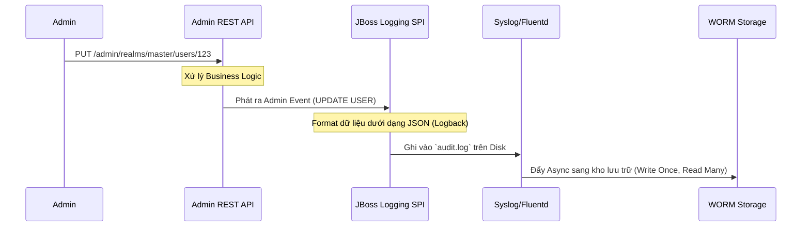

# Bài học 2: Hệ thống Audit Logs và Quản trị Rủi ro trong Keycloak

> [!NOTE]
> **Category:** Theory (Lý thuyết)
> **Goal:** Tìm hiểu vai trò của Audit Logs trong việc kiểm toán hệ thống. Phân biệt Audit Log chuẩn với Event Logging thông thường, các cơ chế duy trì (Retention), và chiến lược phân tích sự cố bảo mật.

## 1. Lý thuyết chuyên sâu (Detailed Theory)
Trong khi **Event Logging** thường tập trung vào mọi hành động xảy ra trong hệ thống, **Audit Logs** (Nhật ký Kiểm toán) mang một ý nghĩa pháp lý và bảo mật cao hơn. Trong môi trường doanh nghiệp chuẩn (Compliance standards như PCI-DSS, HIPAA, SOC 2), Audit Logs yêu cầu tính **Bất biến (Immutability)** và độ chi tiết sâu sắc.

Audit Log trong Keycloak chủ yếu bao gồm Admin Events nhưng cần xuất ra ở một định dạng chống can thiệp. Một Audit Log đạt chuẩn cần trả lời được 5 câu hỏi cốt lõi (5W):
- **Who:** Ai thực hiện (Admin user ID, IP address).
- **What:** Thực hiện hành động gì (Create, Update, Delete).
- **Where:** Tác động vào tài nguyên nào (Client ID, Realm ID, Role ID).
- **When:** Vào thời điểm nào (Timestamp với múi giờ cụ thể).
- **Why:** (Thường thông qua Context - Dữ liệu cũ là gì, Dữ liệu mới là gì - qua Representation).

## 2. Luồng nội bộ & Cơ chế cấp thấp (Internal Workflow & Low-level Mechanisms)
Để đạt chuẩn Audit Log, luồng dữ liệu của Keycloak thường được định tuyến qua File Logging có cấu trúc, thay vì lưu trong Database mà Keycloak Admin có thể tự ý sửa đổi.


**Giải thích:**
- Khi Admin gọi API để thay đổi cấu hình, `JBoss Logging SPI` sẽ được dùng để format dữ liệu thành chuẩn JSON log.
- Các Log này thay vì đẩy vào Database như Event thông thường, được ghi trực tiếp ra hệ thống File qua bộ quay Log (Log rotation).
- Tiếp đó, các tác nhân thu thập log như Fluentd/Filebeat đọc file này và đẩy sang hệ thống phân tích (như Splunk) hay thiết bị lưu trữ WORM (Write Once, Read Many) để không ai có thể sửa chữa nội dung nhật ký kiểm toán.

## 3. Thực hành tốt nhất & Bảo mật (Best Practices & Security)
> [!IMPORTANT]
> **Tích hợp SIEM:** Không để log kiểm toán chỉ lưu trữ "chết" trên server Keycloak. Phải sử dụng bộ định dạng JSON Logging (`quarkus.log.console.json=true`) và vận chuyển log tới hệ thống SIEM (Security Information and Event Management) để cảnh báo tức thời các bất thường (Ví dụ: Một tài khoản nội bộ tự cấp quyền Admin (Privilege Escalation)).

> [!WARNING]
> **Toàn vẹn Dữ liệu (Data Integrity):** Kẻ tấn công, nếu chiếm quyền truy cập Root của máy chủ Keycloak, có thể xóa file nhật ký. Do đó, việc Push các log ngay lập tức sang dịch vụ thứ ba (Remote Syslog) là nguyên tắc sống còn trong quản trị rủi ro.

## 4. Cấu hình minh họa thực tế (Configuration Examples)
Sử dụng cấu trúc Quarkus Logging để ép Keycloak ghi log dưới dạng JSON chuẩn, giúp các công cụ phân tích dễ dàng đọc (parse) cấu trúc Audit:

Cấu hình trong `keycloak.conf`:
```properties
# Chuyển đổi toàn bộ Console log thành định dạng JSON
kc.log-console-output=json

# Tùy chỉnh Log Level cho hệ thống Event
kc.log-level=INFO,org.keycloak.events:DEBUG
```

Mẫu một đoạn log dạng JSON khi một User bị cập nhật (Minh họa):
```json
{
  "timestamp": "2026-07-13T10:00:00.000Z",
  "sequence": 12345,
  "loggerClassName": "org.keycloak.events.Event",
  "loggerName": "org.keycloak.events",
  "level": "DEBUG",
  "message": "type=ADMIN_EVENT, operationType=UPDATE, resourceType=USER, resourcePath=users/xyz-123",
  "threadName": "executor-thread-1"
}
```

## 5. Trường hợp ngoại lệ (Edge Cases)
- **Sensitive Data Exposure in Logs:** Trong một số trường hợp, `representation` (nội dung payload) chứa giá trị thuộc tính nhạy cảm. Hệ thống Logging phải được cấu hình để che giấu (Masking) các trường như `password`, `secret` trước khi lưu trữ xuống đĩa.
- **Disk I/O Latency:** Ghi Audit log liên tục với lượng lớn thay đổi có thể làm chậm quá trình xử lý HTTP (vì ghi log đồng bộ vào Console/File chặn luồng xử lý). Giải pháp là dùng Async Appender trong cấu hình Log.

## 6. Câu hỏi Phỏng vấn (Interview Questions)
1. **[Junior]** Audit Log khác với Debug Log ở những điểm nào?
2. **[Junior]** Tại sao lưu trữ Audit Log dạng JSON lại tốt hơn dạng text thuần túy?
3. **[Senior]** Làm thế nào để đảm bảo tính bất biến (Immutability) của các file nhật ký kiểm toán từ Keycloak?
4. **[Senior]** Một Admin thực hiện thay đổi cấu hình, nhưng mạng bị rớt ngay lúc thao tác thành công. Làm sao hệ thống đảm bảo Audit log được ghi nhận?
5. **[Senior]** Thiết kế một kiến trúc (Architecture) thu thập log để đáp ứng chuẩn PCI-DSS khi triển khai Keycloak trên Kubernetes.

## 7. Tài liệu tham khảo (References)
- [Keycloak Logging Documentation](https://www.keycloak.org/server/logging)
- [Quarkus Logging Capabilities](https://quarkus.io/guides/logging)
- [NIST SP 800-92: Guide to Computer Security Log Management](https://csrc.nist.gov/publications/detail/sp/800-92/final)
