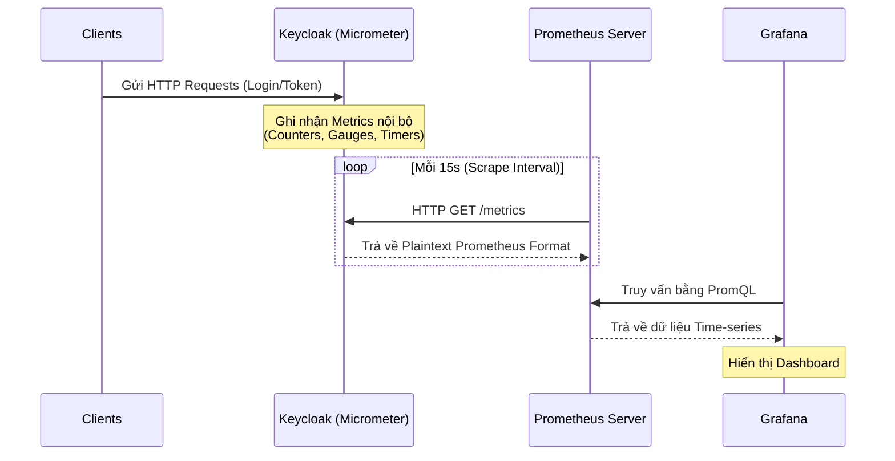

# Bài học 3: Cấu trúc Prometheus Metrics trong Keycloak

> [!NOTE]
> **Category:** Theory (Lý thuyết)
> **Goal:** Nắm vững cách Keycloak (dựa trên Quarkus & Micrometer) xuất xuất (expose) các metrics hệ thống và cách tích hợp với Prometheus & Grafana để giám sát (Monitoring) ở cấp độ Enterprise.

## 1. Lý thuyết chuyên sâu (Detailed Theory)
Hệ thống giám sát (Monitoring System) là xương sống để đảm bảo Keycloak luôn đạt SLA (Service Level Agreement) cao nhất. Keycloak phiên bản dựa trên Quarkus sử dụng thư viện **Micrometer** để thu thập các số liệu (Metrics).

Những Metrics này bao gồm:
- **JVM Metrics:** Bộ nhớ (Heap, Non-Heap), CPU usage, Garbage Collection (GC) pauses, số lượng Thread.
- **Database Connection Pool (Agroal):** Số kết nối đang hoạt động (Active Connections), thời gian chờ (Wait time), kết nối nhàn rỗi (Idle).
- **HTTP/REST Metrics:** Số lượng Request tới các endpoint, thời gian xử lý (Response Time/Latency), và tỷ lệ lỗi HTTP 4xx, 5xx.
- **Keycloak Specific Metrics (Tùy chọn bổ sung):** Số lượt đăng nhập, số lỗi đăng nhập, lượng token được cấp phát.

Các metrics này được định dạng theo chuẩn của hệ thống **Prometheus** – một Time-Series Database phổ biến nhất trong hệ sinh thái Cloud-Native/Kubernetes.

## 2. Luồng nội bộ & Cơ chế cấp thấp (Internal Workflow & Low-level Mechanisms)
Quá trình Keycloak thu thập và expose metrics tới Prometheus diễn ra theo mô hình Pull-based.


**Giải thích cơ chế cấp thấp:**
- Khác với Push-based (hệ thống tự gửi dữ liệu đi), Prometheus dùng cấu hình `scrape_configs` định kỳ gọi vào endpoint `/metrics` của Keycloak.
- Thư viện Micrometer trong Quarkus engine thực hiện việc tổng hợp các giá trị `Counter` (chỉ tăng, ví dụ tổng số request), `Gauge` (có thể tăng giảm, ví dụ dung lượng RAM), và `Timer` (phân phối thời gian xử lý). Nó chuyển đổi cấu trúc bộ nhớ trong của Java sang định dạng chuỗi văn bản (Plaintext format) đặc trưng của Prometheus.

## 3. Thực hành tốt nhất & Bảo mật (Best Practices & Security)
> [!WARNING]
> **Bảo mật Endpoint `/metrics`:** Metrics Endpoint có thể tiết lộ nhiều thông tin nhạy cảm về hệ thống (phiên bản, thư viện, tải hệ thống). Tránh expose cổng quản lý (Management port: 9000) trực tiếp ra Internet. Sử dụng Load Balancer, Ingress Controller hoặc Firewall để chỉ cho phép các IP cụ thể (như cụm Prometheus) truy cập vào đường dẫn này.

> [!IMPORTANT]
> **Tách biệt Management Interface:** Bắt đầu từ Keycloak 20+, tính năng Management Interface cho phép cấu hình endpoint `/metrics` và `/health` ở một Port riêng biệt (ví dụ port `9000`), không chung port `8080` dùng cho traffic của người dùng. Điều này giúp tăng mức độ cách ly bảo mật.

## 4. Cấu hình minh họa thực tế (Configuration Examples)
Để bật Metrics trong Keycloak thông qua `keycloak.conf` hoặc lúc build (đối với Docker/Podman):

```bash
# Lệnh build container hoặc chạy trực tiếp cấu hình
kc.sh build --metrics-enabled=true

# Chạy server với port quản trị riêng
kc.sh start --metrics-enabled=true --http-management-port=9000
```
Endpoint sau khi cấu hình thành công: `http://localhost:9000/metrics`.

Mẫu cấu hình `prometheus.yml` (Scrape config):
```yaml
scrape_configs:
  - job_name: 'keycloak'
    metrics_path: '/metrics'
    static_configs:
      - targets: ['keycloak-server:9000']
```

## 5. Trường hợp ngoại lệ (Edge Cases)
- **High Cardinality Metrics (Đa dạng hóa nhãn quá mức):** Nếu bạn vô tình định cấu hình Micrometer gắn nhãn (Label) dựa trên URL query parameter có giá trị thay đổi ngẫu nhiên (như `session_state` hay `code`), Prometheus database sẽ gặp hiện tượng "High Cardinality", dẫn tới cạn kiệt RAM (OOM) ở Prometheus Server.
- **Scrape Timeouts:** Dưới mức tải (Load) cực lớn, Keycloak có thể tốn hơn thời gian scrape interval (ví dụ 10s) để render toàn bộ text metrics, dẫn tới việc Prometheus đánh dấu instance là `DOWN`. Giải pháp là tối ưu cấu hình JVM hoặc tăng `scrape_timeout`.

## 6. Câu hỏi Phỏng vấn (Interview Questions)
1. **[Junior]** Làm cách nào để kích hoạt endpoint `/metrics` trên Keycloak phiên bản Quarkus?
2. **[Junior]** Định dạng dữ liệu trả về từ `/metrics` là gì? (JSON, XML, hay Plaintext?)
3. **[Senior]** Giải thích lợi ích của việc sử dụng `http-management-port` tách biệt thay vì dùng chung port chính (8080).
4. **[Senior]** Làm thế nào để giám sát riêng biệt các Request tới Authentication API so với Token API?
5. **[Senior]** Phân biệt sự khác nhau giữa metric kiểu `Counter` và `Gauge` trong Micrometer.

## 7. Tài liệu tham khảo (References)
- [Keycloak Metrics & Monitoring Docs](https://www.keycloak.org/server/metrics)
- [Micrometer Documentation](https://micrometer.io/docs)
- [Prometheus Data Model](https://prometheus.io/docs/concepts/data_model/)
