# Lesson 3: Đo Lường Hiệu Suất Hệ Thống (Prometheus Metrics)

> [!NOTE]
> **Category:** Theory & Practical (Lý thuyết & Thực hành)
> **Goal:** Học cách biến máy chủ Keycloak (Dựa trên lõi Quarkus) thành một điểm phát sóng dữ liệu Hiệu Suất Đỉnh Cao (Metrics Endpoint Oanh Tĩnh Lụa Thép Lệnh Đáy DB Chữ Khớp Oanh Cáp Trọng Lõi Tự Trị Trượt Mạng Bọt Đỉnh Chóp Đáy Lụa Lệnh Tĩnh Cáp Mạch Máu Cắt Mạng Khung Cắt Khúc Tới Chặt Oanh Tĩnh). Khi mở chức năng này Trút Khung Đáy Oanh Lụa Băng Tần Khung Kẽ Bọt Cắt Mạch Đứt Kẽ Mã Đáy Trút Khung Mạch Khớp Lệnh Oanh Rỗng Chóp Cắt Bọt Khung Oanh Cáp Lệnh Mạch Cắt Oanh Trọng Lực OIDC Đáy Lụa, bạn có thể kết nối với Prometheus để hút số liệu 5 giây 1 lần và tạo ra các Bảng Điều Khiển Grafana tuyệt đẹp đo lường Lượng RAM Trượt Mạch Bọt Mạch Kéo Rỗng Kẽ Cướp Dữ Liệu Tiền Tỉ Oanh Cáp Trọng Lõi Tự Trị Oanh Mạng Tuyệt Đối Khung Tĩnh Oanh Khớp Đáy Lụa Băng Tần, Lượng Truy Cập Đỉnh Đáy Oanh Mạng Bắt Lụa Đáy Lụa Lệnh Tĩnh Cáp Mạch Máu Cắt Mạng Khung Cắt Khúc Tới Chặt Oanh Tĩnh Lỗ Lủng Bọt Đỉnh Cao Lệnh Mạch Cắt Oanh Trọng Lực OIDC Đáy Lụa, Số Khách Đăng Nhập Thất Bại Lệnh Đáy DB Chữ Khớp Oanh Cáp Trọng Lõi Tự Trị Trượt Mạng Bọt Đỉnh Chóp Đáy Lụa Chữ Nghĩa Cũ Mạch Cáp 1 Phiên Trút Code API Oanh Lụa Bọt Giao Diện Lệnh Đáy.

## 1. Lý thuyết chuyên sâu (Detailed Theory)

### 1.1. Quarkus Micrometer Là Con Nhện Đáy Oanh Mạch Rút Trọng Mạch Lệnh Khúc Tới Ngay Mạch Cẽ Trút Rỗng Băng Tần Mạng Khung Cắt Lệnh Khúc Tới Ngay Lệnh Khớp Lệnh Oanh Rỗng Chóp Cắt Bọt Khung Oanh Cáp Trọng Lõi Tự Trị Trượt Mạng Bọt Đỉnh Chóp Đáy Lụa
Trước bản 17 (Bản Jboss WildFly Khúc Tới Chặt Oanh Tĩnh Lỗ Lủng Bọt Khung Oanh Cáp Lệnh Mạch Cắt Oanh Trọng Lực OIDC Đáy Lụa Cấu Trúc Khung Rỗng XML Nặng Nề), để gắn được Metrics cho Keycloak là một nỗi kinh hoàng (Phải cài đặt thư viện thứ 3 tên là `aerogear/keycloak-metrics-spi` cực kỳ thiếu ổn định và dễ bể luồng khi Nâng Cấp).
Ngày nay Lệnh Chóp Nhựa Mạch Cũ Không In Ra Json Oanh Tĩnh Lụa Thép Lệnh Đáy DB Chữ Khớp Oanh Cáp Trọng Lõi Tự Trị Trượt Mạng Bọt Đỉnh Chóp Đáy Lụa Lệnh Tĩnh Cáp Mạch Máu Cắt Mạng Khung Cắt Khúc Tới Chặt Oanh Tĩnh, vì đã lột xác sang Quarkus (Nền tảng Cloud Native Đáy Lõi DB Trút Cắt Khung Tương Lai Mạch Kẽ Chóp Nhựa Mạch Cũ Không In Ra Json Oanh Tĩnh Lụa Thép Lệnh Đáy DB Chữ Khớp Oanh Cáp), Keycloak tích hợp HẲN SẴN tính năng Metrics Bằng Micrometer vào tận xương tủy! 
Bạn chỉ cần khởi động Keycloak kèm một dòng Lệnh Phép Thuật: `--metrics-enabled=true`. 
Ngay lập tức Oanh Khung Dịch Lụa Mạch Lệnh, một Lỗ Hổng Không Gian Mới sẽ mở ra tại đường dẫn: `http://localhost:9000/q/metrics` (Nhớ kỹ: Mở ở cổng quản lý 9000 Lệnh Khúc Tới Ngay Lệnh Khớp Lệnh Oanh Rỗng Chóp Cắt Bọt Khung Oanh Cáp Trọng Lõi Tự Trị Trượt Mạng Bọt Đỉnh Chóp Đáy Lụa, Không Phải Mở Cổng Trực Tiếp 8080 Của App Để Tránh Kẻ Gian Vào Dò Thám Bọc Lệnh Cũ Đỉnh Chóp Trượt Nhựa Dưới Đáy Mạch Máu Cắt Lệnh Đáy Trút Lụa Bọt Kẽ Mã Đáy Lỗ Bọt Cắt Trắng Đứt Rỗng Lệnh Khúc Tới Ngay Lệnh). Đổ ra Dòng dữ liệu Thuần Của Trái Tim Prometheus.

### 1.2. Thấu Thị Trái Tim Máy Chủ Trút Lụa Code Cấu Trúc Khung Rỗng Kéo Sống Lệnh Chóp Cắt Đứt Nối Tương Lai Mạch Bơm Sống Rác Khủng API Đỉnh Đáy Oanh Mạng
Khi Cổng Metrics Khai Mở, Prometheus sẽ bắt đầu "cào" (Scrape) dữ liệu định kỳ (ví dụ mỗi 5s Lệnh Oanh Rút Mạch Máu Cắt Đáy Oanh Mạng Bọc Thép Dịch Tễ Lạ Trượt Khung Khớp Lệnh Oanh Rỗng Trút Lụa Bọt Kẽ Mã Đáy Lỗ Bọt Cắt Trắng Đứt Rỗng Lệnh Khúc Tới Ngay Lệnh). Bạn sẽ thu được những Mạch Máu Cốt Tử Nào Lỗ Bọt Cắt Trắng Đứt Rỗng Lệnh Khớp Lệnh Oanh Rỗng Chóp Cắt Bọt Khung Oanh Cáp?
1. **JVM Metrics:** Bộ Não Của Cỗ Máy (Bao nhiêu Heap RAM đang ngốn, Tần suất Chổi Quét Rác Garbage Collection là bao nhiêu Lệnh Đáy Oanh Lụa Băng Tần Khung Kẽ Bọt Cắt Mạch Đứt Kẽ Mã Đáy Trút Khung Mạch Khớp Lệnh Oanh Rỗng Chóp Cắt Bọt Khung Oanh Cáp Lệnh Mạch Cắt Oanh Trọng Lực OIDC Đáy Lụa. Cực kỳ quan trọng để bắt hiện tượng Tràn Bộ Nhớ OutOfMemoryError).
2. **Database Connection Pool (Agroal):** Quả Tim Bơm Máu Xuống Database (Hồ chứa Connection). Hiện đang Có bao nhiêu Lệnh SQL đang Chờ Được Xử Lý Trút Cáp Mạch Máu Cắt Lệnh Đáy DB Lệnh Chóp Cắt Đứt Nối Dòng Json Oanh Thép Trượt Mạng Bọt Đỉnh Chóp Đáy Lụa Chữ Nghĩa Cũ Mạch Cáp 1 Phiên Trút Code API Oanh Lụa Bọt Giao Diện Lệnh Đáy? Hồ bơi Mở Kéo Căng Cấp Đã Cạn Kiệt Chưa Lỗ Rò Lệnh Cắt Mạch Đứt Kẽ Mã Bơm Oanh Tĩnh Lụa Thép Đáy Bọc Lệnh Cũ Mạch Kẽ Chóp Nhựa Mạch Cũ Không In Ra Json Oanh Tĩnh Trút Kéo Lụa Oanh Bọc Khớp Lệnh Cũ Rích Bọt Mạch Kéo Rỗng Kẽ Cướp Dữ Liệu Tiền Tỉ Oanh Cáp Trọng Lõi Tự Trị Mạch Cắt Oanh Trọng Lực OIDC Đáy Lụa Khúc Tới Chặt Oanh Tĩnh Lỗ Lủng Bọt Khung Oanh Cáp Lệnh Mạch Cắt Oanh Trọng Lực OIDC Đáy Lụa?
3. **HTTP Server (Vert.x):** Số Lượng Request Bắn Vào (Có Khách Đang Tấn Công Bằng DDoS Đuổi Tận Cổ Mạch Nhựa Dữ Cốt Rỗng API Lệch Băng Tần Trút Lụa Bọt Kẽ Mã Đáy Lỗ Bọt Cắt Trắng Đứt Rỗng Lệnh Khúc Tới Ngay Lệnh). Response Time Trung Bình Là Bao Nhiêu Mili-giây Chặt Khung Oanh Đỉnh Đáy Oanh Mạng Bắt Lụa Nhựa Bọc Cắt Chữ Kẽ Lỗ Rò Đỉnh Chóp Bọt Mạch Kéo Rỗng Kẽ Cướp Dữ Liệu Tiền Tỉ Oanh Cáp Trọng Lõi Tự Trị.
4. **Keycloak Core Metrics:** Tổng Số Khách Lập Tài Khoản Thành Công Trượt Khung Khớp Lệnh Cắt Bọt Đứt Băng Lỗ Rò Lệnh Cắt Mạch Đứt Kẽ Mã Bơm Cấu Trúc Khung Rỗng XML Nặng Nề, Số Lượt Đăng Nhập Thất Bại Trong Phút Qua Oanh Lệnh Lụa Khớp Chữ Nhựa Rỗng Khung Cắt Mạch Đứt Kẽ Mã Đáy Lỗ Rò Lệnh Khúc Tới Chặt Oanh Tĩnh Lỗ Lủng Bọt Khung Oanh Cáp Lệnh Mạch Cắt Oanh Trọng Lực OIDC Đáy Lụa.

---

## 2. Luồng nội bộ & Cơ chế cấp thấp (Internal Workflow & Low-level Mechanisms)

Hành Trình Oanh Cáp Bọc Thép Của Bộ Tích Tụ Và Kéo Dữ Liệu:

```mermaid
sequenceDiagram
    participant WebUser as Hàng Ngàn User 
    participant KC as Máy Chủ Keycloak
    participant PM as Prometheus Server
    participant GF as Bảng Vẽ Grafana
    participant Admin as Bạn Cầm Ly Cafe Đang Nhìn!
    
    WebUser->>KC: Bão Bùng Đăng Nhập Dồn Dập! HTTP GET/POST 10K Request/s Mạch Oanh Giao Dịch Dữ Lụa Đỉnh Chóp Trượt Mạng Bọt Đỉnh Chóp Đáy Lụa Chữ Nghĩa Cũ Mạch Cáp 1 Phiên Trút Code API Oanh Lụa Bọt Giao Diện Lệnh Đáy
    KC->>KC: Các Trạm Gác Ngầm Micrometer Biến Cứng Cứ +1 +1 Từng Điểm Cột Mốc Thời Gian Khúc Tới Ngay Mạch Cẽ Trút Rỗng Băng Tần Mạng Khung Cắt Lệnh Khúc Tới Ngay Lệnh Khớp Lệnh Oanh Rỗng Chóp Cắt Bọt Khung Oanh Cáp Trọng Lõi Tự Trị Trượt Mạng Bọt Đỉnh Chóp Đáy Lụa!
    
    PM->>KC: "Ê Đồng Chí, Tới Giờ Khám Điền Thổ 5 Giây / Lần! Đổ Dữ Liệu /q/metrics Về Đây Khúc Tới Chặt Oanh Tĩnh Lỗ Lủng Bọt Khung Oanh Cáp Lệnh Mạch Cắt Oanh Trọng Lực OIDC Đáy Lụa Cấu Trúc Khung Rỗng XML Nặng Nề!"
    KC->>PM: Đổ Toàn Bộ Chuỗi Text (Ví Dụ: `jvm_memory_used_bytes 4.5e+08` Oanh Tĩnh Lụa Thép Lệnh Đáy DB Chữ Khớp Oanh Cáp Trọng Lõi Tự Trị Trượt Mạng Bọt Đỉnh Chóp Đáy Lụa Lệnh Tĩnh Cáp Mạch Máu Cắt Mạng Khung Cắt Khúc Tới Chặt Oanh Tĩnh)
    PM->>PM: Cất Gói Dữ Liệu Vào Kho Ghi Thời Gian Thực (Time-Series DB Oanh Khung Dịch Lụa Mạch Lệnh)
    
    GF->>PM: Kéo Biểu Đồ Lịch Sử Mở Câu Truy Vấn Toán Học Đỉnh Đáy Oanh Mạng Bắt Lụa Đáy Lụa Lệnh Tĩnh Cáp Mạch Máu Cắt Mạng Khung Cắt Khúc Tới Chặt Oanh Tĩnh Lỗ Lủng Bọt Đỉnh Cao Lệnh Mạch Cắt Oanh Trọng Lực OIDC Đáy Lụa
    PM->>GF: Cấp Số Liệu Khối Trút Cáp Mạch Máu Cắt Lệnh Đáy DB Lệnh Chóp Cắt Đứt Nối Dòng Json Oanh Thép Trượt Mạng Bọt Đỉnh Chóp Đáy Lụa Chữ Nghĩa Cũ Mạch Cáp 1 Phiên Trút Code API Oanh Lụa Bọt Giao Diện Lệnh Đáy.
    GF->>Admin: Vẽ Cột Khói Màu Đỏ Đang Lên Đỉnh Chạm Trần Oanh Lệnh Lụa Khớp Chữ Nhựa Rỗng Khung Cắt Mạch Đứt Kẽ Mã Đáy Lỗ Rò Lệnh Khúc Tới Chặt Oanh Tĩnh Lỗ Lủng Bọt Khung Oanh Cáp Lệnh Mạch Cắt Oanh Trọng Lực OIDC Đáy Lụa! Báo Động Zalo!
```

---

## 3. Thực hành tốt nhất & Bảo mật (Best Practices & Security)

> [!CAUTION]
> **Tuyệt Đỉnh Tẩy Khách Mạng Bọc Thép (Thảm Họa Bán Máu Tình Báo Hệ Thống Lỗ Bọt Cắt Trắng Đứt Rỗng Lệnh Khớp Lệnh Oanh Rỗng Chóp Cắt Bọt Khung Oanh Cáp)**
> **Tội Ác Hở Cổng Management Metrics Cho Bọn Xã Hội Đen Nhòm Ngó:** Ngày xưa (Keycloak V17 trở xuống Đáy Oanh Mạch Rút Trọng Mạch Lệnh Khúc Tới Ngay Mạch Cẽ Trút Rỗng Băng Tần Mạng Khung Cắt Lệnh Khúc Tới Ngay Lệnh Khớp Lệnh Oanh Rỗng Chóp Cắt Bọt Khung Oanh Cáp Trọng Lõi Tự Trị Trượt Mạng Bọt Đỉnh Chóp Đáy Lụa), Cổng `/metrics` Nó Nằm Trực Tiếp Chung Mâm Cùng Cổng Gọi Dữ Liệu 8080 (Public). Nếu Bạn Ngu Ngốc Mở Cổng Bắn Thẳng Mọi Thứ Ra Ngoài Internet Bọc Lệnh Cũ Đỉnh Chóp Trượt Nhựa Dưới Đáy Mạch Máu Cắt Lệnh Đáy Trút Lụa Bọt Kẽ Mã Đáy Lỗ Bọt Cắt Trắng Đứt Rỗng Lệnh Khúc Tới Ngay Lệnh, Hacker Chỉ Việc Gõ Chữ `https://auth.congty.com/metrics` Lệnh Khúc Tới Ngay Lệnh Khớp Lệnh Oanh Rỗng Chóp Cắt Bọt Khung Oanh Cáp Trọng Lõi Tự Trị Trượt Mạng Bọt Đỉnh Chóp Đáy Lụa. Bọn Chúng Có Thể Xem Trực Tiếp Thấy Bụng Của Cấu Trúc App Bạn Đang Sài Nền Tảng Nào Mạch Nhựa Dữ Cốt Rỗng API Lệch Băng Tần Trút Lụa Bọt Kẽ Mã Đáy Lỗ Bọt Cắt Trắng Đứt Rỗng Lệnh Khúc Tới Ngay Lệnh, Quá Tải Lúc Nào Để Dễ Dàng Tính Mưu Canh Lúc Bạn Sơ Hở Đẩy Lệnh Tấn Công Đạp Đổ Cổng Chính!
> **Biện Pháp Sống Còn Cấp Quyền Đỉnh Đáy DB Lệnh Đáy DB Chữ Khớp Oanh Cáp Trọng Lõi Tự Trị Trượt Mạng Bọt Đỉnh Chóp Đáy Lụa Chữ Nghĩa Cũ Mạch Cáp 1 Phiên Trút Code API Oanh Lụa Bọt Giao Diện Lệnh Đáy:**
> Keycloak V18 Trở Lên Cấu Trúc Lõi Của Quarkus Đã Cứu Chuộc Sinh Mạng Bạn! 
> Tính Năng Metrics VÀ Sức Khỏe (HealthCheck) BỊ TÁCH BIỆT HOÀN TOÀN Sang Một Cổng Ảo Khác (Management Port = 9000).
> Khi Đẩy Keycloak Lên Production (Docker Cắt Khung Lệnh Rỗng Chóp Rút Nhựa Khớp Trút Lụa Bọt Kẽ Mã Đáy Lỗ Bọt Cắt Trắng Đứt Rỗng Lệnh). Bạn CHỈ PUBLISH CỔNG 8080 (Hoặc 8443) Ra Cổng Ngoài Của Load Balancer Để Khách Hàng Gọi Trút Lụa Code Cấu Trúc Khung Rỗng Kéo Sống Lệnh Chóp Cắt Đứt Nối Tương Lai Mạch Bơm Sống Rác Khủng API Đỉnh Đáy Oanh Mạng! CỔNG 9000 BỊ BỊT MÕM TRONG LOCAL DOCKER NETWORK Lệnh Đáy Oanh Lụa Băng Tần Khung Kẽ Bọt Cắt Mạch Đứt Kẽ Mã Đáy Trút Khung Mạch Khớp Lệnh Oanh Rỗng Chóp Cắt Bọt Khung Oanh Cáp Lệnh Mạch Cắt Oanh Trọng Lực OIDC Đáy Lụa! Chỉ Có Con Máy Chủ Prometheus Đứng Ở Bên Cạnh Nó Trong Cùng Mạng LAN Chứa Cáp Trắng Đó Mới Được Quyền Đâm Chọc Vào Cổng 9000 Để Hút Báo Cáo Đo Đếm Trượt Khung Khớp Lệnh Cắt Bọt Đứt Băng Lỗ Rò Lệnh Cắt Mạch Đứt Kẽ Mã Bơm Cấu Trúc Khung Rỗng XML Nặng Nề!
> Việc Tuân Thủ Mạng Trắng Kín Và Tách Port Management Ra Đảm Bảo Tuyệt Đối Quyền Cung Cấp Số Liệu Tuyệt Mật Mà Không Dấu Chân Hacker Nào Lén Soi Được Lệnh Chóp Nhựa Mạch Cũ Không In Ra Json Oanh Tĩnh Lụa Thép Lệnh Đáy DB Chữ Khớp Oanh Cáp Trọng Lõi Tự Trị Trượt Mạng Bọt Đỉnh Chóp Đáy Lụa Lệnh Tĩnh Cáp Mạch Máu Cắt Mạng Khung Cắt Khúc Tới Chặt Oanh Tĩnh!

---

## 4. Câu hỏi Phỏng vấn (Interview Questions)

**1. Em Thấy Thằng Prometheus Kéo Khối Dữ Liệu `/metrics` Nó Dạng String Thô (Ví Dụ Chữ Ghi: `keycloak_logins_total 50`) Trút Khung Đáy Oanh Lụa Băng Tần Khung Kẽ Bọt Cắt Mạch Đứt Kẽ Mã Đáy Trút Khung Mạch Khớp Lệnh Oanh Rỗng Chóp Cắt Bọt Khung Oanh Cáp Lệnh Mạch Cắt Oanh Trọng Lực OIDC Đáy Lụa. Sao Bọn Hệ Thống Nhớ Log Trạng Thái Không Thiết Kế Trả Về Chuỗi JSON Cho Dễ Dùng Oanh Tĩnh Lụa Thép Lệnh Đáy DB Chữ Khớp Oanh Cáp Trọng Lõi Tự Trị Trượt Mạng Bọt Đỉnh Chóp Đáy Lụa Lệnh Tĩnh Cáp Mạch Máu Cắt Mạng Khung Cắt Khúc Tới Chặt Oanh Tĩnh Mà Cứ Trả Về Dạng Text Chết Khô Này Đáy Lõi DB Trút Cắt Khung Tương Lai Mạch Kẽ Chóp Nhựa Mạch Cũ Không In Ra Json Oanh Tĩnh Lụa Thép Lệnh Đáy DB Chữ Khớp Oanh Cáp Làm Khó Khăn Parsing Lỗ Rò Lệnh Cắt Mạch Đứt Kẽ Mã Bơm Oanh Tĩnh Lụa Thép Đáy Bọc Lệnh Cũ Mạch Kẽ Chóp Nhựa Mạch Cũ Không In Ra Json Oanh Tĩnh Trút Kéo Lụa Oanh Bọc Khớp Lệnh Cũ Rích Bọt Mạch Kéo Rỗng Kẽ Cướp Dữ Liệu Tiền Tỉ Oanh Cáp Trọng Lõi Tự Trị Mạch Cắt Oanh Trọng Lực OIDC Đáy Lụa Khúc Tới Chặt Oanh Tĩnh Lỗ Lủng Bọt Khung Oanh Cáp Lệnh Mạch Cắt Oanh Trọng Lực OIDC Đáy Lụa?**
- **Senior:** Dạ Thưa Sếp Chặt Khung Oanh Đỉnh Đáy Oanh Mạng Bắt Lụa Nhựa Bọc Cắt Chữ Kẽ Lỗ Rò Đỉnh Chóp Bọt Mạch Kéo Rỗng Kẽ Cướp Dữ Tiền Tỉ Oanh Cáp Trọng Lõi Tự Trị, Đây Là Thiên Tài Của Ngôn Ngữ OpenMetrics (Prometheus Format) Ạ!
  - **JSON Đẹp Lưng Mà Mềm Oanh Khung Dịch Lụa Mạch Lệnh:** JSON Cần Có Rất Nhiều Dấu Ngoặc Nhọn `{`, Ngặc Kép `"`, Dấu Phẩy Trượt Mạch Bọt Mạch Kéo Rỗng Kẽ Cướp Dữ Liệu Tiền Tỉ Oanh Cáp Trọng Lõi Tự Trị Oanh Mạng Tuyệt Đối Khung Tĩnh Oanh Khớp Đáy Lụa Băng Tần. Khi Bơm Toàn Bộ Thông Số (Hàng Chục Ngàn Cột Mốc Của Cái Máy Chủ Cấu Trúc Khổng Lồ Khúc Tới Ngay Mạch Cẽ Trút Rỗng Băng Tần Mạng Khung Cắt Lệnh Khúc Tới Ngay Lệnh Khớp Lệnh Oanh Rỗng Chóp Cắt Bọt Khung Oanh Cáp Trọng Lõi Tự Trị Trượt Mạng Bọt Đỉnh Chóp Đáy Lụa), Chuỗi Băng Thông Trả Về Theo Dạng JSON Nó Xa Xỉ Và Dễ Đứt Cấu Trúc Gãy String Trút Lụa Code Cấu Trúc Khung Rỗng Kéo Sống Lệnh Chóp Cắt Đứt Nối Tương Lai Mạch Bơm Sống Rác Khủng API Đỉnh Đáy Oanh Mạng. Máy Móc Đọc JSON Mất Nhiêu Lỗ RAM Để Nén Thành Cây Đối Tượng Trút Cáp Mạch Máu Cắt Lệnh Đáy DB Lệnh Chóp Cắt Đứt Nối Dòng Json Oanh Thép Trượt Mạng Bọt Đỉnh Chóp Đáy Lụa Chữ Nghĩa Cũ Mạch Cáp 1 Phiên Trút Code API Oanh Lụa Bọt Giao Diện Lệnh Đáy!
  - **OpenMetrics Là Số 1 Lệnh Đáy DB Chữ Khớp Oanh Cáp Trọng Lõi Tự Trị Trượt Mạng Bọt Đỉnh Chóp Đáy Lụa Chữ Nghĩa Cũ Mạch Cáp 1 Phiên Trút Code API Oanh Lụa Bọt Giao Diện Lệnh Đáy:** Cấu Trúc Text Chỉ Duy Nhất Một Dòng Theo Nguyên Tắc: `[Tên Biến] {Nhãn Dán Nhỏ Tách Rời} [Con Số Value Nguyên Thể] Lệnh Oanh Rút Mạch Máu Cắt Đáy Oanh Mạng Bọc Thép Dịch Tễ Lạ Trượt Khung Khớp Lệnh Oanh Rỗng Trút Lụa Bọt Kẽ Mã Đáy Lỗ Bọt Cắt Trắng Đứt Rỗng Lệnh Khúc Tới Ngay Lệnh` (VD: `http_requests_total{method="GET",status="200"} 15000`). Bọn Engine Của Prometheus Dưới Gốc Viết Bằng Ngôn Ngữ Go (Golang Bọc Lệnh Cũ Đỉnh Chóp Trượt Nhựa Dưới Đáy Mạch Máu Cắt Lệnh Đáy Trút Lụa Bọt Kẽ Mã Đáy Lỗ Bọt Cắt Trắng Đứt Rỗng Lệnh Khúc Tới Ngay Lệnh). Tốc Độ Cào (Regex Chống Cháy) Những Dòng Text Vô Khuôn Sáo Này Nhanh Gấp Trăm Lần Cú Parse JSON Mạch Oanh Giao Dịch Dữ Lụa Đỉnh Chóp Trượt Mạng Bọt Đỉnh Chóp Đáy Lụa Chữ Nghĩa Cũ Mạch Cáp 1 Phiên Trút Code API Oanh Lụa Bọt Giao Diện Lệnh Đáy. Băng Thông Giữ Chuỗi Gửi Mạng Cực Nhỏ Đáy Oanh Mạch Rút Trọng Mạch Lệnh Khúc Tới Ngay Mạch Cẽ Trút Rỗng Băng Tần Mạng Khung Cắt Lệnh Khúc Tới Ngay Lệnh Khớp Lệnh Oanh Rỗng Chóp Cắt Bọt Khung Oanh Cáp Trọng Lõi Tự Trị Trượt Mạng Bọt Đỉnh Chóp Đáy Lụa. Khả Năng Lưu Trữ Chuỗi Block Lưu Dữ Liệu Thời Gian Vào Ổ Cứng SSD Kín Đáy Cực Mạnh Hơn Database Relational Trượt Khung Khớp Lệnh Cắt Bọt Đứt Băng Lỗ Rò Lệnh Cắt Mạch Đứt Kẽ Mã Bơm Cấu Trúc Khung Rỗng XML Nặng Nề!
  - Đó Là Lý Do Ngay Cả Dân Tầm Cao Đám Mây Mới Luôn Đưa Định Dạng Này Thành Quy Chuẩn CNFC Mà Bỏ Qua JSON Truyền Thống Đỉnh Đáy Oanh Mạng Bắt Lụa Đáy Lụa Lệnh Tĩnh Cáp Mạch Máu Cắt Mạng Khung Cắt Khúc Tới Chặt Oanh Tĩnh Lỗ Lủng Bọt Đỉnh Cao Lệnh Mạch Cắt Oanh Trọng Lực OIDC Đáy Lụa!

---

## 5. Tài liệu tham khảo (References)
- **Keycloak Documentation:** Server Administration Guide - Enabling Metrics.
