# Lesson 1: Trái Tim Đồng Bộ (Clustering & Infinispan)

> [!NOTE]
> **Category:** Theory & Practical (Lý thuyết & Thực hành)
> **Goal:** Hiểu tại sao Keycloak không lưu Session (Phiên đăng nhập) xuống Database (PostgreSQL) mà lại lưu trên RAM (Infinispan). Cách cấu hình JGroups để các Máy chủ Keycloak "Nhận Diện" được nhau trong cùng một Mạng và chia sẻ RAM cho nhau.

## 1. Lý thuyết chuyên sâu (Detailed Theory)

### 1.1. Nỗi Đau Của Database Truyền Thống
Bạn có 2 máy chủ Keycloak (Node 1 và Node 2) cùng kết nối vào 1 Database PostgreSQL.
Khách hàng Đăng Nhập ở Node 1. Node 1 phát sinh ra 1 cái `UserSession` (Nói rằng thằng Tèo vừa Đăng Nhập Thành Công).
Nếu Node 1 **Ghi cái Session đó xuống PostgreSQL**, và sau đó 1 giây Khách Hàng gọi API đổi mật khẩu... Cái Request đó bị Load Balancer đẩy nhầm sang Node 2.
Node 2 sẽ phải đục xuống PostgreSQL để Móc Cái Session của thằng Tèo lên kiểm tra.
- **Vấn Đề Trút Lụa Code Cấu Trúc Khung Rỗng Kéo Sống Lệnh Chóp Cắt Đứt Nối Tương Lai Mạch Bơm Sống Rác Khủng API Đỉnh Đáy Oanh Mạng:** Session sinh ra và chết đi liên tục! (Hàng vạn Login/Logout mỗi giây). Việc Bắn Lệnh `INSERT` / `DELETE` vào Bảng Database liên tục như vậy sẽ giết chết Ổ Cứng Server trong vòng 5 nốt nhạc! DB Không Dành Để Chứa Session Nhất Thời!

### 1.2. Giải Pháp Mang Tên Infinispan (Distributed Cache)
Keycloak đã nhúng sẵn một Công nghệ Đỉnh Cao của Red Hat tên là **Infinispan**. 
Nó là một Bộ Nhớ Đệm Phân Tán (Distributed Cache In-Memory).
- Khi Thằng Tèo đăng nhập ở Node 1. Node 1 Cất Session của Tèo vào Cây RAM của chính Nó (Infinispan Cục Bộ). 
- ĐỒNG THỜI, Bằng Tốc Độ Ánh Sáng (Qua giao thức JGroups/UDP Multicast), Node 1 Bắn Tín Hiệu Ra Mạng LAN Báo Cho Node 2: *"Ê, Tao Vừa Mở Cửa Cho Thằng Tèo Nhé! Copy Vào Não Mày Đi!"*
- Node 2 Nhận Tin, Tự Động Cất 1 Bản Sao Session Của Tèo Vào RAM Của Nó.
- Lát Sau, Khách Hàng Gõ Request Bị Load Balancer Bắn Vào Node 2. Node 2 Tra Trong RAM Thấy Tèo Đang Đăng Nhập Hợp Lệ -> Phục Vụ Luôn Khúc Tới Chặt Oanh Tĩnh Lỗ Lủng Bọt Khung Oanh Cáp Lệnh Mạch Cắt Oanh Trọng Lực OIDC Đáy Lụa Cấu Trúc Khung Rỗng XML Nặng Nề! Tốc Độ Phản Hồi 0.001s Vì Không Phải Chọc DB Khúc Tới Ngay Mạch Cẽ Trút Rỗng Băng Tần Mạng Khung Cắt Lệnh Khúc Tới Ngay Lệnh Khớp Lệnh Oanh Rỗng Chóp Cắt Bọt Khung Oanh Cáp Trọng Lõi Tự Trị Trượt Mạng Bọt Đỉnh Chóp Đáy Lụa!
Tuyệt Vời Hơn! NGUYÊN CÁI CỤC NODE 1 BỊ CHÁY! RÚT ĐIỆN! Khách Hàng Bị Đẩy Hết Sang Node 2. Node 2 Vẫn Chứa Toàn Bộ Bản Sao Của Khách. KHÔNG AI BỊ VĂNG RA NGOÀI ĐĂNG NHẬP LẠI (Zero Downtime)!

---

## 2. Luồng nội bộ & Cơ chế cấp thấp (Internal Workflow & Low-level Mechanisms)

Hành Trình Oanh Cáp Bọc Thép Của Việc Kết Nối Đồng Đội:

```mermaid
sequenceDiagram
    participant LoadBalancer as NGINX
    participant Node1 as Keycloak Node 1
    participant Node2 as Keycloak Node 2
    participant JGroup as Mạng LAN (UDP Multicast)
    
    Node1->>JGroup: "Tao Vừa Khởi Động Ở Cổng 7800! Có Thằng Nào Ở Đây Không Khúc Tới Ngay Mạch Cẽ Trút Rỗng Băng Tần Mạng Khung Cắt Lệnh Khúc Tới Ngay Lệnh Khớp Lệnh Oanh Rỗng Chóp Cắt Bọt Khung Oanh Cáp Trọng Lõi Tự Trị Trượt Mạng Bọt Đỉnh Chóp Đáy Lụa?"
    Node2->>JGroup: "Chào Đồng Chí! Tao Cũng Vừa Khởi Động Ở Máy Bên Cạnh Khúc Tới Chặt Oanh Tĩnh Lỗ Lủng Bọt Khung Oanh Cáp Lệnh Mạch Cắt Oanh Trọng Lực OIDC Đáy Lụa Cấu Trúc Khung Rỗng XML Nặng Nề! Tụi Mình Bắt Tay Thành 1 Cluster Đi!"
    Node1->>Node2: [PING-PONG] Bắt Tay Thành Công Khúc Tới Chặt Oanh Tĩnh Lỗ Lủng Bọt Khung Oanh Cáp Lệnh Mạch Cắt Oanh Trọng Lực OIDC Đáy Lụa Cấu Trúc Khung Rỗng XML Nặng Nề. Tạo Thành Cluster "Keycloak-Prod"
    
    LoadBalancer->>Node1: Chuyển Request Của Khách Hàng A Vào Node 1
    Node1->>Node1: Đăng Nhập Thành Công. Lưu Session Vào RAM Của Node 1.
    
    Node1->>JGroup: "Ê Node 2 Lỗ Rò Lệnh Cắt Mạch Đứt Kẽ Mã Bơm Oanh Tĩnh Lụa Thép Đáy Bọc Lệnh Cũ Mạch Kẽ Chóp Nhựa Mạch Cũ Không In Ra Json Oanh Tĩnh Trút Kéo Lụa Oanh Bọc Khớp Lệnh Cũ Rích Bọt Mạch Kéo Rỗng Kẽ Cướp Dữ Liệu Tiền Tỉ Oanh Cáp Trọng Lõi Tự Trị Mạch Cắt Oanh Trọng Lực OIDC Đáy Lụa Khúc Tới Chặt Oanh Tĩnh Lỗ Lủng Bọt Khung Oanh Cáp Lệnh Mạch Cắt Oanh Trọng Lực OIDC Đáy Lụa, Tao Truyền Bản Sao Của Khách A Qua Mày Cất Giùm Nè! Nhỡ Tao Chết Mày Đem Ra Sài Đáy Oanh Mạch Rút Trọng Mạch Lệnh Khúc Tới Ngay Mạch Cẽ Trút Rỗng Băng Tần Mạng Khung Cắt Lệnh Khúc Tới Ngay Lệnh Khớp Lệnh Oanh Rỗng Chóp Cắt Bọt Khung Oanh Cáp Trọng Lõi Tự Trị Trượt Mạng Bọt Đỉnh Chóp Đáy Lụa!" (Asynchronous Replication)
    JGroup->>Node2: Đổ Dữ Liệu Vào RAM Của Node 2.
    
    Note over Node1, Node2: NODE 1 BỊ RÚT ĐIỆN ĐỘT NGỘT!
    
    LoadBalancer->>Node2: Phát Hiện Node 1 Chết. Đẩy Lệnh Của Khách Hàng A Sang Node 2!
    Node2->>Node2: Thấy Khách A Quen Quen, Tìm Thấy Bản Sao Ở RAM. Phục Vụ Ngay Lập Tức Mà Không Yêu Cầu Khách Nhập Lại Pass!
```

---

## 3. Thực hành tốt nhất & Bảo mật (Best Practices & Security)

> [!CAUTION]
> **Tuyệt Đỉnh Tẩy Khách Mạng Bọc Thép (Thảm Họa Phân Não - Split Brain)**
> **Tội Ác Chạy Cụm Bằng AWS Kéo Dây Không Chuẩn Mực Đáy Lõi DB Trút Cắt Khung Tương Lai Mạch Kẽ Chóp Nhựa Mạch Cũ Không In Ra Json Oanh Tĩnh Lụa Thép Lệnh Đáy DB Chữ Khớp Oanh Cáp:** Bạn thuê 2 Máy chủ Ảo (EC2) trên Cloud. Bạn bật Keycloak bằng chế độ Cluster Mặc Định. Chế độ Mặc định của JGroups sử dụng **UDP Multicast** (Tức là Gào Tự Do Vào Mạng Cục Bộ xem thằng nào nghe thấy thì bắt tay Trượt Khung Khớp Lệnh Cắt Bọt Đứt Băng Lỗ Rò Lệnh Cắt Mạch Đứt Kẽ Mã Bơm Cấu Trúc Khung Rỗng XML Nặng Nề). 
> **Hậu Quả Chết Lạc Lối:** 
> Rất Nhiều Nhà Cung Cấp Cloud (Đặc biệt là AWS, Azure) **CHẶN MẶC ĐỊNH GIAO THỨC UDP MULTICAST Ở TẦNG FIREWALL ẢO**!
> Hai Máy chủ Keycloak chạy lên, gào thét vào Hư Không mà Không Thấy Nhau (Bị Tường Lửa Ngăn Cản Oanh Tĩnh Lụa Thép Lệnh Đáy DB Chữ Khớp Oanh Cáp Trọng Lõi Tự Trị Trượt Mạng Bọt Đỉnh Chóp Đáy Lụa Lệnh Tĩnh Cáp Mạch Máu Cắt Mạng Khung Cắt Khúc Tới Chặt Oanh Tĩnh). Kết quả là Nó Sinh Ra Hiện Tượng Split Brain (Phân Não): Đứa Nào Cũng Nghĩ Mình Đang Là Boss Độc Nhất Vô Nhị Đỉnh Đáy Oanh Mạng Bắt Lụa Đáy Lụa Lệnh Tĩnh Cáp Mạch Máu Cắt Mạng Khung Cắt Khúc Tới Chặt Oanh Tĩnh Lỗ Lủng Bọt Đỉnh Cao Lệnh Mạch Cắt Oanh Trọng Lực OIDC Đáy Lụa! Khách Đăng Nhập Ở Node 1 Xong Bị Văng Qua Node 2 -> Mất Phiên Bắt Đăng Nhập Lại (Login Loop Cắt Khung Lệnh Rỗng Chóp Rút Nhựa Khớp Trút Lụa Bọt Kẽ Mã Đáy Lỗ Bọt Cắt Trắng Đứt Rỗng Lệnh)!
> **Biện Pháp Sống Còn Cấp Độ Kubernetes:**
> Khi Cấu Hình Chạy Cluster Trên Cloud, TUYỆT ĐỐI BỎ GIAO THỨC UDP MULTICAST Lệnh Chóp Nhựa Mạch Cũ Không In Ra Json Oanh Tĩnh Lụa Thép Lệnh Đáy DB Chữ Khớp Oanh Cáp Trọng Lõi Tự Trị Trượt Mạng Bọt Đỉnh Chóp Đáy Lụa Lệnh Tĩnh Cáp Mạch Máu Cắt Mạng Khung Cắt Khúc Tới Chặt Oanh Tĩnh! 
> Hãy Chuyển Sang Chế Độ: `JDBC_PING` (Các Node sẽ Lấy DB PostgreSQL Ra Làm Bảng Báo Danh Khúc Tới Ngay Mạch Cẽ Trút Rỗng Băng Tần Mạng Khung Cắt Lệnh Khúc Tới Ngay Lệnh Khớp Lệnh Oanh Rỗng Chóp Cắt Bọt Khung Oanh Cáp Trọng Lõi Tự Trị Trượt Mạng Bọt Đỉnh Chóp Đáy Lụa. Thằng Nào Khởi Động Cũng Ghi Tên IP Vào Bảng PING Của DB Để Tìm Thấy Nhau Trút Khung Đáy Oanh Lụa Băng Tần Khung Kẽ Bọt Cắt Mạch Đứt Kẽ Mã Đáy Trút Khung Mạch Khớp Lệnh Oanh Rỗng Chóp Cắt Bọt Khung Oanh Cáp Lệnh Mạch Cắt Oanh Trọng Lực OIDC Đáy Lụa). 
> Hoặc Dùng `DNS_PING` (Tìm Nhau Bằng Service DNS Của Kubernetes). Chỉ có cách này mới Giúp Tụi Nó Kết Nối Bằng TCP Băng Qua Tường Lửa Ảo Chặt Khung Oanh Đỉnh Đáy Oanh Mạng Bắt Lụa Nhựa Bọc Cắt Chữ Kẽ Lỗ Rò Đỉnh Chóp Bọt Mạch Kéo Rỗng Kẽ Cướp Dữ Liệu Tiền Tỉ Oanh Cáp Trọng Lõi Tự Trị!

---

## 4. Câu hỏi Phỏng vấn (Interview Questions)

**1. Em Hãy Giải Thích Sự Khác Biệt Giữa Cache Phân Tán (Distributed Cache) Và Cache Sao Chép (Replicated Cache) Trong Cơ Chế Của Infinispan Keycloak? Sếp Yêu Cầu Chạy Cụm 10 Node Keycloak Cùng Lúc Lệnh Khúc Tới Ngay Lệnh Khớp Lệnh Oanh Rỗng Chóp Cắt Bọt Khung Oanh Cáp Trọng Lõi Tự Trị Trượt Mạng Bọt Đỉnh Chóp Đáy Lụa. Em Sẽ Chọn Chế Độ Nào Để Lưu Session Khách Hàng Và Tại Sao Oanh Tĩnh Lụa Thép Lệnh Đáy DB Chữ Khớp Oanh Cáp Trọng Lõi Tự Trị Trượt Mạng Bọt Đỉnh Chóp Đáy Lụa Lệnh Tĩnh Cáp Mạch Máu Cắt Mạng Khung Cắt Khúc Tới Chặt Oanh Tĩnh?**
- **Senior:** Dạ Thưa Sếp Trút Cáp Mạch Máu Cắt Lệnh Đáy DB Lệnh Chóp Cắt Đứt Nối Dòng Json Oanh Thép Trượt Mạng Bọt Đỉnh Chóp Đáy Lụa Chữ Nghĩa Cũ Mạch Cáp 1 Phiên Trút Code API Oanh Lụa Bọt Giao Diện Lệnh Đáy, Đây Là Câu Hỏi Phân Loại Đẳng Cấp Kỹ Sư Hệ Thống (System Design) Ạ!
  - **Replicated Cache (Sao Chép Toàn Bộ):** Khi Có 1 Dữ Liệu Mới Sinh Ra Ở Node 1. Nó Sẽ Nài Nỉ Phát Tín Hiệu Chép Sang TOÀN BỘ 9 Cái Node Còn Lại! Nghĩa Là Nếu Cả 10 Node Đều Chạy Oanh Khung Dịch Lụa Mạch Lệnh, Dữ Liệu Sẽ Được Nhân Bản Ra Thành 10 Bản Sao Giống Hệt Nhau Ở 10 Bộ RAM Khác Nhau Lệnh Oanh Rút Mạch Máu Cắt Đáy Oanh Mạng Bọc Thép Dịch Tễ Lạ Trượt Khung Khớp Lệnh Oanh Rỗng Trút Lụa Bọt Kẽ Mã Đáy Lỗ Bọt Cắt Trắng Đứt Rỗng Lệnh Khúc Tới Ngay Lệnh! 
  - **Distributed Cache (Phân Tán Mảnh Ghép Trút Lụa Code Cấu Trúc Khung Rỗng Kéo Sống Lệnh Chóp Cắt Đứt Nối Tương Lai Mạch Bơm Sống Rác Khủng API Đỉnh Đáy Oanh Mạng):** Khi Dữ Liệu Sinh Ra Ở Node 1. Nó Không Bắn Đi 9 Đứa. Mặc Định (Của Keycloak) Báo Chủ Cấu Hình Chỉ Số `Owners = 2`. Nghĩa Là Nó Chỉ Chép Sang 1 Đứa Vô Tình Trúng Thưởng Nữa Thôi (Làm Thành 2 Bản Sao Duy Nhất Sống Ở Đâu Đó Trong Cụm 10 Node Mạch Oanh Giao Dịch Dữ Lụa Đỉnh Chóp Trượt Mạng Bọt Đỉnh Chóp Đáy Lụa Chữ Nghĩa Cũ Mạch Cáp 1 Phiên Trút Code API Oanh Lụa Bọt Giao Diện Lệnh Đáy).
  - **Lựa Chọn Sinh Tử Ở Mức 10 Node Khúc Tới Chặt Oanh Tĩnh Lỗ Lủng Bọt Khung Oanh Cáp Lệnh Mạch Cắt Oanh Trọng Lực OIDC Đáy Lụa Cấu Trúc Khung Rỗng XML Nặng Nề:** Nếu Chạy 2-3 Node Bọc Lệnh Cũ Đỉnh Chóp Trượt Nhựa Dưới Đáy Mạch Máu Cắt Lệnh Đáy Trút Lụa Bọt Kẽ Mã Đáy Lỗ Bọt Cắt Trắng Đứt Rỗng Lệnh Khúc Tới Ngay Lệnh, Em Dùng Replicated Vẫn Khỏe Trút Cáp Mạch Máu Cắt Lệnh Đáy DB Lệnh Chóp Cắt Đứt Nối Dòng Json Oanh Thép Trượt Mạng Bọt Đỉnh Chóp Đáy Lụa Chữ Nghĩa Cũ Mạch Cáp 1 Phiên Trút Code API Oanh Lụa Bọt Giao Diện Lệnh Đáy. Nhưng Lên Đến 10 Node Trượt Mạch Bọt Mạch Kéo Rỗng Kẽ Cướp Dữ Liệu Tiền Tỉ Oanh Cáp Trọng Lõi Tự Trị Oanh Mạng Tuyệt Đối Khung Tĩnh Oanh Khớp Đáy Lụa Băng Tần, BẮT BUỘC PHẢI DÙNG DISTRIBUTED (Mặc định của Session Oanh Lệnh Lụa Khớp Chữ Nhựa Rỗng Khung Cắt Mạch Đứt Kẽ Mã Đáy Lỗ Rò Lệnh Khúc Tới Chặt Oanh Tĩnh Lỗ Lủng Bọt Khung Oanh Cáp Lệnh Mạch Cắt Oanh Trọng Lực OIDC Đáy Lụa). Nếu Sếp Ép Dùng Replicated Cho Session Ở Cụm 10 Máy... Mỗi Khi Có 1000 Khách Login Lệnh Đáy Oanh Lụa Băng Tần Khung Kẽ Bọt Cắt Mạch Đứt Kẽ Mã Đáy Trút Khung Mạch Khớp Lệnh Oanh Rỗng Chóp Cắt Bọt Khung Oanh Cáp Lệnh Mạch Cắt Oanh Trọng Lực OIDC Đáy Lụa, Mạng LAN Nội Bộ Của Sếp Sẽ Bị Bắn Nát Bão Táp Gói Tin (Network Storm Đáy Lõi DB Trút Cắt Khung Tương Lai Mạch Kẽ Chóp Nhựa Mạch Cũ Không In Ra Json Oanh Tĩnh Lụa Thép Lệnh Đáy DB Chữ Khớp Oanh Cáp) Vì Đứa Này Chửi Mắng Đứa Kia Đòi Chép Code Đi Khắp Nơi Lỗ Rò Lệnh Cắt Mạch Đứt Kẽ Mã Bơm Oanh Tĩnh Lụa Thép Đáy Bọc Lệnh Cũ Mạch Kẽ Chóp Nhựa Mạch Cũ Không In Ra Json Oanh Tĩnh Trút Kéo Lụa Oanh Bọc Khớp Lệnh Cũ Rích Bọt Mạch Kéo Rỗng Kẽ Cướp Dữ Liệu Tiền Tỉ Oanh Cáp Trọng Lõi Tự Trị Mạch Cắt Oanh Trọng Lực OIDC Đáy Lụa Khúc Tới Chặt Oanh Tĩnh Lỗ Lủng Bọt Khung Oanh Cáp Lệnh Mạch Cắt Oanh Trọng Lực OIDC Đáy Lụa! Toàn Bộ Băng Thông Bị Nghẽn Trút Khung Đáy Oanh Lụa Băng Tần Khung Kẽ Bọt Cắt Mạch Đứt Kẽ Mã Đáy Trút Khung Mạch Khớp Lệnh Oanh Rỗng Chóp Cắt Bọt Khung Oanh Cáp Lệnh Mạch Cắt Oanh Trọng Lực OIDC Đáy Lụa, Máy Chủ Sập Khó Hiểu Chặt Khung Oanh Đỉnh Đáy Oanh Mạng Bắt Lụa Nhựa Bọc Cắt Chữ Kẽ Lỗ Rò Đỉnh Chóp Bọt Mạch Kéo Rỗng Kẽ Cướp Dữ Liệu Tiền Tỉ Oanh Cáp Trọng Lõi Tự Trị! Distributed Giới Hạn `owners=2` Là Tối Ưu Nhất Của Sự Sống Còn Cho Đám Mây Mạch Nhựa Dữ Cốt Rỗng API Lệch Băng Tần Trút Lụa Bọt Kẽ Mã Đáy Lỗ Bọt Cắt Trắng Đứt Rỗng Lệnh Khúc Tới Ngay Lệnh!

---

## 5. Tài liệu tham khảo (References)
- **Keycloak Documentation:** Server Installation - High Availability - Clustering.
