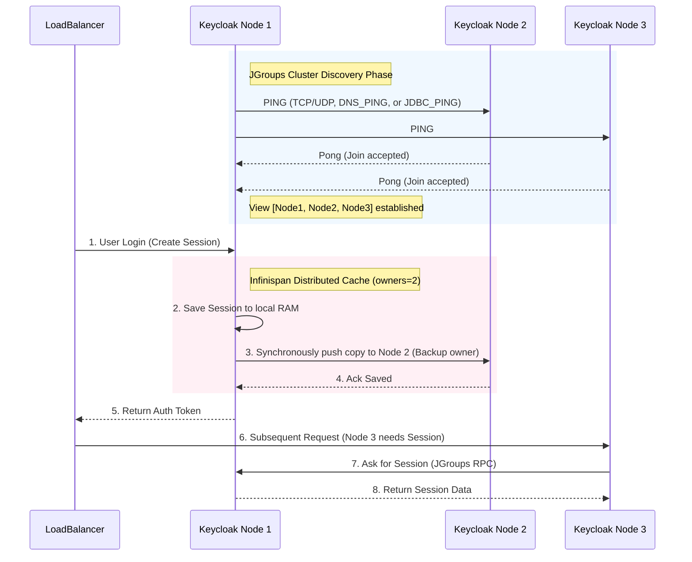

> [!NOTE]
> **Category:** Theory (Lý thuyết)
> **Goal:** Nắm bắt kiến trúc Cụm (Clustering) và tính Sẵn sàng cao (High Availability) trong Keycloak sử dụng công nghệ Infinispan để phân tán bộ nhớ đệm (Cache) và đồng bộ trạng thái phiên (Session) giữa các Server Nodes.

## 1. Lý thuyết chuyên sâu (Detailed Theory)

Một hệ thống quản lý danh tính định danh như Keycloak không thể được triển khai trên một máy chủ đơn lẻ (Single Point of Failure) nếu phải phục vụ trong môi trường doanh nghiệp. Nó phải chạy thành một **Cụm (Cluster)** nhiều máy chủ. Tuy nhiên, thách thức lớn nhất khi chạy cụm là: **Đồng bộ trạng thái phiên của người dùng (User Session) và làm mới cấu hình**. 

Keycloak không lưu toàn bộ mọi User Session xuống Database (như PostgreSQL) liên tục do vấn đề giới hạn hiệu suất (I/O Bottleneck). Thay vào đó, Keycloak sử dụng **Infinispan**, một nền tảng lưới dữ liệu bộ nhớ đệm phân tán (Distributed In-Memory Data Grid) viết bằng Java, làm trái tim cho việc trao đổi dữ liệu tốc độ cao giữa các Nodes.

Các loại Cache trong Infinispan mà Keycloak sử dụng:
- **Local Cache**: Chỉ lưu trữ trong RAM của một Node (ví dụ: Realms config, User profiles đã load). Giúp đọc siêu nhanh nhưng không chia sẻ qua mạng.
- **Distributed Cache (Phân tán)**: Dữ liệu được băm (hash) và chia nhỏ. Mỗi bản ghi (ví dụ: Session X) chỉ được lưu trên số lượng Node cố định (ví dụ 2 Nodes) để cân bằng giữa sự an toàn và hạn chế rác bộ nhớ.
- **Replicated Cache (Nhân bản)**: Dữ liệu được copy y hệt lên TẤT CẢ các nodes trong cụm. (Dùng cho các sự kiện nhỏ giọt như `actionTokens` hoặc khóa phân tán `work`).

## 2. Luồng nội bộ & Cơ chế cấp thấp (Internal Workflow & Low-level Mechanisms)

Bên dưới lớp vỏ của Infinispan là hệ thống **JGroups** - thư viện chịu trách nhiệm giao tiếp mạng (Network Communication) chuyên biệt cho việc tạo nhóm máy chủ và gửi tin nhắn đồng bộ.



**Cơ chế cấp thấp (Low-level Mechanisms):**
- JGroups sử dụng các Giao thức Khám phá (Discovery Protocols) để các máy chủ "tìm thấy" nhau. Trong môi trường truyền thống, UDP Multicast thường được dùng. Nhưng trên Môi trường Đám mây (Kubernetes/AWS), Multicast bị chặn, do đó Keycloak phải dùng cơ chế `DNS_PING` (tìm qua DNS của Kubernetes Service) hoặc `JDBC_PING` (lưu IP tạm lên Database dùng chung).
- Infinispan chia khóa Session dựa trên cơ chế Consistent Hashing, giúp định tuyến yêu cầu về đúng máy chủ đang nắm giữ bản sao của Session.

## 3. Thực hành tốt nhất & Bảo mật (Best Practices & Security)

> [!WARNING]
> Mặc định, traffic của JGroups gửi đi không được mã hóa. Nếu các Keycloak node nằm chung một mạng LAN với các ứng dụng không tin cậy khác, kẻ tấn công có thể "nghe lén" (Sniffing) mạng để trộm User Session hoặc thậm chí "bơm" (Inject) quyền truy cập admin vào Cluster.

> [!IMPORTANT]
> **Network Segmentation:** Phải đặt các cổng mạng dùng cho JGroups (mặc định TCP port 7800) trong một mạng nội bộ riêng biệt (Private Subnet / VLAN) và dùng Firewall chặn chặn đứng mọi IP lạ kết nối vào cổng này, KHÔNG BAO GIỜ được expose cổng này ra ngoài Internet.

**Thực hành tốt nhất:**
1. **Sử dụng cấu hình JGroups phù hợp với hạ tầng**: Trên Kubernetes dùng `DNS_PING`. Trên AWS EC2 dùng `S3_PING` hoặc `JDBC_PING`.
2. **Cấu hình `owners` của Distributed Cache**: Khuyến nghị cấu hình thông số `owners=2` (tức là 1 bản chính, 1 bản dự phòng). Đừng đặt `owners` bằng tổng số node (Ví dụ cụm có 10 nodes, đừng để `owners=10` vì nó sẽ phá nát băng thông mạng nội bộ khi phải copy 10 lần cho 1 session).

## 4. Cấu hình minh họa thực tế (Configuration Examples)

Ví dụ để khởi chạy Keycloak (Quarkus distribution) với cấu hình HA sử dụng `JDBC_PING` (rất phổ biến khi chạy docker-compose/VM không có DNS nội bộ chuẩn).

Lệnh khởi động với tham số môi trường:
```bash
# Thiết lập biến môi trường để Keycloak biết cần chạy Cluster
export KC_CACHE=ispn
export KC_CACHE_STACK=jdbc-ping

# Cấu hình JDBC Ping sử dụng DB PostgreSQL hiện tại để Node tự điểm danh
export JGROUPS_DISCOVERY_PROPERTIES="datasource_jndi_name=java:jboss/datasources/KeycloakDS,initialize_sql=CREATE TABLE IF NOT EXISTS JGROUPSPING (own_addr VARCHAR(200) NOT NULL, cluster_name VARCHAR(200) NOT NULL, ping_data BYTEA, constraint PK_JGROUPSPING PRIMARY KEY (own_addr, cluster_name));"

# Khởi động Keycloak node 1 (lưu ý dùng ip nội bộ của node, ví dụ 10.0.0.1)
/opt/keycloak/bin/kc.sh start --optimized --bind 10.0.0.1
```

*(Lưu ý: Đối với phiên bản Quarkus mới hơn, cấu hình Stack được định nghĩa cụ thể qua file XML tùy chỉnh nạp bằng `KC_CACHE_CONFIG_FILE`).*

## 5. Trường hợp ngoại lệ (Edge Cases)

1. **Split-Brain (Hội chứng não chia đôi)**:
   - *Sự cố*: Liên kết mạng giữa Node 1 và Node 2 bị đứt, nhưng cả hai đều còn kết nối với Database. Chúng sẽ tự tách ra thành 2 Cụm độc lập, mỗi Node tự xưng là Master. Dẫn đến Session bị mất đồng bộ, người dùng refresh trang liên tục bị văng ra.
   - *Khắc phục*: Cần cấu hình số lượng nút tối thiểu để duy trì Cluster (Quorum). Nếu không đủ (ví dụ cần lớn hơn n/2), Node bị rớt mạng phải tự cô lập và dừng phục vụ (Fail-fast).

2. **Garbage Collection (GC) Pauses dài**:
   - *Sự cố*: Máy ảo Java (JVM) tiến hành dọn rác bộ nhớ (Full GC) mất 5 giây, làm JVM đóng băng hoàn toàn. Các Node khác PING không thấy trả lời, nghĩ rằng máy này đã sập nên loại nó khỏi Cluster và tổ chức chia lại dữ liệu (Rebalance). Khi Node này tỉnh lại, Cluster lại xáo trộn lần nữa.
   - *Khắc phục*: Phải sử dụng bộ thu gom rác thế hệ mới như ZGC hoặc G1GC, cấu hình cấp đủ RAM (Heap Size). Đồng thời tăng nhẹ thông số timeout `FD_ALL` (Failure Detection) trong JGroups để bỏ qua các độ trễ ngắn hạn.

## 6. Câu hỏi Phỏng vấn (Interview Questions)

1. **Junior:** Chức năng chính của bộ nhớ đệm (Cache) trong kiến trúc HA của Keycloak là gì?
   - *Đáp án:* Lưu trữ và đồng bộ hóa trạng thái phiên làm việc (Session) của người dùng giữa các Node để nếu một Node sập, người dùng không bị mất phiên và không bị yêu cầu đăng nhập lại (Seamless failover).
2. **Junior:** Phân biệt Local Cache và Distributed Cache.
   - *Đáp án:* Local Cache chỉ nằm trên RAM của 1 máy, không đẩy qua mạng, dùng cho dữ liệu ít thay đổi như cấu hình Realm. Distributed Cache băm dữ liệu và gửi sao lưu sang một số máy cố định trong cụm để đề phòng mất mát.
3. **Senior:** JGroups phát hiện lỗi rớt mạng của một Node (Failure Detection) như thế nào?
   - *Đáp án:* Dựa trên các giao thức ping (heartbeat). Giao thức `FD_ALL` (hoặc `FD_SOCK`) định kỳ gửi tín hiệu sống sót (keep-alive) giữa các thành viên trong cụm. Nếu vượt qua số lần retry hoặc timeout mà không nhận được tín hiệu trả lời, Node đó sẽ bị đánh dấu là "dead" và bị loại ra khỏi "View" của Cluster.
4. **Senior:** Tại sao khi triển khai Keycloak lên Kubernetes, người ta không dùng Multicast (UDP) truyền thống cho JGroups mà phải dùng `DNS_PING` (hoặc `KUBE_PING`)?
   - *Đáp án:* Kiến trúc mạng ảo hóa của Kubernetes (như Flannel/Calico) và môi trường Cloud nói chung thường vô hiệu hóa hoàn toàn hoặc không hỗ trợ cơ chế định tuyến gói tin Multicast vì lý do bảo mật và hiệu năng. Do đó JGroups phải truy vấn DNS (Service Headless của K8s) hoặc gọi API K8s để lấy danh sách IP các Pod trực tiếp.
5. **Senior:** Giải thích hiện tượng "State Transfer" khi một Node mới vừa gia nhập vào một cụm Keycloak đang bận rộn.
   - *Đáp án:* Khi có thay đổi thành viên trong cụm (View changes), Infinispan phải tính toán lại bảng băm (Consistent Hash) và luân chuyển các khóa Cache (Session) từ Node cũ sang Node mới để chia đều tải (Rebalance). Quá trình di chuyển state này (State Transfer) làm tăng đột biến băng thông mạng và CPU, có thể gây chậm chạp hệ thống tạm thời.

## 7. Tài liệu tham khảo (References)

- [Keycloak High Availability Documentation](https://www.keycloak.org/high-availability/concepts-memory-and-cpu)
- [Infinispan Distributed Cache Documentation](https://infinispan.org/docs/stable/titles/configuring/configuring.html)
- [JGroups Network Protocols & Discovery](http://www.jgroups.org/manual4/index.html)
