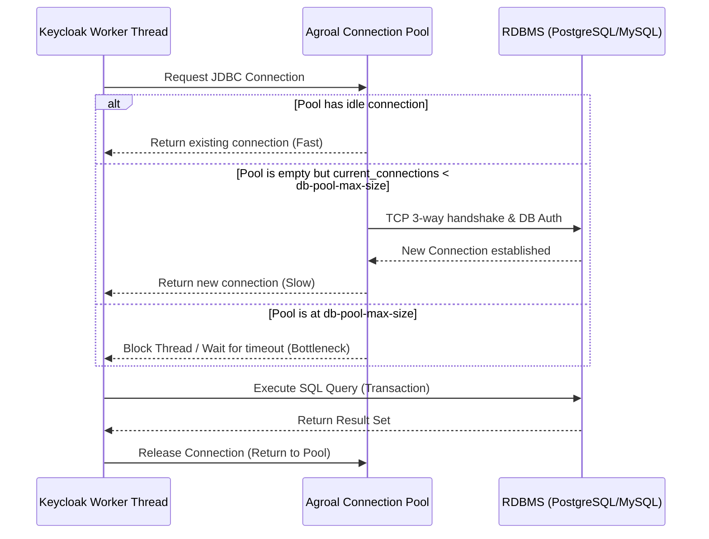

> [!NOTE]
> **Category:** Theory
> **Goal:** Hiểu sâu về kiến trúc cơ sở dữ liệu trong hệ thống phân tán, các thách thức trong môi trường High Availability (HA) và cách tối ưu hóa Database Tuning cho Keycloak.

## 1. Lý thuyết chuyên sâu (Detailed Theory)

Keycloak là một giải pháp Identity and Access Management (IAM). Khi được triển khai ở mô hình High Availability (HA), Keycloak không hoạt động độc lập mà chia sẻ trạng thái tạm thời (ví dụ: Session) thông qua **Infinispan** (Distributed Cache) và lưu trữ dữ liệu bền vững (Persistent Data như Users, Clients, Realm configs, Offline Sessions) vào một **Relational Database Management System (RDBMS)**.

Tuning Database trong môi trường HA tập trung vào giải quyết 3 thách thức cốt lõi:
- **Connection Pooling:** Tránh kiệt quệ tài nguyên (Resource Exhaustion) tại phía Database khi hàng ngàn threads xử lý đồng thời của Keycloak (cùng với Quarkus framework) cố gắng mở kết nối TCP mới.
- **Transaction Isolation & Locking:** Đảm bảo tính nhất quán dữ liệu (Data Consistency) và tránh Deadlock khi nhiều node Keycloak đồng thời thực hiện thao tác ghi (Write) xuống cơ sở dữ liệu chung.
- **High Concurrency & Load Distribution:** Phân tải các truy vấn để tránh nút thắt cổ chai (Bottleneck) tại Database, giảm thiểu độ trễ phản hồi (Latency) khi số lượng Request tăng vọt (Spike Load).

## 2. Luồng nội bộ & Cơ chế cấp thấp (Internal Workflow & Low-level Mechanisms)

Quá trình thiết lập một kết nối TCP và thực hiện xác thực với Database rất tốn kém về mặt hiệu năng (Context Switch, Memory Allocation, Network Round-trip). Keycloak (được xây dựng trên Quarkus) sử dụng **Agroal Connection Pool** để quản lý và tái sử dụng các kết nối này.



**Giải thích luồng:**
1. Khi Worker Thread của Keycloak cần tương tác với cơ sở dữ liệu, nó sẽ yêu cầu một kết nối từ Agroal Pool.
2. Nếu Pool đang có kết nối rảnh (Idle Connection), nó sẽ cấp phát ngay lập tức.
3. Nếu Pool trống nhưng chưa chạm ngưỡng `max-size`, nó sẽ mở một kết nối mới tới DB.
4. Nếu số kết nối đã đạt `max-size`, Thread sẽ bị Block cho đến khi có một kết nối khác được hoàn trả (Released) hoặc sẽ ném ra lỗi Timeout nếu quá thời gian chờ.

## 3. Thực hành tốt nhất & Bảo mật (Best Practices & Security)

- **Sử dụng Database Clustering:** Trong môi trường HA, bản thân Database không được phép là một điểm lỗi duy nhất (SPOF - Single Point of Failure). Bạn phải sử dụng Database Cluster (ví dụ: PostgreSQL kết hợp với Patroni, hoặc MySQL InnoDB Cluster).
- **Mã hóa Data in Transit:** Luôn cấu hình kết nối TLS/SSL giữa cụm Keycloak và Database để ngăn chặn các cuộc tấn công Packet Sniffing, đặc biệt khi các hệ thống này nằm ở hai Data Center khác nhau.
- **Quy tắc cấu hình Agroal Pool:** Giá trị `db-pool-max-size` không được cấu hình quá lớn. Một nguyên tắc toán học cơ bản: `max_connections` (trên Database) `> (keycloak_nodes * db-pool-max-size)`. Nếu cấu hình vượt qua giới hạn của Database, hệ thống sẽ chối bỏ kết nối và gây gián đoạn dịch vụ.
- **Connection Validation:** Luôn để Agroal tự động kiểm tra tính hợp lệ của connection dưới nền (Background validation) bằng cách chạy một câu query nhỏ định kỳ (như `SELECT 1`) để loại bỏ các kết nối hỏng (Stale Connections) do Network bị rớt nhịp.

> [!IMPORTANT]
> Cấu hình `db-pool-max-size` khuyên dùng thường nằm trong khoảng **100 đến 250** trên mỗi node. Mở quá nhiều kết nối không làm hệ thống nhanh hơn mà còn làm Database chậm đi do chi phí Context Switching của CPU quá lớn.

## 4. Cấu hình minh họa thực tế (Configuration Examples)

Dưới đây là một cấu hình mẫu tối ưu thông qua file `keycloak.conf` hoặc bằng biến môi trường (Environment Variables) khi triển khai bằng Docker/Kubernetes:

```properties
# Thông tin nhà cung cấp Database
db=postgres
db-url=jdbc:postgresql://db-cluster.internal:5432/keycloak_db

# Không đặt thông tin nhạy cảm ở đây nếu triển khai Production (Hãy dùng Vault/Secrets)
db-username=keycloak_user
db-password=super_secret_password

# Cấu hình Agroal Connection Pool Tuning
# Số lượng kết nối tối thiểu luôn duy trì mở
db-pool-initial-size=10
db-pool-min-size=10

# Số lượng kết nối tối đa mỗi Node Keycloak có thể mở tới DB
db-pool-max-size=100

# Kích hoạt tính năng Statement Caching để tăng tốc độ phân tích cú pháp SQL
db-url-properties=?prepareThreshold=5&preparedStatementCacheQueries=256
```

## 5. Trường hợp ngoại lệ (Edge Cases)

- **Thundering Herd Problem (Sự cố bầy đàn):** Khi toàn bộ cụm Keycloak hoặc Database được khởi động lại cùng một lúc. Hàng loạt Node Keycloak sẽ ồ ạt kết nối lại tới DB ngay lập tức. Nếu `db-pool-initial-size` quá lớn, DB sẽ lập tức rơi vào trạng thái quá tải (CPU Spike 100%).
  - **Cách khắc phục:** Cấu hình `db-pool-initial-size` ở mức thấp và cho phép hệ thống tự scale up số lượng kết nối một cách từ từ dựa trên tải thực tế.
- **Connection Leak (Rò rỉ kết nối):** Xảy ra khi lập trình viên tự phát triển các Extensions (SPI - Service Provider Interface) cho Keycloak và thực hiện query DB trực tiếp nhưng quên đóng (close) kết nối trong khối lệnh `finally`. Điều này dẫn đến Pool bị cạn kiệt vĩnh viễn và Keycloak bị treo.
  - **Cách khắc phục:** Audit kỹ mã nguồn SPI, sử dụng try-with-resources của Java để tự động dọn dẹp JDBC Connections.
- **Network Partition (Lỗi chia cắt mạng):** Đường truyền mạng bị gián đoạn nhưng không truyền tín hiệu ngắt kết nối (RST packet). Các TCP connections trong Pool trở thành "kết nối ma" (Ghost connections). Keycloak sẽ treo vì chờ phản hồi mãi mãi.
  - **Cách khắc phục:** Cấu hình `socketTimeout` trong JDBC URL và thiết lập OS-level TCP KeepAlive.

## 6. Câu hỏi Phỏng vấn (Interview Questions)

**Junior Level:**
- **Câu hỏi 1:** Tại sao Keycloak lại sử dụng Connection Pool thay vì tạo kết nối JDBC trực tiếp mỗi khi có HTTP Request mới?
  - **Đáp án:** Việc tạo kết nối TCP và xác thực người dùng DB (TCP 3-way handshake + TLS Handshake) rất tốn thời gian (có thể mất hàng chục milliseconds). Connection Pool duy trì sẵn các kết nối được mở từ trước, giúp phản hồi ngay lập tức, tiết kiệm tài nguyên CPU/Network.
- **Câu hỏi 2:** Ý nghĩa của `db-pool-min-size` và `db-pool-max-size` là gì?
  - **Đáp án:** `min-size` là số lượng kết nối tối thiểu luôn được giữ duy trì dù hệ thống không có người dùng. `max-size` là hạn mức tối đa các kết nối được sinh ra khi hệ thống chịu tải cao.

**Senior Level:**
- **Câu hỏi 3:** Bạn có một cụm Keycloak gồm 5 Nodes, `db-pool-max-size` mỗi Node là 200. Hệ quản trị CSDL PostgreSQL cấu hình `max_connections=500`. Chuyện gì sẽ xảy ra vào giờ cao điểm? Cách giải quyết?
  - **Đáp án:** Vào giờ cao điểm, 5 Nodes sẽ có khả năng đẩy số kết nối lên 5 * 200 = 1000 kết nối. Khi vượt mốc 500, PostgreSQL sẽ từ chối truy cập (Lỗi `FATAL: sorry, too many clients already`). Keycloak sẽ ném Exception và gián đoạn. Cách khắc phục: Sử dụng connection pooler trung gian như PgBouncer hoặc giảm `db-pool-max-size` xuống dưới 100.
- **Câu hỏi 4:** Nếu triển khai PgBouncer phía trước Database, bạn nên cấu hình `pool_mode` là gì đối với workload của Keycloak?
  - **Đáp án:** Thông thường là `transaction` mode để tối ưu hiệu suất, nhưng phải đảm bảo Keycloak và JDBC driver không sử dụng các session-level state (như Prepared Statements chưa đóng đúng cách) gây xung đột hoặc lỗi dữ liệu chéo.
- **Câu hỏi 5:** Làm thế nào để chẩn đoán hệ thống đang bị tình trạng "Connection Leak" trong Keycloak?
  - **Đáp án:** Theo dõi Metrics thông qua Prometheus. Nếu thấy metric biểu thị số lượng `active connections` tiến sát vạch `max-size` và duy trì ở mức đó thành đường ngang (Flatline), dù không có Traffic, chứng tỏ SPI hoặc module nào đó đã lấy kết nối ra nhưng không Release lại vào Pool.

## 7. Tài liệu tham khảo (References)
- [Keycloak Official Docs: Configuring the database](https://www.keycloak.org/server/db)
- [Quarkus - Datasources and Agroal Configuration](https://quarkus.io/guides/datasource)
- [PostgreSQL: Handling High Connections](https://www.postgresql.org/docs/current/runtime-config-connection.html)
