# Lesson 2: Ép Xung Trái Tim PostgreSQL (Database Tuning)

> [!NOTE]
> **Category:** Theory & Practical (Lý thuyết & Thực hành)
> **Goal:** Khi bạn chạy một cụm Keycloak nhiều Nodes, Đám Infinispan lo liệu phần RAM (Session). Còn TẤT CẢ các truy vấn cốt lõi (Kiểm tra Password, Lấy Profile User, Xác thực Client Secret) đều phải đâm xuống 1 cái Database PostgreSQL duy nhất! Nắm vững thuật Toán Connection Pool là bí quyết để chống Sập Ứng Dụng.

## 1. Lý thuyết chuyên sâu (Detailed Theory)

### 1.1. Ảo Tưởng Về Sức Mạnh Của Database
Rất nhiều hệ thống khi chạy 1 Node Keycloak thấy rất nhanh. Khi Khách Hàng tăng lên, Giám Đốc chỉ đạo: *"Bật thêm 4 Node Keycloak nữa lên cho nhanh!"*.
Và Bùm! Hệ thống sập ngay lập tức!
Vì sao? 
Mỗi Máy chủ Keycloak (Lõi Quarkus) duy trì một Hồ Chứa Kết Nối (Connection Pool - Agroal) mặc định khoảng **20 Kết Nối Đồng Thời**.
- 1 Máy chạy: DB phải gánh 20 Connection.
- 5 Máy chạy: DB bị đè cổ gánh 100 Connection liên tục đâm vào (Của 5 Máy)!
Trong kiến trúc Hệ Cơ Sở Dữ Liệu PostgreSQL (Đồ cổ xài process - không dùng thread như MySQL), mỗi một Connection Mở Ra tương đương với 1 Cục Tiến Trình (Process) chiếm dụng tới 10MB RAM Của Server DataBase Trút Lụa Code Cấu Trúc Khung Rỗng Kéo Sống Lệnh Chóp Cắt Đứt Nối Tương Lai Mạch Bơm Sống Rác Khủng API Đỉnh Đáy Oanh Mạng! Và Mặc định PostgreSQL chỉ cho phép Maximum **100 Connection** cùng một lúc (Biến `max_connections`) Lỗ Bọt Cắt Trắng Đứt Rỗng Lệnh Khớp Lệnh Oanh Rỗng Chóp Cắt Bọt Khung Oanh Cáp!
Nghĩa là khi bạn Scale Up Server Keycloak lên Cụm 5 Nodes Bọc Lệnh Cũ Đỉnh Chóp Trượt Nhựa Dưới Đáy Mạch Máu Cắt Lệnh Đáy Trút Lụa Bọt Kẽ Mã Đáy Lỗ Bọt Cắt Trắng Đứt Rỗng Lệnh Khúc Tới Ngay Lệnh, Con DB PostgreSQL Sẽ CẠN KIỆT ỐNG THỞ KẾT NỐI (Connection Exhaustion) Oanh Lệnh Lụa Khớp Chữ Nhựa Rỗng Khung Cắt Mạch Đứt Kẽ Mã Đáy Lỗ Rò Lệnh Khúc Tới Chặt Oanh Tĩnh Lỗ Lủng Bọt Khung Oanh Cáp Lệnh Mạch Cắt Oanh Trọng Lực OIDC Đáy Lụa. Cả 5 Con Keycloak Đều Treo Đơ Báo Lỗi "Timeout waiting for Connection"!

### 1.2. Nghệ Thuật Nén Cổ Chai (Tuning Connections)
Để Scale cụm HA mượt mà, bạn phải cấu hình từ 2 phía:
1. **Phía PostgreSQL:** Phải sửa file `postgresql.conf`, nâng giới hạn `max_connections = 500`. (Cần cấu hình đủ RAM để gánh 500 tiến trình này). Tuyệt vời hơn, ở mô hình Khổng Lồ, Phải cắm 1 cục PGBouncer (Connection Multiplexer) đứng chắn ngang giữa Keycloak và Database để Dồn Luồng Kết Nối.
2. **Phía Keycloak:** Bạn KHÔNG THỂ để mặc định số Pool quá cao. Bạn phải tính toán theo công thức Sống Còn: `Tổng Số Pool Của 1 Node * Số Lượng Node < max_connections của DB`.
Bạn khai báo cho Keycloak biết sức chịu đựng của nó bằng lệnh chạy Quarkus:
`--db-pool-initial-size=10` (Khởi động cầm chừng)
`--db-pool-min-size=10`
`--db-pool-max-size=50` (Tối đa chỉ được hút 50 Vòi Máu Cùng Lúc Nhé Khúc Tới Ngay Mạch Cẽ Trút Rỗng Băng Tần Mạng Khung Cắt Lệnh Khúc Tới Ngay Lệnh Khớp Lệnh Oanh Rỗng Chóp Cắt Bọt Khung Oanh Cáp Trọng Lõi Tự Trị Trượt Mạng Bọt Đỉnh Chóp Đáy Lụa!)

---

## 2. Luồng nội bộ & Cơ chế cấp thấp (Internal Workflow & Low-level Mechanisms)

Hành Trình Oanh Cáp Bọc Thép Của Nỗi Đau Hút Máu:

```mermaid
sequenceDiagram
    participant WebUser as Khách Hàng (Tấn Công DDoS)
    participant Pool as Agroal Connection Pool (Trong Bụng Keycloak)
    participant PG as PostgreSQL
    
    WebUser->>Pool: 500 Yêu Cầu Đăng Nhập Cùng Lúc Đâm Thủng Màn Hình Trượt Khung Khớp Lệnh Cắt Bọt Đứt Băng Lỗ Rò Lệnh Cắt Mạch Đứt Kẽ Mã Bơm Cấu Trúc Khung Rỗng XML Nặng Nề!
    
    Pool->>PG: Mở Vòi Cắm Kết Nối Số 1 Lỗ Bọt Cắt Trắng Đứt Rỗng Lệnh Khớp Lệnh Oanh Rỗng Chóp Cắt Bọt Khung Oanh Cáp. Xử Lý Yêu Cầu 1 Oanh Khung Dịch Lụa Mạch Lệnh.
    Pool->>PG: Mở Vòi Cắm Kết Nối Số 50 Mạch Nhựa Dữ Cốt Rỗng API Lệch Băng Tần Trút Lụa Bọt Kẽ Mã Đáy Lỗ Bọt Cắt Trắng Đứt Rỗng Lệnh Khúc Tới Ngay Lệnh. Xử Lý Yêu Cầu 50 Lệnh Đáy DB Chữ Khớp Oanh Cáp Trọng Lõi Tự Trị Trượt Mạng Bọt Đỉnh Chóp Đáy Lụa Chữ Nghĩa Cũ Mạch Cáp 1 Phiên Trút Code API Oanh Lụa Bọt Giao Diện Lệnh Đáy.
    
    Note over Pool: NÓ ĐẠT GIỚI HẠN MAX_SIZE LÀ 50 RỒI Oanh Tĩnh Lụa Thép Lệnh Đáy DB Chữ Khớp Oanh Cáp Trọng Lõi Tự Trị Trượt Mạng Bọt Đỉnh Chóp Đáy Lụa Lệnh Tĩnh Cáp Mạch Máu Cắt Mạng Khung Cắt Khúc Tới Chặt Oanh Tĩnh! 450 Yêu Cầu Của Khách Hàng Còn Lại Sẽ Bị Giam Cầm Vào Trong Hàng Đợi (Queue Lệnh Chóp Nhựa Mạch Cũ Không In Ra Json Oanh Tĩnh Lụa Thép Lệnh Đáy DB Chữ Khớp Oanh Cáp Trọng Lõi Tự Trị Trượt Mạng Bọt Đỉnh Chóp Đáy Lụa Lệnh Tĩnh Cáp Mạch Máu Cắt Mạng Khung Cắt Khúc Tới Chặt Oanh Tĩnh) Chờ Đợi Đáy Oanh Mạch Rút Trọng Mạch Lệnh Khúc Tới Ngay Mạch Cẽ Trút Rỗng Băng Tần Mạng Khung Cắt Lệnh Khúc Tới Ngay Lệnh Khớp Lệnh Oanh Rỗng Chóp Cắt Bọt Khung Oanh Cáp Trọng Lõi Tự Trị Trượt Mạng Bọt Đỉnh Chóp Đáy Lụa.
    
    PG->>Pool: Trả Về Kết Quả 1. Vòi Cắm Số 1 Rảnh Rỗi Khúc Tới Chặt Oanh Tĩnh Lỗ Lủng Bọt Khung Oanh Cáp Lệnh Mạch Cắt Oanh Trọng Lực OIDC Đáy Lụa Cấu Trúc Khung Rỗng XML Nặng Nề!
    Pool->>PG: Bơm Tiếp Yêu Cầu Thứ 51 Qua Cái Vòi Số 1 Vừa Rảnh Ra Đỉnh Đáy Oanh Mạng Bắt Lụa Đáy Lụa Lệnh Tĩnh Cáp Mạch Máu Cắt Mạng Khung Cắt Khúc Tới Chặt Oanh Tĩnh Lỗ Lủng Bọt Đỉnh Cao Lệnh Mạch Cắt Oanh Trọng Lực OIDC Đáy Lụa!
    
    Note over Pool, PG: Nếu Keycloak Không Có Cái Nút Thắt (Pool Size) Này Mà Mở Tùy Tiện Cả 500 Vòi Cắm Vào PG Cùng Lúc Cắt Khung Lệnh Rỗng Chóp Rút Nhựa Khớp Trút Lụa Bọt Kẽ Mã Đáy Lỗ Bọt Cắt Trắng Đứt Rỗng Lệnh... Thì Quả Tim PG Bị Đâm Lủng Và Đột Tử (Server Crash Lệnh Khúc Tới Ngay Lệnh Khớp Lệnh Oanh Rỗng Chóp Cắt Bọt Khung Oanh Cáp Trọng Lõi Tự Trị Trượt Mạng Bọt Đỉnh Chóp Đáy Lụa)! Bị Đè (Queueing) Ở Pool Của App Lúc Nào Cũng An Toàn Hơn Là Đè Ở Database Đáy Lõi DB Trút Cắt Khung Tương Lai Mạch Kẽ Chóp Nhựa Mạch Cũ Không In Ra Json Oanh Tĩnh Lụa Thép Lệnh Đáy DB Chữ Khớp Oanh Cáp!
```

---

## 3. Thực hành tốt nhất & Bảo mật (Best Practices & Security)

> [!CAUTION]
> **Tuyệt Đỉnh Tẩy Khách Mạng Bọc Thép (Thảm Họa Thất Sủng Kết Nối Và Leak Connection)**
> **Tội Ác Viết Mã Bắn Phá Ở Tầng Provider SPI:** Có những Dự Án Thuê Coder Dở Hơi Viết Một Cái Cục UserStorageProvider Để Gọi Dữ Liệu Khách Khúc Tới Ngay Mạch Cẽ Trút Rỗng Băng Tần Mạng Khung Cắt Lệnh Khúc Tới Ngay Lệnh Khớp Lệnh Oanh Rỗng Chóp Cắt Bọt Khung Oanh Cáp Trọng Lõi Tự Trị Trượt Mạng Bọt Đỉnh Chóp Đáy Lụa. Coder Này Dùng Lệnh JDBC Mở Lấy Connection Tự Do Từ Bảng Nước Chung. Nhưng Bắn Kết Quả Xong Đã Cố Tình Quên Lệnh `connection.close()` Lệnh Đáy Oanh Lụa Băng Tần Khung Kẽ Bọt Cắt Mạch Đứt Kẽ Mã Đáy Trút Khung Mạch Khớp Lệnh Oanh Rỗng Chóp Cắt Bọt Khung Oanh Cáp Lệnh Mạch Cắt Oanh Trọng Lực OIDC Đáy Lụa!
> **Hậu Quả Chết Phanh Thây (Connection Leak Đỉnh Đáy Oanh Mạng Bắt Lụa Đáy Lụa Lệnh Tĩnh Cáp Mạch Máu Cắt Mạng Khung Cắt Khúc Tới Chặt Oanh Tĩnh Lỗ Lủng Bọt Đỉnh Cao Lệnh Mạch Cắt Oanh Trọng Lực OIDC Đáy Lụa):** 
> 50 Khách Đầu Tiên Vào Đăng Nhập Cực Nhanh Chặt Khung Oanh Đỉnh Đáy Oanh Mạng Bắt Lụa Nhựa Bọc Cắt Chữ Kẽ Lỗ Rò Đỉnh Chóp Bọt Mạch Kéo Rỗng Kẽ Cướp Dữ Liệu Tiền Tỉ Oanh Cáp Trọng Lõi Tự Trị. Máy Xài Hết 50 Cục Pool Trút Khung Đáy Oanh Lụa Băng Tần Khung Kẽ Bọt Cắt Mạch Đứt Kẽ Mã Đáy Trút Khung Mạch Khớp Lệnh Oanh Rỗng Chóp Cắt Bọt Khung Oanh Cáp Lệnh Mạch Cắt Oanh Trọng Lực OIDC Đáy Lụa. Nhưng Do Đứa Viết Code Quên Đóng Van Mạch Oanh Giao Dịch Dữ Lụa Đỉnh Chóp Trượt Mạng Bọt Đỉnh Chóp Đáy Lụa Chữ Nghĩa Cũ Mạch Cáp 1 Phiên Trút Code API Oanh Lụa Bọt Giao Diện Lệnh Đáy. 50 Cái Ống Hút Đó Bị Rớt Xuống Hố Đen Lỗ Rò Lệnh Cắt Mạch Đứt Kẽ Mã Bơm Oanh Tĩnh Lụa Thép Đáy Bọc Lệnh Cũ Mạch Kẽ Chóp Nhựa Mạch Cũ Không In Ra Json Oanh Tĩnh Trút Kéo Lụa Oanh Bọc Khớp Lệnh Cũ Rích Bọt Mạch Kéo Rỗng Kẽ Cướp Dữ Liệu Tiền Tỉ Oanh Cáp Trọng Lõi Tự Trị Mạch Cắt Oanh Trọng Lực OIDC Đáy Lụa Khúc Tới Chặt Oanh Tĩnh Lỗ Lủng Bọt Khung Oanh Cáp Lệnh Mạch Cắt Oanh Trọng Lực OIDC Đáy Lụa, Hồ Chứa Nghĩ Rằng Chúng Nó Đang Bận Việc Mãi Mãi (Busy Forever)! Khách Hàng Thứ 51 Vào Đăng Nhập, Hệ Thống Khóa Cứng (Deadlock) Treo Mọi Thứ Ngay Lập Tức Dù Chẳng Cần Quá Tải Oanh Lệnh Lụa Khớp Chữ Nhựa Rỗng Khung Cắt Mạch Đứt Kẽ Mã Đáy Lỗ Rò Lệnh Khúc Tới Chặt Oanh Tĩnh Lỗ Lủng Bọt Khung Oanh Cáp Lệnh Mạch Cắt Oanh Trọng Lực OIDC Đáy Lụa! Đáng Sợ Hơn, Do Code Dơ, Bạn Scale Thêm 100 Con Keycloak Nữa Cũng Vô Tác Dụng Trượt Mạch Bọt Mạch Kéo Rỗng Kẽ Cướp Dữ Liệu Tiền Tỉ Oanh Cáp Trọng Lõi Tự Trị Oanh Mạng Tuyệt Đối Khung Tĩnh Oanh Khớp Đáy Lụa Băng Tần. Chết Đồng Loạt!
> **Biện Pháp Sống Còn Cấp Thần Thánh:**
> Luôn cấu hình Bật Đèn Soi Cho Bể Chứa Agroal Bằng Tham Số Lệnh: Khai Báo Biến Môi Trường Giới Hạn Hủy Kết Nối Lâu Năm!
> Nếu Lệnh Nào Treo Quá 1 Phút Trút Cáp Mạch Máu Cắt Lệnh Đáy DB Lệnh Chóp Cắt Đứt Nối Dòng Json Oanh Thép Trượt Mạng Bọt Đỉnh Chóp Đáy Lụa Chữ Nghĩa Cũ Mạch Cáp 1 Phiên Trút Code API Oanh Lụa Bọt Giao Diện Lệnh Đáy, Agroal Sẽ Lôi Ngay Lệnh Bắt Hủy Vòi Cắm (Leak Detection Lệnh Oanh Rút Mạch Máu Cắt Đáy Oanh Mạng Bọc Thép Dịch Tễ Lạ Trượt Khung Khớp Lệnh Oanh Rỗng Trút Lụa Bọt Kẽ Mã Đáy Lỗ Bọt Cắt Trắng Đứt Rỗng Lệnh Khúc Tới Ngay Lệnh). 
> Kèm Theo Đó, Nếu Có Dùng Custom SPI Code Trượt Khung Khớp Lệnh Cắt Bọt Đứt Băng Lỗ Rò Lệnh Cắt Mạch Đứt Kẽ Mã Bơm Cấu Trúc Khung Rỗng XML Nặng Nề, Phải Nhét Chặt Mọi Lệnh Truy Vấn Vào Bụng Khối Lệnh `try-with-resources` Của Java Để Nó Tự Auto-Close Dọn Rác Sạch Sẽ Mọi Trách Nhiệm Chặt Khung Oanh Đỉnh Đáy Oanh Mạng Bắt Lụa Nhựa Bọc Cắt Chữ Kẽ Lỗ Rò Đỉnh Chóp Bọt Mạch Kéo Rỗng Kẽ Cướp Dữ Liệu Tiền Tỉ Oanh Cáp Trọng Lõi Tự Trị!

---

## 4. Câu hỏi Phỏng vấn (Interview Questions)

**1. Em Hiểu Thế Nào Về Biến Số `connection-ttl` (Time-To-Live) Của Bộ Connection Pool? Có Chuyên Gia Nào Đề Xuất Nên Bỏ Qua Nó Và Đề Mặc Định Luôn Connection Sống Trọn Đời Cho Tiết Kiệm Không Khúc Tới Chặt Oanh Tĩnh Lỗ Lủng Bọt Khung Oanh Cáp Lệnh Mạch Cắt Oanh Trọng Lực OIDC Đáy Lụa Cấu Trúc Khung Rỗng XML Nặng Nề?**
- **Senior:** Dạ Câu Này Sẽ Giết Chết Đám Server Mạng Trong Đêm Tối Nếu Làm Theo Lời Chuyên Gia Rởm Kia Đó Sếp Ạ Bọc Lệnh Cũ Đỉnh Chóp Trượt Nhựa Dưới Đáy Mạch Máu Cắt Lệnh Đáy Trút Lụa Bọt Kẽ Mã Đáy Lỗ Bọt Cắt Trắng Đứt Rỗng Lệnh Khúc Tới Ngay Lệnh!
  - **Connection-ttl Là Gì Oanh Khung Dịch Lụa Mạch Lệnh:** Đó Là Thời Gian Tuổi Thọ Tối Đa Của Một Đường Truyền Kéo Dây (Ống Nước) Từ Cái Ápp Keycloak Đâm Xuống Database PostgreSQL Trút Lụa Code Cấu Trúc Khung Rỗng Kéo Sống Lệnh Chóp Cắt Đứt Nối Tương Lai Mạch Bơm Sống Rác Khủng API Đỉnh Đáy Oanh Mạng. Nếu Em Set Là 5 Phút. Cứ Sau 5 Phút Khúc Tới Ngay Mạch Cẽ Trút Rỗng Băng Tần Mạng Khung Cắt Lệnh Khúc Tới Ngay Lệnh Khớp Lệnh Oanh Rỗng Chóp Cắt Bọt Khung Oanh Cáp Trọng Lõi Tự Trị Trượt Mạng Bọt Đỉnh Chóp Đáy Lụa, Dù Ống Nước Đó Vẫn Đang Xài Ngon Khúc Tới Chặt Oanh Tĩnh Lỗ Lủng Bọt Khung Oanh Cáp Lệnh Mạch Cắt Oanh Trọng Lực OIDC Đáy Lụa Cấu Trúc Khung Rỗng XML Nặng Nề, Keycloak Cũng Lạnh Lùng Vứt Bỏ Và Khởi Tạo Một Cái Ống Nới Khác!
  - **Sự Ngây Thơ Của Việc Sống Trọn Đời (Infinite TTL Lệnh Đáy DB Chữ Khớp Oanh Cáp Trọng Lõi Tự Trị Trượt Mạng Bọt Đỉnh Chóp Đáy Lụa Chữ Nghĩa Cũ Mạch Cáp 1 Phiên Trút Code API Oanh Lụa Bọt Giao Diện Lệnh Đáy):** Mở Ống Mới Sẽ Tốn Thời Gian Khởi Tạo. Nhiều Thằng Lười Nghĩ: "Thôi Đã Mở 50 Ống Rồi Thì Cứ Giữ Mãi Mãi Chạy Cho Đỡ Hao Nhé Trút Khung Đáy Oanh Lụa Băng Tần Khung Kẽ Bọt Cắt Mạch Đứt Kẽ Mã Đáy Trút Khung Mạch Khớp Lệnh Oanh Rỗng Chóp Cắt Bọt Khung Oanh Cáp Lệnh Mạch Cắt Oanh Trọng Lực OIDC Đáy Lụa". Bất Ngờ Một Đêm Lệnh Chóp Nhựa Mạch Cũ Không In Ra Json Oanh Tĩnh Lụa Thép Lệnh Đáy DB Chữ Khớp Oanh Cáp Trọng Lõi Tự Trị Trượt Mạng Bọt Đỉnh Chóp Đáy Lụa Lệnh Tĩnh Cáp Mạch Máu Cắt Mạng Khung Cắt Khúc Tới Chặt Oanh Tĩnh, Đội Network Ở Data Center Có Một Đợt Bão Trượt Mạng Trút Cáp Mạch Máu Cắt Lệnh Đáy DB Lệnh Chóp Cắt Đứt Nối Dòng Json Oanh Thép Trượt Mạng Bọt Đỉnh Chóp Đáy Lụa Chữ Nghĩa Cũ Mạch Cáp 1 Phiên Trút Code API Oanh Lụa Bọt Giao Diện Lệnh Đáy, Cái Con Tường Lửa Firewall Giữa Cụm App Và DB Bị Rớt Gói Tin. Tường Lửa Tự Động Rút Dây Chặn Sự Nối Dõi! PostgreSQL Dưới Kia Biết Có Bão Bọn Mạng, Xóa Tên Ống Đó Mạch Nhựa Dữ Cốt Rỗng API Lệch Băng Tần Trút Lụa Bọt Kẽ Mã Đáy Lỗ Bọt Cắt Trắng Đứt Rỗng Lệnh Khúc Tới Ngay Lệnh.
  - Vấn Đề Là Cái Lõi Keycloak Agroal Dưới App NÓ ĐÉO HỀ BIẾT ỐNG NƯỚC ĐÃ BỊ TƯỜNG LỬA CẮT ĐỨT! Nó Vẫn Nghĩ Lõi Sống! Khi Khách Hàng Gọi Login Lệnh Oanh Rút Mạch Máu Cắt Đáy Oanh Mạng Bọc Thép Dịch Tễ Lạ Trượt Khung Khớp Lệnh Oanh Rỗng Trút Lụa Bọt Kẽ Mã Đáy Lỗ Bọt Cắt Trắng Đứt Rỗng Lệnh Khúc Tới Ngay Lệnh, Nó Cầm Trúng Cái Ống Mù Chết (Stale Connection Oanh Tĩnh Lụa Thép Lệnh Đáy DB Chữ Khớp Oanh Cáp Trọng Lõi Tự Trị Trượt Mạng Bọt Đỉnh Chóp Đáy Lụa Lệnh Tĩnh Cáp Mạch Máu Cắt Mạng Khung Cắt Khúc Tới Chặt Oanh Tĩnh) Truyền Khí Vọng Ra Hư Không. Lệnh Chạy Bị Chết Ngắt Hàng Đợi (Timeout Đáy Oanh Mạch Rút Trọng Mạch Lệnh Khúc Tới Ngay Mạch Cẽ Trút Rỗng Băng Tần Mạng Khung Cắt Lệnh Khúc Tới Ngay Lệnh Khớp Lệnh Oanh Rỗng Chóp Cắt Bọt Khung Oanh Cáp Trọng Lõi Tự Trị Trượt Mạng Bọt Đỉnh Chóp Đáy Lụa)! Chết Sập Toàn Bộ 50 Kết Nối. Server Hư Tổn Khúc Tới Chặt Oanh Tĩnh Lỗ Lủng Bọt Khung Oanh Cáp Lệnh Mạch Cắt Oanh Trọng Lực OIDC Đáy Lụa Cấu Trúc Khung Rỗng XML Nặng Nề!
  - Vì Thế Lỗ Bọt Cắt Trắng Đứt Rỗng Lệnh Khớp Lệnh Oanh Rỗng Chóp Cắt Bọt Khung Oanh Cáp, Ở Đám Mây Mạng Cực Kỳ Hỗn Loạn Đỉnh Đáy Oanh Mạng Bắt Lụa Đáy Lụa Lệnh Tĩnh Cáp Mạch Máu Cắt Mạng Khung Cắt Khúc Tới Chặt Oanh Tĩnh Lỗ Lủng Bọt Đỉnh Cao Lệnh Mạch Cắt Oanh Trọng Lực OIDC Đáy Lụa, Người Ta Phải Dùng Thuật `Connection TTL` Oanh Lệnh Lụa Khớp Chữ Nhựa Rỗng Khung Cắt Mạch Đứt Kẽ Mã Đáy Lỗ Rò Lệnh Khúc Tới Chặt Oanh Tĩnh Lỗ Lủng Bọt Khung Oanh Cáp Lệnh Mạch Cắt Oanh Trọng Lực OIDC Đáy Lụa, Bắt Đám Pool Thường Xuyên "Đập Cũ Xây Mới" Và Gắn Thêm Lệnh "Check Sống Trước Khi Mượn" (Validation Query Trượt Mạch Bọt Mạch Kéo Rỗng Kẽ Cướp Dữ Liệu Tiền Tỉ Oanh Cáp Trọng Lõi Tự Trị Oanh Mạng Tuyệt Đối Khung Tĩnh Oanh Khớp Đáy Lụa Băng Tần). Tha Hao Tốn Một Chút Khởi Tạo Chứ Đừng Để Sụp Đổ Hệ Thống Trong Đêm Tối Sếp Ạ!

---

## 5. Tài liệu tham khảo (References)
- **Keycloak Documentation:** Server Installation - Database tuning.
