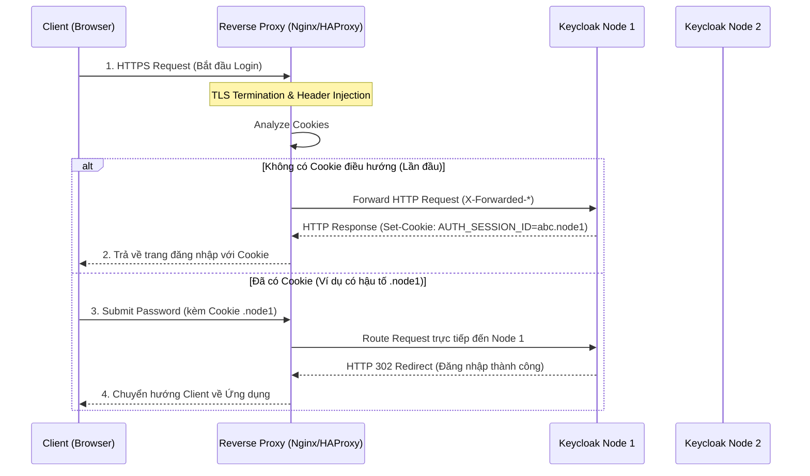

> [!NOTE]
> **Category:** Theory
> **Goal:** Hiểu vai trò, kiến trúc và cách cấu hình Load Balancer / Reverse Proxy phía trước cụm Keycloak trong môi trường High Availability (HA).

## 1. Lý thuyết chuyên sâu (Detailed Theory)

Trong một hệ thống mạng doanh nghiệp (Enterprise Network) tuân thủ tính HA (High Availability), người dùng cuối (Client) không bao giờ giao tiếp trực tiếp với một Node Keycloak cụ thể. Thay vào đó, toàn bộ Request sẽ được chuyển tới một thiết bị hoặc phần mềm trung gian gọi là **Load Balancer (LB)** hoặc **Reverse Proxy**. 

Vai trò sống còn của Load Balancer với Keycloak bao gồm:
- **Ngăn chặn điểm nghẽn và rủi ro sập hệ thống (SPOF Prevention):** Phân phối lượng lớn các Request đến nhiều node Keycloak khác nhau. Khi một Node bị chết (Crash), LB sẽ phát hiện và chuyển hướng truy cập sang các Node còn sống, giữ cho thời gian Uptime đạt 99.99%.
- **Offload mã hóa SSL/TLS (TLS Termination):** Quá trình mã hóa và giải mã HTTPS cực kỳ tốn CPU. Bằng cách kết thúc chứng chỉ SSL ngay tại LB, các Node Keycloak sẽ tập trung CPU cho việc băm mật khẩu (Password Hashing) và xử lý luồng xác thực OIDC.
- **Header Forwarding:** Vì LB che giấu IP thực của Client khỏi Keycloak, LB phải "bơm" (inject) thông tin gốc của Client vào các HTTP Headers tiêu chuẩn (như `X-Forwarded-For`, `X-Forwarded-Proto`) để Keycloak có thể nhận diện đúng Client và sinh ra các Callback/Redirect URL chính xác.

## 2. Luồng nội bộ & Cơ chế cấp thấp (Internal Workflow & Low-level Mechanisms)

Khi được cấu hình chuẩn cho luồng đăng nhập, LB thường tận dụng cơ chế **Sticky Session** (Session Affinity). Cơ chế này giúp điều hướng một User đang thực hiện chuỗi thao tác đăng nhập luôn kết nối đúng vào một Node ban đầu mà không bị chuyển tải ngẫu nhiên.



**Tại sao Sticky Session lại cần thiết?**
Keycloak chia sẻ Cache bằng công nghệ **Infinispan**. Tuy nhiên, quá trình Replication (đồng bộ dữ liệu giữa các Node) qua đường mạng có độ trễ nhỏ (Network Latency). Nếu một người dùng vừa gửi Request 1 (tạo trạng thái) tới `Node 1`, và ngay sau đó mili-giây gửi Request 2 (chứng minh trạng thái) bị LB đẩy qua `Node 2` trong khi `Node 2` chưa kịp nhận bản ghi đồng bộ từ `Node 1`, người dùng sẽ nhận lỗi "Session not found". Sticky Session loại bỏ nhược điểm này.

## 3. Thực hành tốt nhất & Bảo mật (Best Practices & Security)

- **Cấu hình Proxy Mode chuẩn xác:** Bắt buộc phải khởi chạy Keycloak với tham số `proxy=edge` (khi LB giao tiếp với Keycloak bằng HTTP) hoặc `proxy=reencrypt` (khi LB giao tiếp với Keycloak bằng HTTPS). Không cấu hình đúng điều này, Keycloak sẽ sinh ra các Redirect URI là `http://...` gây lỗi bảo mật "Mixed Content" trên trình duyệt.
- **Triển khai X-Forwarded Headers:** Đảm bảo Load Balancer truyền đầy đủ các Headers chuẩn: `X-Forwarded-For` (IP của Client), `X-Forwarded-Proto` (Schema: http/https), và `X-Forwarded-Host` (Domain gốc).
- **Health Check thông minh:** Đừng dùng Health Check thông thường như ping cổng TCP. Hãy trỏ LB vào Endpoint HTTP của Keycloak là `/health/ready`. Trạng thái `ready` khẳng định Node không chỉ bật mà mọi hệ thống nội bộ (như kết nối DB, Infinispan cache) đã khởi động hoàn tất và sẵn sàng nhận Traffic.
- **Re-encryption cho môi trường Zero-Trust:** Trong hệ thống ngân hàng hoặc tài chính, mọi dữ liệu di chuyển ngay cả trên mạng nội bộ (Internal Network) đều phải mã hóa. Hãy cấu hình LB giải mã HTTPS từ ngoài internet, phân tích header, rồi tiếp tục mã hóa lại HTTPS (TLS Re-encryption) để truyền gói tin sang Keycloak.

> [!WARNING]
> Nếu bạn public Keycloak qua Load Balancer nhưng không chặn cổng quản trị, ai cũng có thể cố dò thông tin. Luôn cấu hình chặn các đường dẫn `/auth/admin/*` ở cấp độ Load Balancer đối với luồng Public Internet và chỉ cho phép dải IP nội bộ hoặc VPN truy cập.

## 4. Cấu hình minh họa thực tế (Configuration Examples)

Dưới đây là một cấu hình Reverse Proxy thông dụng sử dụng NGINX.

**Cấu hình trên NGINX:**
```nginx
upstream keycloak_cluster {
    # Sử dụng IP Hash để mô phỏng tính năng Sticky Session
    ip_hash;
    server 10.0.0.11:8080 max_fails=3 fail_timeout=10s;
    server 10.0.0.12:8080 max_fails=3 fail_timeout=10s;
}

server {
    listen 443 ssl http2;
    server_name auth.company.com;

    ssl_certificate /etc/nginx/ssl/fullchain.pem;
    ssl_certificate_key /etc/nginx/ssl/privkey.pem;

    location / {
        proxy_pass http://keycloak_cluster;
        
        # Bơm thông tin Header bắt buộc cho Keycloak
        proxy_set_header Host $host;
        proxy_set_header X-Real-IP $remote_addr;
        proxy_set_header X-Forwarded-For $proxy_add_x_forwarded_for;
        proxy_set_header X-Forwarded-Proto $scheme;
        proxy_set_header X-Forwarded-Host $host;
        proxy_set_header X-Forwarded-Port 443;
    }
}
```

**Cấu hình trên Keycloak (keycloak.conf):**
```properties
# Kích hoạt chế độ Proxy (Edge Mode - nhận HTTP từ LB)
proxy=edge
# Tên miền chính thức của môi trường (Host gốc)
hostname=auth.company.com
hostname-strict=true
```

## 5. Trường hợp ngoại lệ (Edge Cases)

- **Lỗi Invalid Redirect URI do thiếu Header:** Sau khi đăng nhập bằng Google/Facebook (Identity Provider), Client bị đưa về trang lỗi "Invalid redirect_uri".
  - **Nguyên nhân:** LB quên truyền Header `X-Forwarded-Proto: https` vào Keycloak. Keycloak sẽ nghĩ Client đang dùng `http` và sinh ra callback URL với dạng `http://...`.
- **Node "Chết giả" (Flapping Status):** Quá trình khởi động ban đầu của Keycloak cần nhiều thời gian để chạy SQL Migration. Nếu LB có Timeout cho Health Check quá ngắn, nó sẽ liên tục đánh dấu Node là DOWN rồi UP (gọi là Flapping).
  - **Cách khắc phục:** Trên LB, cấu hình `initial_delay` (thời gian bỏ qua check khi khởi động) và tăng thời gian timeout của Health Check lên mức phù hợp (ví dụ 30-60 giây ở lần khởi chạy đầu).
- **Phân tải không đều (Uneven Load Distribution):** Do thuật toán `ip_hash` hoặc Sticky Session, nếu một văn phòng công ty (sau NAT router) dùng chung 1 địa chỉ IP thực, tất cả nhân viên sẽ bị LB đẩy về cùng 1 Node duy nhất.
  - **Cách khắc phục:** Cân nhắc thay thế `ip_hash` bằng tính năng Sticky-Cookie (ví dụ dùng Nginx Plus hoặc HAProxy) để phân tích Cookie trên từng trình duyệt thay vì IP.

## 6. Câu hỏi Phỏng vấn (Interview Questions)

**Junior Level:**
- **Câu hỏi 1:** Tính năng TLS Termination trên Load Balancer mang lại lợi ích gì cho hệ thống Keycloak?
  - **Đáp án:** Nó giúp giảm tải tài nguyên CPU trên các Node Keycloak do không phải tính toán mã hóa HTTPS. Ngoài ra, việc quản lý và gia hạn chứng chỉ (Certificates) sẽ tập trung tại Load Balancer thay vì phải cấu hình cho từng Node lẻ tẻ.
- **Câu hỏi 2:** Hai endpoint `/health/live` và `/health/ready` của Keycloak khác nhau điểm nào?
  - **Đáp án:** Liveness check (`/health/live`) xác định xem Process còn chạy không (nếu chết thì nền tảng như Kubernetes sẽ khởi động lại Pod). Readiness check (`/health/ready`) xác định xem ứng dụng đã sẵn sàng tiếp nhận Request chưa (nếu chưa, LB sẽ không đẩy Traffic vào).

**Senior Level:**
- **Câu hỏi 3:** Hãy giải thích cơ chế "proxy=reencrypt" trong Keycloak. Ứng dụng trong ngữ cảnh nào?
  - **Đáp án:** Đây là cấu hình sử dụng khi toàn bộ kiến trúc mạng tuân theo mô hình Zero-Trust. Cả Request từ ngoài Internet vào LB, lẫn Request từ LB vào trong Keycloak đều phải chạy trên HTTPS. Keycloak cần nhận thức được nó đang đứng sau một Proxy an toàn để xử lý Forwarded Headers hợp lệ.
- **Câu hỏi 4:** Khi cấu hình Keycloak ở cụm HA mà không sử dụng Sticky Session ở Load Balancer, chuyện gì có thể xảy ra ở luồng xác thực?
  - **Đáp án:** Xảy ra hiện tượng "Authentication Session Miss". Quá trình đăng nhập sinh ra Session State lưu tại Infinispan. Nếu User gửi Request kế tiếp bị chuyển sang Node khác chưa kịp đồng bộ (Replication Latency), người dùng sẽ văng lỗi session expired hoặc bắt đầu lại quá trình đăng nhập.
- **Câu hỏi 5:** Làm thế nào để cấu hình Load Balancer chặn truy cập Master Realm (Admin UI) từ Internet nhưng vẫn cho phép API xác thực thông thường?
  - **Đáp án:** Tại cấu hình Load Balancer, thêm rule từ chối (Drop/Deny) các đường dẫn HTTP Request Path bắt đầu với `/auth/admin/` hoặc `/admin/` nếu địa chỉ gốc (Client IP) không nằm trong danh sách White List IP của doanh nghiệp.

## 7. Tài liệu tham khảo (References)
- [Keycloak Documentation: Configuring Reverse Proxy](https://www.keycloak.org/server/reverseproxy)
- [Keycloak Architecture Guide: High Availability](https://www.keycloak.org/high-availability/introduction)
- [IETF RFC 7239: Forwarded HTTP Extension](https://datatracker.ietf.org/doc/html/rfc7239)
