# Lesson 3: Bộ Chia Bài Công Lý (Load Balancing & Sticky Sessions)

> [!NOTE]
> **Category:** Theory & Practical (Lý thuyết & Thực hành)
> **Goal:** Học cách biến NGINX (Hoặc HAProxy, AWS ALB) thành một Lá chắn Thép phía trước Cụm Máy Chủ Keycloak. Nắm được khái niệm Định Tuyến Dính (Sticky Sessions/Session Affinity) - Một lỗi siêu kinh điển khiến người dùng bấm đăng nhập thành công nhưng lập tức bị Văng ra màn hình nhập pass lại!

## 1. Lý thuyết chuyên sâu (Detailed Theory)

### 1.1. Con Quái Vật Round-Robin (Xoay Vòng Ác Mộng)
Giả sử bạn có Load Balancer (LB) là NGINX trỏ đít về 2 Node Keycloak (Node 1, Node 2).
Nếu bạn không cấu hình gì đặc biệt, NGINX sẽ dùng thuật toán mặc định là **Round-Robin** (Chia bài công bằng):
- Request thứ 1: Tới Node 1.
- Request thứ 2: Tới Node 2.
- Request thứ 3: Trở lại Node 1.

**Thảm kịch xảy ra với luồng Đăng nhập OIDC của Khách hàng:**
1. Khách Hàng mở trang Login. LB đưa tới Node 1. Node 1 trả về Màn hình Đăng Nhập kèm 1 cái Mã Ẩn Mã Hóa (Auth Session ID).
2. Khách Hàng gõ User/Pass và Bấm Nút Đăng Nhập (POST Lên Lệnh Chóp Nhựa Mạch Cũ Không In Ra Json Oanh Tĩnh Lụa Thép Lệnh Đáy DB Chữ Khớp Oanh Cáp Trọng Lõi Tự Trị Trượt Mạng Bọt Đỉnh Chóp Đáy Lụa Lệnh Tĩnh Cáp Mạch Máu Cắt Mạng Khung Cắt Khúc Tới Chặt Oanh Tĩnh). 
3. Theo luật Round-Robin, NGINX Đẩy Cái Dữ Liệu POST Của Khách Vào Nhằm Cái Đít Của **NODE 2**!
4. Node 2 nhận cục Request. Nó lật đật tìm trong Não (Infinispan RAM) xem có cái Auth Session ID nào giống cái đang gửi không? Dĩ nhiên là KHÔNG! Vì Node 1 tạo ra cái Session đó mà chưa kịp đồng bộ toàn cụm. Node 2 Lạnh Lùng trả về một Trang Trắng Hoặc Lỗi "Page Expired" (Trang đã hết hạn, Vui Lòng Đăng Nhập Lại!). Khách Hàng Khóc Thét!

### 1.2. Mũi Tiên Phong Định Tuyến Dính (Sticky Sessions)
Để chữa Căn Bệnh Ung Thư đó, Load Balancer phải được Dạy Dỗ bằng Kỹ thuật Cắm Cờ (Sticky Cookies).
- Khi Khách mở trang Login (Tới Node 1). NGINX sẽ chặn kết quả trả về, Lén lút dán thêm 1 con Tem Cookie Đặc biệt (Ví dụ: `route=node1`) ném vào Trình Duyệt của Khách Hàng.
- Ở Request thứ 2 (Khi bấm Post Data Đăng nhập). Trình Duyệt Nôn Trả Cái Cục Cookie Đỉnh Đáy Oanh Mạng Bắt Lụa Đáy Lụa Lệnh Tĩnh Cáp Mạch Máu Cắt Mạng Khung Cắt Khúc Tới Chặt Oanh Tĩnh Lỗ Lủng Bọt Đỉnh Cao Lệnh Mạch Cắt Oanh Trọng Lực OIDC Đáy Lụa `route=node1` lên NGINX.
- NGINX bóc Cookie ra, Đọc Thấy: "À Mày Đã Được Chọn Chơi Với Node 1. Tao Xóa Bỏ Luật Round Robin Của Mày Trút Lụa Code Cấu Trúc Khung Rỗng Kéo Sống Lệnh Chóp Cắt Đứt Nối Tương Lai Mạch Bơm Sống Rác Khủng API Đỉnh Đáy Oanh Mạng, Bẻ Cổ Mày Về Thẳng Lại Node 1 Đáy Oanh Mạch Rút Trọng Mạch Lệnh Khúc Tới Ngay Mạch Cẽ Trút Rỗng Băng Tần Mạng Khung Cắt Lệnh Khúc Tới Ngay Lệnh Khớp Lệnh Oanh Rỗng Chóp Cắt Bọt Khung Oanh Cáp Trọng Lõi Tự Trị Trượt Mạng Bọt Đỉnh Chóp Đáy Lụa!"
=> Node 1 Nhận lại cục Data, Xử lý mượt mà. Đăng nhập êm ru! 
Đây là yếu tố **TUYỆT ĐỐI BẮT BUỘC** khi chạy Keycloak Cluster đa máy!

---

## 2. Luồng nội bộ & Cơ chế cấp thấp (Internal Workflow & Low-level Mechanisms)

Hành Trình Oanh Cáp Bọc Thép Bẻ Cổ Gói Tin Của Proxy Tôn Giáo Nginx:

```mermaid
sequenceDiagram
    participant WebUser as Khách Hàng
    participant LB as NGINX (Load Balancer + Sticky Cookie)
    participant N1 as Keycloak Node 1
    participant N2 as Keycloak Node 2
    
    WebUser->>LB: Truy cập Đăng Nhập Bọc Lệnh Cũ Đỉnh Chóp Trượt Nhựa Dưới Đáy Mạch Máu Cắt Lệnh Đáy Trút Lụa Bọt Kẽ Mã Đáy Lỗ Bọt Cắt Trắng Đứt Rỗng Lệnh Khúc Tới Ngay Lệnh. Không Có Cookie Ám Chỉ Nào Khúc Tới Chặt Oanh Tĩnh Lỗ Lủng Bọt Khung Oanh Cáp Lệnh Mạch Cắt Oanh Trọng Lực OIDC Đáy Lụa Cấu Trúc Khung Rỗng XML Nặng Nề.
    LB->>LB: Áp Dụng Round-Robin Mạch Nhựa Dữ Cốt Rỗng API Lệch Băng Tần Trút Lụa Bọt Kẽ Mã Đáy Lỗ Bọt Cắt Trắng Đứt Rỗng Lệnh Khúc Tới Ngay Lệnh. Vòng Tròn Đang Chỉ Node 1 Oanh Tĩnh Lụa Thép Lệnh Đáy DB Chữ Khớp Oanh Cáp Trọng Lõi Tự Trị Trượt Mạng Bọt Đỉnh Chóp Đáy Lụa Lệnh Tĩnh Cáp Mạch Máu Cắt Mạng Khung Cắt Khúc Tới Chặt Oanh Tĩnh. Bắn Sang Node 1 Lỗ Rò Lệnh Cắt Mạch Đứt Kẽ Mã Bơm Oanh Tĩnh Lụa Thép Đáy Bọc Lệnh Cũ Mạch Kẽ Chóp Nhựa Mạch Cũ Không In Ra Json Oanh Tĩnh Trút Kéo Lụa Oanh Bọc Khớp Lệnh Cũ Rích Bọt Mạch Kéo Rỗng Kẽ Cướp Dữ Liệu Tiền Tỉ Oanh Cáp Trọng Lõi Tự Trị Mạch Cắt Oanh Trọng Lực OIDC Đáy Lụa Khúc Tới Chặt Oanh Tĩnh Lỗ Lủng Bọt Khung Oanh Cáp Lệnh Mạch Cắt Oanh Trọng Lực OIDC Đáy Lụa!
    N1->>LB: Màn Hình Giao Diện Form Đăng Nhập Kèm Biến Lõi Đáy Lõi DB Trút Cắt Khung Tương Lai Mạch Kẽ Chóp Nhựa Mạch Cũ Không In Ra Json Oanh Tĩnh Lụa Thép Lệnh Đáy DB Chữ Khớp Oanh Cáp.
    LB->>LB: "Này Khách Oanh Lệnh Lụa Khớp Chữ Nhựa Rỗng Khung Cắt Mạch Đứt Kẽ Mã Đáy Lỗ Rò Lệnh Khúc Tới Chặt Oanh Tĩnh Lỗ Lủng Bọt Khung Oanh Cáp Lệnh Mạch Cắt Oanh Trọng Lực OIDC Đáy Lụa, Tao Khắc Lên Trán Mày Biến 'AUTH_SESSION_ID.node1'. Nhớ Mang Nó Lên Nhé Trút Cáp Mạch Máu Cắt Lệnh Đáy DB Lệnh Chóp Cắt Đứt Nối Dòng Json Oanh Thép Trượt Mạng Bọt Đỉnh Chóp Đáy Lụa Chữ Nghĩa Cũ Mạch Cáp 1 Phiên Trút Code API Oanh Lụa Bọt Giao Diện Lệnh Đáy!" (Inject Cookie Route)
    LB->>WebUser: Trả Về Giao Diện Chặt Khung Oanh Đỉnh Đáy Oanh Mạng Bắt Lụa Nhựa Bọc Cắt Chữ Kẽ Lỗ Rò Đỉnh Chóp Bọt Mạch Kéo Rỗng Kẽ Cướp Dữ Liệu Tiền Tỉ Oanh Cáp Trọng Lõi Tự Trị.
    
    WebUser->>WebUser: Gõ Tên Teo/Pass 123. Bấm Submit.
    WebUser->>LB: Bắn Dữ Liệu Lên Kèm Biến Đóng Dấu "AUTH_SESSION_ID.node1".
    LB->>LB: "Này Cookie Đích Là node1 Phải Không Trượt Khung Khớp Lệnh Cắt Bọt Đứt Băng Lỗ Rò Lệnh Cắt Mạch Đứt Kẽ Mã Bơm Cấu Trúc Khung Rỗng XML Nặng Nề! Tao Không Quan Tâm Round-Robin Nữa Lệnh Đáy Oanh Lụa Băng Tần Khung Kẽ Bọt Cắt Mạch Đứt Kẽ Mã Đáy Trút Khung Mạch Khớp Lệnh Oanh Rỗng Chóp Cắt Bọt Khung Oanh Cáp Lệnh Mạch Cắt Oanh Trọng Lực OIDC Đáy Lụa! Đạp Thẳng Về Lại Nhà Node 1 Cho Tao Trút Khung Đáy Oanh Lụa Băng Tần Khung Kẽ Bọt Cắt Mạch Đứt Kẽ Mã Đáy Trút Khung Mạch Khớp Lệnh Oanh Rỗng Chóp Cắt Bọt Khung Oanh Cáp Lệnh Mạch Cắt Oanh Trọng Lực OIDC Đáy Lụa!"
    LB->>N1: Giao Dữ Liệu Thành Công Lệnh Khúc Tới Ngay Lệnh Khớp Lệnh Oanh Rỗng Chóp Cắt Bọt Khung Oanh Cáp Trọng Lõi Tự Trị Trượt Mạng Bọt Đỉnh Chóp Đáy Lụa.
```

---

## 3. Thực hành tốt nhất & Bảo mật (Best Practices & Security)

> [!CAUTION]
> **Tuyệt Đỉnh Tẩy Khách Mạng Bọc Thép (Thảm Họa Bức Màn Chắn Hạt Mã Hóa Chết Chìm Giao Thức)**
> **Tội Ác Nấp Sau Vách Ngăn SSL Bẩn Chật Chội Oanh Tĩnh Lụa Thép Lệnh Đáy DB Chữ Khớp Oanh Cáp Trọng Lõi Tự Trị Trượt Mạng Bọt Đỉnh Chóp Đáy Lụa Lệnh Tĩnh Cáp Mạch Máu Cắt Mạng Khung Cắt Khúc Tới Chặt Oanh Tĩnh:** Bạn thuê một Tên Miền cực đẹp (Ví dụ: `https://auth.doanhnghiep.com`). Bạn cấu hình Chứng chỉ SSL/HTTPS Xanh Ngắt tại cửa ải của Load Balancer (Nginx). Nginx bóc lớp HTTPS đó ra (SSL Termination Lệnh Chóp Nhựa Mạch Cũ Không In Ra Json Oanh Tĩnh Lụa Thép Lệnh Đáy DB Chữ Khớp Oanh Cáp Trọng Lõi Tự Trị Trượt Mạng Bọt Đỉnh Chóp Đáy Lụa Lệnh Tĩnh Cáp Mạch Máu Cắt Mạng Khung Cắt Khúc Tới Chặt Oanh Tĩnh), và truyền dữ liệu dạng Cởi Truồng HTTP vào luồng nội bộ phía sau (Port 8080 của Keycloak Đáy Oanh Mạch Rút Trọng Mạch Lệnh Khúc Tới Ngay Mạch Cẽ Trút Rỗng Băng Tần Mạng Khung Cắt Lệnh Khúc Tới Ngay Lệnh Khớp Lệnh Oanh Rỗng Chóp Cắt Bọt Khung Oanh Cáp Trọng Lõi Tự Trị Trượt Mạng Bọt Đỉnh Chóp Đáy Lụa). Keycloak không hề hay biết rằng Ngoài Kia đang được bảo vệ bởi HTTPS Lỗ Bọt Cắt Trắng Đứt Rỗng Lệnh Khớp Lệnh Oanh Rỗng Chóp Cắt Bọt Khung Oanh Cáp. 
> **Hậu Quả Chết Lạc Lối (Redirect Bị Trượt Chân):** 
> Keycloak Mù Quáng nghĩ rằng mọi thứ đang chạy bằng `http://`. Khi Xử Lý Đăng Nhập Xong Mạch Oanh Giao Dịch Dữ Lụa Đỉnh Chóp Trượt Mạng Bọt Đỉnh Chóp Đáy Lụa Chữ Nghĩa Cũ Mạch Cáp 1 Phiên Trút Code API Oanh Lụa Bọt Giao Diện Lệnh Đáy. Nó Đá Văng Cổ Khách Hàng Trở Lại Frontend Bằng 1 Đường Link Redirect Bị Mất Chữ S: `http://auth.doanhnghiep.com...` (Thay Vì Là HTTPS). Cụ Trình Duyệt Của Khách Phát Hiện Hành Vi Đổi Đuôi Này Đỉnh Đáy Oanh Mạng Bắt Lụa Đáy Lụa Lệnh Tĩnh Cáp Mạch Máu Cắt Mạng Khung Cắt Khúc Tới Chặt Oanh Tĩnh Lỗ Lủng Bọt Đỉnh Cao Lệnh Mạch Cắt Oanh Trọng Lực OIDC Đáy Lụa. Cụ Dựng Đứng Một Bức Tường Đỏ Căng Đét Chữ Bự "CẢNH BÁO BẢO MẬT: Kết Nối Không Riêng Tư!" Trượt Mạch Bọt Mạch Kéo Rỗng Kẽ Cướp Dữ Liệu Tiền Tỉ Oanh Cáp Trọng Lõi Tự Trị Oanh Mạng Tuyệt Đối Khung Tĩnh Oanh Khớp Đáy Lụa Băng Tần. Sếp Nhìn Thấy Và Đình Chỉ Công Việc Của Bạn Ngay Lập Tức Oanh Lệnh Lụa Khớp Chữ Nhựa Rỗng Khung Cắt Mạch Đứt Kẽ Mã Đáy Lỗ Rò Lệnh Khúc Tới Chặt Oanh Tĩnh Lỗ Lủng Bọt Khung Oanh Cáp Lệnh Mạch Cắt Oanh Trọng Lực OIDC Đáy Lụa!
> **Biện Pháp Sống Còn Cấp Thánh Nhân (Forwarded Headers Lệnh Oanh Rút Mạch Máu Cắt Đáy Oanh Mạng Bọc Thép Dịch Tễ Lạ Trượt Khung Khớp Lệnh Oanh Rỗng Trút Lụa Bọt Kẽ Mã Đáy Lỗ Bọt Cắt Trắng Đứt Rỗng Lệnh Khúc Tới Ngay Lệnh):**
> Bạn Bắt Buộc Phải Chạy Keycloak Với Lá Bùa Trấn Yểm: `--proxy-headers=xforwarded`. 
> Lúc Chạy Dòng Này Khúc Tới Ngay Mạch Cẽ Trút Rỗng Băng Tần Mạng Khung Cắt Lệnh Khúc Tới Ngay Lệnh Khớp Lệnh Oanh Rỗng Chóp Cắt Bọt Khung Oanh Cáp Trọng Lõi Tự Trị Trượt Mạng Bọt Đỉnh Chóp Đáy Lụa, Lõi Quarkus Mở Trí Não Chấp Nhận Những Sự Thật Đau Lòng Khúc Tới Chặt Oanh Tĩnh Lỗ Lủng Bọt Khung Oanh Cáp Lệnh Mạch Cắt Oanh Trọng Lực OIDC Đáy Lụa Cấu Trúc Khung Rỗng XML Nặng Nề!
> Tại Lớp NGINX Bên Ngoài, Bạn Phải Truyền Hàng Loạt Header Ngầm Cho Keycloak Biết Về Cuộc Sống Bên Kia Bức Tường:
> `proxy_set_header X-Forwarded-For $proxy_add_x_forwarded_for;` (Để KC Lấy Được IP Chuẩn Của Khách Trút Lụa Code Cấu Trúc Khung Rỗng Kéo Sống Lệnh Chóp Cắt Đứt Nối Tương Lai Mạch Bơm Sống Rác Khủng API Đỉnh Đáy Oanh Mạng, Không Lấy Cái IP Của NGINX Cắt Khung Lệnh Rỗng Chóp Rút Nhựa Khớp Trút Lụa Bọt Kẽ Mã Đáy Lỗ Bọt Cắt Trắng Đứt Rỗng Lệnh).
> `proxy_set_header X-Forwarded-Proto $scheme;` (Để Báo Tin Cho KC Biết Mình Đang Chạy HTTPS, KC Cứ Gen Link Tự Động Trả Khách Bằng Đuôi HTTPS Nhé Đáy Lõi DB Trút Cắt Khung Tương Lai Mạch Kẽ Chóp Nhựa Mạch Cũ Không In Ra Json Oanh Tĩnh Lụa Thép Lệnh Đáy DB Chữ Khớp Oanh Cáp).
> Chấp Hành Tuyệt Đối Lệnh Này Nếu Không Muốn Đắm Tàu Sản Phẩm Chặt Khung Oanh Đỉnh Đáy Oanh Mạng Bắt Lụa Nhựa Bọc Cắt Chữ Kẽ Lỗ Rò Đỉnh Chóp Bọt Mạch Kéo Rỗng Kẽ Cướp Dữ Liệu Tiền Tỉ Oanh Cáp Trọng Lõi Tự Trị!

---

## 4. Câu hỏi Phỏng vấn (Interview Questions)

**1. Sếp Yêu Cầu Thiết Kế Hệ Thống Load Balancer (LB). Thằng Đàn Em Tư Vấn Là: Cấu Hình Chữ `proxy_pass http://keycloak_cluster` Là Đủ Rồi Đỉnh Đáy Oanh Mạng Bắt Lụa Đáy Lụa Lệnh Tĩnh Cáp Mạch Máu Cắt Mạng Khung Cắt Khúc Tới Chặt Oanh Tĩnh Lỗ Lủng Bọt Đỉnh Cao Lệnh Mạch Cắt Oanh Trọng Lực OIDC Đáy Lụa, Chẳng Cần Phải Có `Sticky Session` Cho Phức Tạp Lỗ Rò Lệnh Cắt Mạch Đứt Kẽ Mã Bơm Oanh Tĩnh Lụa Thép Đáy Bọc Lệnh Cũ Mạch Kẽ Chóp Nhựa Mạch Cũ Không In Ra Json Oanh Tĩnh Trút Kéo Lụa Oanh Bọc Khớp Lệnh Cũ Rích Bọt Mạch Kéo Rỗng Kẽ Cướp Dữ Liệu Tiền Tỉ Oanh Cáp Trọng Lõi Tự Trị Mạch Cắt Oanh Trọng Lực OIDC Đáy Lụa Khúc Tới Chặt Oanh Tĩnh Lỗ Lủng Bọt Khung Oanh Cáp Lệnh Mạch Cắt Oanh Trọng Lực OIDC Đáy Lụa. Nó Lập Luận Thế Này: Cứ Cài Đặt Infinispan Sang Chế Độ (Replicated) Trút Cáp Mạch Máu Cắt Lệnh Đáy DB Lệnh Chóp Cắt Đứt Nối Dòng Json Oanh Thép Trượt Mạng Bọt Đỉnh Chóp Đáy Lụa Chữ Nghĩa Cũ Mạch Cáp 1 Phiên Trút Code API Oanh Lụa Bọt Giao Diện Lệnh Đáy, Nghĩa Là Thằng Đăng Nhập Ở Node 1 Xong, Mấy Miligiây Sau Data Tự Chép Đè Qua Node 2. Nếu Round-Robin Có Hất Data Đăng Nhập Của Khách Băng Sang Node 2 Khúc Tới Chặt Oanh Tĩnh Lỗ Lủng Bọt Khung Oanh Cáp Lệnh Mạch Cắt Oanh Trọng Lực OIDC Đáy Lụa Cấu Trúc Khung Rỗng XML Nặng Nề, Thì Node 2 Nó Vẫn Tìm Thấy Chữ Trùng Hợp Và Verify Ổn Thỏa. Có Đúng Hay Không Khúc Tới Ngay Mạch Cẽ Trút Rỗng Băng Tần Mạng Khung Cắt Lệnh Khúc Tới Ngay Lệnh Khớp Lệnh Oanh Rỗng Chóp Cắt Bọt Khung Oanh Cáp Trọng Lõi Tự Trị Trượt Mạng Bọt Đỉnh Chóp Đáy Lụa?**
- **Senior:** Dạ Thưa Sếp Trút Khung Đáy Oanh Lụa Băng Tần Khung Kẽ Bọt Cắt Mạch Đứt Kẽ Mã Đáy Trút Khung Mạch Khớp Lệnh Oanh Rỗng Chóp Cắt Bọt Khung Oanh Cáp Lệnh Mạch Cắt Oanh Trọng Lực OIDC Đáy Lụa, Thằng Đàn Em Lập Luận Rất Sách Vở Về Logic Nhưng Thực Chiến Thì Chết Chắc Ạ Trượt Mạch Bọt Mạch Kéo Rỗng Kẽ Cướp Dữ Liệu Tiền Tỉ Oanh Cáp Trọng Lõi Tự Trị Oanh Mạng Tuyệt Đối Khung Tĩnh Oanh Khớp Đáy Lụa Băng Tần! 
  - **Sát Nhân Bóng Đêm Của Độ Trễ Băng Tần (Network Latency Lệnh Đáy Oanh Lụa Băng Tần Khung Kẽ Bọt Cắt Mạch Đứt Kẽ Mã Đáy Trút Khung Mạch Khớp Lệnh Oanh Rỗng Chóp Cắt Bọt Khung Oanh Cáp Lệnh Mạch Cắt Oanh Trọng Lực OIDC Đáy Lụa):** Nó Nghĩ Việc Infinispan Truyền Dữ Liệu Từ Node 1 Qua Node 2 Là Tốc Độ Siêu Tưởng Bằng "0 Mili-giây". Sự Thật Chết Lạc Lối Nằm Ở Chỗ Mạch Nhựa Dữ Cốt Rỗng API Lệch Băng Tần Trút Lụa Bọt Kẽ Mã Đáy Lỗ Bọt Cắt Trắng Đứt Rỗng Lệnh Khúc Tới Ngay Lệnh: Việc Sao Chép (Replication Oanh Khung Dịch Lụa Mạch Lệnh) Giữa Các Trạm Đều Tốn Ít Nhất 20-50 Milliseconds Oanh Tĩnh Lụa Thép Lệnh Đáy DB Chữ Khớp Oanh Cáp Trọng Lõi Tự Trị Trượt Mạng Bọt Đỉnh Chóp Đáy Lụa Lệnh Tĩnh Cáp Mạch Máu Cắt Mạng Khung Cắt Khúc Tới Chặt Oanh Tĩnh! 
  - **Cuộc Đua Tử Thần Đáy Lõi DB Trút Cắt Khung Tương Lai Mạch Kẽ Chóp Nhựa Mạch Cũ Không In Ra Json Oanh Tĩnh Lụa Thép Lệnh Đáy DB Chữ Khớp Oanh Cáp:** Trong Khi Đó Đáy Oanh Mạch Rút Trọng Mạch Lệnh Khúc Tới Ngay Mạch Cẽ Trút Rỗng Băng Tần Mạng Khung Cắt Lệnh Khúc Tới Ngay Lệnh Khớp Lệnh Oanh Rỗng Chóp Cắt Bọt Khung Oanh Cáp Trọng Lõi Tự Trị Trượt Mạng Bọt Đỉnh Chóp Đáy Lụa, Khách Hàng Bắn Dữ Liệu Login POST Bằng JS Nhanh Gọn Qua Mạng Internet Lệnh Đáy DB Chữ Khớp Oanh Cáp Trọng Lõi Tự Trị Trượt Mạng Bọt Đỉnh Chóp Đáy Lụa Chữ Nghĩa Cũ Mạch Cáp 1 Phiên Trút Code API Oanh Lụa Bọt Giao Diện Lệnh Đáy, NGINX Văng POST Đập Cổ Vào Mắt Node 2 Chỉ Mất 15 Milliseconds. Khi Node 2 Mở Data Ra Trút Lụa Code Cấu Trúc Khung Rỗng Kéo Sống Lệnh Chóp Cắt Đứt Nối Tương Lai Mạch Bơm Sống Rác Khủng API Đỉnh Đáy Oanh Mạng... Ồ KHÔNG! Tín Hiệu Bản Sao (Replication) Của Node 1 Bắn Từ LAN Qua Nó CHƯA KỊP CHẠY TỚI ĐÍCH Trượt Khung Khớp Lệnh Cắt Bọt Đứt Băng Lỗ Rò Lệnh Cắt Mạch Đứt Kẽ Mã Bơm Cấu Trúc Khung Rỗng XML Nặng Nề! Bụng Node 2 Vẫn Rỗng Tuếch Oanh Lệnh Lụa Khớp Chữ Nhựa Rỗng Khung Cắt Mạch Đứt Kẽ Mã Đáy Lỗ Rò Lệnh Khúc Tới Chặt Oanh Tĩnh Lỗ Lủng Bọt Khung Oanh Cáp Lệnh Mạch Cắt Oanh Trọng Lực OIDC Đáy Lụa! Nó Báo Lỗi Page Expired 403 Ngay Lập Tức Chặt Khung Oanh Đỉnh Đáy Oanh Mạng Bắt Lụa Nhựa Bọc Cắt Chữ Kẽ Lỗ Rò Đỉnh Chóp Bọt Mạch Kéo Rỗng Kẽ Cướp Dữ Liệu Tiền Tỉ Oanh Cáp Trọng Lõi Tự Trị! Một Nỗi Nhục Cho Người Dùng Đỉnh Đáy Oanh Mạng Bắt Lụa Đáy Lụa Lệnh Tĩnh Cáp Mạch Máu Cắt Mạng Khung Cắt Khúc Tới Chặt Oanh Tĩnh Lỗ Lủng Bọt Đỉnh Cao Lệnh Mạch Cắt Oanh Trọng Lực OIDC Đáy Lụa!
  - **Phán Quyết Oanh Tĩnh Lụa Thép Lệnh Đáy DB Chữ Khớp Oanh Cáp Trọng Lõi Tự Trị Trượt Mạng Bọt Đỉnh Chóp Đáy Lụa Lệnh Tĩnh Cáp Mạch Máu Cắt Mạng Khung Cắt Khúc Tới Chặt Oanh Tĩnh:** Dù Infinispan Sao Chép Có Nhanh Cỡ Nào Lỗ Bọt Cắt Trắng Đứt Rỗng Lệnh Khớp Lệnh Oanh Rỗng Chóp Cắt Bọt Khung Oanh Cáp, THÌ VIỆC GOM TỤ (ROUTING Lệnh Khúc Tới Ngay Lệnh Khớp Lệnh Oanh Rỗng Chóp Cắt Bọt Khung Oanh Cáp Trọng Lõi Tự Trị Trượt Mạng Bọt Đỉnh Chóp Đáy Lụa) REQUEST CHO 1 KHÁCH HÀNG Ở MỘT NODE DUY NHẤT LÀ ĐIỀU BẮT BUỘC SỐNG CÒN CỦA QUẢN TRỊ MẠNG ĐỂ TRÁNH SỰ XUNG ĐỘT THỜI GIAN KÉO DÀI (Race Condition Đáy Oanh Mạch Rút Trọng Mạch Lệnh Khúc Tới Ngay Mạch Cẽ Trút Rỗng Băng Tần Mạng Khung Cắt Lệnh Khúc Tới Ngay Lệnh Khớp Lệnh Oanh Rỗng Chóp Cắt Bọt Khung Oanh Cáp Trọng Lõi Tự Trị Trượt Mạng Bọt Đỉnh Chóp Đáy Lụa)! Em Bắt Thằng Em Setup Sticky Session Ở Load Balancer Liền! Đừng Để Sự Ngây Thơ Giết Chết Tiền Của Công Ty Lệnh Chóp Nhựa Mạch Cũ Không In Ra Json Oanh Tĩnh Lụa Thép Lệnh Đáy DB Chữ Khớp Oanh Cáp Trọng Lõi Tự Trị Trượt Mạng Bọt Đỉnh Chóp Đáy Lụa Lệnh Tĩnh Cáp Mạch Máu Cắt Mạng Khung Cắt Khúc Tới Chặt Oanh Tĩnh!

---

## 5. Tài liệu tham khảo (References)
- **Keycloak Documentation:** Server Installation - High Availability - Load Balancing.
