# Lesson 1: Lá Chắn Mạng Cốt Lõi (SSL/TLS Certificates)

> [!NOTE]
> **Category:** Theory & Practical (Lý thuyết & Thực hành)
> **Goal:** Hiểu rõ yêu cầu BẮT BUỘC của Keycloak về HTTPS ở môi trường Thực tế (Production). Biết cách xử lý Chứng chỉ Số (Certificates) theo 2 mô hình: Gắn trực tiếp vào Keycloak, hoặc Ủy quyền cho NGINX bóc tách SSL (SSL Termination).

## 1. Lý thuyết chuyên sâu (Detailed Theory)

### 1.1. Lời Chửi Rủa Của Chế Độ Production
Từ đầu khóa học, chúng ta toàn chạy lệnh `start-dev` (Chế độ Cởi mở của Coder). 
Khi bạn chuyển sang chạy lệnh `start` (Chế độ Production Cứng), Keycloak sẽ **LẬP TỨC TỪ CHỐI KHỞI ĐỘNG** và ném thẳng vào mặt bạn một dòng Log màu đỏ chóe: *"Keycloak requires HTTPS in production!"*.
Tại sao? Vì Dữ liệu mà Keycloak trả về toàn là TOKEN (Mật khẩu vạn năng) chứa thông tin nhảy cảm. Nếu chạy bằng HTTP thường (Không mã hóa), hacker chỉ cần ngồi chung quán Cafe dùng Tool bắt gói tin Wifi (Wireshark) là Đọc Được Sạch Sành Sanh Chữ Nghĩa Của Cái Token Đó (Tấn Công MITM - Man In The Middle)!

### 1.2. Hai Con Đường Đắc Đạo (SSL Strategies)
Để thỏa mãn điều kiện HTTPS, bạn có 2 cách kiến trúc:

**Cách 1: Gắn Chứng Chỉ Thẳng Vào Bụng Keycloak (Edge SSL)**
Bạn có 2 file: `tls.crt` (Chứng chỉ Mật mã khóa Công khai) và `tls.key` (Khóa Bí mật).
Bạn gắn chúng vào thư mục `/opt/keycloak/conf/` và khởi chạy Keycloak với tham số:
`--https-certificate-file=...` và `--https-certificate-key-file=...`.
Keycloak sẽ tự thân mở Cổng 8443, tự lo liệu mọi thuật toán Mã hóa. 
- *Nhược điểm:* Khó nâng cấp, Đổi chứng chỉ phải Restart Keycloak. Khá tốn CPU của Lõi App để giải mã.

**Cách 2: Giao Việc Chân Tay Cho Hộ Vệ NGINX (SSL Termination) - ĐƯỢC KHUYÊN DÙNG KHẮP THẾ GIỚI**
Bạn để Keycloak chạy Cởi Truồng Mạch Oanh Giao Dịch Dữ Lụa Đỉnh Chóp Trượt Mạng Bọt Đỉnh Chóp Đáy Lụa Chữ Nghĩa Cũ Mạch Cáp 1 Phiên Trút Code API Oanh Lụa Bọt Giao Diện Lệnh Đáy (HTTP Không Mã Hóa) Ở PORT 8080 trong CỤM MẠNG LAN KÍN CỦA DOCKER.
Bạn dựng NGINX ở cửa Ngõ Internet Mạch Nhựa Dữ Cốt Rỗng API Lệch Băng Tần Trút Lụa Bọt Kẽ Mã Đáy Lỗ Bọt Cắt Trắng Đứt Rỗng Lệnh Khúc Tới Ngay Lệnh.
Cài Đặt Cert HTTPS lên Bụng của NGINX Khúc Tới Chặt Oanh Tĩnh Lỗ Lủng Bọt Khung Oanh Cáp Lệnh Mạch Cắt Oanh Trọng Lực OIDC Đáy Lụa Cấu Trúc Khung Rỗng XML Nặng Nề.
Khách ngoài đường gọi HTTPS vào NGINX Lệnh Đáy DB Chữ Khớp Oanh Cáp Trọng Lõi Tự Trị Trượt Mạng Bọt Đỉnh Chóp Đáy Lụa Chữ Nghĩa Cũ Mạch Cáp 1 Phiên Trút Code API Oanh Lụa Bọt Giao Diện Lệnh Đáy. NGINX sẽ nhận dữ liệu, giải mã bằng CPU của nó Trút Cáp Mạch Máu Cắt Lệnh Đáy DB Lệnh Chóp Cắt Đứt Nối Dòng Json Oanh Thép Trượt Mạng Bọt Đỉnh Chóp Đáy Lụa Chữ Nghĩa Cũ Mạch Cáp 1 Phiên Trút Code API Oanh Lụa Bọt Giao Diện Lệnh Đáy, Sau đó mới Ném Cục Data Bằng Đường HTTP Trơn Tuột Ra Phía Sau Cho Keycloak Xử Lý Lỗ Rò Lệnh Cắt Mạch Đứt Kẽ Mã Bơm Oanh Tĩnh Lụa Thép Đáy Bọc Lệnh Cũ Mạch Kẽ Chóp Nhựa Mạch Cũ Không In Ra Json Oanh Tĩnh Trút Kéo Lụa Oanh Bọc Khớp Lệnh Cũ Rích Bọt Mạch Kéo Rỗng Kẽ Cướp Dữ Liệu Tiền Tỉ Oanh Cáp Trọng Lõi Tự Trị Mạch Cắt Oanh Trọng Lực OIDC Đáy Lụa Khúc Tới Chặt Oanh Tĩnh Lỗ Lủng Bọt Khung Oanh Cáp Lệnh Mạch Cắt Oanh Trọng Lực OIDC Đáy Lụa!
- *Tại sao lại an toàn?* Vì luồng "HTTP Trơn Tuột" kia diễn ra BÊN TRONG BỤNG CỦA MÁY CHỦ (Docker Bridge/LAN Kín Đáy Oanh Mạch Rút Trọng Mạch Lệnh Khúc Tới Ngay Mạch Cẽ Trút Rỗng Băng Tần Mạng Khung Cắt Lệnh Khúc Tới Ngay Lệnh Khớp Lệnh Oanh Rỗng Chóp Cắt Bọt Khung Oanh Cáp Trọng Lõi Tự Trị Trượt Mạng Bọt Đỉnh Chóp Đáy Lụa), không Hacker nào thò tay vào bắt luồng mạng ở dây LAN nội bộ đó được!
- *Ưu điểm Tuyệt Đối:* Khi chạy lệnh Khởi Động Keycloak, Nhớ Đính Kèm Khẩu Quyết: `--proxy=edge` (Để Lõi Quarkus Biết Mình Đang Được NGINX Dẫn Đường Bọc Lệnh Cũ Đỉnh Chóp Trượt Nhựa Dưới Đáy Mạch Máu Cắt Lệnh Đáy Trút Lụa Bọt Kẽ Mã Đáy Lỗ Bọt Cắt Trắng Đứt Rỗng Lệnh Khúc Tới Ngay Lệnh, Nó Sẽ Bỏ Qua Cái Án Tử "Bắt Buộc HTTPS" Và Vẫn Chịu Bật Lên Lệnh Chóp Nhựa Mạch Cũ Không In Ra Json Oanh Tĩnh Lụa Thép Lệnh Đáy DB Chữ Khớp Oanh Cáp Trọng Lõi Tự Trị Trượt Mạng Bọt Đỉnh Chóp Đáy Lụa Lệnh Tĩnh Cáp Mạch Máu Cắt Mạng Khung Cắt Khúc Tới Chặt Oanh Tĩnh!).

---

## 2. Luồng nội bộ & Cơ chế cấp thấp (Internal Workflow & Low-level Mechanisms)

Hành Trình Oanh Cáp Bọc Thép Của Nginx Lột Áo Giáp Mạng:

```mermaid
sequenceDiagram
    participant WebUser as Hacker Ngồi Quán Cafe (Khách Hàng)
    participant Nginx as NGINX (TLS Terminator)
    participant KC as Lõi Keycloak (Cổng 8080)
    
    WebUser->>Nginx: Đăng Nhập "123456" Qua HTTPS Cổng 443. Toàn Bộ Gói Tin Bị Mã Hóa Thành Cục "XZY@#$!@#" Đáy Lõi DB Trút Cắt Khung Tương Lai Mạch Kẽ Chóp Nhựa Mạch Cũ Không In Ra Json Oanh Tĩnh Lụa Thép Lệnh Đáy DB Chữ Khớp Oanh Cáp.
    Note over WebUser: Thằng Đứng Cạnh Nhòm Wireshark Cũng Chỉ Thấy Rác "XZY@#$!@#" Lệnh Đáy Oanh Lụa Băng Tần Khung Kẽ Bọt Cắt Mạch Đứt Kẽ Mã Đáy Trút Khung Mạch Khớp Lệnh Oanh Rỗng Chóp Cắt Bọt Khung Oanh Cáp Lệnh Mạch Cắt Oanh Trọng Lực OIDC Đáy Lụa!
    
    Nginx->>Nginx: Dùng Cây Khóa Chìa TLS Trút Cáp Mạch Máu Cắt Lệnh Đáy DB Lệnh Chóp Cắt Đứt Nối Dòng Json Oanh Thép Trượt Mạng Bọt Đỉnh Chóp Đáy Lụa Chữ Nghĩa Cũ Mạch Cáp 1 Phiên Trút Code API Oanh Lụa Bọt Giao Diện Lệnh Đáy (Tạo Ra Từ Let's Encrypt Lệnh Khúc Tới Ngay Lệnh Khớp Lệnh Oanh Rỗng Chóp Cắt Bọt Khung Oanh Cáp Trọng Lõi Tự Trị Trượt Mạng Bọt Đỉnh Chóp Đáy Lụa), Cắt Vỡ Lớp Vỏ! Chữ "123456" Lộ Ra Lỗ Bọt Cắt Trắng Đứt Rỗng Lệnh Khớp Lệnh Oanh Rỗng Chóp Cắt Bọt Khung Oanh Cáp!
    Nginx->>KC: (Luồng Kín Bên Trong Docker Lệnh Oanh Rút Mạch Máu Cắt Đáy Oanh Mạng Bọc Thép Dịch Tễ Lạ Trượt Khung Khớp Lệnh Oanh Rỗng Trút Lụa Bọt Kẽ Mã Đáy Lỗ Bọt Cắt Trắng Đứt Rỗng Lệnh Khúc Tới Ngay Lệnh) Bơm Chữ "123456" Qua Dây Điện HTTP 8080 Tới Cổng Ứng Dụng Khúc Tới Ngay Mạch Cẽ Trút Rỗng Băng Tần Mạng Khung Cắt Lệnh Khúc Tới Ngay Lệnh Khớp Lệnh Oanh Rỗng Chóp Cắt Bọt Khung Oanh Cáp Trọng Lõi Tự Trị Trượt Mạng Bọt Đỉnh Chóp Đáy Lụa!
    
    KC->>KC: Lõi Quarkus Kiểm Tra Đúng Mật Khẩu Khúc Tới Chặt Oanh Tĩnh Lỗ Lủng Bọt Khung Oanh Cáp Lệnh Mạch Cắt Oanh Trọng Lực OIDC Đáy Lụa Cấu Trúc Khung Rỗng XML Nặng Nề! Tạo Token Json JWT Trượt Khung Khớp Lệnh Cắt Bọt Đứt Băng Lỗ Rò Lệnh Cắt Mạch Đứt Kẽ Mã Bơm Cấu Trúc Khung Rỗng XML Nặng Nề!
    KC->>Nginx: (Luồng Kín Bên Trong Lỗ Rò Lệnh Cắt Mạch Đứt Kẽ Mã Bơm Oanh Tĩnh Lụa Thép Đáy Bọc Lệnh Cũ Mạch Kẽ Chóp Nhựa Mạch Cũ Không In Ra Json Oanh Tĩnh Trút Kéo Lụa Oanh Bọc Khớp Lệnh Cũ Rích Bọt Mạch Kéo Rỗng Kẽ Cướp Dữ Liệu Tiền Tỉ Oanh Cáp Trọng Lõi Tự Trị Mạch Cắt Oanh Trọng Lực OIDC Đáy Lụa Khúc Tới Chặt Oanh Tĩnh Lỗ Lủng Bọt Khung Oanh Cáp Lệnh Mạch Cắt Oanh Trọng Lực OIDC Đáy Lụa) Trả Cục Token Đang Cởi Truồng Cho NGINX Trút Khung Đáy Oanh Lụa Băng Tần Khung Kẽ Bọt Cắt Mạch Đứt Kẽ Mã Đáy Trút Khung Mạch Khớp Lệnh Oanh Rỗng Chóp Cắt Bọt Khung Oanh Cáp Lệnh Mạch Cắt Oanh Trọng Lực OIDC Đáy Lụa!
    
    Nginx->>Nginx: Gom Bọc Cục Token Lại. Bơm Mã Hóa TLS Biến Nó Thành Cục Đen Ngòm "AABBC%#%" Mạch Oanh Giao Dịch Dữ Lụa Đỉnh Chóp Trượt Mạng Bọt Đỉnh Chóp Đáy Lụa Chữ Nghĩa Cũ Mạch Cáp 1 Phiên Trút Code API Oanh Lụa Bọt Giao Diện Lệnh Đáy
    Nginx->>WebUser: Bắn Ra Internet HTTPS Lỗ Bọt Cắt Trắng Đứt Rỗng Lệnh Khớp Lệnh Oanh Rỗng Chóp Cắt Bọt Khung Oanh Cáp! Khách Nhận Mượt Mà Đỉnh Đáy Oanh Mạng Bắt Lụa Đáy Lụa Lệnh Tĩnh Cáp Mạch Máu Cắt Mạng Khung Cắt Khúc Tới Chặt Oanh Tĩnh Lỗ Lủng Bọt Đỉnh Cao Lệnh Mạch Cắt Oanh Trọng Lực OIDC Đáy Lụa!
```

---

## 3. Thực hành tốt nhất & Bảo mật (Best Practices & Security)

> [!CAUTION]
> **Tuyệt Đỉnh Tẩy Khách Mạng Bọc Thép (Thảm Họa Quên Mất Strict Transport Security - HSTS)**
> **Tội Ác Nửa Mùa Oanh Tĩnh Lụa Thép Lệnh Đáy DB Chữ Khớp Oanh Cáp Trọng Lõi Tự Trị Trượt Mạng Bọt Đỉnh Chóp Đáy Lụa Lệnh Tĩnh Cáp Mạch Máu Cắt Mạng Khung Cắt Khúc Tới Chặt Oanh Tĩnh:** Rất Nhiều Lập Trình Viên Đã Mua SSL Xanh Lệnh Đáy DB Chữ Khớp Oanh Cáp Trọng Lõi Tự Trị Trượt Mạng Bọt Đỉnh Chóp Đáy Lụa Chữ Nghĩa Cũ Mạch Cáp 1 Phiên Trút Code API Oanh Lụa Bọt Giao Diện Lệnh Đáy, Gắn Vào NGINX Xong Trút Lụa Code Cấu Trúc Khung Rỗng Kéo Sống Lệnh Chóp Cắt Đứt Nối Tương Lai Mạch Bơm Sống Rác Khủng API Đỉnh Đáy Oanh Mạng. Nghĩ Bụng Vậy Là An Toàn 100%!
> Nhưng Họ Đã Quên Bịt Cái Lỗ Hổng Cơ Bản Của Trình Duyệt Oanh Khung Dịch Lụa Mạch Lệnh: Khi Khách Hàng Gõ Trên Ô URL Chữ Tên Miền Cộc Lốc (Ví Dụ: `auth.congty.com`), Trình Duyệt Sẽ Tự Động Thử Đường Truyền Bằng Cổng HTTP TRƠN (Port 80) TRƯỚC TIÊN Trút Cáp Mạch Máu Cắt Lệnh Đáy DB Lệnh Chóp Cắt Đứt Nối Dòng Json Oanh Thép Trượt Mạng Bọt Đỉnh Chóp Đáy Lụa Chữ Nghĩa Cũ Mạch Cáp 1 Phiên Trút Code API Oanh Lụa Bọt Giao Diện Lệnh Đáy! 
> Nginx của bạn tuy có tự động Cấu Hình "Đá Redirect Chuyển Sang Cổng 443 HTTPS" (Chuyển Hướng Mạch Nhựa Dữ Cốt Rỗng API Lệch Băng Tần Trút Lụa Bọt Kẽ Mã Đáy Lỗ Bọt Cắt Trắng Đứt Rỗng Lệnh Khúc Tới Ngay Lệnh). NHƯNG Ở CÁI TÍCH TẮC MILI-GIÂY MÀ CÁI REQUEST ĐẦU TIÊN CỦA KHÁCH RỚT XUỐNG CỔNG 80 ĐÓ, Bọn Hacker Dùng Kỹ Thuật (SSL Stripping) Đứng Ngay Giữa Chặn Ngang Bức Thư Bọc Lệnh Cũ Đỉnh Chóp Trượt Nhựa Dưới Đáy Mạch Máu Cắt Lệnh Đáy Trút Lụa Bọt Kẽ Mã Đáy Lỗ Bọt Cắt Trắng Đứt Rỗng Lệnh Khúc Tới Ngay Lệnh. Bọn Chúng Giả Danh Là Máy Chủ Trút Khung Đáy Oanh Lụa Băng Tần Khung Kẽ Bọt Cắt Mạch Đứt Kẽ Mã Đáy Trút Khung Mạch Khớp Lệnh Oanh Rỗng Chóp Cắt Bọt Khung Oanh Cáp Lệnh Mạch Cắt Oanh Trọng Lực OIDC Đáy Lụa, Trả Về Màn Hình Đăng Nhập Giả Lỗ Rò Lệnh Cắt Mạch Đứt Kẽ Mã Bơm Oanh Tĩnh Lụa Thép Đáy Bọc Lệnh Cũ Mạch Kẽ Chóp Nhựa Mạch Cũ Không In Ra Json Oanh Tĩnh Trút Kéo Lụa Oanh Bọc Khớp Lệnh Cũ Rích Bọt Mạch Kéo Rỗng Kẽ Cướp Dữ Liệu Tiền Tỉ Oanh Cáp Trọng Lõi Tự Trị Mạch Cắt Oanh Trọng Lực OIDC Đáy Lụa Khúc Tới Chặt Oanh Tĩnh Lỗ Lủng Bọt Khung Oanh Cáp Lệnh Mạch Cắt Oanh Trọng Lực OIDC Đáy Lụa! Chết Tươi!
> **Biện Pháp Sống Còn HSTS Header Chặt Khung Oanh Đỉnh Đáy Oanh Mạng Bắt Lụa Nhựa Bọc Cắt Chữ Kẽ Lỗ Rò Đỉnh Chóp Bọt Mạch Kéo Rỗng Kẽ Cướp Dữ Liệu Tiền Tỉ Oanh Cáp Trọng Lõi Tự Trị:**
> Bạn BẮT BUỘC phải Bơm Header HSTS vào Cấu Hình NGINX HTTPS Của Bạn (Và Bản Thân Lõi Keycloak Security Defenses Đã Bật Sẵn Cấu Hình Trả Về Cái Này Oanh Lệnh Lụa Khớp Chữ Nhựa Rỗng Khung Cắt Mạch Đứt Kẽ Mã Đáy Lỗ Rò Lệnh Khúc Tới Chặt Oanh Tĩnh Lỗ Lủng Bọt Khung Oanh Cáp Lệnh Mạch Cắt Oanh Trọng Lực OIDC Đáy Lụa):
> `add_header Strict-Transport-Security "max-age=31536000; includeSubDomains" always;`
> Con Tem Lệnh Này Khi Chạy Vào Bụng Của Trình Duyệt Khách Hàng (Chrome Lệnh Đáy Oanh Lụa Băng Tần Khung Kẽ Bọt Cắt Mạch Đứt Kẽ Mã Đáy Trút Khung Mạch Khớp Lệnh Oanh Rỗng Chóp Cắt Bọt Khung Oanh Cáp Lệnh Mạch Cắt Oanh Trọng Lực OIDC Đáy Lụa). Kể Từ Nay Về Sau Lệnh Khúc Tới Ngay Lệnh Khớp Lệnh Oanh Rỗng Chóp Cắt Bọt Khung Oanh Cáp Trọng Lõi Tự Trị Trượt Mạng Bọt Đỉnh Chóp Đáy Lụa, Chrome Sẽ TỰ ĐỘNG KHÓA CỨNG LUÔN Lệnh Gọi Khách Hàng Trượt Mạch Bọt Mạch Kéo Rỗng Kẽ Cướp Dữ Liệu Tiền Tỉ Oanh Cáp Trọng Lõi Tự Trị Oanh Mạng Tuyệt Đối Khung Tĩnh Oanh Khớp Đáy Lụa Băng Tần. Cho Dù Khách Cố Tình Gõ Chữ `http://auth.congty...` Cắt Khung Lệnh Rỗng Chóp Rút Nhựa Khớp Trút Lụa Bọt Kẽ Mã Đáy Lỗ Bọt Cắt Trắng Đứt Rỗng Lệnh, Cụ Chrome Cũng Lệnh Ngầm Chạy HTTPS Ngay Ở Tầng Bàn Phím Khúc Tới Ngay Mạch Cẽ Trút Rỗng Băng Tần Mạng Khung Cắt Lệnh Khúc Tới Ngay Lệnh Khớp Lệnh Oanh Rỗng Chóp Cắt Bọt Khung Oanh Cáp Trọng Lõi Tự Trị Trượt Mạng Bọt Đỉnh Chóp Đáy Lụa Không Cho Phép Bất Kỳ Miligiây Nào Rò Rỉ Mạng Nhựa! Tuyệt Kỹ Mạng HSTS Khúc Tới Chặt Oanh Tĩnh Lỗ Lủng Bọt Khung Oanh Cáp Lệnh Mạch Cắt Oanh Trọng Lực OIDC Đáy Lụa Cấu Trúc Khung Rỗng XML Nặng Nề!

---

## 4. Câu hỏi Phỏng vấn (Interview Questions)

**1. Sếp Mới Nhận Bàn Giao Cụm Cloud Lỗ Bọt Cắt Trắng Đứt Rỗng Lệnh Khớp Lệnh Oanh Rỗng Chóp Cắt Bọt Khung Oanh Cáp. Thằng SysAdmin Cũ Nó Build Hình Như Là Dùng "SSL Passthrough" Chứ Không Dùng "SSL Termination". Chữ Passthrough Nghĩa Là Gì? Và Keycloak Có Hỗ Trợ Chạy Với Chế Độ Này Không Đỉnh Đáy Oanh Mạng Bắt Lụa Đáy Lụa Lệnh Tĩnh Cáp Mạch Máu Cắt Mạng Khung Cắt Khúc Tới Chặt Oanh Tĩnh Lỗ Lủng Bọt Đỉnh Cao Lệnh Mạch Cắt Oanh Trọng Lực OIDC Đáy Lụa?**
- **Senior:** Dạ Đây Là Kỹ Thuật Đỉnh Của Chóp Trong Mạng Ảo Hóa Lỗ Bọt Cắt Trắng Đứt Rỗng Lệnh Khớp Lệnh Oanh Rỗng Chóp Cắt Bọt Khung Oanh Cáp!
  - **SSL Passthrough Là Lệnh Đi Kín Lệnh Oanh Rút Mạch Máu Cắt Đáy Oanh Mạng Bọc Thép Dịch Tễ Lạ Trượt Khung Khớp Lệnh Oanh Rỗng Trút Lụa Bọt Kẽ Mã Đáy Lỗ Bọt Cắt Trắng Đứt Rỗng Lệnh Khúc Tới Ngay Lệnh:** Ở Chế Độ Termination (Lột Đồ Mạch Oanh Giao Dịch Dữ Lụa Đỉnh Chóp Trượt Mạng Bọt Đỉnh Chóp Đáy Lụa Chữ Nghĩa Cũ Mạch Cáp 1 Phiên Trút Code API Oanh Lụa Bọt Giao Diện Lệnh Đáy), NGINX Giữ Chìa Khóa. Thằng NGINX Sẽ NHÌN THẤY Mọi Dữ Liệu Rõ Ràng Của Khách Hàng (Mật Khẩu, Thẻ Tín Dụng Lệnh Chóp Nhựa Mạch Cũ Không In Ra Json Oanh Tĩnh Lụa Thép Lệnh Đáy DB Chữ Khớp Oanh Cáp Trọng Lõi Tự Trị Trượt Mạng Bọt Đỉnh Chóp Đáy Lụa Lệnh Tĩnh Cáp Mạch Máu Cắt Mạng Khung Cắt Khúc Tới Chặt Oanh Tĩnh). Còn Ở Kỹ Thuật Passthrough (Chạy Xuyên Thấu Khúc Tới Chặt Oanh Tĩnh Lỗ Lủng Bọt Khung Oanh Cáp Lệnh Mạch Cắt Oanh Trọng Lực OIDC Đáy Lụa Cấu Trúc Khung Rỗng XML Nặng Nề), NGINX Chơi Cấu Hình Stream Tầng 4 (Layer 4 TCP Mạch Nhựa Dữ Cốt Rỗng API Lệch Băng Tần Trút Lụa Bọt Kẽ Mã Đáy Lỗ Bọt Cắt Trắng Đứt Rỗng Lệnh Khúc Tới Ngay Lệnh). Nó Hoàn Toàn Không Bóc Tách Hay Nhìn Trộm Chữ Gì Đáy Oanh Mạch Rút Trọng Mạch Lệnh Khúc Tới Ngay Mạch Cẽ Trút Rỗng Băng Tần Mạng Khung Cắt Lệnh Khúc Tới Ngay Lệnh Khớp Lệnh Oanh Rỗng Chóp Cắt Bọt Khung Oanh Cáp Trọng Lõi Tự Trị Trượt Mạng Bọt Đỉnh Chóp Đáy Lụa. Khách Hàng Ném Vào Khối HTTPS Trượt Khung Khớp Lệnh Cắt Bọt Đứt Băng Lỗ Rò Lệnh Cắt Mạch Đứt Kẽ Mã Bơm Cấu Trúc Khung Rỗng XML Nặng Nề, NGINX Vác Nguyên Cái Khối Đen Ngòm Đó Ném Trực Tiếp Tới Tận Giường Của Keycloak (Port 8443 Oanh Khung Dịch Lụa Mạch Lệnh)! Lúc Này Lõi Ứng Dụng Keycloak Mới Là Thằng Giữ Chìa Khóa Bí Mật TLS Để Mở Ra Đáy Lõi DB Trút Cắt Khung Tương Lai Mạch Kẽ Chóp Nhựa Mạch Cũ Không In Ra Json Oanh Tĩnh Lụa Thép Lệnh Đáy DB Chữ Khớp Oanh Cáp!
  - **Sự Đánh Đổi Tàn Nhẫn Oanh Lệnh Lụa Khớp Chữ Nhựa Rỗng Khung Cắt Mạch Đứt Kẽ Mã Đáy Lỗ Rò Lệnh Khúc Tới Chặt Oanh Tĩnh Lỗ Lủng Bọt Khung Oanh Cáp Lệnh Mạch Cắt Oanh Trọng Lực OIDC Đáy Lụa:** Passthrough Cực Kỳ Bảo Mật Cho Các Ngân Hàng Vì Hệ Thống Mạng (Nginx/LB) Dù Có Bị Đội Coder Ngồi Soi Log Củng Đéo Thể Bóc Được Data Khách (Zero Trust Đỉnh Đáy Oanh Mạng Bắt Lụa Đáy Lụa Lệnh Tĩnh Cáp Mạch Máu Cắt Mạng Khung Cắt Khúc Tới Chặt Oanh Tĩnh Lỗ Lủng Bọt Đỉnh Cao Lệnh Mạch Cắt Oanh Trọng Lực OIDC Đáy Lụa). Keycloak HOÀN TOÀN HỖ TRỢ Chạy Passthrough Trút Lụa Code Cấu Trúc Khung Rỗng Kéo Sống Lệnh Chóp Cắt Đứt Nối Tương Lai Mạch Bơm Sống Rác Khủng API Đỉnh Đáy Oanh Mạng. Lúc Chạy Lệnh, Ta Kích Hoạt Thằng Keycloak Dùng `--proxy=passthrough` Trút Cáp Mạch Máu Cắt Lệnh Đáy DB Lệnh Chóp Cắt Đứt Nối Dòng Json Oanh Thép Trượt Mạng Bọt Đỉnh Chóp Đáy Lụa Chữ Nghĩa Cũ Mạch Cáp 1 Phiên Trút Code API Oanh Lụa Bọt Giao Diện Lệnh Đáy, Nhét Chìa Khóa Cert Vào Bụng Nó Đáy Oanh Mạch Rút Trọng Mạch Lệnh Khúc Tới Ngay Mạch Cẽ Trút Rỗng Băng Tần Mạng Khung Cắt Lệnh Khúc Tới Ngay Lệnh Khớp Lệnh Oanh Rỗng Chóp Cắt Bọt Khung Oanh Cáp Trọng Lõi Tự Trị Trượt Mạng Bọt Đỉnh Chóp Đáy Lụa. Tuy Nhiên Oanh Tĩnh Lụa Thép Lệnh Đáy DB Chữ Khớp Oanh Cáp Trọng Lõi Tự Trị Trượt Mạng Bọt Đỉnh Chóp Đáy Lụa Lệnh Tĩnh Cáp Mạch Máu Cắt Mạng Khung Cắt Khúc Tới Chặt Oanh Tĩnh, Đánh Đổi Lại Là Con Lõi Keycloak Sẽ Bị Quá Tải CPU Khủng Khiếp Khi Phải Tự Gánh Vác Khâu Giải Mã RSA Phức Tạp Lệnh Đáy Oanh Lụa Băng Tần Khung Kẽ Bọt Cắt Mạch Đứt Kẽ Mã Đáy Trút Khung Mạch Khớp Lệnh Oanh Rỗng Chóp Cắt Bọt Khung Oanh Cáp Lệnh Mạch Cắt Oanh Trọng Lực OIDC Đáy Lụa. Thường Người Ta Vẫn Chọn Termination Ở Lớp LB Và Đảm Bảo Dây LAN Nội Bộ Là Khu Vực Kín Tuyệt Đối Ạ Chặt Khung Oanh Đỉnh Đáy Oanh Mạng Bắt Lụa Nhựa Bọc Cắt Chữ Kẽ Lỗ Rò Đỉnh Chóp Bọt Mạch Kéo Rỗng Kẽ Cướp Dữ Liệu Tiền Tỉ Oanh Cáp Trọng Lõi Tự Trị!

---

## 5. Tài liệu tham khảo (References)
- **Keycloak Documentation:** Server Installation - Configuring TLS.
