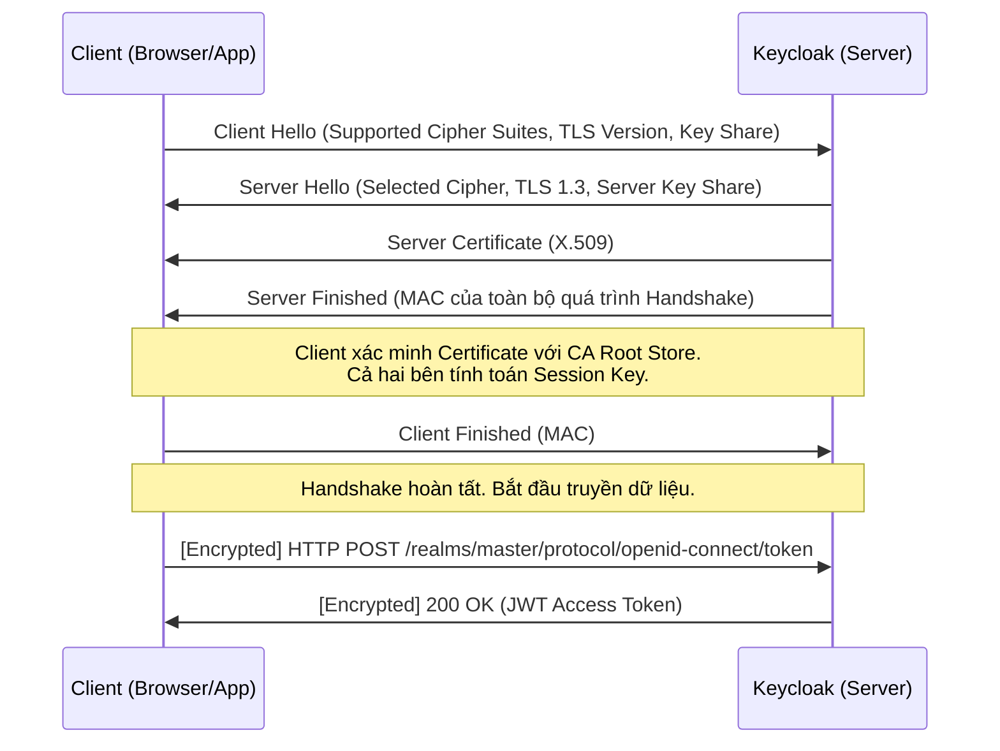

> [!NOTE]
> **Category:** Theory / Security Hardening
> **Goal:** Nắm vững kiến thức chuyên sâu về giao thức TLS, vòng đời của Chứng chỉ số (Certificates), và cách triển khai mã hóa kênh truyền (HTTPS) cho Keycloak nhằm chống lại các rủi ro đánh cắp dữ liệu xác thực.

## 1. Lý thuyết chuyên sâu (Detailed Theory)

Trong bất kỳ hệ thống Quản lý Định danh (Identity Management) nào, dữ liệu được truyền tải luôn là những thông tin tối mật: Tên đăng nhập, Mật khẩu, và các Access Token (JWT). Nếu các luồng dữ liệu này được truyền qua giao thức HTTP không mã hóa (Plaintext), kẻ tấn công có thể dễ dàng sử dụng kỹ thuật "Người đứng giữa" (Man-in-the-Middle - MitM) bằng cách sử dụng các công cụ như Wireshark để chụp gói tin, từ đó chiếm đoạt hoàn toàn tài khoản của người dùng.

**TLS (Transport Layer Security)**, thế hệ kế tiếp của SSL, là giao thức cung cấp tính bảo mật liên lạc qua mạng máy tính. Nó đảm bảo ba yếu tố cốt lõi:
1. **Mã hóa (Encryption):** Ẩn nội dung dữ liệu khỏi những bên thứ ba không có thẩm quyền.
2. **Xác thực (Authentication):** Chứng minh danh tính của máy chủ (Server) đang giao tiếp thông qua một Chứng chỉ số (Certificate) hợp lệ, được cấp bởi Tổ chức phát hành chứng chỉ (Certificate Authority - CA).
3. **Toàn vẹn (Integrity):** Đảm bảo dữ liệu không bị thay đổi hoặc giả mạo trên đường truyền.

Đối với Keycloak, việc triển khai mã hóa bằng TLS là bắt buộc. Ở cấu hình mặc định (Production Mode), Keycloak sẽ từ chối khởi động nếu không được cấu hình HTTPS, trừ khi nó được báo hiệu rằng đang chạy phía sau một Reverse Proxy (TLS Termination Proxy).

## 2. Luồng nội bộ & Cơ chế cấp thấp (Internal Workflow & Low-level Mechanisms)

Quá trình giao tiếp an toàn giữa Client và Keycloak bắt đầu bằng một bước gọi là **TLS Handshake** (Ví dụ dưới đây mô phỏng luồng của TLS 1.3, với thời gian thiết lập được tối ưu hóa chỉ với 1-RTT).



**Giải thích cơ chế cấp thấp:**
- Trong pha `Client Hello`, Client sẽ gửi danh sách các bộ mã hóa (Cipher Suites) mà nó hỗ trợ, ví dụ: `TLS_AES_128_GCM_SHA256`. 
- Keycloak sẽ chọn một bộ mã hóa mạnh nhất mà nó hỗ trợ để phản hồi qua `Server Hello`.
- Keycloak gửi Chứng chỉ (Certificate) chứa khóa công khai (Public Key). Client sẽ kiểm tra xem chứng chỉ này có hợp lệ không (chưa hết hạn, tên miền khớp, và được ký bởi một CA uy tín).
- Sau quá trình trao đổi khóa (Key Exchange) sử dụng thuật toán như ECDHE (Elliptic Curve Diffie-Hellman), cả hai bên cùng tạo ra một "Session Key" dùng để mã hóa đối xứng khối dữ liệu HTTP trao đổi sau đó.

## 3. Thực hành tốt nhất & Bảo mật (Best Practices & Security)

- **End-to-End Encryption vs. Edge Termination:** Trong các hệ thống lớn, TLS thường được kết thúc tại Reverse Proxy (Nginx, AWS ALB) - gọi là Edge Termination, sau đó Proxy sẽ dùng kết nối HTTP thuần nội bộ tới Keycloak. Tuy nhiên, tiêu chuẩn bảo mật Zero Trust khuyên dùng **End-to-End Encryption**, nghĩa là ngay cả kết nối nội bộ giữa Proxy và Keycloak cũng phải được mã hóa bằng TLS.
- **Tắt các giao thức và Cipher Suites yếu:** Chỉ nên cho phép cấu hình TLS 1.2 và TLS 1.3. Bắt buộc vô hiệu hóa các giao thức cũ, có lỗ hổng (như SSLv3, TLS 1.0, TLS 1.1) và các bộ mã hóa yếu (như RC4, DES, hoặc các bộ mã hóa không hỗ trợ Forward Secrecy).
- **Tự động hóa vòng đời Chứng chỉ:** Sử dụng các giao thức như ACME (Let's Encrypt) kết hợp với Certbot hoặc cert-manager (trên Kubernetes) để tự động gia hạn (renew) chứng chỉ trước khi hết hạn (ví dụ, chứng chỉ thường hết hạn sau 90 ngày).

## 4. Cấu hình minh họa thực tế (Configuration Examples)

Keycloak (sử dụng phân phối Quarkus) cung cấp cấu hình TLS rất đơn giản bằng cách cung cấp đường dẫn đến file chứa Chứng chỉ và Khóa riêng (Private Key) ở định dạng PEM.

Lệnh khởi chạy Keycloak với cấu hình HTTPS:

```bash
bin/kc.sh start \
  --https-certificate-file=/path/to/fullchain.pem \
  --https-certificate-key-file=/path/to/privkey.pem \
  --https-port=8443
```

Trong đó:
- `fullchain.pem`: Tệp chứa chứng chỉ của tên miền và các chứng chỉ trung gian (Intermediate Certificates).
- `privkey.pem`: Tệp chứa Khóa riêng (Private Key). Lưu ý tuyệt đối không để lộ file này.

Ngoài ra, nếu Keycloak đóng vai trò là một Client để gọi sang các hệ thống khác qua TLS (Ví dụ: kết nối LDAPS tới Active Directory), bạn cần cấu hình **Truststore** (kho chứa các CA tin cậy):

```bash
bin/kc.sh start \
  --spi-truststore-file-file=/path/to/truststore.jks \
  --spi-truststore-file-password=mytruststorepass
```

## 5. Trường hợp ngoại lệ (Edge Cases)

- **Lỗi `PKIX path building failed`:** Đây là một lỗi rất phổ biến khi Keycloak cố gắng giao tiếp với một máy chủ khác (ví dụ: SMTP Server để gửi email, hoặc Identity Provider bên ngoài) sử dụng chứng chỉ tự ký (Self-signed Certificate) hoặc do một CA nội bộ cấp.
  - **Cách xử lý:** Hệ thống Java/Quarkus bên trong Keycloak không tin tưởng chứng chỉ đó. Bạn phải lấy chứng chỉ công khai của máy chủ đích, và `keytool -import` nó vào cấu hình Truststore của Keycloak.
- **Downtime do quên gia hạn chứng chỉ:** Chứng chỉ hết hạn sẽ khiến toàn bộ các Request từ trình duyệt bị cảnh báo bảo mật chặn lại, đồng thời các giao tiếp API (Server-to-Server) sẽ hoàn toàn sập vì lỗi xác thực TLS.
  - **Cách xử lý:** Thiết lập hệ thống giám sát (Monitoring/Alerting) kiểm tra hạn chứng chỉ và cảnh báo trước 30 ngày.

## 6. Câu hỏi Phỏng vấn (Interview Questions)

1. **(Junior)** TLS có vai trò gì trong việc bảo vệ Keycloak?
   - *Đáp án:* TLS mã hóa luồng dữ liệu truyền tải giữa người dùng và máy chủ, chống lại tấn công đánh cắp dữ liệu (MitM) và bảo vệ các thông tin nhạy cảm như Mật khẩu và Token.

2. **(Junior)** Khi thiết lập môi trường Production, Keycloak báo lỗi và không chịu khởi chạy bằng giao thức HTTP thông thường. Tại sao?
   - *Đáp án:* Khi chạy lệnh `start` (Production Mode), Keycloak yêu cầu phải cấu hình TLS (cung cấp Certificate) theo mặc định (strict mode). Nếu không có chứng chỉ, bạn phải báo cho Keycloak biết rằng nó đang chạy sau proxy bằng cờ `--proxy`.

3. **(Senior)** Phân biệt giữa Keystore và Truststore trong hệ sinh thái Java/Keycloak.
   - *Đáp án:* Keystore dùng để chứa chứng chỉ và khóa riêng (Private Key) để định danh chính máy chủ đó cho các Client kết nối tới (Server Identity). Truststore chứa danh sách các chứng chỉ công khai (CA Certificates) để đánh giá mức độ tin cậy khi chính máy chủ đó đóng vai trò làm Client gọi ra các dịch vụ ngoại vi.

4. **(Senior)** Nếu bạn phải triển khai Zero Trust Architecture (ZTA) với Keycloak, bạn xử lý luồng TLS Termination như thế nào?
   - *Đáp án:* Không terminate TLS hoàn toàn ở biên (Load Balancer/API Gateway). Thay vào đó, sau khi kiểm tra, Reverse Proxy sẽ mở lại một kết nối TLS khác (End-to-End Encryption) tới cổng 8443 của Keycloak, nhằm bảo vệ dữ liệu trên hệ thống mạng nội bộ.

5. **(Senior)** Forward Secrecy (Bảo mật chuyển tiếp) trong bộ mã hóa (Cipher Suite) là gì?
   - *Đáp án:* Là một tính năng đảm bảo rằng nếu Private Key của máy chủ bị lộ trong tương lai, kẻ tấn công cũng không thể giải mã lại các gói tin TLS (Session Keys) đã thu thập được từ quá khứ, vì mỗi phiên giao dịch đều tạo ra các khóa dùng một lần độc lập (như ECDHE).

## 7. Tài liệu tham khảo (References)

- [RFC 8446 - The Transport Layer Security (TLS) Protocol Version 1.3](https://datatracker.ietf.org/doc/html/rfc8446)
- [Keycloak Configuring TLS](https://www.keycloak.org/server/enabletls)
- [OWASP Transport Layer Protection Cheat Sheet](https://cheatsheetseries.owasp.org/cheatsheets/Transport_Layer_Protection_Cheat_Sheet.html)
