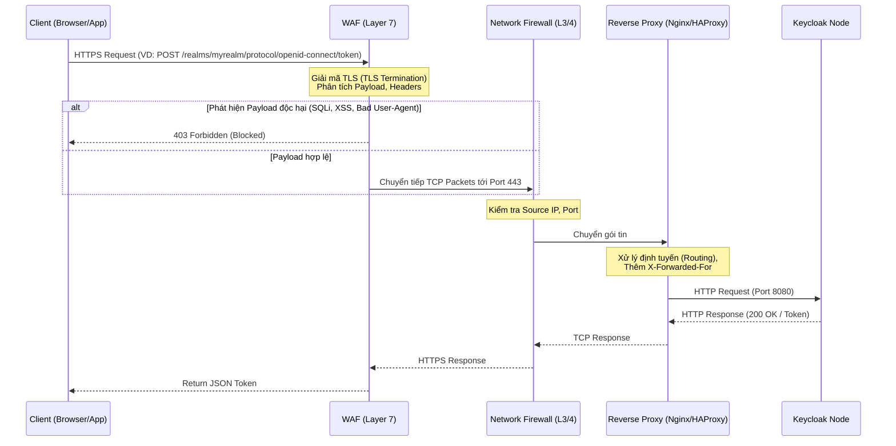

> [!NOTE]
> **Category:** Theory / Architecture
> **Goal:** Cung cấp kiến thức chuyên sâu về việc thiết lập hệ thống Tường lửa (Firewall) và Web Application Firewall (WAF) để bảo vệ lớp mạng và lớp ứng dụng cho Keycloak trước các cuộc tấn công phổ biến.

## 1. Lý thuyết chuyên sâu (Detailed Theory)

Keycloak là hệ thống Quản lý Định danh và Truy cập (Identity and Access Management - IAM) trung tâm. Do đó, nó chứa những thông tin nhạy cảm nhất của toàn bộ hệ thống (danh sách người dùng, mật khẩu đã mã hóa, các phiên đăng nhập, cấu hình hệ thống). Việc bảo vệ Keycloak là nhiệm vụ sống còn. 

Trong kiến trúc mạng doanh nghiệp (Enterprise Network Architecture), việc chỉ dựa vào cơ chế bảo mật nội tại của Keycloak là không đủ. Bạn cần các lớp bảo vệ bên ngoài, bao gồm:

- **Network Firewall (Lớp 3/4 - Network/Transport Layer):** Chịu trách nhiệm lọc gói tin IP và các cổng (Ports). Mục đích cốt lõi là chỉ cho phép các kết nối mạng hợp lệ đến đúng các cổng dịch vụ (thường là 443 cho HTTPS) và từ chối tất cả các truy cập trực tiếp từ Internet vào các cổng nội bộ (như 8080 của Keycloak, 5432 của Database, hoặc các cổng JGroups/Infinispan).
- **Web Application Firewall - WAF (Lớp 7 - Application Layer):** Kiểm tra nội dung của các luồng HTTP/HTTPS. WAF hiểu được cấu trúc của một Request, từ Headers đến Payload. Nó giải quyết bài toán chống lại các cuộc tấn công khai thác lỗ hổng web như SQL Injection (SQLi), Cross-Site Scripting (XSS), cũng như ngăn chặn các hành vi thu thập dữ liệu (Scraping), tấn công từ chối dịch vụ tầng ứng dụng (L7 DDoS), hoặc khai thác lỗ hổng (Zero-day exploits) trong các thư viện (ví dụ: Log4Shell).

## 2. Luồng nội bộ & Cơ chế cấp thấp (Internal Workflow & Low-level Mechanisms)

Quá trình một HTTP Request từ phía Client đi qua hệ thống phòng thủ đến Keycloak được thể hiện qua sơ đồ sau:



**Giải thích cơ chế cấp thấp:**
1. WAF thường đóng vai trò là điểm cuối của mã hóa (TLS Termination Endpoint). Nó phải giải mã gói tin để đọc nội dung HTTP trước khi phân tích. WAF áp dụng các quy tắc (Rulesets) dựa trên biểu thức chính quy (Regex) hoặc thuật toán bất thường (Anomaly Scoring) để đánh giá Request.
2. Nếu Request vượt qua WAF, Firewall mạng truyền thống (iptables, AWS Security Groups, v.v.) sẽ đảm bảo rằng máy chủ chứa Reverse Proxy/Keycloak chỉ nhận kết nối từ các IP hợp lệ (IP của WAF hoặc dải IP Load Balancer).
3. Reverse Proxy đính kèm các Header chuẩn (như `X-Forwarded-For`, `X-Forwarded-Proto`) để Keycloak biết được IP thực của Client, phục vụ cho việc ghi log và kích hoạt các cơ chế bảo vệ nội bộ (Brute-force protection).

## 3. Thực hành tốt nhất & Bảo mật (Best Practices & Security)

- **Ẩn Admin Console khỏi Public Internet:** Đường dẫn `/admin` và `/auth/admin` không bao giờ được phép mở ra Internet. WAF hoặc Reverse Proxy phải được cấu hình để chặn tất cả các Request đến đường dẫn này nếu IP nguồn không thuộc mạng nội bộ (VPN, Bastion Host, hoặc các IP văn phòng cố định).
> [!IMPORTANT]  
> Việc để lộ Admin Console là rủi ro cực kỳ cao. Kẻ tấn công có thể liên tục thử dò mật khẩu tài khoản quản trị (Brute-force) hoặc khai thác các lỗi Zero-day trên giao diện quản trị.

- **Giới hạn tốc độ (Rate Limiting) ở WAF:** Đặt Rate Limit chặt chẽ trên các endpoint nhạy cảm như `/protocol/openid-connect/token` (đăng nhập) và `/protocol/openid-connect/registrations` (đăng ký) để chống lại các cuộc tấn công từ chối dịch vụ (DDoS) và nhồi nhét thông tin xác thực (Credential Stuffing).
- **Chặn các công cụ quét (Block Scanners):** Sử dụng danh sách đen (Blacklist) trong WAF để chặn các `User-Agent` độc hại hoặc các công cụ quét tự động như Nmap, Zgrab, Nuclei, v.v.

## 4. Cấu hình minh họa thực tế (Configuration Examples)

Dưới đây là một ví dụ minh họa cấu hình Nginx làm Reverse Proxy kết hợp với cấu hình chặn đường dẫn `/admin` nếu không đến từ một dải IP đáng tin cậy.

```nginx
server {
    listen 443 ssl;
    server_name sso.company.com;

    ssl_certificate /etc/letsencrypt/live/sso.company.com/fullchain.pem;
    ssl_certificate_key /etc/letsencrypt/live/sso.company.com/privkey.pem;

    # Cấu hình chuyển tiếp (Forwarding)
    location / {
        proxy_pass http://keycloak_upstream;
        proxy_set_header Host $host;
        proxy_set_header X-Real-IP $remote_addr;
        proxy_set_header X-Forwarded-For $proxy_add_x_forwarded_for;
        proxy_set_header X-Forwarded-Proto $scheme;
    }

    # Chặn truy cập Admin Console từ bên ngoài
    location /admin/ {
        # Chỉ cho phép IP mạng nội bộ hoặc VPN
        allow 192.168.1.0/24;
        allow 10.0.0.0/8;
        # Từ chối mọi IP khác
        deny all;
        
        proxy_pass http://keycloak_upstream;
        proxy_set_header Host $host;
        proxy_set_header X-Real-IP $remote_addr;
        proxy_set_header X-Forwarded-For $proxy_add_x_forwarded_for;
        proxy_set_header X-Forwarded-Proto $scheme;
    }
}
```

## 5. Trường hợp ngoại lệ (Edge Cases)

- **Cảnh báo giả (False Positives) ở WAF:** Các mã thông báo (Tokens) OIDC như JWT có thể chứa độ dài payload rất lớn (đặc biệt khi có nhiều roles, claims) hoặc chứa các ký tự đặc biệt có thể kích hoạt nhầm luật (Rule) "SQL Injection" hoặc "XSS" của WAF.
  - **Cách khắc phục:** Cần phân tích kỹ WAF logs, điều chỉnh (tuning) lại các quy tắc (Rules) cho riêng đường dẫn `/realms/*/protocol/openid-connect/*` để bỏ qua kiểm tra một số pattern cụ thể (nhưng vẫn phải giữ mức bảo mật cơ bản).
- **Lừa gạt IP (IP Spoofing) thông qua X-Forwarded-For:** Nếu hệ thống của bạn tin tưởng một cách mù quáng vào `X-Forwarded-For` do Client gửi lên, kẻ tấn công có thể giả mạo header này để vượt qua lớp bảo vệ IP ban đầu.
  - **Cách khắc phục:** Hãy cấu hình Reverse Proxy chỉ chấp nhận `X-Forwarded-For` từ một số proxy hạ tầng (trusted proxies) nhất định và loại bỏ các header do Client tự định nghĩa.

## 6. Câu hỏi Phỏng vấn (Interview Questions)

1. **(Junior)** Chức năng chính của WAF khác với Network Firewall ở điểm nào khi bảo vệ Keycloak?
   - *Đáp án:* Network Firewall chặn/cho phép kết nối dựa trên IP và Port (Layer 3/4). WAF bảo vệ ở Layer 7 (HTTP/HTTPS), phân tích nội dung để chống lại các lỗ hổng web (SQLi, XSS, quét lỗ hổng).

2. **(Junior)** Làm thế nào để chặn người dùng truy cập Admin Console của Keycloak từ mạng Internet?
   - *Đáp án:* Có thể cấu hình rules trên WAF hoặc Reverse Proxy/API Gateway (ví dụ Nginx) để chặn (trả về 403 Forbidden) mọi Request hướng tới URI `/admin/` hoặc `/auth/admin/` nếu IP nguồn không nằm trong danh sách IP tin cậy.

3. **(Senior)** Tại sao Rate Limiting tại WAF lại hiệu quả hơn so với cơ chế bảo vệ Brute Force mặc định trong Keycloak?
   - *Đáp án:* WAF xử lý Request ngay tại biên mạng (Edge), giúp chặn lưu lượng xấu trước khi nó tiêu tốn tài nguyên (CPU, RAM, Database) của Keycloak. Keycloak xử lý Brute Force ở Layer ứng dụng, tiêu tốn nhiều tài nguyên hơn cho mỗi Request thất bại.

4. **(Senior)** Keycloak nhận sai địa chỉ IP thực của người dùng sau khi đi qua WAF và Load Balancer, dẫn đến cơ chế bảo mật (như Brute Force) hoạt động sai. Nguyên nhân và cách khắc phục?
   - *Đáp án:* Do thiếu cấu hình chuyển tiếp IP. Cần đảm bảo WAF/LB gửi header `X-Forwarded-For` chứa IP gốc, đồng thời Keycloak phải được cấu hình bật chế độ proxy (`PROXY_ADDRESS_FORWARDING=true` trên Quarkus: `proxy-headers=x-forwarded`) để nhận diện header đó.

5. **(Senior)** JWT Token do Keycloak phát hành thỉnh thoảng bị WAF từ chối chặn lại. Theo bạn, nguyên nhân do đâu và bạn sẽ xử lý như thế nào?
   - *Đáp án:* Do False Positive. Payload JWT đôi khi chứa các chuỗi Base64 dài có thể trùng với mẫu tấn công (signature/regex) của WAF. Giải pháp là phân tích WAF Logs, xác định Rule ID gây lỗi, và tạo Exceptions/Whitelisting cho đường dẫn phát hành hoặc xác thực Token trên WAF đó.

## 7. Tài liệu tham khảo (References)

- [OWASP Web Application Firewall](https://owasp.org/www-community/Web_Application_Firewall)
- [Keycloak Configuring the Reverse Proxy](https://www.keycloak.org/server/reverseproxy)
- [Nginx Access Restriction Module](https://nginx.org/en/docs/http/ngx_http_access_module.html)
