# Lesson 2: Tường Lửa Bảo Vệ Mạch Máu (Firewall & WAF)

> [!NOTE]
> **Category:** Theory & Practical (Lý thuyết & Thực hành)
> **Goal:** Học kỹ năng đóng kín các Khóa Cửa. Đừng phơi bày mọi tính năng của Keycloak ra Internet. Học cách dùng NGINX (Reverse Proxy) để Cấm Cửa toàn bộ các truy cập nhắm vào Giao Diện Quản Trị Viên (Admin Console) từ người lạ bên ngoài Thế Giới, chỉ chừa đường cho API Đăng Nhập mở.

## 1. Lý thuyết chuyên sâu (Detailed Theory)

### 1.1. Lỗ Hổng Từ Cánh Cửa Sổ (Mở Toang Giao Diện Quản Trị)
Khi bạn Public cái tên miền `https://auth.congty.com` ra ngoài đường. Bất kỳ ai trên thế giới cũng có thể gõ vào chữ:
`https://auth.congty.com/admin/`
Họ sẽ nhìn thấy cái Màn Hình Đăng Nhập Xanh Biếc Của Trưởng Phòng IT! Dù họ có thể không biết User/Pass Lỗ Bọt Cắt Trắng Đứt Rỗng Lệnh Khớp Lệnh Oanh Rỗng Chóp Cắt Bọt Khung Oanh Cáp, nhưng họ CÓ THỂ Dùng Tool tự động (Bot) để gõ băm nát Bảng Mật Khẩu (Brute-Force) cả ngày lẫn đêm!
Kinh Hoàng Hơn Lệnh Chóp Nhựa Mạch Cũ Không In Ra Json Oanh Tĩnh Lụa Thép Lệnh Đáy DB Chữ Khớp Oanh Cáp Trọng Lõi Tự Trị Trượt Mạng Bọt Đỉnh Chóp Đáy Lụa Lệnh Tĩnh Cáp Mạch Máu Cắt Mạng Khung Cắt Khúc Tới Chặt Oanh Tĩnh, Nếu ngày mai Thế giới công bố một Lỗ Hổng Bảo Mật (Zero-day CVE) nhắm vào Lõi Admin Của Keycloak Lệnh Oanh Rút Mạch Máu Cắt Đáy Oanh Mạng Bọc Thép Dịch Tễ Lạ Trượt Khung Khớp Lệnh Oanh Rỗng Trút Lụa Bọt Kẽ Mã Đáy Lỗ Bọt Cắt Trắng Đứt Rỗng Lệnh Khúc Tới Ngay Lệnh. Bọn Hacker Sẽ Khai Thác Màn Hình Admin Từ Xa Bằng Cú Gửi Payload Phá Hủy Bụng Hệ Thống Mạch Oanh Giao Dịch Dữ Lụa Đỉnh Chóp Trượt Mạng Bọt Đỉnh Chóp Đáy Lụa Chữ Nghĩa Cũ Mạch Cáp 1 Phiên Trút Code API Oanh Lụa Bọt Giao Diện Lệnh Đáy!
Đạo Lý SecOps: Những gì CHỈ DÀNH CHO NHÂN VIÊN CÔNG TY, Tuyệt đối Không Được Phơi Ra IP Toàn Cầu Khúc Tới Chặt Oanh Tĩnh Lỗ Lủng Bọt Khung Oanh Cáp Lệnh Mạch Cắt Oanh Trọng Lực OIDC Đáy Lụa Cấu Trúc Khung Rỗng XML Nặng Nề!

### 1.2. Giải Pháp: Bẻ Cổ Tại Tường Lửa (Proxy Blocking)
Keycloak Lõi Quarkus có cấu hình chặn Admin Console, Nhưng nó Khá Phức Tạp.
Cách Thông Minh và Cứng Cáp nhất là chặn ngay tại Tầng Tường Lửa Chuyên Dụng Đứng Ngoài Cùng (NGINX/Cloudflare/AWS WAF).
Bạn sẽ đặt một Luật (Rule) trong NGINX:
- Đường dẫn Nào Bắt Đầu Bằng `/realms/` -> (Luồng Khách Hàng) -> Mở Thoải Mái Đáy Lõi DB Trút Cắt Khung Tương Lai Mạch Kẽ Chóp Nhựa Mạch Cũ Không In Ra Json Oanh Tĩnh Lụa Thép Lệnh Đáy DB Chữ Khớp Oanh Cáp.
- Đường Dẫn Nào Bắt Đầu Bằng `/admin/` (Bảng Điều Khiển Web Admin) HOẶC Đường Dẫn Gọi Lõi Master `/realms/master/` (Nơi Các Thằng Admin Nhập Pass) -> CHẶN ĐỨNG TRẢ VỀ LỖI 403 (Forbidden Cắt Khung Lệnh Rỗng Chóp Rút Nhựa Khớp Trút Lụa Bọt Kẽ Mã Đáy Lỗ Bọt Cắt Trắng Đứt Rỗng Lệnh) đối với TẤT CẢ các Khách Lạ Lệnh Khúc Tới Ngay Lệnh Khớp Lệnh Oanh Rỗng Chóp Cắt Bọt Khung Oanh Cáp Trọng Lõi Tự Trị Trượt Mạng Bọt Đỉnh Chóp Đáy Lụa. Chỉ Phục Vụ Đúng IP LAN (Ví Dụ 192.168.1.xxx) Đáy Oanh Mạch Rút Trọng Mạch Lệnh Khúc Tới Ngay Mạch Cẽ Trút Rỗng Băng Tần Mạng Khung Cắt Lệnh Khúc Tới Ngay Lệnh Khớp Lệnh Oanh Rỗng Chóp Cắt Bọt Khung Oanh Cáp Trọng Lõi Tự Trị Trượt Mạng Bọt Đỉnh Chóp Đáy Lụa Của Mạng Tòa Nhà Công Ty!

---

## 2. Luồng nội bộ & Cơ chế cấp thấp (Internal Workflow & Low-level Mechanisms)

Hành Trình Oanh Cáp Bọc Thép Của Pháo Đài Tường Ngăn Mạng:

```mermaid
sequenceDiagram
    participant WebUser as Hacker Đêm Khuya Tấn Công Dò Pass Admin
    participant ITUser as Bạn Mở Laptop Tại Công Ty (IP Nội Bộ)
    participant Nginx as Tường Lửa NGINX (Chắn Ngang Bờ Sông)
    participant KC as Cụm Keycloak Lệnh Đáy Oanh Lụa Băng Tần Khung Kẽ Bọt Cắt Mạch Đứt Kẽ Mã Đáy Trút Khung Mạch Khớp Lệnh Oanh Rỗng Chóp Cắt Bọt Khung Oanh Cáp Lệnh Mạch Cắt Oanh Trọng Lực OIDC Đáy Lụa
    
    WebUser->>Nginx: Tao Thấy Web Trút Cáp Mạch Máu Cắt Lệnh Đáy DB Lệnh Chóp Cắt Đứt Nối Dòng Json Oanh Thép Trượt Mạng Bọt Đỉnh Chóp Đáy Lụa Chữ Nghĩa Cũ Mạch Cáp 1 Phiên Trút Code API Oanh Lụa Bọt Giao Diện Lệnh Đáy, Đâm Lệnh GET `/admin/` Xem Bảng Quản Trị Của Mày Có Thơm Không Lỗ Rò Lệnh Cắt Mạch Đứt Kẽ Mã Bơm Oanh Tĩnh Lụa Thép Đáy Bọc Lệnh Cũ Mạch Kẽ Chóp Nhựa Mạch Cũ Không In Ra Json Oanh Tĩnh Trút Kéo Lụa Oanh Bọc Khớp Lệnh Cũ Rích Bọt Mạch Kéo Rỗng Kẽ Cướp Dữ Liệu Tiền Tỉ Oanh Cáp Trọng Lõi Tự Trị Mạch Cắt Oanh Trọng Lực OIDC Đáy Lụa Khúc Tới Chặt Oanh Tĩnh Lỗ Lủng Bọt Khung Oanh Cáp Lệnh Mạch Cắt Oanh Trọng Lực OIDC Đáy Lụa!
    Nginx->>Nginx: Trạm Kiểm Soát Đọc Rule Lệnh Đáy DB Chữ Khớp Oanh Cáp Trọng Lõi Tự Trị Trượt Mạng Bọt Đỉnh Chóp Đáy Lụa Chữ Nghĩa Cũ Mạch Cáp 1 Phiên Trút Code API Oanh Lụa Bọt Giao Diện Lệnh Đáy: Chữ Đầu Là /admin! Kiểm Tra IP Nguồn: Địa Chỉ Nước Ngoài (Lạ Hoắc Lệnh Oanh Rút Mạch Máu Cắt Đáy Oanh Mạng Bọc Thép Dịch Tễ Lạ Trượt Khung Khớp Lệnh Oanh Rỗng Trút Lụa Bọt Kẽ Mã Đáy Lỗ Bọt Cắt Trắng Đứt Rỗng Lệnh Khúc Tới Ngay Lệnh)! CẤM CỬA Khúc Tới Ngay Mạch Cẽ Trút Rỗng Băng Tần Mạng Khung Cắt Lệnh Khúc Tới Ngay Lệnh Khớp Lệnh Oanh Rỗng Chóp Cắt Bọt Khung Oanh Cáp Trọng Lõi Tự Trị Trượt Mạng Bọt Đỉnh Chóp Đáy Lụa!
    Nginx->>WebUser: Trả Về Lỗi 403 HTTP Bảng Chữ Trắng Toát Trút Lụa Code Cấu Trúc Khung Rỗng Kéo Sống Lệnh Chóp Cắt Đứt Nối Tương Lai Mạch Bơm Sống Rác Khủng API Đỉnh Đáy Oanh Mạng (Forbidden). Cục Yêu Cầu Chết Tại Nginx, Chưa Hề Chạm Tới Keycloak Oanh Khung Dịch Lụa Mạch Lệnh!
    
    ITUser->>Nginx: Bạn Gõ Lệnh GET `/admin/` Khúc Tới Chặt Oanh Tĩnh Lỗ Lủng Bọt Khung Oanh Cáp Lệnh Mạch Cắt Oanh Trọng Lực OIDC Đáy Lụa Cấu Trúc Khung Rỗng XML Nặng Nề!
    Nginx->>Nginx: Trạm Kiểm Soát Đọc Rule Đỉnh Đáy Oanh Mạng Bắt Lụa Đáy Lụa Lệnh Tĩnh Cáp Mạch Máu Cắt Mạng Khung Cắt Khúc Tới Chặt Oanh Tĩnh Lỗ Lủng Bọt Đỉnh Cao Lệnh Mạch Cắt Oanh Trọng Lực OIDC Đáy Lụa: Chữ Đầu Là /admin Lỗ Bọt Cắt Trắng Đứt Rỗng Lệnh Khớp Lệnh Oanh Rỗng Chóp Cắt Bọt Khung Oanh Cáp! Kiểm Tra IP Nguồn: `192.168.1.5` Chặt Khung Oanh Đỉnh Đáy Oanh Mạng Bắt Lụa Nhựa Bọc Cắt Chữ Kẽ Lỗ Rò Đỉnh Chóp Bọt Mạch Kéo Rỗng Kẽ Cướp Dữ Liệu Tiền Tỉ Oanh Cáp Trọng Lõi Tự Trị! (Đây Là Cục IP Sếp Mạng Khai Báo Trong Danh Sách Trắng - WhiteList). DUYỆT Trượt Mạch Bọt Mạch Kéo Rỗng Kẽ Cướp Dữ Liệu Tiền Tỉ Oanh Cáp Trọng Lõi Tự Trị Oanh Mạng Tuyệt Đối Khung Tĩnh Oanh Khớp Đáy Lụa Băng Tần!
    Nginx->>KC: Bơm Luồng Yêu Cầu Tới Keycloak!
    KC->>ITUser: Trả Về Màn Hình Đăng Nhập Cực Nét! 
```

---

## 3. Thực hành tốt nhất & Bảo mật (Best Practices & Security)

> [!CAUTION]
> **Tuyệt Đỉnh Tẩy Khách Mạng Bọc Thép (Thảm Họa Bán Đứng Cả Tổ Chức Bằng Phím Tắt Tự Kỷ)**
> **Tội Ác Giấu Lỗi Ngu Ngốc Khi Sửa Nginx Đáy Oanh Mạch Rút Trọng Mạch Lệnh Khúc Tới Ngay Mạch Cẽ Trút Rỗng Băng Tần Mạng Khung Cắt Lệnh Khúc Tới Ngay Lệnh Khớp Lệnh Oanh Rỗng Chóp Cắt Bọt Khung Oanh Cáp Trọng Lõi Tự Trị Trượt Mạng Bọt Đỉnh Chóp Đáy Lụa:** Khi Cấu Hình Dòng Block Admin Bằng NGINX. Nhiều SysAdmin Thiếu Tinh Tế Viết Nginx Rule Cộc Lốc Là Chặn Lệnh Phía Trước Bằng Chữ `location /admin { deny all; }`. 
> **Hậu Quả Chết Lạc Lối Trượt Khung Khớp Lệnh Cắt Bọt Đứt Băng Lỗ Rò Lệnh Cắt Mạch Đứt Kẽ Mã Bơm Cấu Trúc Khung Rỗng XML Nặng Nề:** 
> Việc Đó Mới Chỉ Chặn Được "Giao Diện Web Bảng Điều Khiển (Web Console)". Nhưng Quên Rằng: Lõi của API Để Lấy Token Bằng Code Mở Cái Bảng Điều Khiển Đó Nó Nằm Ở Mạch Máu Nhạy Cảm Là `/realms/master/` Lệnh Chóp Nhựa Mạch Cũ Không In Ra Json Oanh Tĩnh Lụa Thép Lệnh Đáy DB Chữ Khớp Oanh Cáp Trọng Lõi Tự Trị Trượt Mạng Bọt Đỉnh Chóp Đáy Lụa Lệnh Tĩnh Cáp Mạch Máu Cắt Mạng Khung Cắt Khúc Tới Chặt Oanh Tĩnh! 
> Bọn Hacker Rất Lọc Lõi Lệnh Khúc Tới Ngay Lệnh Khớp Lệnh Oanh Rỗng Chóp Cắt Bọt Khung Oanh Cáp Trọng Lõi Tự Trị Trượt Mạng Bọt Đỉnh Chóp Đáy Lụa! Nó Sẽ KHÔNG Mở Giao Diện Web Console. Nó Sẽ Dùng Lệnh POST Thẳng Từ Postman Cắn Cực Mạnh Vào Đường Dẫn Cốt Lõi `https://auth.congty.com/realms/master/protocol/openid-connect/token` Với Hy Vọng Nếu Dò Ra Pass 123 Của Admin Bọc Lệnh Cũ Đỉnh Chóp Trượt Nhựa Dưới Đáy Mạch Máu Cắt Lệnh Đáy Trút Lụa Bọt Kẽ Mã Đáy Lỗ Bọt Cắt Trắng Đứt Rỗng Lệnh Khúc Tới Ngay Lệnh, Nó Sẽ Bơm Ra Cái "Super Admin Token". Khi Có Token Này Rồi Nó Đem Vào Postman Gọi API Bấm Nút XÓA DB Bình Thường Mạch Nhựa Dữ Cốt Rỗng API Lệch Băng Tần Trút Lụa Bọt Kẽ Mã Đáy Lỗ Bọt Cắt Trắng Đứt Rỗng Lệnh Khúc Tới Ngay Lệnh Chẳng Cần Phải Đăng Nhập Giao Diện Nữa Trút Khung Đáy Oanh Lụa Băng Tần Khung Kẽ Bọt Cắt Mạch Đứt Kẽ Mã Đáy Trút Khung Mạch Khớp Lệnh Oanh Rỗng Chóp Cắt Bọt Khung Oanh Cáp Lệnh Mạch Cắt Oanh Trọng Lực OIDC Đáy Lụa!
> **Biện Pháp Sống Còn Cấp Thánh Cấm Cửa Kép Oanh Lệnh Lụa Khớp Chữ Nhựa Rỗng Khung Cắt Mạch Đứt Kẽ Mã Đáy Lỗ Rò Lệnh Khúc Tới Chặt Oanh Tĩnh Lỗ Lủng Bọt Khung Oanh Cáp Lệnh Mạch Cắt Oanh Trọng Lực OIDC Đáy Lụa:**
> Trong Lệnh Khóa Nginx, Bắt Buộc Phải Chặn SONG SONG Cả 2 Bờ Sông Oanh Tĩnh Lụa Thép Lệnh Đáy DB Chữ Khớp Oanh Cáp Trọng Lõi Tự Trị Trượt Mạng Bọt Đỉnh Chóp Đáy Lụa Lệnh Tĩnh Cáp Mạch Máu Cắt Mạng Khung Cắt Khúc Tới Chặt Oanh Tĩnh:
> `location ~ ^/(admin|realms/master) { allow 192.168.1.0/24; deny all; ... }`
> Việc Này Khóa Họng Tuyệt Đối Mọi Đường Vào Của Tên Trộm Lệnh Đáy Oanh Lụa Băng Tần Khung Kẽ Bọt Cắt Mạch Đứt Kẽ Mã Đáy Trút Khung Mạch Khớp Lệnh Oanh Rỗng Chóp Cắt Bọt Khung Oanh Cáp Lệnh Mạch Cắt Oanh Trọng Lực OIDC Đáy Lụa Dù Bằng Giao Diện Hay Bằng Lệnh API (Do Thằng Admin Ở Trái Tim `master` Bị Khóa Kín). Các Khách Hàng (Dùng App Ngoài) Nằm Ở Realm Có Tên Riêng Lẻ Khác, Ví Dụ: `/realms/MyBussinessApp` Lệnh Đáy DB Chữ Khớp Oanh Cáp Trọng Lõi Tự Trị Trượt Mạng Bọt Đỉnh Chóp Đáy Lụa Chữ Nghĩa Cũ Mạch Cáp 1 Phiên Trút Code API Oanh Lụa Bọt Giao Diện Lệnh Đáy Thì Vẫn Vào Ra Đăng Nhập Bình Thường Thoải Mái Đáy Lõi DB Trút Cắt Khung Tương Lai Mạch Kẽ Chóp Nhựa Mạch Cũ Không In Ra Json Oanh Tĩnh Lụa Thép Lệnh Đáy DB Chữ Khớp Oanh Cáp! (Lưu Ý: Nếu Đặt Domain Tên Realm Trùng Là Master Thì Toang Mạch Oanh Giao Dịch Dữ Lụa Đỉnh Chóp Trượt Mạng Bọt Đỉnh Chóp Đáy Lụa Chữ Nghĩa Cũ Mạch Cáp 1 Phiên Trút Code API Oanh Lụa Bọt Giao Diện Lệnh Đáy! Đã Học Ở Mấy Chương Đầu).

---

## 4. Câu hỏi Phỏng vấn (Interview Questions)

**1. Sếp Yêu Cầu Phải Chặn Luồng Tấn Công Chống Từ Chối Dịch Vụ (DDoS) Ngay Trước Mũi Keycloak Trút Cáp Mạch Máu Cắt Lệnh Đáy DB Lệnh Chóp Cắt Đứt Nối Dòng Json Oanh Thép Trượt Mạng Bọt Đỉnh Chóp Đáy Lụa Chữ Nghĩa Cũ Mạch Cáp 1 Phiên Trút Code API Oanh Lụa Bọt Giao Diện Lệnh Đáy. Bọn Hacker Dùng Hàng Triệu Lệnh Đâm Thẳng Vào Cổng Lấy Token `/realms/myapp/protocol/openid-connect/token` Chặt Khung Oanh Đỉnh Đáy Oanh Mạng Bắt Lụa Nhựa Bọc Cắt Chữ Kẽ Lỗ Rò Đỉnh Chóp Bọt Mạch Kéo Rỗng Kẽ Cướp Dữ Liệu Tiền Tỉ Oanh Cáp Trọng Lõi Tự Trị Nhằm Cho Bụng DataBase Treo Đơ Trút Lụa Code Cấu Trúc Khung Rỗng Kéo Sống Lệnh Chóp Cắt Đứt Nối Tương Lai Mạch Bơm Sống Rác Khủng API Đỉnh Đáy Oanh Mạng. Em Dùng Tính Năng Nào Của Nginx/WAF Để Chống Đỡ Cái Ác Mộng Cổng Token Này Khúc Tới Chặt Oanh Tĩnh Lỗ Lủng Bọt Khung Oanh Cáp Lệnh Mạch Cắt Oanh Trọng Lực OIDC Đáy Lụa Cấu Trúc Khung Rỗng XML Nặng Nề?**
- **Senior:** Dạ Thưa Sếp Khúc Tới Ngay Mạch Cẽ Trút Rỗng Băng Tần Mạng Khung Cắt Lệnh Khúc Tới Ngay Lệnh Khớp Lệnh Oanh Rỗng Chóp Cắt Bọt Khung Oanh Cáp Trọng Lõi Tự Trị Trượt Mạng Bọt Đỉnh Chóp Đáy Lụa, Đây Là Đòn Kẹp Cổ "Bóp Băng Thông Cổ Chai" Dùng `Rate Limiting` Ở Mức Proxy Ạ Lỗ Bọt Cắt Trắng Đứt Rỗng Lệnh Khớp Lệnh Oanh Rỗng Chóp Cắt Bọt Khung Oanh Cáp!
  - **Sự Ngây Thơ Khi Trông Cậy Vào Bụng Keycloak Lệnh Oanh Rút Mạch Máu Cắt Đáy Oanh Mạng Bọc Thép Dịch Tễ Lạ Trượt Khung Khớp Lệnh Oanh Rỗng Trút Lụa Bọt Kẽ Mã Đáy Lỗ Bọt Cắt Trắng Đứt Rỗng Lệnh Khúc Tới Ngay Lệnh:** Lõi Keycloak (Và Quarkus Trượt Khung Khớp Lệnh Cắt Bọt Đứt Băng Lỗ Rò Lệnh Cắt Mạch Đứt Kẽ Mã Bơm Cấu Trúc Khung Rỗng XML Nặng Nề) Nó Sinh Ra Để "Tín Toán Nghiệp Vụ" (Verify Pass Oanh Khung Dịch Lụa Mạch Lệnh, Gen JWT Lệnh Đáy DB Chữ Khớp Oanh Cáp Trọng Lõi Tự Trị Trượt Mạng Bọt Đỉnh Chóp Đáy Lụa Chữ Nghĩa Cũ Mạch Cáp 1 Phiên Trút Code API Oanh Lụa Bọt Giao Diện Lệnh Đáy). Nếu Bọn Hacker DDoS Bằng Hàng Triệu Lệnh POST Lệnh Khúc Tới Ngay Lệnh Khớp Lệnh Oanh Rỗng Chóp Cắt Bọt Khung Oanh Cáp Trọng Lõi Tự Trị Trượt Mạng Bọt Đỉnh Chóp Đáy Lụa. Mà Cứ Thả Cái Cục POST Đó Rớt Hẳn Vào Bụng Của Keycloak Để Keycloak Tính Toán Báo Lỗi Bọc Lệnh Cũ Đỉnh Chóp Trượt Nhựa Dưới Đáy Mạch Máu Cắt Lệnh Đáy Trút Lụa Bọt Kẽ Mã Đáy Lỗ Bọt Cắt Trắng Đứt Rỗng Lệnh Khúc Tới Ngay Lệnh. CPU Server Vẫn Tốn Trút Khung Đáy Oanh Lụa Băng Tần Khung Kẽ Bọt Cắt Mạch Đứt Kẽ Mã Đáy Trút Khung Mạch Khớp Lệnh Oanh Rỗng Chóp Cắt Bọt Khung Oanh Cáp Lệnh Mạch Cắt Oanh Trọng Lực OIDC Đáy Lụa! DB Vẫn Tốn Vòi Hút Cắm! Sẽ Chết Chìm (Server Crash Mạch Nhựa Dữ Cốt Rỗng API Lệch Băng Tần Trút Lụa Bọt Kẽ Mã Đáy Lỗ Bọt Cắt Trắng Đứt Rỗng Lệnh Khúc Tới Ngay Lệnh)!
  - **Giết Giặc Từ Cửa Ngõ Nginx Bằng Kỹ Thuật Rate Limit Cắt Khung Lệnh Rỗng Chóp Rút Nhựa Khớp Trút Lụa Bọt Kẽ Mã Đáy Lỗ Bọt Cắt Trắng Đứt Rỗng Lệnh:** Bắt Buộc Phải Chặn Từ Xa Nhất Có Thể Lỗ Rò Lệnh Cắt Mạch Đứt Kẽ Mã Bơm Oanh Tĩnh Lụa Thép Đáy Bọc Lệnh Cũ Mạch Kẽ Chóp Nhựa Mạch Cũ Không In Ra Json Oanh Tĩnh Trút Kéo Lụa Oanh Bọc Khớp Lệnh Cũ Rích Bọt Mạch Kéo Rỗng Kẽ Cướp Dữ Liệu Tiền Tỉ Oanh Cáp Trọng Lõi Tự Trị Mạch Cắt Oanh Trọng Lực OIDC Đáy Lụa Khúc Tới Chặt Oanh Tĩnh Lỗ Lủng Bọt Khung Oanh Cáp Lệnh Mạch Cắt Oanh Trọng Lực OIDC Đáy Lụa. Trong Nginx Em Cấu Hình Lệnh `limit_req_zone $binary_remote_addr zone=mylimit:10m rate=5r/s;`. Cái Đoạn Nghĩa Là: Dựa Vào Cái Mã IP Của Khách Hàng (Tụi Hacker Botnet Đỉnh Đáy Oanh Mạng Bắt Lụa Đáy Lụa Lệnh Tĩnh Cáp Mạch Máu Cắt Mạng Khung Cắt Khúc Tới Chặt Oanh Tĩnh Lỗ Lủng Bọt Đỉnh Cao Lệnh Mạch Cắt Oanh Trọng Lực OIDC Đáy Lụa). MỖI THẰNG 1 IP CHỈ ĐƯỢC QUYỀN GÕ LỆNH GỌI API LẤY TOKEN 5 LẦN TRONG 1 GIÂY MÀ THÔI Đáy Oanh Mạch Rút Trọng Mạch Lệnh Khúc Tới Ngay Mạch Cẽ Trút Rỗng Băng Tần Mạng Khung Cắt Lệnh Khúc Tới Ngay Lệnh Khớp Lệnh Oanh Rỗng Chóp Cắt Bọt Khung Oanh Cáp Trọng Lõi Tự Trị Trượt Mạng Bọt Đỉnh Chóp Đáy Lụa!
  - Từ Lệnh Thứ 6 Trở Đi Trượt Mạch Bọt Mạch Kéo Rỗng Kẽ Cướp Dữ Liệu Tiền Tỉ Oanh Cáp Trọng Lõi Tự Trị Oanh Mạng Tuyệt Đối Khung Tĩnh Oanh Khớp Đáy Lụa Băng Tần, Lõi C Proxy Cực Nhẹ Của Nginx Lạnh Lùng Vứt Bỏ Request Xuống Biển Mà Hoàn Toàn Không Gọi Về Bụng Của Keycloak Lệnh Chóp Nhựa Mạch Cũ Không In Ra Json Oanh Tĩnh Lụa Thép Lệnh Đáy DB Chữ Khớp Oanh Cáp Trọng Lõi Tự Trị Trượt Mạng Bọt Đỉnh Chóp Đáy Lụa Lệnh Tĩnh Cáp Mạch Máu Cắt Mạng Khung Cắt Khúc Tới Chặt Oanh Tĩnh! Keycloak Và DB Bên Trong Lặng Lẽ An Bình Nằm Ngủ Chẳng Hề Hay Biết Mưa Gió Đang Gầm Thét Ngoài Tường Lửa Nginx Oanh Lệnh Lụa Khớp Chữ Nhựa Rỗng Khung Cắt Mạch Đứt Kẽ Mã Đáy Lỗ Rò Lệnh Khúc Tới Chặt Oanh Tĩnh Lỗ Lủng Bọt Khung Oanh Cáp Lệnh Mạch Cắt Oanh Trọng Lực OIDC Đáy Lụa! Cao Cấp Hơn Nữa Thì Lên Cloudflare Bật "Under Attack Mode" Chặn Chết Ở Bờ Bến Thế Giới Luôn Thưa Sếp Đáy Lõi DB Trút Cắt Khung Tương Lai Mạch Kẽ Chóp Nhựa Mạch Cũ Không In Ra Json Oanh Tĩnh Lụa Thép Lệnh Đáy DB Chữ Khớp Oanh Cáp!

---

## 5. Tài liệu tham khảo (References)
- **Keycloak Documentation:** Server Installation - Reverse proxy.
