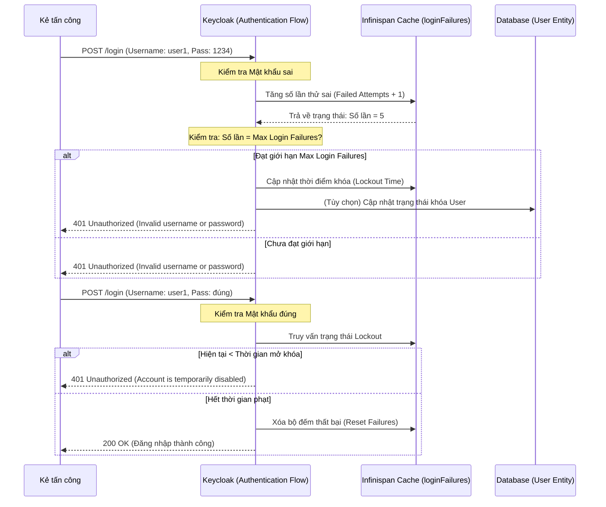

> [!NOTE]
> **Category:** Theory / Security Hardening
> **Goal:** Hiểu sâu về cơ chế phòng chống tấn công dò mật khẩu (Brute Force Protection) tích hợp sẵn trong Keycloak, cách thức cấu hình tham số an toàn, và nguyên lý hoạt động cấp thấp của hệ thống để bảo vệ tài khoản người dùng khỏi các cuộc tấn công đoán mật khẩu hoặc nhồi nhét thông tin (Credential Stuffing).

## 1. Lý thuyết chuyên sâu (Detailed Theory)

Tấn công dò mật khẩu (Brute Force Attack) là việc kẻ tấn công sử dụng phần mềm tự động để thử hàng loạt các kết hợp tên đăng nhập và mật khẩu cho đến khi tìm được một cặp hợp lệ. Một biến thể phổ biến và nguy hiểm hơn là **Nhồi nhét thông tin xác thực (Credential Stuffing)**, trong đó tin tặc sử dụng danh sách các cặp email/mật khẩu bị rò rỉ từ các hệ thống khác để thử nghiệm trên hệ thống Keycloak của bạn.

Hệ thống Quản lý Định danh (Identity Provider) là mục tiêu hàng đầu của loại tấn công này. Keycloak cung cấp một cơ chế bảo vệ nội bộ mạnh mẽ có tên là **Brute Force Detection**. Tính năng này có thể tự động giám sát các lần đăng nhập thất bại. Nếu số lần thất bại vượt quá một ngưỡng (Threshold) được định trước, hệ thống sẽ đưa ra quyết định:
- **Khóa tạm thời (Temporary Lockout):** Ngăn chặn tài khoản đăng nhập trong một khoảng thời gian nhất định (tăng dần thời gian chờ sau mỗi lần thử sai tiếp theo).
- **Khóa vĩnh viễn (Permanent Lockout):** Khóa hẳn tài khoản cho đến khi quản trị viên (Admin) vào mở khóa thủ công.

## 2. Luồng nội bộ & Cơ chế cấp thấp (Internal Workflow & Low-level Mechanisms)

Khi một yêu cầu đăng nhập được gửi tới, Keycloak sẽ theo dõi trạng thái xác thực bằng cách ghi lại số lần thử thất bại vào bộ nhớ đệm phân tán (Infinispan Cache) tên là `loginFailures`. 

**Cơ chế cấp thấp:**
- **Infinispan Cache:** Keycloak không ghi trực tiếp mọi lần thất bại xuống Database (RDMS) để tránh sập Database khi bị tấn công Brute Force với cường độ cao. Mọi bộ đếm (counters) và thời gian khóa được quản lý chủ yếu trong bộ nhớ (Infinispan).
- **Exponential Backoff:** Thuật toán tính toán thời gian khóa thường dựa trên cơ chế cấp số nhân. Ví dụ, lần khóa đầu tiên là 1 phút, lần tiếp theo là 2 phút, rồi 4 phút, 8 phút. Cơ chế này vắt kiệt thời gian của kẻ tấn công bằng các công cụ tự động.

## 3. Thực hành tốt nhất & Bảo mật (Best Practices & Security)

- **Tránh thông báo quá chi tiết:** Theo chuẩn bảo mật OWASP, khi một tài khoản bị khóa, giao diện người dùng vẫn chỉ nên hiển thị thông báo chung chung "Tên đăng nhập hoặc mật khẩu không hợp lệ" thay vì "Tài khoản của bạn đã bị khóa". Điều này ngăn kẻ tấn công (và những kẻ theo dõi mạng) biết được trạng thái thực của tài khoản (Tránh User Enumeration).
- **Cấu hình X-Forwarded-For chuẩn xác:** Cơ chế phát hiện Brute Force của Keycloak phụ thuộc một phần vào địa chỉ IP của Client. Nếu hệ thống mạng (Reverse Proxy, Load Balancer) không được cấu hình để truyền đúng header IP thực (X-Forwarded-For), Keycloak sẽ nhìn thấy toàn bộ lượng truy cập đến từ 1 IP của Proxy. Khi đó, nó có thể khóa oan toàn bộ người dùng trong hệ thống (False Positive).
- **Sử dụng Temporary Lockout thay vì Permanent Lockout:** Trừ những trường hợp bảo mật cực kỳ khắt khe, bạn nên dùng khóa tạm thời. Khóa vĩnh viễn rất dễ trở thành công cụ để tấn công Từ chối dịch vụ tầng ứng dụng (Application DDoS) — kẻ tấn công cố tình nhập sai mật khẩu của hàng loạt tài khoản nhân viên để khiến họ bị khóa vĩnh viễn, làm sập toàn bộ luồng công việc của công ty.

## 4. Cấu hình minh họa thực tế (Configuration Examples)

Bạn có thể cấu hình Brute Force Protection trên giao diện Admin Console: `Realm Settings` -> `Security Defenses` -> Tab `Brute Force Detection`.

Cấu hình mẫu tối ưu cho doanh nghiệp:
- **Enabled:** `ON`
- **Failure Factor (Max Login Failures):** `5` (Số lần thử sai tối đa).
- **Wait Increment:** `1 Minute` (Thời gian khóa ban đầu).
- **Max Wait:** `15 Minutes` (Thời gian khóa tối đa để không khóa người dùng quá lâu, gây phiền hà).
- **Failure Window:** `1 Hour` (Hệ thống sẽ cộng dồn các lần lỗi trong vòng 1 giờ; nếu vượt quá sẽ bị khóa).
- **Clear failures after success:** `ON` (Xóa bộ đếm nếu đăng nhập thành công).

## 5. Trường hợp ngoại lệ (Edge Cases)

- **Vấn đề NAT ở mạng Doanh nghiệp:** Toàn bộ nhân viên trong một tòa nhà văn phòng có thể sử dụng chung một dải IP tĩnh ngoài mạng (Public IP) ra Internet. Nếu Keycloak cấu hình chặn tính theo IP quá khắt khe, khi một nhân viên gõ sai mật khẩu nhiều lần, hệ thống có thể chặn cả văn phòng đăng nhập (Lỗi False Positive do chung IP). 
  - **Cách xử lý:** Cấu hình chủ yếu dựa trên `Username` kết hợp thay vì chỉ IP, và sử dụng Whitelist IP cho các văn phòng nội bộ ở cấp độ WAF.
- **Cuộc tấn công "Low and Slow" (Chậm và Thấp):** Kẻ tấn công chỉ thử 1 hoặc 2 mật khẩu mỗi ngày để qua mặt hệ thống đếm thời gian (Failure Window).
  - **Cách xử lý:** Hệ thống Brute Force nội bộ không đủ sức giải quyết. Bắt buộc phải tích hợp các giải pháp phân tích hành vi người dùng (UEBA - User and Entity Behavior Analytics) bên thứ ba, hoặc bật tính năng cảnh báo qua email về các lần đăng nhập bất thường.

## 6. Câu hỏi Phỏng vấn (Interview Questions)

1. **(Junior)** Tính năng Brute Force Detection trong Keycloak dùng để làm gì?
   - *Đáp án:* Dùng để phát hiện và ngăn chặn người dùng hoặc hacker liên tục nhập sai mật khẩu bằng cách khóa tài khoản tạm thời hoặc vĩnh viễn.

2. **(Junior)** Làm thế nào để mở khóa một tài khoản bị khóa do Brute Force trong Keycloak?
   - *Đáp án:* Nếu là khóa tạm thời, chỉ cần đợi hết thời gian (Wait Increment). Quản trị viên cũng có thể mở khóa thủ công thông qua Admin Console ở mục `Users` -> Chọn người dùng -> `Credentials` -> Xóa trạng thái tạm khóa.

3. **(Senior)** Nếu bị tấn công Brute Force ở quy mô lớn (hàng triệu requests), liệu bật Brute Force Detection của Keycloak có cứu được hệ thống không?
   - *Đáp án:* Không. Brute Force Detection của Keycloak xử lý tại lớp Application, tiêu tốn tài nguyên (CPU/Memory/Infinispan) cho mỗi request. Để chống lại cường độ cao, cần phải chặn ở mức WAF/Load Balancer/Rate Limiter trước khi request đến Keycloak.

4. **(Senior)** Tại sao sau khi cấu hình Nginx đứng trước Keycloak, tính năng Brute Force Protection đột nhiên khóa tất cả mọi người dùng khi chỉ có một người gõ sai mật khẩu?
   - *Đáp án:* Do Keycloak không nhận được IP thực của Client mà chỉ nhận IP của Nginx Proxy. Cần cấu hình chuyển tiếp IP bằng các Header (`X-Forwarded-For`), đồng thời cấu hình Keycloak chạy ở chế độ Proxy (`--proxy-headers=x-forwarded` trong Quarkus).

5. **(Senior)** Giải thích cơ chế lưu trữ các bộ đếm (counters) của Brute Force trong hệ thống Keycloak phân tán (Cluster).
   - *Đáp án:* Keycloak sử dụng bộ đệm phân tán Infinispan (cache `loginFailures`) để chia sẻ các lần đăng nhập thất bại giữa các node trong cluster. Điều này đảm bảo tính nhất quán (Consistency) và tốc độ (Low Latency) mà không gây quá tải CSDL (Database) ghi (writes) liên tục.

## 7. Tài liệu tham khảo (References)

- [Keycloak Threat Mitigation Guide - Brute Force Attacks](https://www.keycloak.org/docs/latest/server_admin/#_brute_force_attacks)
- [OWASP Credential Stuffing Prevention Cheat Sheet](https://cheatsheetseries.owasp.org/cheatsheets/Credential_Stuffing_Prevention_Cheat_Sheet.html)
- [OWASP Authentication Cheat Sheet](https://cheatsheetseries.owasp.org/cheatsheets/Authentication_Cheat_Sheet.html)
