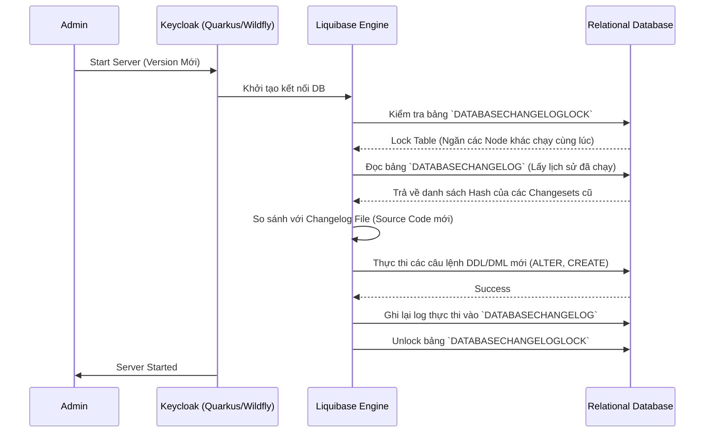

> [!NOTE]
> **Category:** Theory
> **Goal:** Tìm hiểu cơ chế cốt lõi của việc di chuyển và nâng cấp cơ sở dữ liệu (Database Migration) trong Keycloak sử dụng công cụ Liquibase.

## 1. Lý thuyết chuyên sâu (Detailed Theory)

Khi nâng cấp Keycloak từ phiên bản cũ lên phiên bản mới hơn, mã nguồn Java của hệ thống thay đổi, thường đi kèm với việc bổ sung các tính năng mới. Các tính năng này yêu cầu cơ sở dữ liệu phải được thay đổi theo (thêm bảng, thêm cột, tạo index, hoặc thay đổi kiểu dữ liệu). Quá trình cập nhật cấu trúc cơ sở dữ liệu này được gọi là **Database Migration**.

**Công cụ Liquibase:**
Keycloak không tự viết các câu lệnh SQL tĩnh để nâng cấp. Nó tích hợp chặt chẽ với **Liquibase** - một thư viện mã nguồn mở chuyên quản lý schema database.
- Liquibase sử dụng các file XML/YAML (được gọi là `changelogs`) để định nghĩa từng thay đổi (gọi là `changesets`).
- Việc sử dụng Liquibase giúp Keycloak hỗ trợ độc lập nhiều loại Database (PostgreSQL, MySQL, Oracle, MSSQL) vì Liquibase tự động dịch các định nghĩa trừu tượng sang câu lệnh Dialect SQL cụ thể.

## 2. Luồng nội bộ & Cơ chế cấp thấp (Internal Workflow & Low-level Mechanisms)

Quá trình Database Migration tự động xảy ra khi bạn khởi động một máy chủ Keycloak ở phiên bản mới lần đầu tiên kết nối vào một database cũ.



**Cơ chế bảo vệ bằng LOCK:**
Trong môi trường Cluster có nhiều Node Keycloak khởi động cùng lúc, bảng `DATABASECHANGELOGLOCK` đóng vai trò cốt lõi. Node đầu tiên nào chiếm được khóa (thuộc tính `LOCKED = 1`) sẽ là Node duy nhất được quyền can thiệp vào cấu trúc bảng. Các Node khác sẽ ở trạng thái chờ (Wait) cho đến khi việc Migration hoàn tất.

## 3. Thực hành tốt nhất & Bảo mật (Best Practices & Security)

> [!WARNING]
> **Tuyệt đối không can thiệp thủ công (No Manual Changes)**: Không bao giờ được phép trực tiếp thay đổi schema database (thêm cột, sửa tên bảng) bằng các công cụ SQL (như DBeaver/pgAdmin) ngoài môi trường Keycloak. Nếu checksum của các bảng thay đổi, Liquibase sẽ phát hiện, báo lỗi `Validation Failed` và từ chối khởi động Keycloak mãi mãi.

> [!IMPORTANT]
> **Backup trước khi chạy Migration**: Schema thay đổi (DROP COLUMN, thay đổi Data Type) có thể gây mất dữ liệu nếu xảy ra sự cố giữa chừng. Hãy luôn tạo bản snapshot database hoặc dùng công cụ dump (như `pg_dump`) trước khi khởi động phiên bản Keycloak mới.

- **Chạy Migration ngoại tuyến (Offline Migration)**: Đối với các Database cực lớn, việc khởi động Server có thể bị timeout (quá thời gian chờ) do Migration mất vài tiếng. Bạn nên xuất file SQL Migration ra trước, cho DBA review và chạy bằng tay, sau đó mới bật Keycloak.

## 4. Cấu hình minh họa thực tế (Configuration Examples)

### Tự động chạy Migration:
Theo mặc định, Keycloak dựa trên Quarkus sẽ tự động thực hiện việc này. Cờ cấu hình:
`db-url`, `db-username`, `db-password` phải chính xác và user này phải có quyền **DDL (Data Definition Language)** (quyền tạo bảng, sửa schema).

### Chạy Manual/Offline Migration (Xuất script):
Thay vì để Keycloak tự chạy thẳng vào DB, bạn có thể lệnh cho Keycloak xuất ra file SQL để Database Admin (DBA) kiểm tra trước.

Sử dụng lệnh export (CLI cho bản Quarkus):
```bash
# Lệnh yêu cầu xuất SQL cho file migration thay vì tự động áp dụng
bin/kc.sh build --db=postgres
bin/kc.sh export --file=/tmp/keycloak-migration.sql
# Hoặc sử dụng các plugin tùy chỉnh nếu bản Keycloak cũ
```
*(Lưu ý: Tuỳ thuộc vào phiên bản, tính năng export SQL trực tiếp từ kc.sh có thể yêu cầu tool chuyên biệt hoặc chạy qua chế độ đặc biệt).*

## 5. Trường hợp ngoại lệ (Edge Cases)

- **Crash trong lúc Migration**: Nguồn điện bị ngắt, hoặc process Keycloak bị kill đúng lúc Liquibase đang ghi dữ liệu. Kết quả: Database ở trạng thái một nửa (Inconsistent State). Liquibase có thể không nhả Lock. Khắc phục: Phải Restore từ Backup. Nếu chỉ kẹt Lock, dùng lệnh SQL `UPDATE DATABASECHANGELOGLOCK SET LOCKED=0, LOCKGRANTED=null, LOCKEDBY=null where ID=1;`.
- **Lỗi Checksum (Validation Failed)**: Xảy ra khi file changelog của Keycloak bị thay đổi hoặc ai đó sửa data trực tiếp trên bảng `DATABASECHANGELOG`. Bạn phải xóa bản ghi gây lỗi trong bảng đó, sửa đổi checksum, hoặc tốt nhất là khôi phục DB.
- **Dữ liệu rác quá lớn (Log Tables)**: Nếu các bảng lưu lịch sử đăng nhập (Event logs) quá lớn (hàng triệu dòng), quá trình thêm index của Liquibase lên các bảng này có thể làm treo database hoàn toàn. Khắc phục: Phải Clear Event Logs từ Admin Console trước khi nâng cấp.

## 6. Câu hỏi Phỏng vấn (Interview Questions)

**Junior Level:**
1. Keycloak sử dụng công cụ nào để tự động nâng cấp cấu trúc cơ sở dữ liệu?
   - *Đáp án:* Liquibase.
2. Bảng `DATABASECHANGELOG` trong Database của Keycloak dùng để làm gì?
   - *Đáp án:* Lưu trữ lịch sử tất cả các bản cập nhật schema (changesets) đã được thực thi thành công, giúp hệ thống biết cần phải chạy script nào cho bản tiếp theo.

**Senior Level:**
3. Trình bày rủi ro khi có hai Node Keycloak cùng lúc nâng cấp Database? Keycloak giải quyết vấn đề đó thế nào?
   - *Đáp án:* Rủi ro tạo ra Deadlock hoặc hỏng cấu trúc bảng do chạy song song. Giải quyết bằng bảng `DATABASECHANGELOGLOCK`. Node nào chèn cờ Lock thành công mới được tiến hành migration.
4. Một quản trị viên đã lỡ tay xoá một cột trong bảng `USER_ENTITY`. Lần tới khi Keycloak restart, điều gì sẽ xảy ra?
   - *Đáp án:* Nếu cột đó được quản lý bởi file Liquibase cũ, Keycloak có thể không phát hiện ra (trừ khi có validation check). Tuy nhiên, code Java của Keycloak sẽ quăng ra lỗi Hibernate / JPA `Column not found` và hệ thống sẽ crash khi thao tác với user. Không bao giờ can thiệp schema thủ công.
5. Khi bạn nâng cấp một DB có bảng Events lưu trữ 50 triệu bản ghi, hệ thống bị đứng cứng (Hangs) suốt 4 tiếng. Lý do là gì và cách giải quyết?
   - *Đáp án:* Lý do là Liquibase đang cố gắng tạo Index (hoặc Alter Column) trên một bảng khổng lồ, gây ra Table Lock làm treo DB. Cách giải quyết tối ưu: Trả về trạng thái Backup, cấu hình tự động xoá Event rác (Event Expiration) trước khi nâng cấp, hoặc xuất file SQL để cho DBA dùng công nghệ Online DDL (như `pg_repack` hoặc chia nhỏ chunk).

## 7. Tài liệu tham khảo (References)

- [Liquibase Official Concepts Documentation](https://docs.liquibase.com/concepts/home.html)
- [Keycloak Upgrading Guide - Database Migration](https://www.keycloak.org/docs/latest/upgrading/index.html)
