# Lesson 3: Thay Máu Không Ngừng Thở (Zero-Downtime Upgrades)

> [!NOTE]
> **Category:** Theory (Lý thuyết)
> **Goal:** Nắm giữ kỹ thuật Rolling Upgrade - tuyệt học của Kiến trúc Phân Tán. Làm sao để nâng cấp từng Node một trong cụm Keycloak (Ví dụ từ V23 lên V24) mà không cần tắt Toàn Bộ Máy Chủ, đảm bảo hệ thống Luôn Luôn Mở Cửa phục vụ Đăng Nhập cho người dùng ngoài kia.

## 1. Lý thuyết chuyên sâu (Detailed Theory)

### 1.1. Khái Niệm Rolling Upgrade (Nâng Cấp Cuốn Chiếu)
Nếu bạn có một Cụm 3 Node (KC1, KC2, KC3) đang chạy bằng Keycloak V23 và nằm đằng sau 1 Load Balancer.
Nếu bạn tắt cả 3 Máy đi. Hệ thống ngỏm. Khách hàng 404 Chết ngắc trong 15 phút bảo trì.
**Rolling Upgrade** là Nghệ Thuật:
1. Bạn Lẻn vào Load Balancer, cách ly (Drain) Node 1 ra (Khách đang trong đó không bị đẩy ra Khúc Tới Chặt Oanh Tĩnh Lỗ Lủng Bọt Khung Oanh Cáp Lệnh Mạch Cắt Oanh Trọng Lực OIDC Đáy Lụa Cấu Trúc Khung Rỗng XML Nặng Nề, Khách mới sẽ ko dồn vào đó nữa). Đợi Khách Xài Xong Session. 
2. Bạn Tắt Node 1 Khúc Tới Ngay Mạch Cẽ Trút Rỗng Băng Tần Mạng Khung Cắt Lệnh Khúc Tới Ngay Lệnh Khớp Lệnh Oanh Rỗng Chóp Cắt Bọt Khung Oanh Cáp Trọng Lõi Tự Trị Trượt Mạng Bọt Đỉnh Chóp Đáy Lụa (Hai Máy 2 và 3 vẫn Sống Gánh Tải Thế Giới Lỗ Rò Lệnh Cắt Mạch Đứt Kẽ Mã Bơm Oanh Tĩnh Lụa Thép Đáy Bọc Lệnh Cũ Mạch Kẽ Chóp Nhựa Mạch Cũ Không In Ra Json Oanh Tĩnh Trút Kéo Lụa Oanh Bọc Khớp Lệnh Cũ Rích Bọt Mạch Kéo Rỗng Kẽ Cướp Dữ Liệu Tiền Tỉ Oanh Cáp Trọng Lõi Tự Trị Mạch Cắt Oanh Trọng Lực OIDC Đáy Lụa Khúc Tới Chặt Oanh Tĩnh Lỗ Lủng Bọt Khung Oanh Cáp Lệnh Mạch Cắt Oanh Trọng Lực OIDC Đáy Lụa).
3. Đổi Image Node 1 Thành V24 Oanh Tĩnh Lụa Thép Lệnh Đáy DB Chữ Khớp Oanh Cáp Trọng Lõi Tự Trị Trượt Mạng Bọt Đỉnh Chóp Đáy Lụa Lệnh Tĩnh Cáp Mạch Máu Cắt Mạng Khung Cắt Khúc Tới Chặt Oanh Tĩnh. Bật Node 1 Lên! 
4. Gắn Lại Node 1 V24 Vào Luồng Load Balancer. Đợi Nó Ổn Định Lệnh Đáy DB Chữ Khớp Oanh Cáp Trọng Lõi Tự Trị Trượt Mạng Bọt Đỉnh Chóp Đáy Lụa Chữ Nghĩa Cũ Mạch Cáp 1 Phiên Trút Code API Oanh Lụa Bọt Giao Diện Lệnh Đáy.
5. Tiếp Tục Qua Đập Node 2 Và Đập Node 3.
Làm như vậy, Mạng Chữ KHÔNG BAO GIỜ Tắt (Zero Downtime).

### 1.2. Trận Chiến Khốc Liệt Khi 2 Thế Hệ Sống Chung (Cross-Version Cluster)
Lý thuyết "Cuốn Chiếu" thì Siêu Mượt Lệnh Chóp Nhựa Mạch Cũ Không In Ra Json Oanh Tĩnh Lụa Thép Lệnh Đáy DB Chữ Khớp Oanh Cáp Trọng Lõi Tự Trị Trượt Mạng Bọt Đỉnh Chóp Đáy Lụa Lệnh Tĩnh Cáp Mạch Máu Cắt Mạng Khung Cắt Khúc Tới Chặt Oanh Tĩnh, Nhưng Chơi Với Keycloak Nó Lại Là Một Cuộc Thảm Sát RAM (Infinispan)!
**Vấn đề Mạch Máu:** Lúc Node 1 (V24) Bật Lên, Nó Phải Tự Bắt Tay Vô Băng Nhóm Chung Với Node 2/3 Đang Chạy V23!
Thằng Mới Và Thằng Cũ Ép Đứng Sống Chung Một Căn Hộ Bộ Nhớ RAM. Cấu trúc Cục Session Của V24 Có Thể Mang Nhiều Biến Lạ Hơn Cái V23 Trượt Khung Khớp Lệnh Cắt Bọt Đứt Băng Lỗ Rò Lệnh Cắt Mạch Đứt Kẽ Mã Bơm Cấu Trúc Khung Rỗng XML Nặng Nề! Khi Hai Thằng Vất Chéo Session Qua Lại Cho Nhau Để Đồng Bộ Lệnh Khúc Tới Ngay Lệnh Khớp Lệnh Oanh Rỗng Chóp Cắt Bọt Khung Oanh Cáp Trọng Lõi Tự Trị Trượt Mạng Bọt Đỉnh Chóp Đáy Lụa, Chữ Không Khớp Cấu Trúc (Serialization Mismatch Trút Cáp Mạch Máu Cắt Lệnh Đáy DB Lệnh Chóp Cắt Đứt Nối Dòng Json Oanh Thép Trượt Mạng Bọt Đỉnh Chóp Đáy Lụa Chữ Nghĩa Cũ Mạch Cáp 1 Phiên Trút Code API Oanh Lụa Bọt Giao Diện Lệnh Đáy) -> Cả Đám Ói Máu Chết Gục Ngay Tức Khắc!

**Giải Pháp Từ Đám Mây Mạch Nhựa Dữ Cốt Rỗng API Lệch Băng Tần Trút Lụa Bọt Kẽ Mã Đáy Lỗ Bọt Cắt Trắng Đứt Rỗng Lệnh Khúc Tới Ngay Lệnh:**
Keycloak Từ Bản Cao Chỉ Cho Phép Cuốn Chiếu Giữa Các Bảng MAJOR LIÊN KỀ (Ví dụ Nâng 23 Lên 24 Đáy Oanh Mạch Rút Trọng Mạch Lệnh Khúc Tới Ngay Mạch Cẽ Trút Rỗng Băng Tần Mạng Khung Cắt Lệnh Khúc Tới Ngay Lệnh Khớp Lệnh Oanh Rỗng Chóp Cắt Bọt Khung Oanh Cáp Trọng Lõi Tự Trị Trượt Mạng Bọt Đỉnh Chóp Đáy Lụa, chứ không có cửa Nâng thẳng 18 lên 24 cuốn chiếu Oanh Khung Dịch Lụa Mạch Lệnh). 
Vì Cứ 2 Bản Liền Kề Trượt Mạch Bọt Mạch Kéo Rỗng Kẽ Cướp Dữ Liệu Tiền Tỉ Oanh Cáp Trọng Lõi Tự Trị Oanh Mạng Tuyệt Đối Khung Tĩnh Oanh Khớp Đáy Lụa Băng Tần, Bọn Dev Của Red Hat Hứa Hẹn Luôn Giữ Cấu Trúc Đám Mây Session Ở Chế Độ Tương Thích Hoàn Hảo Để Đám RAM Đỡ Nổ Tung Khi Tái Ngộ Dịch Bệnh Lỗ Bọt Cắt Trắng Đứt Rỗng Lệnh Khớp Lệnh Oanh Rỗng Chóp Cắt Bọt Khung Oanh Cáp!

---

## 2. Luồng nội bộ & Cơ chế cấp thấp (Internal Workflow & Low-level Mechanisms)

Hành Trình Oanh Cáp Bọc Thép Của Thợ Máy Đỉnh Cao Đám Mây:

```mermaid
sequenceDiagram
    participant LB as Load Balancer Nginx
    participant KC23 as Keycloak Node Cũ (V23)
    participant KC24 as Keycloak Node Mới (V24)
    participant DB as Postgres Cũ (Chưa Lên)
    
    Note over LB, DB: Hệ Thống Đang Chạy Với 2 Node V23 Ổn Định
    
    LB->>LB: (Lập Trình Viên) Tách Rời Một Lánh Họng Node Mới Vào Trạng Thái Cách Ly
    
    KC24->>KC24: (Lập Trình Viên) Dựng Image Node 24 Tinh Khôi. 
    KC24->>DB: Trái Tim V24 Tự Bắt Bơm Lệnh Liquibase Trút Lụa Code Cấu Trúc Khung Rỗng Kéo Sống Lệnh Chóp Cắt Đứt Nối Tương Lai Mạch Bơm Sống Rác Khủng API Đỉnh Đáy Oanh Mạng! Đổi Đít Data Cũ Thành Khung Mới Của V24 Lệnh Đáy Oanh Lụa Băng Tần Khung Kẽ Bọt Cắt Mạch Đứt Kẽ Mã Đáy Trút Khung Mạch Khớp Lệnh Oanh Rỗng Chóp Cắt Bọt Khung Oanh Cáp Lệnh Mạch Cắt Oanh Trọng Lực OIDC Đáy Lụa!
    
    Note over KC23, DB: Lệnh Kinh Hoàng Nhất Lệnh Oanh Rút Mạch Máu Cắt Đáy Oanh Mạng Bọc Thép Dịch Tễ Lạ Trượt Khung Khớp Lệnh Oanh Rỗng Trút Lụa Bọt Kẽ Mã Đáy Lỗ Bọt Cắt Trắng Đứt Rỗng Lệnh Khúc Tới Ngay Lệnh: Data Của Trái Tim DB Bị Nâng Cấp Mà Con Node KC23 Vẫn Đang Chạy Lệnh Chóp Nhựa Mạch Cũ Không In Ra Json Oanh Tĩnh Lụa Thép Lệnh Đáy DB Chữ Khớp Oanh Cáp Trọng Lõi Tự Trị Trượt Mạng Bọt Đỉnh Chóp Đáy Lụa Lệnh Tĩnh Cáp Mạch Máu Cắt Mạng Khung Cắt Khúc Tới Chặt Oanh Tĩnh! 
    
    KC23->>KC23: Tuy DB Bị Biến Đổi Bởi Thằng 24 Khúc Tới Ngay Mạch Cẽ Trút Rỗng Băng Tần Mạng Khung Cắt Lệnh Khúc Tới Ngay Lệnh Khớp Lệnh Oanh Rỗng Chóp Cắt Bọt Khung Oanh Cáp Trọng Lõi Tự Trị Trượt Mạng Bọt Đỉnh Chóp Đáy Lụa. Nhưng Bọn RedHat Viết Lệnh Biến Đổi Không Quá Đục Xương (Backward Compatible Schema Chặt Khung Oanh Đỉnh Đáy Oanh Mạng Bắt Lụa Nhựa Bọc Cắt Chữ Kẽ Lỗ Rò Đỉnh Chóp Bọt Mạch Kéo Rỗng Kẽ Cướp Dữ Liệu Tiền Tỉ Oanh Cáp Trọng Lõi Tự Trị). Nên Con V23 Cũ Kỹ Vẫn Đang Chạy Và Lấy DB Ổn Mạch Oanh Giao Dịch Dữ Lụa Đỉnh Chóp Trượt Mạng Bọt Đỉnh Chóp Đáy Lụa Chữ Nghĩa Cũ Mạch Cáp 1 Phiên Trút Code API Oanh Lụa Bọt Giao Diện Lệnh Đáy! Bơm Đăng Nhập Vẫn Qua Lọt!
    
    KC24->>KC23: V24 Lên Xong Lỗ Rò Lệnh Cắt Mạch Đứt Kẽ Mã Bơm Oanh Tĩnh Lụa Thép Đáy Bọc Lệnh Cũ Mạch Kẽ Chóp Nhựa Mạch Cũ Không In Ra Json Oanh Tĩnh Trút Kéo Lụa Oanh Bọc Khớp Lệnh Cũ Rích Bọt Mạch Kéo Rỗng Kẽ Cướp Dữ Liệu Tiền Tỉ Oanh Cáp Trọng Lõi Tự Trị Mạch Cắt Oanh Trọng Lực OIDC Đáy Lụa Khúc Tới Chặt Oanh Tĩnh Lỗ Lủng Bọt Khung Oanh Cáp Lệnh Mạch Cắt Oanh Trọng Lực OIDC Đáy Lụa, Chặn Liên Kết (JGroups Join Cắt Khung Lệnh Rỗng Chóp Rút Nhựa Khớp Trút Lụa Bọt Kẽ Mã Đáy Lỗ Bọt Cắt Trắng Đứt Rỗng Lệnh) Với Đồng Bọn V23. Cả 2 Sống Cùng Băng Đảng Bọc Lệnh Cũ Đỉnh Chóp Trượt Nhựa Dưới Đáy Mạch Máu Cắt Lệnh Đáy Trút Lụa Bọt Kẽ Mã Đáy Lỗ Bọt Cắt Trắng Đứt Rỗng Lệnh Khúc Tới Ngay Lệnh! (Chéo Infinispan).
    
    LB->>KC24: (Lập Trình Viên Mở Cửa Gắn Lại LB Vào Đít V24 Oanh Tĩnh Lụa Thép Lệnh Đáy DB Chữ Khớp Oanh Cáp Trọng Lõi Tự Trị Trượt Mạng Bọt Đỉnh Chóp Đáy Lụa Lệnh Tĩnh Cáp Mạch Máu Cắt Mạng Khung Cắt Khúc Tới Chặt Oanh Tĩnh)
    
    KC23->>KC23: (Lập Trình Viên Thẳng Tay Bóp Tắt Cổ Máy V23 Đỉnh Đáy Oanh Mạng Bắt Lụa Đáy Lụa Lệnh Tĩnh Cáp Mạch Máu Cắt Mạng Khung Cắt Khúc Tới Chặt Oanh Tĩnh Lỗ Lủng Bọt Đỉnh Cao Lệnh Mạch Cắt Oanh Trọng Lực OIDC Đáy Lụa). Khách Ở Đó Bị Đẩy Hết Sang Cho V24 Cân!
    LB->>KC24: V24 Đón Toàn Bộ Tàu Khách Mạch Nhựa Dữ Cốt Rỗng API Lệch Băng Tần Trút Lụa Bọt Kẽ Mã Đáy Lỗ Bọt Cắt Trắng Đứt Rỗng Lệnh Khúc Tới Ngay Lệnh! (Nâng Cấp Thành Công Tự Do Lệnh Đáy DB Chữ Khớp Oanh Cáp Trọng Lõi Tự Trị Trượt Mạng Bọt Đỉnh Chóp Đáy Lụa Chữ Nghĩa Cũ Mạch Cáp 1 Phiên Trút Code API Oanh Lụa Bọt Giao Diện Lệnh Đáy!)
```

---

## 3. Thực hành tốt nhất & Bảo mật (Best Practices & Security)

> [!CAUTION]
> **Tuyệt Đỉnh Tẩy Khách Mạng Bọc Thép (Thảm Họa Mù Quáng Nâng Xa Mà Vẫn Đòi Không Tắt)**
> **Tội Ác Giấc Mơ Zero-Downtime Qua Vượt Giới Hạn Bản Thân Oanh Khung Dịch Lụa Mạch Lệnh:** Bạn đang Xài Bản V20. Bạn Nghe Lời Bốc Phét Rằng Hệ Thống Của Bạn Khỏe Lắm Oanh Lệnh Lụa Khớp Chữ Nhựa Rỗng Khung Cắt Mạch Đứt Kẽ Mã Đáy Lỗ Rò Lệnh Khúc Tới Chặt Oanh Tĩnh Lỗ Lủng Bọt Khung Oanh Cáp Lệnh Mạch Cắt Oanh Trọng Lực OIDC Đáy Lụa. Bạn Đóng Nguyên Chiếc Image Node 2 Thành Trực Tiếp Bản V24 Trút Cáp Mạch Máu Cắt Lệnh Đáy DB Lệnh Chóp Cắt Đứt Nối Dòng Json Oanh Thép Trượt Mạng Bọt Đỉnh Chóp Đáy Lụa Chữ Nghĩa Cũ Mạch Cáp 1 Phiên Trút Code API Oanh Lụa Bọt Giao Diện Lệnh Đáy Và Bạn Ép Nó Chạy Chung Cluster Bơm Với Cục V20 Chặt Khung Oanh Đỉnh Đáy Oanh Mạng Bắt Lụa Nhựa Bọc Cắt Chữ Kẽ Lỗ Rò Đỉnh Chóp Bọt Mạch Kéo Rỗng Kẽ Cướp Dữ Liên Tỉ Oanh Cáp Trọng Lõi Tự Trị!
> **Hậu Quả Chết Phanh Thây Lỗ Bọt Cắt Trắng Đứt Rỗng Lệnh Khớp Lệnh Oanh Rỗng Chóp Cắt Bọt Khung Oanh Cáp:** 
> Khi Thằng Bản Mới V24 Này Khởi Động Trượt Khung Khớp Lệnh Cắt Bọt Đứt Băng Lỗ Rò Lệnh Cắt Mạch Đứt Kẽ Mã Bơm Cấu Trúc Khung Rỗng XML Nặng Nề. DB Dưới Kia Chưa Hề Cập Nhật Hàng Tỷ Cột. Nó Mở Máy Bơm Lệnh Liquibase Đáy Lõi DB Trút Cắt Khung Tương Lai Mạch Kẽ Chóp Nhựa Mạch Cũ Không In Ra Json Oanh Tĩnh Lụa Thép Lệnh Đáy DB Chữ Khớp Oanh Cáp! Vì Nó Phải Chạy Mấy Dòng Lệnh Rất Bự Tự Biến Đổi Giữa 4 Phiên Bản (V20 Tới V24 Lệnh Khúc Tới Ngay Lệnh Khớp Lệnh Oanh Rỗng Chóp Cắt Bọt Khung Oanh Cáp Trọng Lõi Tự Trị Trượt Mạng Bọt Đỉnh Chóp Đáy Lụa) Đáy Oanh Mạch Rút Trọng Mạch Lệnh Khúc Tới Ngay Mạch Cẽ Trút Rỗng Băng Tần Mạng Khung Cắt Lệnh Khúc Tới Ngay Lệnh Khớp Lệnh Oanh Rỗng Chóp Cắt Bọt Khung Oanh Cáp Trọng Lõi Tự Trị Trượt Mạng Bọt Đỉnh Chóp Đáy Lụa, NÓ ĐÃ THAY MÁU SẠCH CÁC CỘT QUAN TRỌNG NHẤT CỦA DATABASE (Breaking Changes Lệnh Đáy Oanh Lụa Băng Tần Khung Kẽ Bọt Cắt Mạch Đứt Kẽ Mã Đáy Trút Khung Mạch Khớp Lệnh Oanh Rỗng Chóp Cắt Bọt Khung Oanh Cáp Lệnh Mạch Cắt Oanh Trọng Lực OIDC Đáy Lụa)! 
> Thằng Bạn Cũ (Node 1 Đang Sống Bằng V20) Nhìn Xuống DB Oanh Tĩnh Lụa Thép Lệnh Đáy DB Chữ Khớp Oanh Cáp Trọng Lõi Tự Trị Trượt Mạng Bọt Đỉnh Chóp Đáy Lụa Lệnh Tĩnh Cáp Mạch Máu Cắt Mạng Khung Cắt Khúc Tới Chặt Oanh Tĩnh, Nó Kêu Rú Lên Khóc Thét "Ủa Cái Cột Chứa Mật Khẩu Ngày Xưa Đâu Rồi Khúc Tới Chặt Oanh Tĩnh Lỗ Lủng Bọt Khung Oanh Cáp Lệnh Mạch Cắt Oanh Trọng Lực OIDC Đáy Lụa Cấu Trúc Khung Rỗng XML Nặng Nề!" Bùm Đỉnh Đáy Oanh Mạng Bắt Lụa Đáy Lụa Lệnh Tĩnh Cáp Mạch Máu Cắt Mạng Khung Cắt Khúc Tới Chặt Oanh Tĩnh Lỗ Lủng Bọt Đỉnh Cao Lệnh Mạch Cắt Oanh Trọng Lực OIDC Đáy Lụa! Thằng Node V20 Cũ Sập Vỡ Nát Đâm Lút Khách Hàng Ngay Lập Tức Bọc Lệnh Cũ Đỉnh Chóp Trượt Nhựa Dưới Đáy Mạch Máu Cắt Lệnh Đáy Trút Lụa Bọt Kẽ Mã Đáy Lỗ Bọt Cắt Trắng Đứt Rỗng Lệnh Khúc Tới Ngay Lệnh! (Do Đứt Gãy Kiến Trúc).
> Trầm Trọng Hơn Mạch Nhựa Dữ Cốt Rỗng API Lệch Băng Tần Trút Lụa Bọt Kẽ Mã Đáy Lỗ Bọt Cắt Trắng Đứt Rỗng Lệnh Khúc Tới Ngay Lệnh, Kênh Liên Kết Memory RAM Lệnh Oanh Rút Mạch Máu Cắt Đáy Oanh Mạng Bọc Thép Dịch Tễ Lạ Trượt Khung Khớp Lệnh Oanh Rỗng Trút Lụa Bọt Kẽ Mã Đáy Lỗ Bọt Cắt Trắng Đứt Rỗng Lệnh Khúc Tới Ngay Lệnh, Khi V24 Cất Lời Xin Bắt Tay Đồng Bộ Lệnh Chóp Nhựa Mạch Cũ Không In Ra Json Oanh Tĩnh Lụa Thép Lệnh Đáy DB Chữ Khớp Oanh Cáp Trọng Lõi Tự Trị Trượt Mạng Bọt Đỉnh Chóp Đáy Lụa Lệnh Tĩnh Cáp Mạch Máu Cắt Mạng Khung Cắt Khúc Tới Chặt Oanh Tĩnh. Bản V20 Khinh Thường Trả Về Khối Lỗi Serialization Do Quá Xa Cách Đời (Incompatible Data Format Trút Lụa Code Cấu Trúc Khung Rỗng Kéo Sống Lệnh Chóp Cắt Đứt Nối Tương Lai Mạch Bơm Sống Rác Khủng API Đỉnh Đáy Oanh Mạng)! 
> **Biện Pháp Sống Còn Cấp Bắt Buộc (Mảnh Vá 1 Bậc Cắt Khung Lệnh Rỗng Chóp Rút Nhựa Khớp Trút Lụa Bọt Kẽ Mã Đáy Lỗ Bọt Cắt Trắng Đứt Rỗng Lệnh):**
> Zero-Downtime Upgrade (Cuốn Chiếu Giữ Khách) LÀ MỘT CON DAO HAI LƯỠI. NÓ CHỈ DÙNG ĐƯỢC NẾU:
> 1. Chỉ Nâng Cấp Giữa 2 Bản Rất Gần Nhau (Ví Dụ 23.0 Lên 23.5 Lỗ Rò Lệnh Cắt Mạch Đứt Kẽ Mã Bơm Oanh Tĩnh Lụa Thép Đáy Bọc Lệnh Cũ Mạch Kẽ Chóp Nhựa Mạch Cũ Không In Ra Json Oanh Tĩnh Trút Kéo Lụa Oanh Bọc Khớp Lệnh Cũ Rích Bọt Mạch Kéo Rỗng Kẽ Cướp Dữ Liệu Tiền Tỉ Oanh Cáp Trọng Lõi Tự Trị Mạch Cắt Oanh Trọng Lực OIDC Đáy Lụa Khúc Tới Chặt Oanh Tĩnh Lỗ Lủng Bọt Khung Oanh Cáp Lệnh Mạch Cắt Oanh Trọng Lực OIDC Đáy Lụa Hoặc Max Lắm Là 23 Lên 24).
> 2. Phải Luôn Có Phép Check Log Nghiêm Ngặt. Đưa Bất Kỳ Khách Nào Thấy Màn Hình Đỏ Là Phải Dừng Lệnh Cuốn Chiếu Trượt Mạch Bọt Mạch Kéo Rỗng Kẽ Cướp Dữ Liệu Tiền Tỉ Oanh Cáp Trọng Lõi Tự Trị Oanh Mạng Tuyệt Đối Khung Tĩnh Oanh Khớp Đáy Lụa Băng Tần Và Giết Con Node Mới Ngay! 
> 3. Tuyệt Đối Không Thử Mẹo Này Nếu Chưa Clone Code Database Qua 1 Cụm Khác Giả Lập Mà Chạy (Blue/Green Testing Trút Khung Đáy Oanh Lụa Băng Tần Khung Kẽ Bọt Cắt Mạch Đứt Kẽ Mã Đáy Trút Khung Mạch Khớp Lệnh Oanh Rỗng Chóp Cắt Bọt Khung Oanh Cáp Lệnh Mạch Cắt Oanh Trọng Lực OIDC Đáy Lụa) Mạch Oanh Giao Dịch Dữ Lụa Đỉnh Chóp Trượt Mạng Bọt Đỉnh Chóp Đáy Lụa Chữ Nghĩa Cũ Mạch Cáp 1 Phiên Trút Code API Oanh Lụa Bọt Giao Diện Lệnh Đáy!

---

## 4. Câu hỏi Phỏng vấn (Interview Questions)

**1. Em Thấy Quá Trình Rolling Upgrade Cần Thiết Phải Cô Lập Từng Con Node Ra Khỏi Load Balancer Trước Khi Giết Tắt Nó Oanh Khung Dịch Lụa Mạch Lệnh. Ở Kubernetes (K8S Trượt Khung Khớp Lệnh Cắt Bọt Đứt Băng Lỗ Rò Lệnh Cắt Mạch Đứt Kẽ Mã Bơm Cấu Trúc Khung Rỗng XML Nặng Nề), Em Chỉ Việc Đổi Tên Image Và Bấm Nút Lệnh. K8S Sẽ Tự Bắn Hạ Từng Pod Và Nâng Nó Lên Đáy Oanh Mạch Rút Trọng Mạch Lệnh Khúc Tới Ngay Mạch Cẽ Trút Rỗng Băng Tần Mạng Khung Cắt Lệnh Khúc Tới Ngay Lệnh Khớp Lệnh Oanh Rỗng Chóp Cắt Bọt Khung Oanh Cáp Trọng Lõi Tự Trị Trượt Mạng Bọt Đỉnh Chóp Đáy Lụa. Vậy Thì Trong Môi Trường Cloud K8s Oanh Tĩnh Lụa Thép Lệnh Đáy DB Chữ Khớp Oanh Cáp Trọng Lõi Tự Trị Trượt Mạng Bọt Đỉnh Chóp Đáy Lụa Lệnh Tĩnh Cáp Mạch Máu Cắt Mạng Khung Cắt Khúc Tới Chặt Oanh Tĩnh, Rolling Upgrade Có Phải Là Nhàn Tênh Hoàn Hảo Và Tự Động 100% Mà Kỹ Sư Không Cần Lo Gì Không Trút Cáp Mạch Máu Cắt Lệnh Đáy DB Lệnh Chóp Cắt Đứt Nối Dòng Json Oanh Thép Trượt Mạng Bọt Đỉnh Chóp Đáy Lụa Chữ Nghĩa Cũ Mạch Cáp 1 Phiên Trút Code API Oanh Lụa Bọt Giao Diện Lệnh Đáy?**
- **Senior:** Dạ Thưa Sếp Khúc Tới Ngay Mạch Cẽ Trút Rỗng Băng Tần Mạng Khung Cắt Lệnh Khúc Tới Ngay Lệnh Khớp Lệnh Oanh Rỗng Chóp Cắt Bọt Khung Oanh Cáp Trọng Lõi Tự Trị Trượt Mạng Bọt Đỉnh Chóp Đáy Lụa, Câu Này Chính Là Cái Mồ Chôn Của Hàng Vạn SysAdmin Trẻ Trâu Chủ Quan Chết Vì Tự Mãn Ạ Đỉnh Đáy Oanh Mạng Bắt Lụa Đáy Lụa Lệnh Tĩnh Cáp Mạch Máu Cắt Mạng Khung Cắt Khúc Tới Chặt Oanh Tĩnh Lỗ Lủng Bọt Đỉnh Cao Lệnh Mạch Cắt Oanh Trọng Lực OIDC Đáy Lụa!
  - **K8S Bắn Hạ Tàn Nhẫn Lỗ Bọt Cắt Trắng Đứt Rỗng Lệnh Khớp Lệnh Oanh Rỗng Chóp Cắt Bọt Khung Oanh Cáp:** Khái Niệm Tự Động Của K8s (RollingUpdate Strategy Lệnh Đáy DB Chữ Khớp Oanh Cáp Trọng Lõi Tự Trị Trượt Mạng Bọt Đỉnh Chóp Đáy Lụa Chữ Nghĩa Cũ Mạch Cáp 1 Phiên Trút Code API Oanh Lụa Bọt Giao Diện Lệnh Đáy) Là Chết Chóc Oanh Lệnh Lụa Khớp Chữ Nhựa Rỗng Khung Cắt Mạch Đứt Kẽ Mã Đáy Lỗ Rò Lệnh Khúc Tới Chặt Oanh Tĩnh Lỗ Lủng Bọt Khung Oanh Cáp Lệnh Mạch Cắt Oanh Trọng Lực OIDC Đáy Lụa. Khi Bấm Lệnh Nâng Cấp Bọc Lệnh Cũ Đỉnh Chóp Trượt Nhựa Dưới Đáy Mạch Máu Cắt Lệnh Đáy Trút Lụa Bọt Kẽ Mã Đáy Lỗ Bọt Cắt Trắng Đứt Rỗng Lệnh Khúc Tới Ngay Lệnh, K8s Lạnh Lùng Bóp Cổ Pod 1 Tắt Nhanh Như Chớp (Terminating Lệnh Khúc Tới Ngay Lệnh Khớp Lệnh Oanh Rỗng Chóp Cắt Bọt Khung Oanh Cáp Trọng Lõi Tự Trị Trượt Mạng Bọt Đỉnh Chóp Đáy Lụa). Vấn Đề Là Trái Tim Của Keycloak Là Bộ Nhớ Phân Tán (Infinispan Oanh Tĩnh Lụa Thép Lệnh Đáy DB Chữ Khớp Oanh Cáp Trọng Lõi Tự Trị Trượt Mạng Bọt Đỉnh Chóp Đáy Lụa Lệnh Tĩnh Cáp Mạch Máu Cắt Mạng Khung Cắt Khúc Tới Chặt Oanh Tĩnh). Ở Các Cụm Nhỏ Trút Lụa Code Cấu Trúc Khung Rỗng Kéo Sống Lệnh Chóp Cắt Đứt Nối Tương Lai Mạch Bơm Sống Rác Khủng API Đỉnh Đáy Oanh Mạng, Bản Sao Dữ Liệu Có Thể Vừa Bị Xóa Trái Phép Vì Máy Đột Ngột Đứt Hơi Không Chờ Sao Chép Trút Khung Đáy Oanh Lụa Băng Tần Khung Kẽ Bọt Cắt Mạch Đứt Kẽ Mã Đáy Trút Khung Mạch Khớp Lệnh Oanh Rỗng Chóp Cắt Bọt Khung Oanh Cáp Lệnh Mạch Cắt Oanh Trọng Lực OIDC Đáy Lụa. Khách Hàng Ở Cái Pod 1 Đang Chờ Login Đáy Lõi DB Trút Cắt Khung Tương Lai Mạch Kẽ Chóp Nhựa Mạch Cũ Không In Ra Json Oanh Tĩnh Lụa Thép Lệnh Đáy DB Chữ Khớp Oanh Cáp Bị Đứt Phăng Luồng Gói Tin Gửi Data Khúc Tới Chặt Oanh Tĩnh Lỗ Lủng Bọt Khung Oanh Cáp Lệnh Mạch Cắt Oanh Trọng Lực OIDC Đáy Lụa Cấu Trúc Khung Rỗng XML Nặng Nề!
  - **Graceful Shutdown Tuyệt Định Công Phu Trượt Mạch Bọt Mạch Kéo Rỗng Kẽ Cướp Dữ Liệu Tiền Tỉ Oanh Cáp Trọng Lõi Tự Trị Oanh Mạng Tuyệt Đối Khung Tĩnh Oanh Khớp Đáy Lụa Băng Tần:** Muốn Rolling Bất Tử Ở K8s Cắt Khung Lệnh Rỗng Chóp Rút Nhựa Khớp Trút Lụa Bọt Kẽ Mã Đáy Lỗ Bọt Cắt Trắng Đứt Rỗng Lệnh, Cậu Kỹ Sư BẮT BUỘC Phải Bơm Vào Bụng File Deployment Của K8s Lệnh Ngầm Chờ Đợi: Lệnh Dừng Khéo Léo (PreStop Hook Lệnh Chóp Nhựa Mạch Cũ Không In Ra Json Oanh Tĩnh Lụa Thép Lệnh Đáy DB Chữ Khớp Oanh Cáp Trọng Lõi Tự Trị Trượt Mạng Bọt Đỉnh Chóp Đáy Lụa Lệnh Tĩnh Cáp Mạch Máu Cắt Mạng Khung Cắt Khúc Tới Chặt Oanh Tĩnh). Bọn Em Bắt Cái Pod Đó Chạy Lệnh `sleep 30` Trước Khi Tắt Mạch Nhựa Dữ Cốt Rỗng API Lệch Băng Tần Trút Lụa Bọt Kẽ Mã Đáy Lỗ Bọt Cắt Trắng Đứt Rỗng Lệnh Khúc Tới Ngay Lệnh. Bằng Việc Delay 30 Giây Này Đáy Oanh Mạch Rút Trọng Mạch Lệnh Khúc Tới Ngay Mạch Cẽ Trút Rỗng Băng Tần Mạng Khung Cắt Lệnh Khúc Tới Ngay Lệnh Khớp Lệnh Oanh Rỗng Chóp Cắt Bọt Khung Oanh Cáp Trọng Lõi Tự Trị Trượt Mạng Bọt Đỉnh Chóp Đáy Lụa, Kubernetes Đã Kịp Thời Gỡ Tên Pod Ra Khỏi Load Balancer LB Đỉnh Đáy Oanh Mạng Bắt Lụa Đáy Lụa Lệnh Tĩnh Cáp Mạch Máu Cắt Mạng Khung Cắt Khúc Tới Chặt Oanh Tĩnh Lỗ Lủng Bọt Đỉnh Cao Lệnh Mạch Cắt Oanh Trọng Lực OIDC Đáy Lụa. Khách Hàng Bên Ngoài Mới Bắt Đầu Mở App Sẽ Không Bị Trỏ Vô Nó Nữa. Khách Hàng Cũ Ở Bụng Nó Vẫn Có Thể Login Trơn Tru Trút Khung Đáy Oanh Lụa Băng Tần Khung Kẽ Bọt Cắt Mạch Đứt Kẽ Mã Đáy Trút Khung Mạch Khớp Lệnh Oanh Rỗng Chóp Cắt Bọt Khung Oanh Cáp Lệnh Mạch Cắt Oanh Trọng Lực OIDC Đáy Lụa Băng Hết Chu Trình Lỗ Rò Lệnh Cắt Mạch Đứt Kẽ Mã Bơm Oanh Tĩnh Lụa Thép Đáy Bọc Lệnh Cũ Mạch Kẽ Chóp Nhựa Mạch Cũ Không In Ra Json Oanh Tĩnh Trút Kéo Lụa Oanh Bọc Khớp Lệnh Cũ Rích Bọt Mạch Kéo Rỗng Kẽ Cướp Dữ Liệu Tiền Tỉ Oanh Cáp Trọng Lõi Tự Trị Mạch Cắt Oanh Trọng Lực OIDC Đáy Lụa Khúc Tới Chặt Oanh Tĩnh Lỗ Lủng Bọt Khung Oanh Cáp Lệnh Mạch Cắt Oanh Trọng Lực OIDC Đáy Lụa. Khúc Bộ Nhớ Infinispan Cũng Có 30 Giây Để Rút Chân Khỏi Mạng Lưới Nhẹ Nhàng Bàn Giao Dữ Liệu (Graceful Leavé Lệnh Đáy Oanh Lụa Băng Tần Khung Kẽ Bọt Cắt Mạch Đứt Kẽ Mã Đáy Trút Khung Mạch Khớp Lệnh Oanh Rỗng Chóp Cắt Bọt Khung Oanh Cáp Lệnh Mạch Cắt Oanh Trọng Lực OIDC Đáy Lụa) Lệnh Oanh Rút Mạch Máu Cắt Đáy Oanh Mạng Bọc Thép Dịch Tễ Lạ Trượt Khung Khớp Lệnh Oanh Rỗng Trút Lụa Bọt Kẽ Mã Đáy Lỗ Bọt Cắt Trắng Đứt Rỗng Lệnh Khúc Tới Ngay Lệnh! Khi 30 Giây Kết Thúc Lệnh Khúc Tới Ngay Lệnh Khớp Lệnh Oanh Rỗng Chóp Cắt Bọt Khung Oanh Cáp Trọng Lõi Tự Trị Trượt Mạng Bọt Đỉnh Chóp Đáy Lụa, Mọi Thứ Đứt Trơn Mượt Mà Hoàn Hảo!

---

## 5. Tài liệu tham khảo (References)
- **Keycloak Documentation:** Upgrading Guide - Zero Downtime Upgrades.
