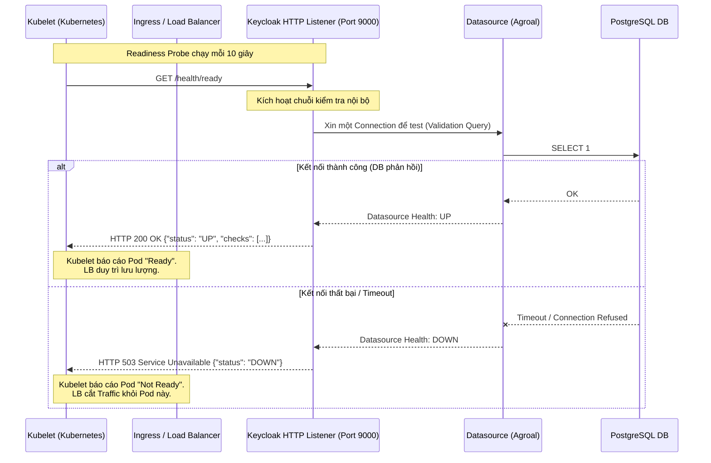

> [!NOTE]
> **Category:** Theory
> **Goal:** Nắm vững kiến trúc, ý nghĩa và cách vận hành cơ chế Health Check nội bộ của Keycloak, đặc biệt trong môi trường điều phối container như Kubernetes.

## 1. Lý thuyết chuyên sâu (Detailed Theory)

Trong một hệ thống phân tán, việc biết được một tiến trình (process) có đang chạy hay không là chưa đủ. Một server Keycloak có thể đang chạy (JVM không crash) nhưng lại hoàn toàn không thể phục vụ các request do mất kết nối Database hoặc cạn kiệt Thread Pool. Đó là lý do hệ thống **Health Check** ra đời.

Keycloak (phiên bản Quarkus) triển khai chuẩn **MicroProfile Health** (được cung cấp bởi thư viện SmallRye Health). Hệ thống này phơi bày các HTTP REST Endpoints để phản ánh trạng thái của Node dựa trên 3 tiêu chí chính:

*   **Liveness (`/health/live`):** Trả lời câu hỏi *"Tiến trình này có còn sống và phản hồi cơ bản không?"*. Nếu Liveness fail, hệ thống quản lý (như Kubernetes) hiểu rằng tiến trình bị treo (deadlock/Out of Memory) và sẽ Kill/Restart nó.
*   **Readiness (`/health/ready`):** Trả lời câu hỏi *"Tiến trình này đã sẵn sàng để nhận traffic từ người dùng chưa?"*. Readiness kiểm tra các phụ thuộc nội bộ như: Database connection có mở được không? Cấu hình đã nạp xong chưa? Nếu Readiness fail, tiến trình không bị Restart, nhưng nó sẽ bị gỡ khỏi danh sách của Load Balancer (không cho traffic chảy vào).
*   **Startup (`/health/started`):** Dùng cho các môi trường khởi động chậm. Chỉ khi Startup check trả về OK thì Liveness/Readiness mới bắt đầu được gọi để tránh việc Restart nhầm một server đang mất nhiều thời gian để khởi động.

## 2. Luồng nội bộ & Cơ chế cấp thấp (Internal Workflow & Low-level Mechanisms)

Dưới đây là luồng hoạt động khi Kubernetes (Kubelet) thực hiện ping thăm dò trạng thái (probe) vào một Pod Keycloak.



*Trong đó:* Liveness check thường đơn giản hơn nhiều so với Readiness. Liveness chỉ cần kiểm tra xem Quarkus HTTP Engine có còn nhận request hay không, hiếm khi gọi sâu xuống DB để tránh tạo tải dư thừa.

## 3. Thực hành tốt nhất & Bảo mật (Best Practices & Security)

*   **Tách biệt cổng Management (Port Separation):** Kể từ Keycloak 18+, các endpoint như `/health` và `/metrics` nên được phơi bày qua một cổng (port) riêng biệt (mặc định là 9000), tách hẳn với cổng phục vụ người dùng (mặc định 8080/8443).
*   **Không bao giờ Expose Health Check ra Public Internet:** Endpoint `/health` có thể tiết lộ thông tin về cấu trúc bên trong (ví dụ: tên database, trạng thái cache), tạo lỗ hổng Information Disclosure. Chỉ cho phép truy cập từ các dải IP nội bộ của hệ thống Monitoring/Kubernetes.
*   **Tinh chỉnh Timeout cho Probe:** Nếu kết nối DB chậm nhưng không đứt, một Readiness Probe quá ngặt nghèo (timeout 1s) có thể khiến K8s hiểu nhầm và cắt traffic liên tục, gây ra hiệu ứng "Flapping".

## 4. Cấu hình minh họa thực tế (Configuration Examples)

Kích hoạt Health Check trong file `keycloak.conf` hoặc bằng Environment Variable:
`KC_HEALTH_ENABLED=true`

Cấu hình cho Kubernetes Liveness và Readiness Probes trong file `Deployment.yaml`:

```yaml
spec:
  containers:
  - name: keycloak
    image: quay.io/keycloak/keycloak:latest
    ports:
      - containerPort: 8080 # Public HTTP
      - containerPort: 9000 # Management Port
    readinessProbe:
      httpGet:
        path: /health/ready
        port: 9000
      initialDelaySeconds: 20
      periodSeconds: 10
      timeoutSeconds: 2
    livenessProbe:
      httpGet:
        path: /health/live
        port: 9000
      initialDelaySeconds: 20
      periodSeconds: 30
      timeoutSeconds: 2
```

## 5. Trường hợp ngoại lệ (Edge Cases)

*   **Kết nối DB bị treo (Connection Pool Exhaustion):** Nếu tất cả các thread kết nối đến Database đang bận xử lý (hoặc bị block do dead-lock), khi Readiness Probe gọi `/health/ready`, nó không thể lấy được connection từ Agroal Connection Pool để test. Việc này sẽ dẫn đến Timeout. Kubernetes sẽ đánh dấu Pod là Not Ready. Đây là một hành vi *có chủ đích* và chuẩn xác, giúp cắt nguồn traffic vào một Pod đang quá tải.
*   **Mất đồng bộ thời gian khởi động (Startup Time Mismatch):** Nếu Keycloak mất 40 giây để migrate Database (Flyway) trong lần đầu chạy, nhưng `initialDelaySeconds` của Liveness Probe chỉ thiết lập 10 giây. Kubelet sẽ ping fail liên tục và Kill Pod trước khi nó kịp khởi động xong. *Khắc phục:* Sử dụng `startupProbe` để chặn Kubelet không kích hoạt Liveness cho đến khi quá trình khởi động thực sự hoàn thành.

## 6. Câu hỏi Phỏng vấn (Interview Questions)

1.  **Junior:** Phân biệt Liveness Probe và Readiness Probe trong ngữ cảnh Keycloak?
    *   *Đáp án:* Liveness để kiểm tra xem tiến trình có sống không (nếu fail -> restart pod). Readiness kiểm tra xem có xử lý được logic nghiệp vụ/kết nối DB không (nếu fail -> ngừng nhận traffic mới từ Load Balancer, không restart).
2.  **Junior:** Làm thế nào để kích hoạt Health endpoint trên Keycloak bản Quarkus?
    *   *Đáp án:* Truyền cờ start-up flag `--health-enabled=true` hoặc set biến môi trường `KC_HEALTH_ENABLED=true`.
3.  **Senior:** Tại sao việc kết hợp chung Liveness Probe và việc test Database Connection là một "Anti-pattern" (Sai lầm thiết kế)?
    *   *Đáp án:* Liveness Probe quyết định việc Restart Pod. Nếu DB bị sập ngắn hạn (network glitch 5s), mà Liveness Probe lại test gọi DB và fail, nó sẽ ép K8s Kill và Restart toàn bộ cluster Keycloak. Điều này làm tồi tệ thêm tình hình. Liveness nên giữ đơn giản, chỉ kiểm tra JVM/HTTP thread. Việc test DB thuộc về Readiness Probe.
4.  **Senior:** Nếu hệ thống có nhiều node Infinispan (Clustering), endpoint `/health/ready` xử lý trạng thái Cluster như thế nào?
    *   *Đáp án:* Nếu Keycloak được cấu hình HA (High Availability), SmallRye Health sẽ gọi vào Infinispan health checks nội bộ. Nếu node hiện tại mất split-brain hoặc rớt khỏi cluster, health check sẽ báo DOWN để không nhận traffic của người dùng, tránh gây Data Inconsistency.

## 7. Tài liệu tham khảo (References)

*   [Keycloak Docs: Configuring metrics and health endpoints](https://www.keycloak.org/server/observability)
*   [MicroProfile Health Specification](https://microprofile.io/project/eclipse/microprofile-health)
*   [Kubernetes: Configure Liveness, Readiness and Startup Probes](https://kubernetes.io/docs/tasks/configure-pod-container/configure-liveness-readiness-startup-probes/)
