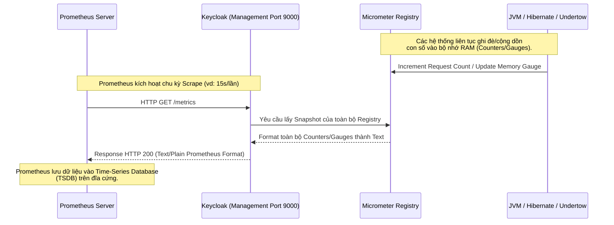

> [!NOTE]
> **Category:** Theory
> **Goal:** Nắm vững cơ chế xuất dữ liệu Metric chuẩn Prometheus bằng Micrometer trong Keycloak và các chỉ số đo lường sống còn đối với hiệu năng hệ thống.

## 1. Lý thuyết chuyên sâu (Detailed Theory)

Trong quản trị định lượng (Observability), **Metrics (Số liệu đo lường)** cung cấp cái nhìn tổng quan về "sức khỏe tổng thể" của hệ thống thông qua các con số thống kê theo thời gian (Time-series data).

Keycloak (Quarkus) sử dụng thư viện **Micrometer** (đóng vai trò như một facade - mặt tiền tương tự SLF4J cho logging) để thu thập dữ liệu và phơi bày chúng dưới định dạng văn bản chuẩn của **Prometheus**. Một số loại Metrics cốt lõi được xuất ra bao gồm:

*   **JVM Metrics:** Trạng thái Heap Memory, Non-Heap, Garbage Collection (GC) pauses, số lượng active threads.
*   **Hibernate & Agroal Metrics:** Tình trạng Connection Pool (số lượng connection đang dùng, đang rảnh), bộ đệm L2 Cache của Hibernate, thời gian thực thi Query.
*   **HTTP Server Metrics:** Số lượng request (Requests count), thời gian phản hồi (Response latency), mã lỗi (HTTP 500, 4xx).
*   **Infinispan / Cluster Metrics:** Trạng thái phân mảnh bộ nhớ (Cache replication), độ trễ đồng bộ dữ liệu giữa các node Keycloak.

Cấu trúc một dòng metric chuẩn Prometheus:
`<metric_name>{<label_name>="<label_value>", ...} <metric_value>`
*Ví dụ:* `http_server_requests_seconds_count{method="GET", status="200"} 15423`

## 2. Luồng nội bộ & Cơ chế cấp thấp (Internal Workflow & Low-level Mechanisms)

Hệ thống theo dõi Metrics vận hành theo mô hình **Pull-based** (kéo dữ liệu) thay vì Push (đẩy).



*Cơ chế cực nhẹ (Lightweight):* Việc update giá trị metrics (ví dụ: `counter.increment()`) trong JVM được thực hiện bởi các nguyên hàm phần cứng (như thao tác CAS - Compare And Swap, Atomic integers), hoàn toàn không khóa (lock-free) gây ảnh hưởng tới tiến trình nghiệp vụ.

## 3. Thực hành tốt nhất & Bảo mật (Best Practices & Security)

*   **Bảo mật đường truyền Metrics:** Route `/metrics` chứa cực kỳ nhiều thông tin nhạy cảm. Phải chạy cổng management 9000 trên mạng nội bộ (Internal VPC), hoặc cấu hình Mutual TLS (mTLS) và Token Authentication trên Prometheus Scraper.
*   **Cẩn trọng với Cardinality Explosion (Sự bùng nổ thẻ gắn):** Không bao giờ đưa các dữ liệu động, ngẫu nhiên (ví dụ: User ID, Client ID động, Session ID) vào Label của Metric.
    *   *Ví dụ xấu:* `http_requests{path="/api/users/123"}`, `http_requests{path="/api/users/456"}`
    *   Việc này sẽ tạo ra hàng triệu chuỗi Time-series độc lập trong TSDB của Prometheus, làm cạn kiệt RAM và làm sập máy chủ giám sát (OOM Killed). Các đường dẫn cần được chuẩn hóa (Templated path: `/api/users/{id}`).

## 4. Cấu hình minh họa thực tế (Configuration Examples)

Kích hoạt Metrics trên Keycloak:
`KC_METRICS_ENABLED=true`

Ví dụ cấu hình một `Scrape Job` trong tệp `prometheus.yml` để Prometheus chủ động kéo dữ liệu từ Keycloak:

```yaml
scrape_configs:
  - job_name: 'keycloak_metrics'
    scrape_interval: 15s
    metrics_path: '/metrics'
    static_configs:
      - targets: ['keycloak-server-ip:9000']
```

Một mẫu đồ thị Grafana (PromQL) tính toán số lượng Request lỗi 5xx trên giây:
`sum(rate(http_server_requests_seconds_count{status=~"5.."}[1m])) by (method)`

## 5. Trường hợp ngoại lệ (Edge Cases)

*   **Scrape Timeout do Keycloak quá tải:** Nếu server Keycloak đang bị "Stuck Thread" hoặc "100% CPU", tiến trình trả về nội dung của `/metrics` cũng sẽ bị đình trệ. Prometheus gửi request kéo dữ liệu và bị Timeout (mặc định 10s). TSDB sẽ bị thủng lỗ (Gaps in data) trên đồ thị vào những thời điểm quan trọng nhất (khi sự cố xảy ra). *Cách giảm thiểu:* Phân tách riêng các worker threads cho Management endpoint để nó không dùng chung thread-pool với Business traffic.
*   **Metrics Reset do Pod Restart:** Dữ liệu trong Micrometer là lưu trên RAM. Khi Pod Keycloak bị khởi động lại, các bộ đếm (Counters) sẽ reset về 0. PromQL xử lý việc này bằng hàm `rate()`, tự động hiểu được sự sụt giảm đột ngột và bù đắp tính toán (handling counter resets).

## 6. Câu hỏi Phỏng vấn (Interview Questions)

1.  **Junior:** Mô hình hoạt động của Prometheus để lấy dữ liệu từ Keycloak là Push hay Pull?
    *   *Đáp án:* Là mô hình Pull. Prometheus chủ động gọi HTTP GET định kỳ tới endpoint `/metrics` của Keycloak.
2.  **Junior:** Các định dạng (format) hiển thị dữ liệu của URL `/metrics` trông như thế nào?
    *   *Đáp án:* Đó là văn bản thuần túy (Plain Text), mỗi dòng là một metric và giá trị, kết hợp với các dấu ngoặc nhọn `{}` để lưu danh sách nhãn (labels).
3.  **Senior:** Hiện tượng "High Cardinality" trong hệ thống Metrics là gì và tại sao nó nguy hiểm?
    *   *Đáp án:* Là việc có quá nhiều giá trị Label độc nhất cho một Metric (ví dụ: gắn User IP Address vào Label). Nó làm phình to cấp số nhân số lượng chuỗi thời gian (Time-Series) cần lưu trữ, phá hủy bộ nhớ RAM và làm giảm hiệu năng truy vấn của Prometheus Server.
4.  **Senior:** Nếu muốn theo dõi hiện tượng "Memory Leak" trong Keycloak, bạn sẽ nhìn vào Metric nào?
    *   *Đáp án:* Phân tích JVM Heap Memory Usage (`jvm_memory_used_bytes` kết hợp `area="heap"`). Biểu đồ của memory leak điển hình có dạng "Răng cưa đi lên" (Sawtooth up), các đợt rác bị gom (GC) không thể dọn dẹp sạch làm đáy của biểu đồ nâng dần theo thời gian cho tới khi gặp lỗi OOM.
5.  **Senior:** Micrometer khác gì với OpenTelemetry Metrics?
    *   *Đáp án:* Micrometer là một thư viện phổ biến (đặc biệt trong hệ sinh thái Spring/Quarkus) định dạng chủ yếu hỗ trợ Prometheus. OpenTelemetry là chuẩn công nghiệp W3C mới hơn, không chỉ tập hợp Metrics mà còn Traces và Logs. Tuy nhiên, Micrometer hiện đang hỗ trợ bridge dữ liệu để tương thích với hệ sinh thái OpenTelemetry.

## 7. Tài liệu tham khảo (References)

*   [Keycloak Observability Guide](https://www.keycloak.org/server/observability)
*   [Micrometer Concept Documentation](https://micrometer.io/docs/concepts)
*   [Prometheus Data Model & PromQL](https://prometheus.io/docs/concepts/data_model/)
