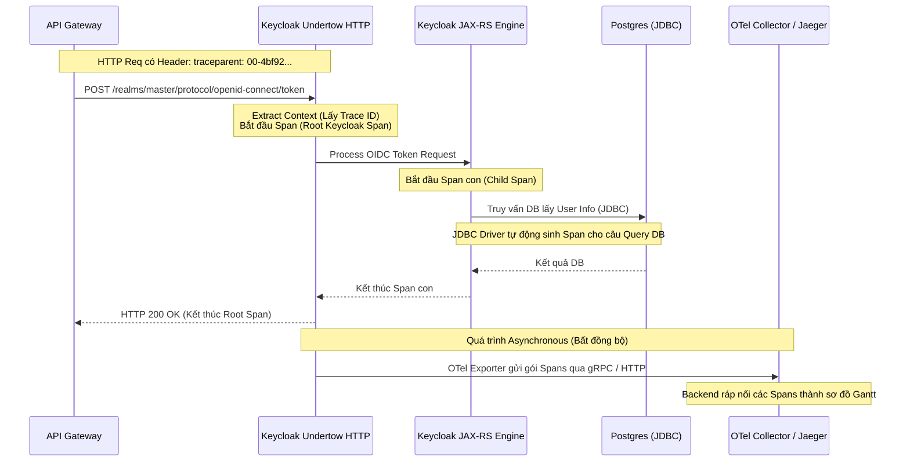

> [!NOTE]
> **Category:** Theory
> **Goal:** Hiểu sâu về Distributed Tracing, chuẩn W3C Trace Context, và cách Keycloak tích hợp OpenTelemetry để theo dõi một Request xuyên suốt hệ thống phân tán.

## 1. Lý thuyết chuyên sâu (Detailed Theory)

Khi hệ thống áp dụng kiến trúc Microservices, một thao tác của người dùng (ví dụ: Đăng nhập) có thể kéo theo chuỗi cuộc gọi HTTP/gRPC đan chéo qua lại giữa nhiều Server (Gateway -> Keycloak -> DB -> Identity Provider ngoài). Logs và Metrics thông thường không đủ để trả lời câu hỏi: *"Trong 5 bước của quy trình đăng nhập chậm 3 giây này, bước nào gây nghẽn cổ chai?"*

**Distributed Tracing (Truy vết phân tán)** ra đời để giải quyết bài toán này. Nó hoạt động dựa trên các nguyên tắc của chuẩn công nghiệp **OpenTelemetry (OTel)**:

*   **Trace (Vết):** Đại diện cho toàn bộ vòng đời của một Request xuyên suốt các hệ thống. Có một `Trace ID` duy nhất sinh ra ở điểm chạm đầu tiên (Gateway).
*   **Span (Khoảng):** Đại diện cho một đơn vị công việc logic bên trong một Trace. Mỗi dịch vụ xử lý request sẽ tạo ra một Span (có `Span ID` riêng), bắt đầu bằng thời gian nhận và kết thúc khi trả kết quả. Một Trace là một cây (Tree) gồm nhiều Spans.
*   **Context Propagation (Lan truyền ngữ cảnh):** Kỹ thuật tiêm (inject) `Trace ID` và `Span ID` của hệ thống cha vào HTTP Headers (chuẩn W3C `traceparent`) để truyền sang hệ thống con. Nhờ đó Backend biết được nó đang thực thi cho luồng công việc nào.

Keycloak hỗ trợ mạnh mẽ OpenTelemetry (OTel) nhờ vào lõi Quarkus. Hệ thống này sử dụng OTel SDK để tự động bọc (instrument) các hàm gọi HTTP, JAX-RS REST endpoints, và truy vấn JDBC vào Database.

## 2. Luồng nội bộ & Cơ chế cấp thấp (Internal Workflow & Low-level Mechanisms)

Quá trình thu thập và xuất Trace từ Keycloak ra bên ngoài (ví dụ tới Jaeger hoặc Grafana Tempo).



*Cơ chế xuất (Exporting):* Gửi telemetry data không thực thi đồng bộ với User request. Các Spans được đưa vào một Batch buffer trên RAM, sau đó các luồng công việc ngầm (Background thread) sẽ dùng giao thức gRPC đẩy dữ liệu ra OTel Collector theo chu kỳ, do đó độ trễ tác động vào ứng dụng gần như bằng 0 (Zero overhead).

## 3. Thực hành tốt nhất & Bảo mật (Best Practices & Security)

*   **Sử dụng OTel Collector thay vì gửi trực tiếp:** Keycloak không nên cấu hình để đẩy Trace trực tiếp tới Backend như Jaeger hay Elastic. Cấu hình Keycloak đẩy dữ liệu vào một thành phần trung gian gọi là **OpenTelemetry Collector** (cài đặt như một sidecar hoặc DaemonSet). Collector sẽ chịu trách nhiệm retry, lọc, batching, và định tuyến tới Backend lưu trữ.
*   **Kiểm soát Sampling Rate (Tỷ lệ lấy mẫu):** Trên môi trường Production có hàng chục ngàn Request mỗi giây, việc Trace 100% Request sẽ ngốn sạch bộ nhớ và CPU của hạ tầng Monitoring. Bạn BẮT BUỘC phải dùng `Probability Sampler` (Ví dụ: chỉ lấy mẫu ngẫu nhiên 5% - `0.05` tổng số Requests).
> [!WARNING]
> Cẩn thận với rò rỉ dữ liệu (Data Leakage) trong Spans. JDBC Tracing có thể vô tình đính kèm các câu lệnh SQL hoàn chỉnh chứa tham số nhạy cảm (như thông tin cá nhân, Password Hash) vào Attributes của Span.

## 4. Cấu hình minh họa thực tế (Configuration Examples)

Kích hoạt và cấu hình OpenTelemetry trong file `keycloak.conf`:

```properties
# Bật tính năng Tracing
KC_TRACING_ENABLED=true

# Cấu hình địa chỉ OTel Collector (thường dùng cổng chuẩn gRPC 4317 hoặc HTTP 4318)
KC_TRACING_EXPORTER_OTLP_ENDPOINT=http://otel-collector.observability.svc.cluster.local:4317

# Cấu hình giao thức xuất (grpc hoặc http/protobuf)
KC_TRACING_EXPORTER_OTLP_PROTOCOL=grpc

# Chiến lược Sampling: probability (lấy xác suất ngẫu nhiên)
KC_TRACING_SAMPLER_TYPE=probability
# Lấy mẫu 10% các luồng
KC_TRACING_SAMPLER_PROBABILITY=0.1
```

## 5. Trường hợp ngoại lệ (Edge Cases)

*   **Mất dấu Trace (Broken Trace):** Nếu Keycloak gọi đến một Identity Provider bên ngoài (như Facebook Login) hoặc một hệ thống legacy (Mã nguồn cũ chưa hỗ trợ chuẩn W3C `traceparent` Header), ngữ cảnh Trace sẽ bị chặt đứt. Các Spans thực thi tại hệ thống legacy đó sẽ trở thành "mồ côi" (Orphan spans) hoặc bắt đầu một Trace ID hoàn toàn mới.
*   **OTel Collector bị Crash / Mạng tắc nghẽn:** Buffer lưu trữ Spans trên RAM của Keycloak sẽ đầy (Ring Buffer Full). Lúc này, OTel SDK sẽ quyết định chủ động rớt bỏ (Drop) các Spans mới để tự bảo vệ sự ổn định của Keycloak, đánh đổi bằng việc mất dữ liệu giám sát.

## 6. Câu hỏi Phỏng vấn (Interview Questions)

1.  **Junior:** Phân biệt `Trace` và `Span` trong Distributed Tracing?
    *   *Đáp án:* Trace đại diện cho toàn bộ hành trình của một giao dịch đi qua nhiều hệ thống. Span là một đoạn đường đi cụ thể, một đơn vị công việc bên trong Trace đó (như gọi API A, gọi DB B).
2.  **Junior:** Kỹ thuật `Context Propagation` thực hiện việc gì?
    *   *Đáp án:* Là việc truyền các mã định danh của Trace (Trace ID, Span ID) qua lại giữa các máy chủ khác nhau thông qua các HTTP Headers (VD: chuẩn W3C `traceparent`) để giữ tính liền mạch.
3.  **Senior:** Tại sao không nên Trace 100% Request trên môi trường Production?
    *   *Đáp án:* Quá trình khởi tạo object Span, gắn Label/Attribute và Export qua mạng dù nhẹ nhưng khi nhân với lượng lớn traffic sẽ tạo ra Overhead (Network I/O, Garbage Collection). Hơn nữa, ổ cứng của hệ thống Monitoring cũng không thể chịu nổi lượng dữ liệu khổng lồ đó. Giải pháp là Sampling (Head-based hoặc Tail-based sampling).
4.  **Senior:** Keycloak làm thế nào để xuất dữ liệu Span ra ngoài mà không làm chậm việc phản hồi (Response) lại cho User?
    *   *Đáp án:* OpenTelemetry sử dụng kỹ thuật Asynchronous Batch Exporting. Spans được thu thập đồng bộ nhưng xuất ra Collector thông qua một background thread riêng biệt nằm ngoài luồng phục vụ HTTP.
5.  **Senior:** Nếu hệ thống của bạn sử dụng Kafka làm phương tiện giao tiếp Asynchronous giữa các Microservices thay vì HTTP REST, Distributed Tracing hoạt động thế nào?
    *   *Đáp án:* Cơ chế Context Propagation vẫn được áp dụng, nhưng thay vì nhúng vào HTTP Header, Trace ID sẽ được nhúng vào Kafka Message Headers. Các SDK của OTel hỗ trợ việc bọc (instrument) Kafka Producer và Consumer để chiết xuất ID và nối tiếp luồng Trace.

## 7. Tài liệu tham khảo (References)

*   [Keycloak Docs: OpenTelemetry Distributed Tracing](https://www.keycloak.org/server/observability)
*   [OpenTelemetry Official Documentation](https://opentelemetry.io/docs/)
*   [W3C Trace Context Specification](https://www.w3.org/TR/trace-context/)
