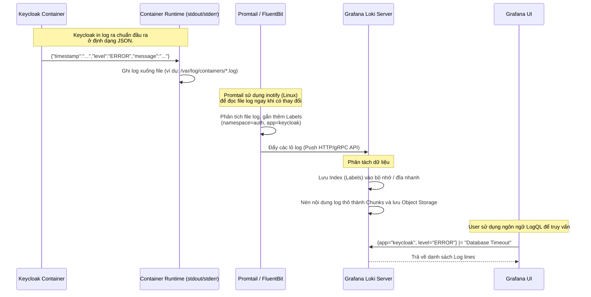

> [!NOTE]
> **Category:** Theory
> **Goal:** Nắm vững triết lý thiết kế, kiến trúc luồng dữ liệu của Grafana Loki trong việc thu thập và phân tích Logs (nhật ký hệ thống) tập trung từ Keycloak.

## 1. Lý thuyết chuyên sâu (Detailed Theory)

Trong một kiến trúc Cloud-native, việc đọc file log phân tán trên từng Pod/Server bằng lệnh `tail -f` là điều bất khả thi và thiếu an toàn. Giải pháp là sử dụng một hệ thống **Log Aggregation (Gom cụm nhật ký)**.

**Grafana Loki** là hệ thống quản lý nhật ký được thiết kế với triết lý tối giản: **"Prometheus for Logs"**.
Điểm khác biệt cốt lõi của Loki so với Elasticsearch (ELK Stack):
*   **Không lập chỉ mục toàn văn bản (No Full-text Indexing):** ELK Stack phân tích và lập chỉ mục từng từ trong file log (Rất tốn CPU và RAM). Loki chỉ lập chỉ mục cho các **Labels (Nhãn)** tương tự như Prometheus (ví dụ: `app="keycloak"`, `level="error"`, `pod="kc-node-1"`). Nội dung thực sự của log được nén lại thành các khối nguyên thủy và lưu trữ thô.
*   Điều này giúp Loki tiêu thụ bộ nhớ rất thấp, tốc độ ghi (Ingestion) cực nhanh, nhưng đổi lại, tốc độ tìm kiếm chuỗi ký tự tự do trong log sẽ chậm hơn Elasticsearch.

Một Stack chuẩn thường kết hợp Loki với một **Agent thu thập log** (phổ biến nhất là **Promtail** hoặc **FluentBit**). Agent này nằm trên Server/Node của hệ thống, cào file log và gửi lên máy chủ Loki.

## 2. Luồng nội bộ & Cơ chế cấp thấp (Internal Workflow & Low-level Mechanisms)

Quá trình luân chuyển dữ liệu Log từ một Container Keycloak đến giao diện Grafana.



*Ngôn ngữ LogQL:* Truy vấn Log của Loki có hai phần. Phần Selector (ví dụ: `{app="keycloak"}`) sẽ tận dụng Index để thu hẹp vùng không gian cần tìm kiếm rất nhanh chóng. Phần Pipeline (ví dụ: `|= "Database Timeout"`) sẽ phải duyệt text thô thông qua cơ chế quét toàn diện (Brute-force scan) trên các khối log đã lọc.

## 3. Thực hành tốt nhất & Bảo mật (Best Practices & Security)

*   **Sử dụng JSON Log Format:** Định dạng log mặc định của Keycloak là văn bản không có cấu trúc (Unstructured text). Để Loki / Promtail có thể bóc tách dễ dàng các trường như `level`, `loggerName`, `thread`, bạn BẮT BUỘC phải chuyển cấu hình output của Keycloak sang định dạng JSON.
*   **Đồng nhất Label với Prometheus:** Sức mạnh lớn nhất của hệ sinh thái Grafana là khả năng liên kết giữa Metrics và Logs. Đảm bảo rằng nhãn mà Promtail gắn vào log (ví dụ: `pod`, `namespace`, `cluster`) phải khớp 100% với nhãn cấu hình trong Prometheus. Khi đó, nếu bạn thấy một đỉnh nhọn (Spike) lỗi 500 trên biểu đồ Metrics, chỉ cần một click chuột để xem toàn bộ file Log của cái Pod đang gây ra lỗi đó.
*   **Tránh High Cardinality ở Labels:** Vì Loki index dựa trên Label, nếu bạn tạo ra các Label có giá trị độc nhất và thay đổi liên tục (như `request_id`, `user_ip`), chỉ mục (Index) của Loki sẽ bùng nổ kích thước (Index Explosion) làm sập hệ thống. Những giá trị động này CHỈ được nằm trong phần text của nội dung Log, không được cấu hình thành Label.

## 4. Cấu hình minh họa thực tế (Configuration Examples)

Kích hoạt định dạng log JSON trong môi trường Keycloak (Quarkus):
`KC_LOG_CONSOLE_OUTPUT=json`

Ví dụ cấu hình một job thu thập trong `promtail-config.yaml` để lấy log từ các Pods của Keycloak trên Kubernetes:

```yaml
scrape_configs:
- job_name: kubernetes-pods
  kubernetes_sd_configs:
  - role: pod
  relabel_configs:
  - source_labels: [__meta_kubernetes_pod_label_app]
    action: keep
    regex: keycloak
  - source_labels: [__meta_kubernetes_pod_name]
    target_label: pod
  - source_labels: [__meta_kubernetes_namespace]
    target_label: namespace
  pipeline_stages:
  - json:
      expressions:
        level: level
        message: message
  - labels:
      level:
```

## 5. Trường hợp ngoại lệ (Edge Cases)

*   **Out of Order Logs (Log không theo thứ tự thời gian):** Nếu bạn có nhiều luồng (threads) ghi log quá nhanh, hoặc mạng chậm khiến Agent gửi lô log cũ lên sau khi lô log mới đã được nhận, Loki trước đây sẽ từ chối lưu log (lỗi "entry out of order"). *Khắc phục:* Trong cấu hình Loki hiện đại, bạn cần bật cờ `accept_out_of_order` nhưng đổi lại sẽ làm giảm hiệu suất nén khối.
*   **Gây nghẽn hệ thống vì Log DEBUG:** Khi hệ thống có sự cố, quản trị viên bật Log Level của Keycloak lên `DEBUG` hoặc `TRACE`. Tốc độ ghi log sẽ tăng hàng ngàn lần. Container Runtime (Docker) có thể tốn CPU để ghi file, và Agent (Promtail) dùng toàn bộ CPU/Băng thông mạng để đẩy dữ liệu lên Loki.

## 6. Câu hỏi Phỏng vấn (Interview Questions)

1.  **Junior:** Tại sao nên cấu hình Keycloak in log ra màn hình (Console) theo định dạng JSON thay vì Text thuần?
    *   *Đáp án:* Log JSON giúp các công cụ thu thập log (như Promtail, FluentBit) dễ dàng phân tích (parse) tự động các trường dữ liệu như mức độ lỗi (level), thời gian (timestamp) mà không cần phải dùng Regex phức tạp và dễ vỡ.
2.  **Junior:** Sự khác biệt cốt lõi giữa Loki và Elasticsearch là gì?
    *   *Đáp án:* Loki không lập chỉ mục nội dung text của log, nó chỉ lập chỉ mục các nhãn (Labels). Do đó Loki tốn ít tài nguyên và hoạt động nhanh hơn trong việc lưu trữ, phù hợp cho xu hướng Cloud-native, trong khi Elasticsearch mạnh mẽ hơn trong việc tìm kiếm Full-text phân tích ngôn ngữ.
3.  **Senior:** Nếu muốn tìm kiếm tất cả các log có chứa từ "Deadlock" trong hệ thống Loki, câu lệnh LogQL sẽ hoạt động như thế nào ở phía Server?
    *   *Đáp án:* Lệnh thường là `{app="keycloak"} |= "Deadlock"`. Loki sẽ dùng Index (Label `app="keycloak"`) để lọc ra các Chunks log thu thập được từ Keycloak. Sau đó, nó áp dụng cơ chế Brute-force quét tìm chuỗi "Deadlock" trên từng dòng text trong các Chunks đó (Bằng cơ chế Parallel scanning - quét song song đa luồng).
4.  **Senior:** Thế nào là sự cố bùng nổ bộ nhớ "High Cardinality" đối với Loki?
    *   *Đáp án:* Nó xảy ra khi nhà phát triển hoặc cấu hình Promtail vô tình lấy một giá trị biến động (như User ID hoặc Request ID) làm một Label. Loki sẽ phải tạo ra hàng triệu luồng index độc lập (Streams), làm phình to bộ nhớ của Ingester và giảm tốc độ hệ thống nghiêm trọng.
5.  **Senior:** Làm thế nào để nối tiếp một câu lệnh truy vấn giữa Metrics và Logs trong hệ sinh thái Grafana?
    *   *Đáp án:* Dựa vào cơ chế "Label Matching". Đảm bảo rằng tiến trình sinh Metrics (Prometheus) và tiến trình đẩy Logs (Promtail/Loki) áp dụng chung một bộ hệ quy chiếu nhãn (vd: `namespace`, `cluster`, `pod`). Grafana sẽ dựa vào những nhãn chung này để tự động chuyển ngữ cảnh khi người dùng bấm từ biểu đồ sang xem log.

## 7. Tài liệu tham khảo (References)

*   [Keycloak Docs: Configuring Logging](https://www.keycloak.org/server/logging)
*   [Grafana Loki Architecture & Documentation](https://grafana.com/docs/loki/latest/)
*   [LogQL: Log Query Language](https://grafana.com/docs/loki/latest/logql/)
