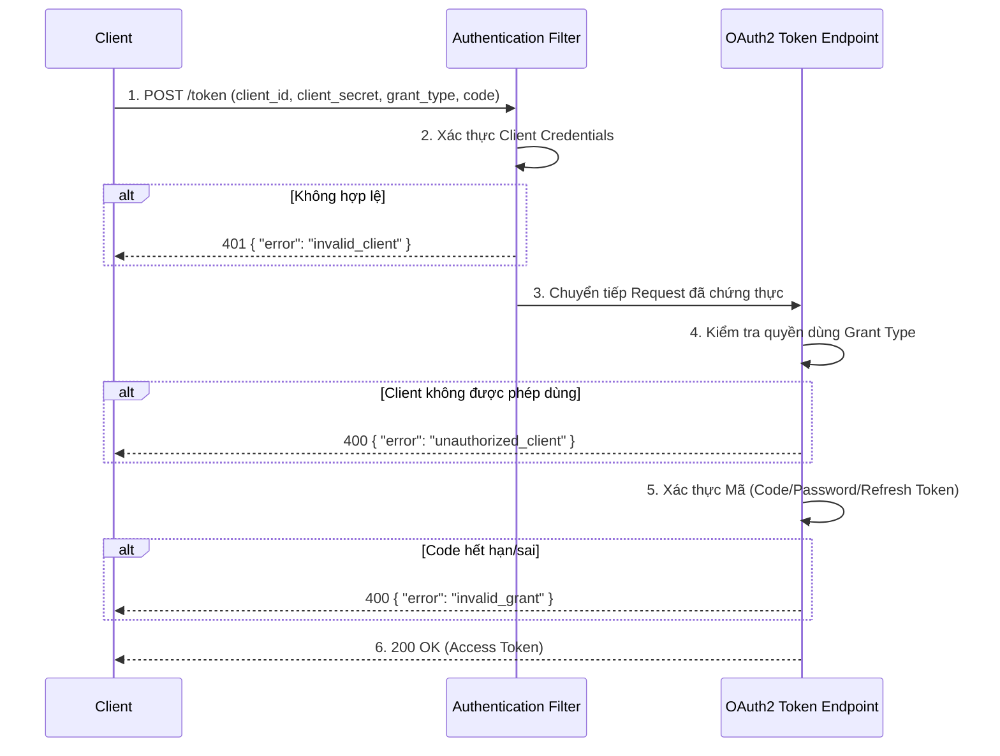

> [!NOTE]
> **Category:** Troubleshooting  
> **Goal:** Nắm vững các mã lỗi tiêu chuẩn của đặc tả OAuth2/OIDC (như `invalid_grant`, `unauthorized_client`), hiểu nguyên nhân gốc rễ và quy trình khắc phục hiệu quả khi tích hợp ứng dụng với Keycloak.

## 1. Lý thuyết chuyên sâu (Detailed Theory)

Khi ứng dụng client (Web, Mobile, Microservice) giao tiếp với Keycloak theo chuẩn OAuth 2.0 hoặc OpenID Connect, các lỗi phát sinh không chỉ dừng lại ở mức HTTP (như 400 Bad Request) mà còn đi kèm với một cấu trúc JSON chi tiết mô tả lỗi.

Đặc tả RFC 6749 định nghĩa rõ ràng các tham số trả về trong Payload lỗi bao gồm: `error` (Mã lỗi tiêu chuẩn) và `error_description` (Mô tả chi tiết nguyên nhân, không bắt buộc nhưng Keycloak thường cung cấp). Việc hiểu đúng các mã lỗi này giúp rút ngắn đáng kể thời gian khoanh vùng sự cố.

Các lỗi OAuth2 chia làm hai nhóm chính:
1. **Lỗi trong quá trình Ủy quyền (Authorization Request):** Xảy ra khi trình duyệt điều hướng tới `/auth`. Keycloak thường hiển thị trực tiếp lỗi trên màn hình UI.
2. **Lỗi trong quá trình Lấy Token (Token Request):** Xảy ra khi Client gọi trực tiếp API `/token`. Keycloak trả về JSON response.

## 2. Luồng nội bộ & Cơ chế cấp thấp (Internal Workflow & Low-level Mechanisms)

Khi xử lý một yêu cầu Token, hệ thống kiểm tra tuần tự nhiều lớp bảo vệ:

**Cơ chế cấp thấp:**
- `invalid_client` bị bẫy ở lớp Filter đầu tiên, nó so khớp Hash của Client Secret trong Database.
- `invalid_grant` thường liên quan đến Session. Keycloak kiểm tra bộ nhớ đệm phân tán (Infinispan) xem Code hoặc Refresh Token còn hiệu lực hay không.

## 3. Thực hành tốt nhất & Bảo mật (Best Practices & Security)

> [!WARNING]
> Không bao giờ để lộ `error_description` gốc từ Keycloak cho End-user trên màn hình ứng dụng của bạn, vì nó có thể chứa các thông tin rò rỉ cấu trúc hệ thống. Chỉ nên log chúng ở phía backend.

- **Kích hoạt Audit Log:** Trong Keycloak Admin Console, bật `Events` để ghi nhận tất cả các thao tác đăng nhập. Logs sẽ cung cấp chi tiết lỗi mà Client bị từ chối.
- **Clock Synchronization:** Đảm bảo tất cả Client và Keycloak Server dùng chung dịch vụ NTP (Network Time Protocol) để tránh lỗi liên quan đến Expired Tokens gây ra sự cố `invalid_grant`.

## 4. Cấu hình minh họa thực tế (Configuration Examples)

### Bảng tra cứu lỗi và cách khắc phục:

**1. `invalid_client`**
- **Nguyên nhân:** Client ID không tồn tại hoặc Client Secret bị sai.
- **Khắc phục:** Vào phần Credentials của Client trên Keycloak, Regenerate Secret và cập nhật lại phía Backend.

**2. `invalid_grant`**
- **Nguyên nhân:** Authorization Code đã hết hạn (thường vòng đời chỉ 1 phút), bị sử dụng lại lần thứ hai, hoặc Refresh Token hết hạn. Clock skew lệch giờ cũng gây lỗi này.
- **Khắc phục:** Code chỉ được đổi 1 lần. Nếu hệ thống tự động đổi fail, yêu cầu người dùng đăng nhập lại. Đồng bộ máy chủ NTP.

**3. `unauthorized_client`**
- **Nguyên nhân:** Client gửi một Grant Type mà nó chưa được kích hoạt. Ví dụ: gửi `grant_type=password` trong khi client không bật "Direct Access Grants Enabled".
- **Khắc phục:** Kích hoạt đúng luồng trong cấu hình Client (Standard Flow, Direct Access, Implicit).

**4. `invalid_scope`**
- **Nguyên nhân:** Yêu cầu một `scope` chưa được cấu hình hoặc gán cho Client.
- **Khắc phục:** Kiểm tra lại Client Scopes được phép trong Keycloak và đảm bảo Request chỉ truyền những tham số hợp lệ.

## 5. Trường hợp ngoại lệ (Edge Cases)

- **Lặp vô hạn (Infinite Redirect Loop):** Xảy ra khi Keycloak và Client không đồng thuận được State hoặc Cookie bị trình duyệt chặn (do SameSite/Third-party cookie policy). Dẫn tới Client liên tục đá qua Keycloak và Keycloak đá lại.
- **Cors Error đè lên OAuth2 Error:** Nếu Front-end gọi trực tiếp endpoint `/token` và sai thông tin, đôi khi nó nhận về lỗi CORS (Cross-Origin) thay vì JSON lỗi. Lý do là khi phát sinh lỗi HTTP 4xx, Keycloak có thể bỏ sót việc gắn Header CORS. Luôn test API qua Postman trước.

## 6. Câu hỏi Phỏng vấn (Interview Questions)

**Câu 1 (Junior):** Ý nghĩa của lỗi `invalid_client` là gì?
*Đáp án:* Client gửi thông tin định danh (thường là client_id và client_secret) không chính xác, hoặc client đó đã bị vô hiệu hóa trên Authorization Server.

**Câu 2 (Junior):** Nếu một Authorization Code được dùng để đổi Token 2 lần liên tiếp, Keycloak sẽ trả về mã lỗi gì?
*Đáp án:* `invalid_grant`.

**Câu 3 (Senior):** Giải thích tại sao lỗi liên quan đến sai lệch thời gian (Clock Skew) lại thường dẫn đến lỗi `invalid_grant` thay vì một lỗi liên quan đến thời gian tường minh?
*Đáp án:* Chuẩn OAuth2 không có mã lỗi riêng cho việc "hết hạn Token". Khi Token hết hạn, Server coi nó là một "Giấy phép (Grant) không hợp lệ". Hệ thống kiểm tra điều kiện `exp` < thời gian hiện tại và trả về mã tổng quát `invalid_grant`.

**Câu 4 (Senior):** Khi Client yêu cầu một `redirect_uri` nhưng nhận được lỗi giao diện Keycloak hiển thị "Invalid redirect uri". Lỗi này xảy ra ở giai đoạn nào và khắc phục ra sao?
*Đáp án:* Xảy ra ở bước Authorization Request (trước khi đăng nhập). Nguyên nhân là tham số URI gửi đi không khớp chính xác 100% với danh sách Valid Redirect URIs định nghĩa trên Keycloak Client settings. Cần cấu hình chính xác (bao gồm cả trailing slash `/`).

**Câu 5 (Senior):** Làm thế nào để điều tra chi tiết một lỗi OAuth2 bí ẩn không có thông điệp cụ thể?
*Đáp án:* Bật debug level cho package `org.keycloak.events` trong tệp cấu hình logging của Keycloak (quarkus properties) và xem lại Event Log trên Admin Console.

## 7. Tài liệu tham khảo (References)
- [OAuth 2.0 Threat Model and Security Considerations - RFC 6819](https://datatracker.ietf.org/doc/html/rfc6819)
- [OAuth 2.0 Authorization Framework - RFC 6749 Section 5.2](https://datatracker.ietf.org/doc/html/rfc6749#section-5.2)
- [Keycloak Troubleshooting Guide](https://www.keycloak.org/docs/latest/server_admin/#troubleshooting)
