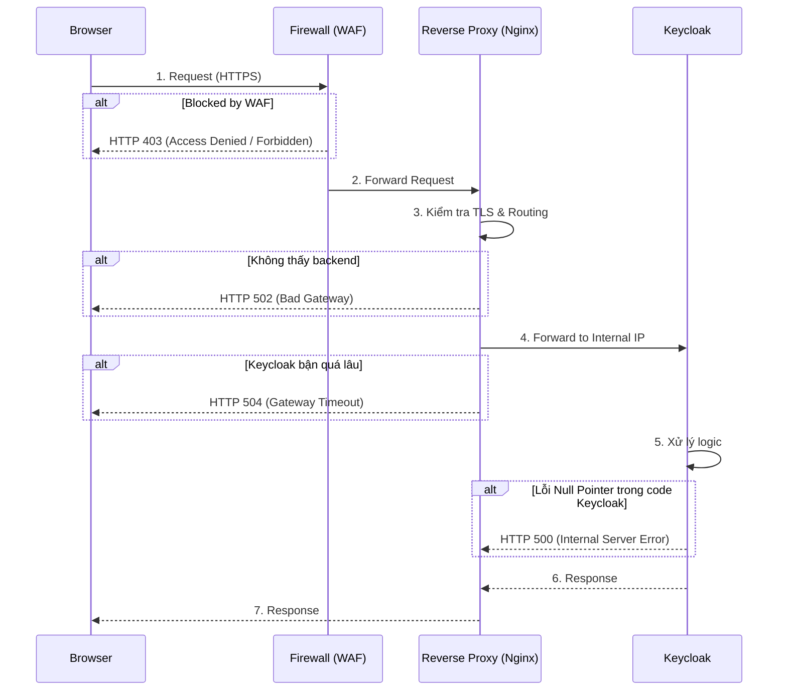

> [!NOTE]
> **Category:** Troubleshooting  
> **Goal:** Phân tích, chuẩn đoán và xử lý các lỗi HTTP Status Codes (4xx, 5xx) thường gặp khi vận hành Keycloak độc lập hoặc phía sau các Reverse Proxy / Load Balancer.

## 1. Lý thuyết chuyên sâu (Detailed Theory)

Trong một kiến trúc mạng hiện đại, Keycloak hiếm khi được mở trực tiếp ra mạng Internet. Thay vào đó, nó thường đứng sau một Reverse Proxy (như Nginx, Apache) hoặc một Ingress Controller (trong Kubernetes). 

Khi có sự cố kết nối, các phản hồi lỗi HTTP 4xx hoặc 5xx có thể được tạo ra bởi **chính Keycloak**, hoặc bởi **Reverse Proxy**, hoặc bởi **bức tường lửa (WAF/Firewall)**. Việc xác định thành phần nào trong chuỗi mạng sinh ra lỗi là kỹ năng sinh tồn tối quan trọng của kỹ sư vận hành.

Phân loại mã lỗi tiêu chuẩn:
- **HTTP 400, 401, 403, 404:** Thường liên quan đến phía Client gửi yêu cầu sai, thiếu quyền, hoặc cấu hình sai ở cấp độ Proxy/Keycloak.
- **HTTP 500, 502, 503, 504:** Lỗi cấp độ Server. Dịch vụ sụp đổ, quá tải, quá thời gian (Timeout), hoặc giao tiếp giữa Proxy và Keycloak bị gián đoạn.

## 2. Luồng nội bộ & Cơ chế cấp thấp (Internal Workflow & Low-level Mechanisms)

Để minh họa nguyên nhân phát sinh HTTP Errors, hãy xem xét luồng giao tiếp tiêu chuẩn:



**Cơ chế cấp thấp:**
Reverse Proxy duy trì các "bể" kết nối (connection pools) với backend. HTTP 502 xảy ra khi Socket TCP đến Keycloak bị từ chối kết nối (Connection Refused). HTTP 504 xảy ra khi kết nối TCP thành công, nhưng Keycloak không gửi lại dữ liệu trước khi bộ đếm thời gian (Proxy Timeout) đếm ngược về không.

## 3. Thực hành tốt nhất & Bảo mật (Best Practices & Security)

> [!IMPORTANT]
> Lỗi kinh điển khi đặt Keycloak sau Proxy là thiết lập Header sai lệch, khiến Keycloak nhận diện sai Protocol (HTTP thay vì HTTPS), dẫn đến lỗi vô tận "Mixed Content" và vòng lặp chuyển hướng. Bắt buộc phải cấu hình biến môi trường `KC_PROXY=edge` (hoặc `reencrypt`).

- **Ghi log header X-Forwarded-For:** Đảm bảo Proxy luôn gắn IP thật của Client vào header trước khi đẩy cho Keycloak để phục vụ Auditing và Brute-Force protection.
- **Tùy biến trang lỗi (Custom Error Pages):** Ẩn các trang hiển thị lỗi mặc định của Nginx/Tomcat chứa phiên bản phần mềm. Những thông tin này giúp tin tặc tìm lỗ hổng 1-day/0-day nhanh chóng.

## 4. Cấu hình minh họa thực tế (Configuration Examples)

### Chuẩn đoán qua danh sách lỗi:

**1. HTTP 502 Bad Gateway**
- **Chuẩn đoán:** Nginx/Proxy không thể kết nối tới port của Keycloak (thường là 8080). Keycloak có thể đã sập (OOM), chưa khởi động xong, hoặc cấu hình IP backend trong Proxy bị sai.
- **Xử lý:** Kiểm tra trạng thái tiến trình `systemctl status keycloak` hoặc docker container. Đảm bảo cổng đang được lắng nghe: `netstat -tulpn | grep 8080`.

**2. HTTP 504 Gateway Timeout**
- **Chuẩn đoán:** Nginx gửi request thành công nhưng Keycloak kẹt quá lâu không trả lời. Thường do truy vấn Database bị block, hoặc tải CPU lên 100%.
- **Xử lý:** Tăng thông số `proxy_read_timeout` trên Nginx nếu tác vụ nặng. Kiểm tra Deadlock trên Database hoặc thread dumps trên JVM.

**3. HTTP 403 Forbidden**
- **Chuẩn đoán:** Nếu lỗi trả về từ Nginx (hoặc WAF): Địa chỉ IP đã bị ban, quy tắc mod_security chặn các ký tự lạ. Nếu lỗi trả về từ Keycloak: Tài khoản không có quyền, hoặc thiếu thiết lập Header `X-Forwarded-Proto`.
- **Xử lý:** Kiểm tra Access Log của Nginx xem ai trả lời. Bổ sung các header sau trên Proxy:
  ```nginx
  proxy_set_header X-Forwarded-For $proxy_add_x_forwarded_for;
  proxy_set_header X-Forwarded-Proto $scheme;
  proxy_set_header X-Forwarded-Host $host;
  ```

**4. HTTP 400 Bad Request (Header Too Large)**
- **Chuẩn đoán:** Session Cookie hoặc token phình to khiến tổng dung lượng HTTP Header vượt qua giới hạn của máy chủ Proxy.
- **Xử lý:** Tăng `large_client_header_buffers` trong cấu hình Nginx. Tối ưu hóa số lượng Role/Group của người dùng trong Keycloak để giảm kích cỡ Cookie/Token.

## 5. Trường hợp ngoại lệ (Edge Cases)

- **HTTP 431 Request Header Fields Too Large:** Tương tự 400 nhưng cụ thể hơn ở cấp độ framework. Spring Boot proxy hoặc Keycloak Quarkus sẽ trả về lỗi này trực tiếp. Cần chỉnh sửa thuộc tính máy chủ trong quarkus properties.
- **Lỗi hiển thị HTTPS nhưng redirect HTTP:** Nếu bạn vào HTTPS, nhưng khi Keycloak redirect đăng nhập lại về HTTP, đó là lỗi 100% do thiếu `KC_PROXY` cấu hình, khiến Keycloak tin rằng nó đang phục vụ giao thức HTTP nội bộ.

## 6. Câu hỏi Phỏng vấn (Interview Questions)

**Câu 1 (Junior):** Phân biệt ý nghĩa gốc của lỗi HTTP 502 và HTTP 504?
*Đáp án:* 502 là Proxy không kết nối được với Server (Server sập/sai mạng). 504 là kết nối được, nhưng Server phản hồi quá lâu vượt quá Timeout.

**Câu 2 (Junior):** Nếu nhận lỗi HTTP 404 Not Found ngay khi truy cập trang chính của Keycloak, bạn nghĩ đến điều gì đầu tiên?
*Đáp án:* Truy cập sai URL (ví dụ: Keycloak 17+ bỏ tiền tố `/auth` nên `/auth/realms/master` bị 404, chỉ còn `/realms/master`), hoặc cấu hình Ingress/Proxy route bị sai đường dẫn.

**Câu 3 (Senior):** Làm thế nào để biết một lỗi HTTP là do Nginx sinh ra hay do bản thân mã nguồn của Keycloak sinh ra?
*Đáp án:* Nginx có định dạng trang lỗi chuẩn có ghi rõ chữ "nginx" nếu chưa custom. Cách tốt nhất là xem xét HTTP Response Header: trường `Server` trả về là gì, hoặc kiểm tra song song `access.log` của nginx và server log của keycloak xem có khớp request ID không.

**Câu 4 (Senior):** Tác dụng của Header `X-Forwarded-Proto` là gì trong cấu trúc ủy quyền OAuth2 phía sau Reverse Proxy?
*Đáp án:* Nó nói cho Keycloak biết giao thức đầu cuối phía người dùng là HTTPS hay HTTP. Keycloak cần thông tin này để tự sinh ra chính xác các URL đính kèm trong các response như Issuer URI, Redirect Location, v.v.

**Câu 5 (Senior):** Nếu bạn gặp HTTP 500 xuất hiện cục bộ (chỉ 1 vài user bị) trong Keycloak, bạn tiếp cận vấn đề thế nào?
*Đáp án:* HTTP 500 là lỗi Logic / Lỗi hệ thống mã nguồn. Ngay lập tức khoanh vùng thời gian xảy ra lỗi, và trích xuất file log của Keycloak (`server.log` hoặc console docker). Tìm cụm từ `ERROR` kèm theo Stacktrace của Java (NullPointerException, SQLException...) để biết hàm nào chết.

## 7. Tài liệu tham khảo (References)
- [RFC 9110: HTTP Semantics](https://datatracker.ietf.org/doc/html/rfc9110)
- [Keycloak Guide - Using a reverse proxy](https://www.keycloak.org/server/reverseproxy)
- [Nginx Reverse Proxy Documentation](https://docs.nginx.com/nginx/admin-guide/web-server/reverse-proxy/)
