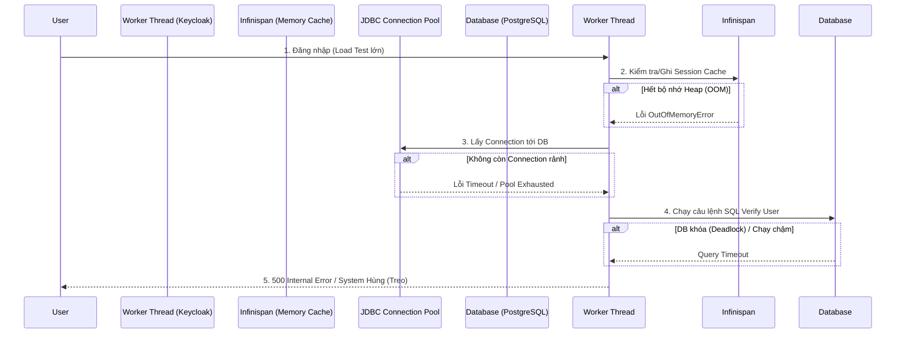

> [!NOTE]
> **Category:** Troubleshooting  
> **Goal:** Chuẩn đoán, phân tích và khắc phục triệt để các sự cố ở cấp độ nền tảng hệ thống (System-level) của Keycloak bao gồm: Cơ sở dữ liệu (Database), Bộ nhớ JVM, và Sự cố Mạng (Network).

## 1. Lý thuyết chuyên sâu (Detailed Theory)

Ngoài các lỗi logic nghiệp vụ và giao thức HTTP, sự ổn định của Keycloak phụ thuộc hoàn toàn vào cơ sở hạ tầng mà nó đang chạy. Là một ứng dụng Java phân tán mạnh mẽ, Keycloak cần ba trụ cột:
- **JVM (Java Virtual Machine):** Quản lý bộ nhớ heap, rác (Garbage Collection), và luồng xử lý (Threads).
- **Database (Cơ sở dữ liệu Quan hệ):** Lưu trữ cấu hình dài hạn, người dùng, clients.
- **Infinispan / JGroups (Bộ nhớ Đệm & Network):** Đồng bộ hóa trạng thái phiên làm việc giữa các Cluster Nodes của Keycloak.

Khi một trong ba trụ cột này sụp đổ, bạn sẽ đối mặt với các lỗi toàn hệ thống cực kỳ nghiêm trọng, dẫn đến Downtime (thời gian chết) hệ thống diện rộng. Việc xử lý đòi hỏi khả năng đọc hiểu log hệ thống và hiểu cấu trúc cấu hình tài nguyên của OS/JVM.

## 2. Luồng nội bộ & Cơ chế cấp thấp (Internal Workflow & Low-level Mechanisms)

Cấu trúc nội bộ của Keycloak ảnh hưởng trực tiếp đến trạng thái hệ thống, biểu diễn thông qua sơ đồ sau:



**Cơ chế cấp thấp:**
- **Kết nối Cơ sở dữ liệu:** Keycloak không mở kết nối trực tiếp mỗi lần. Nó dùng `Agroal` Connection Pool (trong bản Quarkus). Nếu Pool quá nhỏ, luồng sẽ bị khóa (blocked) chờ.
- **Đồng bộ Cluster:** JGroups sử dụng mạng Multicast/Unicast để truyền bản tin (heartbeat). Nếu gói mạng UDP/TCP bị rớt, hiện tượng Split-brain (vỡ não) xảy ra, các nodes tự động đẩy nhau ra khỏi cluster.

## 3. Thực hành tốt nhất & Bảo mật (Best Practices & Security)

> [!CAUTION]
> Tuyệt đối không để thông số cấp phát bộ nhớ mặc định (Default Heap) khi lên Production. Nếu không cấu hình `Xms` và `Xmx`, hệ điều hành có thể tiêu diệt tiến trình Keycloak bằng OOM Killer của Linux một cách âm thầm, không có bất kỳ log nào được ghi lại.

- **Kích hoạt Metrics:** Luôn cấu hình Prometheus Endpoint trong Keycloak (`KC_METRICS_ENABLED=true`) để theo dõi thông số JVM và DB connection pool qua Grafana.
- **Giới hạn số kết nối:** Số lượng connection lớn nhất của Pool (DB pool size) không được vượt quá số kết nối tối đa cơ sở dữ liệu chấp nhận (max_connections ở PostgreSQL).

## 4. Cấu hình minh họa thực tế (Configuration Examples)

### Danh sách Lỗi Hệ thống và Cách Xử lý:

**1. Lỗi OutOfMemoryError (OOM) / Java Heap Space**
- **Dấu hiệu:** Hệ thống bỗng nhiên giật lag, log in dòng `java.lang.OutOfMemoryError: Java heap space`. Cuối cùng Keycloak crash.
- **Khắc phục:** Tăng kích thước bộ nhớ qua biến môi trường hoặc tham số lệnh.
  ```bash
  # Tăng bộ nhớ lên tối thiểu 2GB, tối đa 4GB
  export JAVA_OPTS_APPEND="-Xms2048m -Xmx4096m -XX:MetaspaceSize=256M"
  bin/kc.sh start
  ```

**2. Lỗi Database Connection Pool Exhausted / Cạn kiệt kết nối**
- **Dấu hiệu:** Lỗi trong file log có nội dung `java.sql.SQLTransientConnectionException: Connection is not available, request timed out after 10000ms`.
- **Khắc phục:** Tăng Pool size và Timeout trong cấu hình Keycloak:
  ```properties
  # quarkus.properties hoặc biến môi trường
  kc.db.pool.initial-size=10
  kc.db.pool.min-size=10
  kc.db.pool.max-size=100
  ```

**3. Lỗi JGroups Cluster Split-Brain / Không tìm thấy nhau**
- **Dấu hiệu:** Các node không đồng bộ được Cache. Lỗi log hiện `TimeoutException` hoặc `MemberLeft`. Người dùng phải đăng nhập lại liên tục vì request văng sang Node chưa có session.
- **Khắc phục:** Chuyển từ giao thức Multicast (UDP) thường bị tường lửa chặn sang TCP PING thông qua biến môi trường (ví dụ sử dụng JDBC_PING cho cloud hoặc DNS_PING cho Kubernetes).

**4. Lỗi Database Lock (Deadlock)**
- **Dấu hiệu:** Giao dịch treo vô thời hạn, log Database cảnh báo "Deadlock detected".
- **Khắc phục:** Nâng cấp Keycloak lên phiên bản mới nhất (có vá lỗi schema). Tối ưu index trên DB và không bao giờ sửa đổi dữ liệu DB thủ công khi Keycloak đang chạy.

## 5. Trường hợp ngoại lệ (Edge Cases)

- **OOM do Session phình to thay vì User:** Dù ít người dùng nhưng nếu mỗi người tạo hàng ngàn Client Sessions độc lập, bộ nhớ Infinispan sẽ đầy. Giải pháp là thiết lập giới hạn `Session Max Lifespan` hợp lý và bật chế độ lưu session offline xuống DB để giảm tải bộ nhớ.
- **Linux OOM Killer:** Nếu Keycloak đột ngột dừng hoàn toàn mà file log không có bất kỳ dòng chữ báo lỗi nào, hãy kiểm tra syslog của Linux: `dmesg -T | grep -i oom`. Bạn sẽ thấy tiến trình bị kernel giết do xin quá RAM vật lý. Cần cấu hình Swap file hoặc giới hạn Xmx thấp hơn RAM thật.

## 6. Câu hỏi Phỏng vấn (Interview Questions)

**Câu 1 (Junior):** Điều gì xảy ra nếu bạn không cấu hình tham số `-Xmx` cho máy chủ Keycloak?
*Đáp án:* JVM sẽ tự động cấp phát bộ nhớ tối đa theo mặc định (thường là 1/4 dung lượng RAM vật lý của máy). Nếu tải cao, Keycloak có thể crash nếu vượt ngưỡng hoặc ăn sạch RAM của các app khác trên cùng máy chủ.

**Câu 2 (Junior):** Lỗi `Connection refused` khi Keycloak kết nối tới Database có ý nghĩa gì?
*Đáp án:* Dịch vụ CSDL chưa chạy, cấu hình IP/Port trong Keycloak bị sai, hoặc tường lửa chặn cổng (ví dụ: port 5432 của PostgreSQL) giữa máy chủ Keycloak và CSDL.

**Câu 3 (Senior):** Giải thích hiện tượng "Connection Pool Leak" và cách nhận biết?
*Đáp án:* Là hiện tượng các luồng ứng dụng mượn kết nối từ Database Pool nhưng bị lỗi không trả lại (hoặc do code tùy chỉnh chưa gọi close()). Dần dần Pool cạn kiệt kết nối, gây ra lỗi `Connection is not available` dù lượng người truy cập rất ít.

**Câu 4 (Senior):** JGroups sử dụng công cụ gì trong Keycloak để giao tiếp mạng, và tại sao nó thường gặp vấn đề trên môi trường Cloud (AWS/Azure)?
*Đáp án:* JGroups mặc định dùng UDP Multicast (`MPING`). Tuy nhiên các hạ tầng Cloud public hầu như đều chặn UDP Multicast vì lý do bảo mật mạng. Do đó phải cấu hình cấu trúc discovery khác như `JDBC_PING` (dùng chung DB để tìm nhau) hoặc `KUBE_PING`/`DNS_PING`.

**Câu 5 (Senior):** Làm thế nào để điều tra một sự cố treo ứng dụng (Thread Hang) thay vì sụp đổ hoàn toàn?
*Đáp án:* Khi ứng dụng bị treo, tiến hành lấy Thread Dump của tiến trình Java bằng công cụ `jstack <pid>`. Dữ liệu sẽ cho thấy tất cả các luồng đang kẹt ở đoạn mã nào (ví dụ đang chờ đọc mạng, chờ khoá DB). Từ đó tra cứu nguyên nhân ngắt luồng.

## 7. Tài liệu tham khảo (References)
- [Keycloak Caching and Clustering Guide](https://www.keycloak.org/server/caching)
- [Oracle JVM Tuning Guide](https://docs.oracle.com/en/java/javase/17/gctuning/)
- [PostgreSQL Performance Tuning](https://wiki.postgresql.org/wiki/Performance_Optimization)
