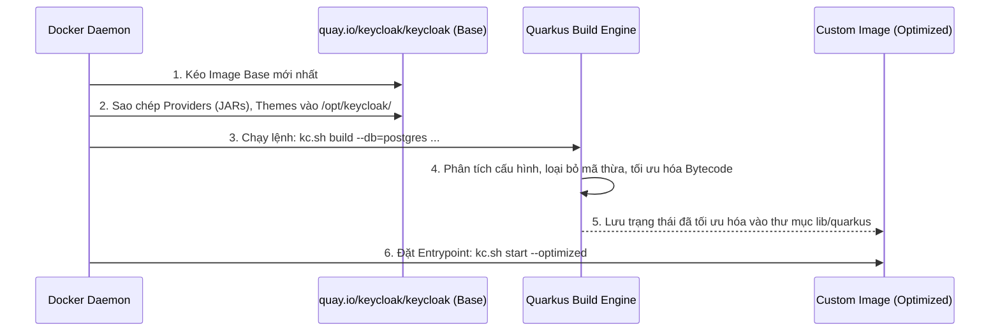

> [!NOTE]
> **Category:** Theory
> **Goal:** Hiểu sâu về cách thức Keycloak tối ưu hóa hiệu suất với Quarkus thông qua quá trình build và lý do tại sao phải tạo Custom Image.

## 1. Lý thuyết chuyên sâu (Detailed Theory)

Từ phiên bản 17, Keycloak đã chuyển đổi hoàn toàn sang kiến trúc sử dụng **Quarkus** thay vì WildFly. Quarkus được thiết kế theo triết lý "Container First", giúp tối ưu hóa thời gian khởi động (Startup Time) và tiết kiệm tài nguyên bộ nhớ (Memory Footprint). 

Trong kiến trúc mới này, Keycloak chia vòng đời chạy thành hai giai đoạn rõ rệt: **Build time** và **Runtime**. 
- **Build time:** Keycloak sẽ biên dịch trước các cấu hình tĩnh (như Database Vendor, Metrics, Health Checks, Caching providers) thành một bản phân phối được tối ưu hóa (Optimized Distribution). Quá trình này thay đổi cấu trúc mã Bytecode của ứng dụng.
- **Runtime:** Khởi chạy bản phân phối đã được tối ưu đó. Tại bước này, hệ thống sẽ không nạp lại toàn bộ cấu hình tĩnh nữa, giúp tăng tốc độ khởi động lên gấp nhiều lần.

Vì vậy, trong môi trường Production, thay vì cung cấp các biến môi trường cấu hình tĩnh mỗi lần container khởi động, cách làm chuẩn (Best Practice) là sử dụng một **Custom Image** (Docker Image tùy chỉnh) kết hợp với multi-stage build. Custom Image này thực thi bước `kc.sh build` trước, sau đó chỉ việc gọi `kc.sh start --optimized` ở môi trường thực tế.

## 2. Luồng nội bộ & Cơ chế cấp thấp (Internal Workflow & Low-level Mechanisms)

Khi chúng ta tạo Custom Docker Image cho Keycloak, có một luồng làm việc bên trong để tối ưu hóa hệ thống.



**Giải thích chi tiết (Step-by-Step):**
1. **Pull Base Image:** Bắt đầu bằng Image chính thức `quay.io/keycloak/keycloak`.
2. **Add Customizations:** Các thư viện mở rộng (SPI/Providers) hoặc Themes được chép vào thư mục của Keycloak. Điều này là bắt buộc ở Build time vì Quarkus cần quét và liên kết các class Java này.
3. **Build Step (`kc.sh build`):** Trình biên dịch của Quarkus đọc các tham số như `--db=postgres`, `--features=...`. Nó tiến hành loại bỏ các driver của MySQL, Oracle, v.v. (những thứ không cần thiết), chỉ giữ lại Postgres.
4. **Optimization:** Hệ thống tạo ra một bytecode được cấu trúc lại, giảm dung lượng bộ nhớ tĩnh (Static memory overhead) lúc Runtime.
5. **Start Step (`--optimized`):** Khi Custom Image được khởi chạy bằng `start --optimized`, Keycloak bỏ qua toàn bộ giai đoạn quét cấu hình tĩnh, nạp thẳng cấu hình đã build sẵn và chỉ cấu hình các biến động (Dynamic configs như DB URL, mật khẩu).

## 3. Thực hành tốt nhất & Bảo mật (Best Practices & Security)

- **Sử dụng Multi-stage Build:** Khuyến cáo dùng multi-stage build trong Dockerfile. Build trên một stage dùng hình ảnh `builder`, sau đó copy thư mục `/opt/keycloak` sang một stage nhỏ gọn hơn để chạy (Minimal Runtime Image). Điều này giúp giảm bề mặt tấn công.
- **Không nhúng Secrets vào Build-time:** Những thông tin nhạy cảm như Mật khẩu DB (`KC_DB_PASSWORD`), Private Keys KHÔNG ĐƯỢC thiết lập trong lúc chạy `kc.sh build`. Chỉ đưa chúng vào lúc Runtime thông qua Environment Variables hoặc Docker Secrets.
- **Quản lý Provider an toàn:** Chỉ chép các file `.jar` từ các nguồn đáng tin cậy. Bất kỳ Provider nào chứa mã độc có thể giành quyền kiểm soát toàn bộ máy chủ Keycloak.

> [!WARNING]
> Nếu bạn chạy `kc.sh start` (không có `--optimized`), Keycloak sẽ ngầm định chạy bước `build` mỗi lần khởi động. Điều này vừa làm chậm thời gian boot, vừa tiêu tốn CPU không cần thiết trong môi trường Cloud/Kubernetes.

> [!IMPORTANT]
> Các biến bắt đầu bằng `KC_DB_URL`, `KC_DB_USERNAME` có thể cung cấp ở Runtime, nhưng biến định nghĩa *loại* database (`KC_DB=postgres`) PHẢI được thiết lập ở Build-time.

## 4. Cấu hình minh họa thực tế (Configuration Examples)

Dưới đây là một Dockerfile chuẩn mực sử dụng Multi-stage build cho Keycloak:

```dockerfile
# Stage 1: Builder
FROM quay.io/keycloak/keycloak:latest as builder

# Kích hoạt health metrics và chỉ định loại Database
ENV KC_HEALTH_ENABLED=true
ENV KC_METRICS_ENABLED=true
ENV KC_DB=postgres

# Sao chép các custom providers và themes
# COPY custom-providers/ /opt/keycloak/providers/
# COPY custom-themes/ /opt/keycloak/themes/

# Chạy build để tối ưu hóa Quarkus
RUN /opt/keycloak/bin/kc.sh build

# Stage 2: Runtime
FROM quay.io/keycloak/keycloak:latest

# Sao chép kết quả đã tối ưu hóa từ stage builder
COPY --from=builder /opt/keycloak/ /opt/keycloak/

# Chỉ định Entrypoint chạy chế độ optimized
ENTRYPOINT ["/opt/keycloak/bin/kc.sh"]
CMD ["start", "--optimized"]
```

## 5. Trường hợp ngoại lệ (Edge Cases)

- **Lỗi Provider không tương thích:** Khi chép một tệp `.jar` (Custom Mapper) cũ vào bản Keycloak mới, lệnh `kc.sh build` có thể báo lỗi `ClassDefNotFound` do xung đột thư viện.
  - **Khắc phục:** Phải biên dịch lại Provider với phiên bản Keycloak đích (update dependencies trong `pom.xml` của provider).
- **Out of Memory (OOM) khi Build:** Trong môi trường CI/CD (như GitHub Actions), lệnh `kc.sh build` có thể bị kill (OOMKilled) nếu container cấp phát không đủ RAM (ít nhất cần ~1.5GB RAM để build).
  - **Khắc phục:** Tăng RAM cho Docker engine hoặc cấu hình biến môi trường `JAVA_OPTS` cho bước build.

## 6. Câu hỏi Phỏng vấn (Interview Questions)

1. **Junior:** Lệnh `kc.sh build` khác biệt thế nào với `kc.sh start` trong Keycloak phiên bản mới (Quarkus)?
   - *Đáp án:* `build` thực hiện tối ưu hóa cấu hình tĩnh (như loại database, provider) vào một bản phân phối được biên dịch sẵn. `start` khởi động ứng dụng (nếu không có `--optimized` sẽ tự động build lại).
2. **Junior:** Có nên cấu hình thông tin kết nối Database (`db-url`, `db-username`) vào trong Dockerfile không?
   - *Đáp án:* Không. Đây là những cấu hình Runtime. Việc hardcode vào Dockerfile sẽ gây rủi ro bảo mật (lộ thông tin) và làm mất tính linh hoạt của Image trên nhiều môi trường.
3. **Senior:** Tại sao Multi-stage build được coi là Best Practice khi tạo Custom Image cho Keycloak?
   - *Đáp án:* Nó giúp quá trình build tách biệt với runtime. Có thể thêm các công cụ build (như Maven/Gradle) vào stage 1 để compile Java Provider, sau đó chỉ copy file JAR sang stage 2. Giúp Image cuối cùng nhẹ, giảm thiểu attack surface.
4. **Senior:** Những cấu hình nào bắt buộc phải thiết lập ở Build-time thay vì Runtime?
   - *Đáp án:* Database vendor (`--db`), FIPS mode (`--fips-mode`), Metrics/Health API (`--metrics-enabled`, `--health-enabled`), và việc nạp các SPI/Providers mới.
5. **Senior:** Nếu ta muốn dùng MySQL thay vì Postgres, ta thay đổi Dockerfile như thế nào và điều gì xảy ra ở dưới nền?
   - *Đáp án:* Đổi `ENV KC_DB=postgres` thành `KC_DB=mysql`. Dưới nền, Quarkus sẽ đóng gói (bundle) JDBC driver của MySQL và loại bỏ driver của Postgres trong bước build.

## 7. Tài liệu tham khảo (References)
- [Keycloak Official Guide: Running Keycloak in a Container](https://www.keycloak.org/server/containers)
- [Keycloak Architecture: Quarkus Migration](https://www.keycloak.org/migration/migrating-to-quarkus)
- [Docker Documentation: Multi-stage builds](https://docs.docker.com/build/building/multi-stage/)
