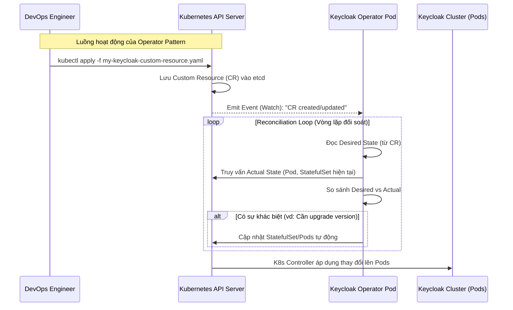

> [!NOTE]
> **Category:** Architecture/Design (Kiến trúc/Thiết kế)
> **Goal:** Phân tích, so sánh sâu sắc hai mô hình triển khai Keycloak phổ biến trên Kubernetes là Helm Chart và Keycloak Operator. Hiểu nguyên lý hoạt động của Operator Pattern và cách lựa chọn công cụ phù hợp với quy mô dự án.

## 1. Lý thuyết chuyên sâu (Detailed Theory)

Khi đưa một hệ thống phức tạp như Keycloak lên Kubernetes, việc viết các file YAML thô (StatefulSet, Service, Ingress, ConfigMap) bằng tay là vô cùng rủi ro và khó bảo trì. Do đó, cộng đồng cung cấp hai giải pháp chính: **Helm** và **Operator**.

- **Helm Chart:** Được ví như "Trình quản lý gói (Package Manager)" của Kubernetes (giống `apt` hoặc `yum`). Nó đóng gói các template YAML. Khi bạn chạy lệnh `helm install`, Helm sẽ thay thế các biến (variables) từ file `values.yaml` vào template và đẩy một loạt các manifest tĩnh vào K8s API. Nhiệm vụ của Helm kết thúc ngay sau khi cài đặt xong.
- **Keycloak Operator:** Là một ứng dụng phần mềm (một Pod) chạy liên tục bên trong cluster K8s. Nó áp dụng mô hình **Operator Pattern**, đóng vai trò như một "Quản trị viên tự động" (Automated SRE). Nó theo dõi các **Custom Resource Definitions (CRDs)** do bạn định nghĩa (ví dụ: đối tượng `Keycloak`, `KeycloakRealmImport`) và liên tục tự động hóa các tác vụ phức tạp như: nâng cấp phiên bản, sao lưu DB, cấu hình tối ưu tự động.

## 2. Luồng nội bộ & Cơ chế cấp thấp (Internal Workflow & Low-level Mechanisms)

**Sự khác biệt cốt lõi:** Trạng thái tĩnh (Static - Helm) vs Trạng thái động (Dynamic Reconciliation - Operator).



**Cơ chế Control Loop:**
Operator được viết bằng Go hoặc Java (Keycloak Operator hiện tại dùng Java/Quarkus dựa trên JOSDK). Nó liên tục lắng nghe (watch) các sự kiện trên K8s API. Nếu bạn lỡ tay xóa một Pod Keycloak hoặc sửa ConfigMap sai, Operator trong vòng vài mili-giây sẽ phát hiện sự sai lệch giữa "Trạng thái mong muốn" và "Trạng thái thực tế", sau đó nó tự động đè lại cấu hình đúng. Helm không làm được điều này vì nó không "sống" trong cluster.

## 3. Thực hành tốt nhất & Bảo mật (Best Practices & Security)

> [!TIP]
> **Khi nào dùng Helm?** Dùng Helm (như Bitnami Keycloak Chart) cho các dự án vừa và nhỏ, nơi bạn muốn kiểm soát hoàn toàn 100% từng dòng YAML được tạo ra, hoặc khi môi trường hạ tầng hạn chế quyền khởi tạo CRD (Custom Resource Definition).

> [!IMPORTANT]
> **Khi nào dùng Operator?** Được khuyến nghị chính thức (Official) bởi Red Hat / Keycloak team. Dùng cho môi trường Enterprise Production. Nó tự động cấu hình tính năng tối ưu (First-class citizen cho Quarkus Keycloak), hỗ trợ auto-wiring với PostgreSQL Operator, và tự động tạo K8s Secret an toàn.

- **Bảo mật với Operator:** Khi chạy Operator, bạn phải cấp cho nó bộ quyền RBAC (ClusterRole) rất rộng để nó có thể tạo StatefulSet, Service, Secret thay bạn. Hãy đảm bảo Operator image được pull từ registry uy tín (quay.io) và giám sát audit log của K8s xem Operator làm gì.
- **GitOps:** Cả hai đều tương thích tốt với ArgoCD hoặc Flux. Với Operator, GitOps tool sẽ đồng bộ CRD `Keycloak` (chỉ 20-30 dòng YAML), phần còn lại Operator lo. Với Helm, GitOps tool sẽ kết xuất template thành hàng ngàn dòng YAML.

## 4. Cấu hình minh họa thực tế (Configuration Examples)

**Cách 1: Triển khai CRD cho Keycloak Operator**
Sau khi cài Operator, bạn chỉ cần nộp 1 file YAML cực kỳ ngắn gọn. Operator sẽ tự dịch nó thành StatefulSet, Service, Ingress.

```yaml
apiVersion: k8s.keycloak.org/v2alpha1
kind: Keycloak
metadata:
  name: my-keycloak
spec:
  instances: 3
  db:
    vendor: postgres
    host: "postgres-db"
    usernameSecret:
      name: keycloak-db-secret
      key: username
    passwordSecret:
      name: keycloak-db-secret
      key: password
  http:
    tlsSecret: my-tls-secret
  hostname:
    hostname: auth.mycompany.com
```

**Cách 2: Triển khai bằng Helm (values.yaml)**
(Sử dụng chart của Bitnami)

```yaml
# values.yaml
replicaCount: 3
auth:
  adminUser: admin
  existingSecret: "my-admin-secret"
postgresql:
  enabled: false
externalDatabase:
  host: postgres-db
  user: keycloak
  existingSecret: "keycloak-db-secret"
ingress:
  enabled: true
  hostname: auth.mycompany.com
```
Chạy lệnh: `helm install kc bitnami/keycloak -f values.yaml`

## 5. Trường hợp ngoại lệ (Edge Cases)

- **Xung đột GitOps và Operator (Fight state):** Bạn dùng ArgoCD theo dõi (sync) đối tượng Service do Operator tạo ra. Tuy nhiên, Operator thỉnh thoảng cập nhật nhãn (label) của Service đó. ArgoCD thấy Service khác với Git nên đè lại, Operator lại đè lại ArgoCD. Gây ra vòng lặp vô hạn. Khắc phục: Cấu hình ArgoCD bỏ qua (IgnoreDifferences) đối với các resource do Operator quản lý.
- **Nâng cấp (Upgrade) thất bại:** Nâng cấp Helm đơn giản là đổi Image tag. Nếu lỗi Database Migration, K8s sẽ bị CrashLoopBackOff. Nâng cấp bằng Operator an toàn hơn, nhưng nếu Operator có bug trong logic xử lý phiên bản mới, bạn rất khó can thiệp bằng tay để gỡ lỗi vì Operator sẽ liên tục ghi đè các sửa đổi thủ công của bạn. Giải pháp: Tạm dừng (Pause reconciliation) Operator bằng annotation.
- **Helm Template quá phức tạp:** Đôi khi bạn cần một tham số JVM khởi động rất đặc biệt mà Helm Chart của Bitnami chưa hỗ trợ. Bạn sẽ bị kẹt. Với Operator, phần `spec.unsupported.podTemplate` cho phép bạn patch (vá) trực tiếp bất cứ cấu hình K8s nào vào Pod.

## 6. Câu hỏi Phỏng vấn (Interview Questions)

1. **Junior:** Helm Chart là gì và tại sao chúng ta không viết file YAML thủ công để cài Keycloak?
   - *Đáp án:* Helm là công cụ đóng gói K8s. Cài Keycloak thủ công cần viết hàng ngàn dòng YAML rải rác (DB, App, Service, Secret), rất dễ sai sót. Helm cung cấp một template có sẵn chuẩn hóa, ta chỉ cần thay đổi các biến cấu hình trong `values.yaml`.
2. **Junior:** "Operator" trong Kubernetes có nghĩa là gì?
   - *Đáp án:* Operator là một phần mềm đóng vai trò như một quản trị viên hệ thống. Nó tự động hóa quá trình triển khai, quản lý, mở rộng và sao lưu một ứng dụng cụ thể (như Keycloak) dựa trên các logic nghiệp vụ đã được lập trình sẵn trong mã nguồn của nó.
3. **Senior:** Bạn được yêu cầu triển khai Keycloak cho 10 khách hàng (Tenants) khác nhau trên cùng 1 K8s Cluster, mỗi khách có cấu hình DB riêng. Bạn chọn Helm hay Operator? Tại sao?
   - *Đáp án:* Cả hai đều làm được, nhưng Operator ưu việt hơn. Chỉ cần tạo 1 Operator duy nhất theo dõi toàn Cluster, sau đó apply 10 CRD `Keycloak` cho 10 namespace. Operator sẽ tự động spawn và quản lý vòng đời của 10 cụm độc lập. Với Helm, bạn phải chạy lệnh helm install 10 lần và quản lý 10 bộ release state rời rạc.
4. **Senior:** Trình bày nguyên lý của "Reconciliation Loop" (Vòng lặp đối soát) trong Keycloak Operator.
   - *Đáp án:* Operator liên tục lặp (loop) quan sát trạng thái của hệ thống. Nó đọc `Desired State` từ Custom Resource (ví dụ spec: instances = 3). Nó dùng K8s API kiểm tra `Actual State` (hiện tại có mấy Pod đang chạy). Nếu có lệch (vd có 1 Pod bị chết còn 2), Operator sẽ gọi API tạo thêm 1 Pod để Actual State khớp với Desired State.
5. **Senior:** Hạn chế lớn nhất của việc sử dụng Keycloak Operator so với Helm Chart là gì?
   - *Đáp án:* Hạn chế là "Blackbox" (Hộp đen) và rào cản xâm nhập (Learning curve). Với Helm, cấu trúc YAML rất minh bạch, dễ dàng sửa đổi template. Với Operator, logic tạo resources được ẩn trong mã Java/Go. Khi có lỗi (ví dụ không sinh ra Ingress), rất khó debug nếu không đọc log và hiểu mã nguồn của Operator.

## 7. Tài liệu tham khảo (References)

- [Keycloak Official Operator Guide](https://www.keycloak.org/operator/installation)
- [Operator Pattern - Kubernetes Official](https://kubernetes.io/docs/concepts/extend-kubernetes/operator/)
- [Helm Documentation](https://helm.sh/docs/)
