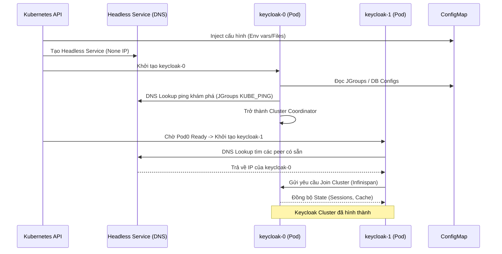

> [!NOTE]
> **Category:** Architecture/Design (Kiến trúc/Thiết kế)
> **Goal:** Hiểu sâu về thiết kế của StatefulSet và ConfigMap trong Kubernetes, tại sao lại phải dùng StatefulSet thay vì Deployment khi triển khai Keycloak Cluster (với Infinispan), và cách quản lý cấu hình tập trung.

## 1. Lý thuyết chuyên sâu (Detailed Theory)

Trong Kubernetes, các ứng dụng Stateless (không lưu trữ trạng thái) thường được triển khai qua **Deployment**. Tuy nhiên, Keycloak không phải là một ứng dụng Stateless hoàn toàn. Mặc dù dữ liệu chính được lưu trong Database (PostgreSQL/MySQL), Keycloak nội bộ sử dụng một Distributed Cache tên là **Infinispan** để lưu trữ Token, User Sessions và chia sẻ trạng thái giữa các Node trong cụm (Cluster).

Vì lý do này, việc triển khai Keycloak trong môi trường HA (High Availability) yêu cầu sự ổn định về danh tính mạng (Network Identity) để các node Infinispan có thể tìm thấy nhau và bầu chọn Leader an toàn. Do đó, **StatefulSet** là giải pháp tối ưu.

- **StatefulSet:** Cung cấp cho mỗi Pod một định danh cố định và độc nhất (ví dụ: `keycloak-0`, `keycloak-1`). Khác với Deployment (tên pod là chuỗi ngẫu nhiên như `keycloak-84hf92-xsd`), StatefulSet duy trì thứ tự khởi động, tắt và gắn kết dữ liệu.
- **ConfigMap & Secret:** Kubernetes tách biệt mã nguồn (Container Image) và cấu hình môi trường. ConfigMap chứa các thông số không nhạy cảm (JDBC URL, Cache configs, JVM Options), trong khi Secret chứa các dữ liệu nhạy cảm (DB Passwords, TLS Certificates). Điều này tuân thủ nguyên tắc 12-factor App.

## 2. Luồng nội bộ & Cơ chế cấp thấp (Internal Workflow & Low-level Mechanisms)

Quá trình khởi tạo và hình thành cụm Keycloak/Infinispan với StatefulSet diễn ra dựa trên cơ chế phân giải DNS nội bộ của K8s.



**Cơ chế KUBE_PING / DNS_PING:**
Để các node tìm thấy nhau, Keycloak sử dụng thư viện JGroups. Trong môi trường Kubernetes, nó dùng giao thức `DNS_PING` hoặc `KUBE_PING`. Thay vì broadcast IP (không hoạt động trên K8s network), nó truy vấn bản ghi SRV/A của một **Headless Service** (một Service cấu hình `clusterIP: None`). Headless Service này sẽ trả về danh sách IP của tất cả các Pod đang chạy thuộc StatefulSet đó, cho phép chúng bắt tay (handshake) TCP trực tiếp với nhau.

## 3. Thực hành tốt nhất & Bảo mật (Best Practices & Security)

> [!WARNING]
> **Split Brain Syndrome:** Nếu dùng Deployment và scale up quá nhanh, các Pod sinh ra đồng loạt có thể không kịp khám phá nhau và tự hình thành các cụm (cluster) rời rạc. StatefulSet giải quyết vấn đề này bằng cách khởi động tuần tự (Ordered, Graceful Deployment).

> [!IMPORTANT]
> **Quản lý Cache Persistence:** Mặc dù Infinispan thường lưu in-memory, nếu bạn cấu hình Distributed Cache có offload xuống đĩa, bạn PHẢI dùng StatefulSet kết hợp với `volumeClaimTemplates` để mỗi Pod có một Persistent Volume (PV) riêng biệt ghim cố định.

- **Immutable Configs:** Luôn coi ConfigMap là bất biến. Nếu thay đổi ConfigMap, hãy cập nhật Deployment/StatefulSet bằng các tool như Kustomize hoặc Helm (với tính năng sha256 annotation) để force-restart các Pod và nhận cấu hình mới. Keycloak không tự reload ConfigMap mà không khởi động lại JVM.
- **Bảo mật Secret:** Không để Password của Database vào ConfigMap. Phải để trong Kubernetes Secret và mount vào Pod dưới dạng Environment Variable hoặc Volume Mount, đồng thời kích hoạt mã hóa etcd (etcd encryption at rest) trên cluster K8s.

## 4. Cấu hình minh họa thực tế (Configuration Examples)

**Định nghĩa ConfigMap và Headless Service cho Keycloak Cluster:**

```yaml
---
apiVersion: v1
kind: ConfigMap
metadata:
  name: keycloak-config
data:
  KC_DB: postgres
  KC_DB_URL: jdbc:postgresql://db-service:5432/keycloak
  # Kích hoạt JGroups dùng DNS_PING
  JGROUPS_DISCOVERY_PROTOCOL: dns.DNS_PING
  JGROUPS_DISCOVERY_PROPERTIES: dns_query=keycloak-headless.default.svc.cluster.local
---
apiVersion: v1
kind: Service
metadata:
  name: keycloak-headless
spec:
  clusterIP: None # Định nghĩa đây là Headless Service
  selector:
    app: keycloak
  ports:
    - name: jgroups
      port: 7600 # Port nội bộ Infinispan
---
apiVersion: apps/v1
kind: StatefulSet
metadata:
  name: keycloak
spec:
  serviceName: "keycloak-headless"
  replicas: 3
  selector:
    matchLabels:
      app: keycloak
  template:
    metadata:
      labels:
        app: keycloak
    spec:
      containers:
        - name: keycloak
          image: quay.io/keycloak/keycloak:latest
          args: ["start"]
          envFrom:
            - configMapRef:
                name: keycloak-config
          ports:
            - containerPort: 8080
            - containerPort: 7600 # Bắt buộc phải expose port JGroups
```

## 5. Trường hợp ngoại lệ (Edge Cases)

- **Network Partition (Lỗi mạng phân mảnh):** Một node (vd `keycloak-2`) tạm thời mất mạng. Infinispan sẽ loại nó khỏi cluster (eviction). Khi node đó có mạng lại, nếu cấu hình không chuẩn, nó có thể cố gắng đẩy dữ liệu cũ đè lên dữ liệu mới, hoặc không thể rejoin. Giải pháp: Cấu hình liveness/readiness probes chặt chẽ để K8s tự kill và restart Pod khi JGroups channel bị mất kết nối.
- **Rollout bị kẹt (Stuck Rollout):** StatefulSet triển khai theo thứ tự 0, 1, 2. Nếu Pod 1 không vượt qua Readiness Probe (ví dụ DB load quá lâu), Pod 2 sẽ không bao giờ được tạo. Khắc phục: Kiểm tra timeout của Health check hoặc dùng PodDisruptionBudget.
- **Lỗi DNS độ trễ cao (CoreDNS Overload):** JGroups dựa hoàn toàn vào DNS_PING. Nếu CoreDNS của K8s bị quá tải và phản hồi chậm, cluster Keycloak sẽ không thể hình thành. Khắc phục: Kích hoạt NodeLocal DNSCache trên K8s.

## 6. Câu hỏi Phỏng vấn (Interview Questions)

1. **Junior:** Trong K8s, khác biệt chính giữa Deployment và StatefulSet là gì? Tại sao Keycloak ưu tiên dùng StatefulSet?
   - *Đáp án:* Deployment tạo các Pod vô danh, thích hợp cho Stateless. StatefulSet tạo Pod có định danh tuần tự (Pod-0, Pod-1) và thứ tự khởi động rõ ràng. Keycloak cần duy trì trạng thái của Infinispan cache cluster nên StatefulSet là an toàn nhất để tránh split-brain.
2. **Junior:** Headless Service khác gì với Service loại ClusterIP thông thường?
   - *Đáp án:* Headless Service có `clusterIP: None`. Nó không cân bằng tải (load balance) qua proxy mà khi truy vấn DNS sẽ trả về trực tiếp IP của từng Pod đứng phía sau nó.
3. **Senior:** JGroups KUBE_PING hoạt động khác DNS_PING như thế nào trong môi trường Kubernetes?
   - *Đáp án:* KUBE_PING truy cập trực tiếp vào Kubernetes API Server để lấy danh sách Pod bằng cách dùng ServiceAccount token của Pod. DNS_PING truy vấn vào bản ghi SRV của hệ thống DNS nội bộ (CoreDNS). DNS_PING thường được ưu tiên vì nhẹ hơn và không cần cấp quyền RBAC phức tạp cho Pod.
4. **Senior:** Làm thế nào để tự động khởi động lại (restart) các Pod của StatefulSet Keycloak khi một ConfigMap bị thay đổi nội dung?
   - *Đáp án:* K8s không tự reload pod khi ConfigMap đổi. Cần sử dụng công cụ như Helm/Kustomize để hash nội dung ConfigMap thành một annotation trong `spec.template.metadata.annotations` của StatefulSet. Khi ConfigMap đổi -> Hash đổi -> K8s phát hiện thay đổi trong Pod template và tiến hành Rolling Update.
5. **Senior:** Nếu Cụm Keycloak 3 node gặp sự cố crash đồng loạt, khi khởi động lại, Infinispan có mất toàn bộ User Session không?
   - *Đáp án:* Có, nếu cấu hình Infinispan chỉ sử dụng in-memory cache. Nếu muốn giữ Session sau khi sập toàn hệ thống, phải cấu hình Infinispan với "Persistent cache store" trỏ xuống một CSDL hoặc sử dụng Persistent Volumes gắn vào StatefulSet.

## 7. Tài liệu tham khảo (References)

- [Kubernetes Concepts - StatefulSets](https://kubernetes.io/docs/concepts/workloads/controllers/statefulset/)
- [Keycloak Guide: Clustering in Kubernetes](https://www.keycloak.org/high-availability/concepts-threads)
- [JGroups Protocols - DNS_PING](http://jgroups.org/manual/index.html#_dns_ping)
