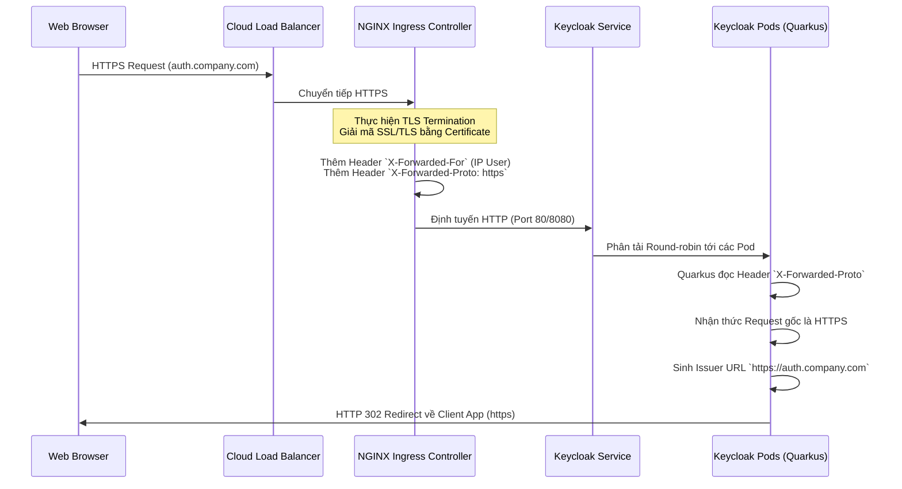

> [!NOTE]
> **Category:** Architecture/Design (Kiến trúc/Thiết kế)
> **Goal:** Nắm bắt cơ chế đưa Keycloak ra internet một cách an toàn thông qua Ingress, giải quyết các bài toán liên quan đến TLS termination, Forwarded Headers, và tự động mở rộng theo tải (Horizontal Pod Autoscaling).

## 1. Lý thuyết chuyên sâu (Detailed Theory)

Khi triển khai Keycloak trên Kubernetes, các Pod thường nằm trong mạng nội bộ (private network). Để người dùng từ Internet có thể truy cập trang đăng nhập, ta cần một cổng giao tiếp ngoại vi.

- **Ingress Controller:** Là một reverse proxy (như NGINX, Traefik, HAProxy) chạy trong K8s. Khác với LoadBalancer (thường cấp 1 IP cho mỗi Service tốn kém), Ingress có thể định tuyến nhiều tên miền (Host) và đường dẫn (Path) vào chung một IP duy nhất. Với Keycloak, Ingress đóng vai trò sống còn trong việc **TLS Termination** (chấm dứt mã hóa SSL tại proxy) để giảm tải cho Keycloak.
- **Horizontal Pod Autoscaling (HPA):** Hệ thống IAM thường đối mặt với các đỉnh tải (Traffic Spikes) bất ngờ (ví dụ: giờ vào ca sáng, mọi nhân viên cùng đăng nhập). HPA là một K8s Controller giám sát tài nguyên (CPU, RAM) hoặc metrics tùy chỉnh (HTTP requests) để tự động tăng số lượng Pod Keycloak khi tải tăng, và giảm khi tải giảm.

Việc thiết lập Ingress cho Keycloak đặc biệt nhạy cảm do giao thức OIDC yêu cầu sự khớp nối tuyệt đối về tên miền (Issuer URL) và đường dẫn chuyển hướng (Redirect URIs).

## 2. Luồng nội bộ & Cơ chế cấp thấp (Internal Workflow & Low-level Mechanisms)

Khi sử dụng Ingress thực hiện TLS Termination, Keycloak bên trong K8s sẽ nhận traffic dạng HTTP (không mã hóa). Nếu không cấu hình đúng, Keycloak sẽ sinh ra các Token với `iss` (Issuer) là `http://...` thay vì `https://...`, dẫn đến toàn bộ ứng dụng bị lỗi `Invalid Token`.



**Cơ chế cấp thấp Proxy Forwarding:**
Keycloak (Quarkus) phải được chạy với tham số `PROXY_ADDRESS_FORWARDING=true` (bản cũ) hoặc `--proxy=edge` (bản mới). Khi đó, engine HTTP nội bộ (Vert.x) sẽ tin tưởng và phân tích các header `X-Forwarded-*` do Ingress bơm vào. Điều này giúp Keycloak biết được IP thực của người dùng (phục vụ Brute-force protection) và Protocol thực tế (HTTPS).

## 3. Thực hành tốt nhất & Bảo mật (Best Practices & Security)

> [!IMPORTANT]
> **Edge Proxy vs Re-encrypt:** Nếu mạng K8s nội bộ không tin cậy (Zero Trust), bạn không được dùng `TLS Termination` (`--proxy=edge`), mà phải dùng `--proxy=reencrypt`. Nghĩa là Ingress nhận HTTPS, giải mã, sau đó LẠI mã hóa HTTPS để đẩy vào Keycloak. Điều này yêu cầu Keycloak Pod cũng phải có chứng chỉ tự ký (self-signed cert).

> [!WARNING]
> **HPA và Infinispan:** Khi HPA tự động scale up Keycloak (từ 3 lên 6 Pods) hoặc scale down (từ 6 về 3 Pods), cụm Infinispan sẽ liên tục phải bầu lại Leader và rebalance (chia lại) dữ liệu cache. Quá trình rebalance này rất tốn CPU và Network. Hãy đặt `behavior` trong HPA với `scaleDown.stabilizationWindowSeconds` lớn (ví dụ: 300s) để tránh hiện tượng dội ngược (flapping).

- **Health Checks:** Ingress phụ thuộc vào Readiness Probe của K8s để đưa traffic vào. Với Keycloak, Probe phải trỏ tới `/health/ready` (chỉ mở cổng sau khi DB và Infinispan đã sẵn sàng), KHÔNG dùng trang `/`.
- **WAF Integration:** Khuyến khích bật ModSecurity hoặc AWS WAF tại Ingress để chặn SQL Injection và XSS trước khi traffic chạm đến Keycloak.

## 4. Cấu hình minh họa thực tế (Configuration Examples)

**Cấu hình Ingress với NGINX và Let's Encrypt (Cert-Manager):**

```yaml
apiVersion: networking.k8s.io/v1
kind: Ingress
metadata:
  name: keycloak-ingress
  annotations:
    kubernetes.io/ingress.class: nginx
    cert-manager.io/cluster-issuer: "letsencrypt-prod"
    # Báo cho NGINX biết backend đang chạy HTTP
    nginx.ingress.kubernetes.io/backend-protocol: "HTTP"
    # Kích hoạt cookie affinity để ghim request (tùy chọn)
    nginx.ingress.kubernetes.io/affinity: "cookie"
spec:
  tls:
  - hosts:
    - auth.company.com
    secretName: keycloak-tls-cert
  rules:
  - host: auth.company.com
    http:
      paths:
      - path: /
        pathType: Prefix
        backend:
          service:
            name: keycloak-service
            port:
              number: 8080
```

*Lưu ý:* Biến môi trường trong Pod Keycloak phải có:
`KC_HOSTNAME=auth.company.com` và `KC_PROXY=edge`.

**Cấu hình HPA (Autoscaling) dựa trên CPU:**

```yaml
apiVersion: autoscaling/v2
kind: HorizontalPodAutoscaler
metadata:
  name: keycloak-hpa
spec:
  scaleTargetRef:
    apiVersion: apps/v1
    kind: StatefulSet # Hoặc Deployment
    name: keycloak
  minReplicas: 3
  maxReplicas: 10
  metrics:
  - type: Resource
    resource:
      name: cpu
      target:
        type: Utilization
        averageUtilization: 70
```

## 5. Trường hợp ngoại lệ (Edge Cases)

- **Lỗi Mixed Content / Infinite Redirect Loop:** Người dùng truy cập HTTPS, Ingress chuyển thành HTTP vào Keycloak, nhưng Keycloak không cấu hình `--proxy=edge`. Keycloak nghĩ rằng đang bị truy cập HTTP nên trả về lệnh `302 Redirect` tới HTTPS. Ingress nhận, lại đẩy vào HTTP -> Lặp vô hạn (ERR_TOO_MANY_REDIRECTS). Khắc phục: Phải bật mode proxy edge và đảm bảo Ingress gửi đúng header `X-Forwarded-Proto`.
- **HPA Kill Pod đang xử lý request:** Khi HPA giảm số Pod, K8s gửi SIGTERM. Keycloak cần thời gian để hoàn thành các request đang dở và ngắt kết nối DB an toàn. Cần cấu hình `terminationGracePeriodSeconds` (ví dụ: 60s) trong Pod spec.
- **Mất Session khi scale down:** Nếu không dùng distributed cache storage (như external Redis/Infinispan) hoặc số bản sao cache (owner) nhỏ hơn số pod bị hủy do HPA, User sẽ bị văng (đăng xuất). Giải pháp: Tăng `owners=2` hoặc `3` trong cấu hình Infinispan cache.

## 6. Câu hỏi Phỏng vấn (Interview Questions)

1. **Junior:** Tính năng HPA trong K8s dùng để làm gì đối với Keycloak?
   - *Đáp án:* HPA tự động tăng hoặc giảm số lượng Pod Keycloak dựa trên mức độ sử dụng tài nguyên (như CPU đạt 70%) nhằm đảm bảo hệ thống không bị sập khi có lượng đăng nhập đột biến và tiết kiệm tài nguyên khi thấp điểm.
2. **Junior:** Nếu cài Ingress và Keycloak, tại sao URL Issuer trong Token lại hiển thị là IP nội bộ của K8s thay vì tên miền?
   - *Đáp án:* Do chưa cấu hình biến `KC_HOSTNAME` (hoặc `KEYCLOAK_FRONTEND_URL` ở bản cũ) cho Keycloak, nên nó tự lấy IP nội bộ làm gốc.
3. **Senior:** Tại sao khi đứng sau NGINX Ingress Controller, Keycloak lại ghi nhận IP của tất cả người dùng bị ban (Brute Force) đều là cùng một IP nội bộ của Ingress? Cách khắc phục?
   - *Đáp án:* Do proxy đã che giấu IP thực. Cần cấu hình Keycloak chạy với tham số `--proxy=edge` để nó phân tích Header `X-Forwarded-For`. Đồng thời phía Ingress cũng phải được cấu hình `use-forwarded-headers: "true"` để nó lấy IP thực từ Cloud Load Balancer (nếu có) truyền tiếp vào Pod.
4. **Senior:** Bạn định cấu hình HPA cho Keycloak dựa trên Memory (RAM) utilization thay vì CPU. Có hợp lý không?
   - *Đáp án:* Không hợp lý. Keycloak chạy trên Java/JVM. JVM có xu hướng giữ lại bộ nhớ đã cấp phát (Heap) chứ không trả lại ngay cho hệ điều hành (K8s). Do đó, Memory Utilization của Pod luôn ở mức cao ảo, làm cho HPA liên tục scale up hoặc không bao giờ scale down. Nên dùng CPU hoặc metrics ứng dụng (ví dụ: requests/sec qua Prometheus Adapter).
5. **Senior:** Mô tả quy trình "Re-encrypt" khi dùng Keycloak Ingress.
   - *Đáp án:* Client -> (HTTPS) -> Ingress -> (Giải mã để inspect, gán header, check WAF) -> Ingress tạo HTTPS mới -> (HTTPS) -> Keycloak Pod. Keycloak lúc này dùng `--proxy=reencrypt` và phải có cấu hình keystore chứa chứng chỉ cho mạng nội bộ.

## 7. Tài liệu tham khảo (References)

- [Keycloak Guide: Configuring reverse proxies](https://www.keycloak.org/server/reverseproxy)
- [Kubernetes Ingress Controllers](https://kubernetes.io/docs/concepts/services-networking/ingress-controllers/)
- [Horizontal Pod Autoscaling - K8s Docs](https://kubernetes.io/docs/tasks/run-application/horizontal-pod-autoscale/)
