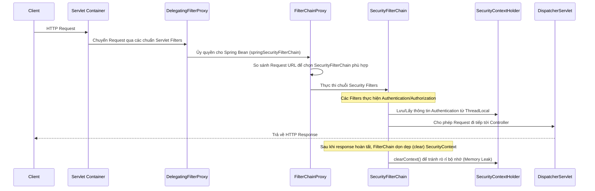

> [!NOTE]
> **Category:** Theory (Lý thuyết)
> **Goal:** Hiểu rõ cấu trúc nền tảng của Spring Security bao gồm `SecurityFilterChain`, `DelegatingFilterProxy`, và cách `SecurityContext` lưu trữ thông tin xác thực cho từng request.

## 1. Lý thuyết chuyên sâu (Detailed Theory)
Spring Security hoạt động hoàn toàn dựa trên cơ chế **Servlet Filters** (đối với ứng dụng Servlet-based) hoặc **WebFilters** (đối với WebFlux).

Bất kỳ HTTP Request nào gửi đến ứng dụng Spring Boot đều phải đi qua một chuỗi các Filters trước khi đến được với `DispatcherServlet` và các Controllers của bạn. Spring Security chèn vào chuỗi này một Filter đặc biệt có tên là `DelegatingFilterProxy`. Nhiệm vụ của `DelegatingFilterProxy` không phải là thực hiện bảo mật, mà là cầu nối (bridge) giữa vòng đời của Servlet Container (như Tomcat) và ApplicationContext (IoC Container) của Spring. Nó ủy quyền xử lý cho một bean tên là `FilterChainProxy`.

**`FilterChainProxy`** là trung tâm của Spring Security. Nó quản lý nhiều **`SecurityFilterChain`**. Mỗi `SecurityFilterChain` là một tập hợp các Security Filters (như `CorsFilter`, `CsrfFilter`, `BearerTokenAuthenticationFilter`, `AuthorizationFilter`) được áp dụng cho một tập hợp các URL nhất định.

**`SecurityContext` và `SecurityContextHolder`**:
Khi một Request đi qua Filter xác thực (ví dụ bằng JWT), nếu thành công, thông tin của người dùng (đối tượng `Authentication`) sẽ được lưu vào `SecurityContext`. Spring Security cung cấp một class tiện ích là `SecurityContextHolder` để lưu trữ `SecurityContext` này theo cơ chế mặc định là `ThreadLocal`. Điều này đảm bảo rằng bất kỳ phương thức nào trong cùng một thread xử lý HTTP request đó đều có thể truy xuất thông tin người dùng đang đăng nhập mà không cần phải truyền đối tượng `Authentication` qua từng tham số hàm.

## 2. Luồng nội bộ & Cơ chế cấp thấp (Internal Workflow & Low-level Mechanisms)



**Cơ chế `ThreadLocal`**: `SecurityContextHolder` sử dụng `ThreadLocal` để gắn kết dữ liệu với luồng hiện tại. Tuy nhiên, sau khi HTTP Request xử lý xong, Spring Security luôn gọi phương thức `clearContext()` bằng một filter tên là `SecurityContextHolderFilter` (hoặc `SecurityContextPersistenceFilter` ở phiên bản cũ) để đảm bảo thread khi được trả về Thread Pool của Tomcat không mang theo thông tin của người dùng cũ.

## 3. Thực hành tốt nhất & Bảo mật (Best Practices & Security)

> [!IMPORTANT]
> Khi xử lý các tác vụ bất đồng bộ (ví dụ: dùng `@Async` hoặc tạo Thread mới bằng `CompletableFuture`), `SecurityContext` **sẽ bị mất** vì thread mới không chia sẻ biến `ThreadLocal` của thread gốc. Bạn phải cấu hình chiến lược lưu trữ (Strategy) thành `MODE_INHERITABLETHREADLOCAL` hoặc sử dụng `DelegatingSecurityContextExecutor`.

> [!WARNING]
> Không nên nhồi nhét quá nhiều logic nghiệp vụ vào Custom Filters. Security Filters chỉ nên làm nhiệm vụ bảo mật (AuthN/AuthZ). Việc gọi DB hay APIs bên ngoài chậm chạp trong Filters sẽ chặn (block) toàn bộ request và làm giảm hiệu suất hệ thống nghiêm trọng.

- **Thứ tự Filter:** Nếu bạn tạo một Filter tùy chỉnh (Custom Filter), hãy chú ý đến vị trí chèn (sử dụng `.addFilterBefore()` hoặc `.addFilterAfter()`). Việc đặt sai vị trí (ví dụ: kiểm tra quyền trước khi xác thực JWT) sẽ làm vỡ kiến trúc bảo mật.
- **Multiple Filter Chains:** Sử dụng nhiều `SecurityFilterChain` beans với `@Order` để phân tách logic bảo mật cho các phần khác nhau của ứng dụng (ví dụ: API dành cho Mobile cần stateless JWT, còn Admin Portal cần stateful Session Cookie).

## 4. Cấu hình minh họa thực tế (Configuration Examples)

Ví dụ cấu hình nhiều `SecurityFilterChain` trong một ứng dụng Spring Boot:

```java
import org.springframework.context.annotation.Bean;
import org.springframework.context.annotation.Configuration;
import org.springframework.core.annotation.Order;
import org.springframework.security.config.annotation.web.builders.HttpSecurity;
import org.springframework.security.config.annotation.web.configuration.EnableWebSecurity;
import org.springframework.security.web.SecurityFilterChain;

@Configuration
@EnableWebSecurity
public class SecurityConfig {

    // Filter Chain 1: Dành riêng cho Actuator Health Check (Độ ưu tiên cao hơn)
    @Bean
    @Order(1)
    public SecurityFilterChain actuatorFilterChain(HttpSecurity http) throws Exception {
        http.securityMatcher("/actuator/**")
            .authorizeHttpRequests(authorize -> authorize
                .requestMatchers("/actuator/health").permitAll()
                .anyRequest().hasRole("SUPER_ADMIN")
            )
            .httpBasic(basic -> {}); // Dùng HTTP Basic cho Actuator thay vì JWT
        return http.build();
    }

    // Filter Chain 2: Dành cho REST APIs chính (Mặc định bắt các request còn lại)
    @Bean
    @Order(2)
    public SecurityFilterChain apiFilterChain(HttpSecurity http) throws Exception {
        http
            .authorizeHttpRequests(authorize -> authorize
                .requestMatchers("/api/public/**").permitAll()
                .anyRequest().authenticated()
            )
            .oauth2ResourceServer(oauth2 -> oauth2.jwt(jwt -> {})); // Sử dụng JWT
        return http.build();
    }
}
```

Cách lấy thông tin xác thực từ Controller bất cứ đâu:
```java
import org.springframework.security.core.context.SecurityContextHolder;
import org.springframework.security.oauth2.jwt.Jwt;
import org.springframework.web.bind.annotation.GetMapping;
import org.springframework.web.bind.annotation.RestController;

@RestController
public class MeController {

    @GetMapping("/api/me")
    public String getMyDetails() {
        var authentication = SecurityContextHolder.getContext().getAuthentication();
        if (authentication != null && authentication.getPrincipal() instanceof Jwt jwt) {
            return "Hello, " + jwt.getClaimAsString("preferred_username");
        }
        return "Anonymous";
    }
}
```

## 5. Trường hợp ngoại lệ (Edge Cases)
- **Tạo ra 2 SecurityFilterChain nhưng quên cấu hình `securityMatcher`**: Nếu Chain có mức độ ưu tiên cao (`@Order(1)`) không chỉ định `.securityMatcher("/some/path")`, nó sẽ bắt **tất cả** các request. Do đó, Chain thứ 2 (`@Order(2)`) sẽ vĩnh viễn không bao giờ được gọi tới (Unreachable Code).
- **Lỗi ở Filter nhưng muốn trả về JSON thống nhất với ExceptionHandler của Controller:** `@ControllerAdvice` chỉ hoạt động ở tầng `DispatcherServlet`. Nếu có Exception văng ra ở tầng Filter (ví dụ JWT không hợp lệ), nó sẽ không đi đến ControllerAdvice. Cần cấu hình `AuthenticationEntryPoint` hoặc dùng `HandlerExceptionResolver` để chuyển tiếp ngoại lệ từ Filter sang ControllerAdvice.

## 6. Câu hỏi Phỏng vấn (Interview Questions)
1. **[Junior]** Sự khác biệt giữa `DelegatingFilterProxy` và `FilterChainProxy` là gì?
   - *Đáp án:* `DelegatingFilterProxy` là một Servlet Filter chuẩn đóng vai trò cầu nối, trong khi `FilterChainProxy` là một Spring Bean quản lý vòng đời và định tuyến request đến các `SecurityFilterChain` cụ thể.
2. **[Junior]** Làm thế nào để lấy được username của người dùng đang đăng nhập ở tầng Service mà không cần truyền tham số từ Controller?
   - *Đáp án:* Sử dụng `SecurityContextHolder.getContext().getAuthentication().getName()`.
3. **[Senior]** Làm thế nào để truyền `SecurityContext` từ luồng chính (Main Thread) sang một luồng mới chạy bằng `@Async`?
   - *Đáp án:* Phải thiết lập chiến lược cho `SecurityContextHolder` là `MODE_INHERITABLETHREADLOCAL` hoặc cung cấp một `TaskExecutor` tùy chỉnh được wrap bởi `DelegatingSecurityContextExecutor`.
4. **[Senior]** Tại sao việc quên gọi `clearContext()` trong tự thiết kế Custom Filter lại gây ra lỗ hổng bảo mật nghiêm trọng?
   - *Đáp án:* Vì Thread được trả về Thread Pool và tái sử dụng cho request của người dùng khác. Người dùng mới có thể vô tình kế thừa quyền hạn (`Authentication`) của người dùng trước đó.
5. **[Senior]** Nếu muốn ghi log tất cả HTTP Request bất kể thành công hay thất bại xác thực, bạn nên đặt Filter của mình ở vị trí nào trong Spring Security Filter Chain?
   - *Đáp án:* Nên đặt trước các filter xác thực (ví dụ sử dụng `.addFilterBefore(myLogFilter, UsernamePasswordAuthenticationFilter.class)` hoặc trước cả `SecurityContextPersistenceFilter`) hoặc đăng ký nó như một Servlet Filter bên ngoài vòng quản lý của Spring Security.

## 7. Tài liệu tham khảo (References)
- [Spring Security Reference: Architecture](https://docs.spring.io/spring-security/reference/servlet/architecture.html)
- [Baeldung: Spring Security Context](https://www.baeldung.com/spring-security-context)
