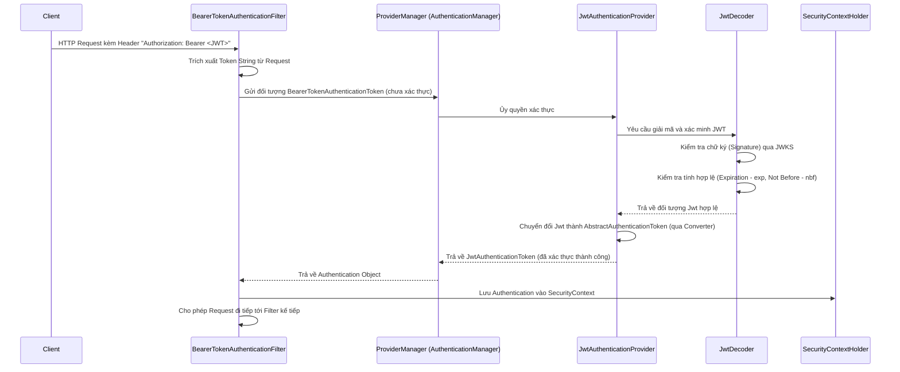

> [!NOTE]
> **Category:** Theory (Lý thuyết)
> **Goal:** Hiểu sâu về luồng xác thực (Authentication Flow) trong kiến trúc Spring Security, các thành phần cốt lõi xử lý quá trình đăng nhập và cách chúng phối hợp với nhau.

## 1. Lý thuyết chuyên sâu (Detailed Theory)
Quá trình **Authentication (Xác thực)** trong Spring Security là quá trình xác minh danh tính của người dùng hoặc hệ thống (gọi chung là Principal) khi họ cố gắng truy cập vào ứng dụng.

Kiến trúc xác thực cốt lõi xoay quanh một số interface chính:
- **`Authentication`**: Biểu diễn thông tin về người dùng (Principal), thông tin đăng nhập (Credentials - ví dụ: mật khẩu hoặc token), và quyền hạn (GrantedAuthorities).
- **`AuthenticationManager`**: API chịu trách nhiệm chính trong việc thực thi xác thực. Nó nhận vào một đối tượng `Authentication` chưa xác thực và trả về một `Authentication` đã xác thực đầy đủ (nếu thành công).
- **`AuthenticationProvider`**: Thực hiện logic xác thực cụ thể. Một `AuthenticationManager` thường ủy quyền (delegate) cho nhiều `AuthenticationProvider` khác nhau (ví dụ: `DaoAuthenticationProvider` cho User/Pass từ Database, `JwtAuthenticationProvider` cho OAuth2 Token).
- **`UserDetailsService`**: Cung cấp dữ liệu người dùng (UserDetails) từ kho lưu trữ (như database) để `AuthenticationProvider` sử dụng kiểm tra.

Khi sử dụng Keycloak dưới dạng OAuth2 Resource Server, luồng xác thực truyền thống (username/password) được thay thế bằng luồng xác thực dựa trên **JWT (JSON Web Token)** do Keycloak phát hành.

## 2. Luồng nội bộ & Cơ chế cấp thấp (Internal Workflow & Low-level Mechanisms)

Dưới đây là luồng xác thực chi tiết khi một HTTP Request mang theo Access Token đi qua Spring Security Filter Chain:



Trong mô hình này, `BearerTokenAuthenticationFilter` đóng vai trò đánh chặn request, `ProviderManager` điều phối, và `JwtAuthenticationProvider` kết hợp với `JwtDecoder` để thực hiện việc xác thực (không cần gọi đến Keycloak server ở mỗi request, vì verify dựa trên Public Key đã cache).

## 3. Thực hành tốt nhất & Bảo mật (Best Practices & Security)

> [!IMPORTANT]
> Với hệ thống stateless phân tán, hãy luôn cấu hình Spring Boot đóng vai trò là **Resource Server**, không phải là **Client** xử lý luồng đăng nhập (Authorization Code Flow) trừ khi đây là ứng dụng SSR (Server-Side Rendering) với Thymeleaf/MVC. Frontend (SPA/Mobile) nên đảm nhận luồng đăng nhập với Keycloak.

> [!WARNING]
> Mặc định, SecurityContextHolder lưu trữ thông tin xác thực trên một ThreadLocal. Điều này có nghĩa là nếu bạn sinh ra một luồng mới (ví dụ `@Async`), thông tin bảo mật sẽ không tự động được truyền sang luồng mới.

- **Stateless Session:** Cấu hình `SessionCreationPolicy.STATELESS` để buộc Spring Security không lưu trạng thái trong HTTPSession, tiết kiệm tài nguyên và phù hợp với kiến trúc Microservices.
- **Xử lý ngoại lệ:** Tùy chỉnh `AuthenticationEntryPoint` để trả về phản hồi JSON chuẩn (như RFC 7807 Problem Details) thay vì trang HTML báo lỗi 401 mặc định của Spring.

## 4. Cấu hình minh họa thực tế (Configuration Examples)

Cấu hình Spring Security dưới dạng Stateless OAuth2 Resource Server:

```java
import org.springframework.context.annotation.Bean;
import org.springframework.context.annotation.Configuration;
import org.springframework.security.config.annotation.web.builders.HttpSecurity;
import org.springframework.security.config.annotation.web.configuration.EnableWebSecurity;
import org.springframework.security.config.http.SessionCreationPolicy;
import org.springframework.security.web.SecurityFilterChain;

@Configuration
@EnableWebSecurity
public class SecurityConfig {

    @Bean
    public SecurityFilterChain filterChain(HttpSecurity http) throws Exception {
        http
            // Tắt CSRF vì chúng ta sử dụng Stateless API với JWT
            .csrf(csrf -> csrf.disable())
            
            // Cấu hình Session thành Stateless
            .sessionManagement(session -> session.sessionCreationPolicy(SessionCreationPolicy.STATELESS))
            
            // Phân quyền cho Request
            .authorizeHttpRequests(auth -> auth
                .requestMatchers("/public/**").permitAll()
                .anyRequest().authenticated()
            )
            
            // Cấu hình Resource Server xử lý JWT
            .oauth2ResourceServer(oauth2 -> oauth2
                .jwt(jwt -> {}) // Sử dụng JwtDecoder tự động cấu hình qua properties
            );
            
        return http.build();
    }
}
```

Cấu hình `application.yml` (hoặc `application.properties`) để chỉ định URI nơi Spring Security có thể tải Public Key (JWKS) từ Keycloak:
```yaml
spring:
  security:
    oauth2:
      resourceserver:
        jwt:
          issuer-uri: http://localhost:8080/realms/myrealm
          jwk-set-uri: http://localhost:8080/realms/myrealm/protocol/openid-connect/certs
```

## 5. Trường hợp ngoại lệ (Edge Cases)
- **Keycloak Downtime trong lúc khởi động Spring Boot:** Nếu sử dụng `issuer-uri`, Spring Boot sẽ cố gắng kết nối với Keycloak khi khởi động để lấy cấu hình OIDC. Nếu Keycloak không sẵn sàng, ứng dụng Spring Boot sẽ fail to start. Cấu hình `jwk-set-uri` trực tiếp thường an toàn hơn vì nó thực hiện lazy-loading khi có request đầu tiên.
- **Clock Skew (Lệch thời gian):** Nếu đồng hồ trên máy chủ Keycloak và máy chủ Spring Boot lệch nhau, JWT có thể bị coi là hết hạn (`exp`) hoặc chưa có hiệu lực (`nbf`) ngay khi vừa tạo. Spring Security cho phép cấu hình `clockSkew` trong `JwtTimestampValidator` (mặc định là 60 giây).

## 6. Câu hỏi Phỏng vấn (Interview Questions)
1. **[Junior]** Vai trò của `AuthenticationManager` trong Spring Security là gì?
   - *Đáp án:* Là interface chính để thực hiện xác thực, nó nhận vào thông tin đăng nhập và trả về một đối tượng Authentication hoàn chỉnh nếu hợp lệ.
2. **[Junior]** Khi tích hợp Keycloak (OAuth2 Resource Server), Spring Boot kiểm tra tính hợp lệ của Token bằng cách nào?
   - *Đáp án:* Xác minh chữ ký (signature) của JWT bằng cách sử dụng Public Key lấy từ endpoint JWKS của Keycloak.
3. **[Senior]** Làm thế nào để giải quyết lỗi ứng dụng Spring Boot không khởi động được khi Keycloak đang sập?
   - *Đáp án:* Tránh sử dụng `spring.security.oauth2.resourceserver.jwt.issuer-uri` vì nó yêu cầu gọi network lúc startup. Thay vào đó, sử dụng `jwk-set-uri`.
4. **[Senior]** Tại sao cần phải cấu hình `SessionCreationPolicy.STATELESS` khi dùng JWT?
   - *Đáp án:* Để ngăn Spring Security tạo HttpSession, tránh lãng phí tài nguyên RAM, loại bỏ các vấn đề đồng bộ session trong cụm phân tán và phù hợp với bản chất stateless của RESTful APIs.
5. **[Senior]** Điều gì xảy ra khi Token hết hạn và người dùng gửi Request? Lớp nào trong Spring Security bắt lỗi này?
   - *Đáp án:* `JwtTimestampValidator` sẽ văng ra ngoại lệ `JwtValidationException`. Exception này bị bắt bởi `BearerTokenAuthenticationFilter` và đẩy sang `AuthenticationEntryPoint`, trả về mã HTTP 401 Unauthorized kèm header `WWW-Authenticate`.

## 7. Tài liệu tham khảo (References)
- [Spring Security Reference: Architecture - Authentication](https://docs.spring.io/spring-security/reference/servlet/authentication/architecture.html)
- [Spring Security Reference: OAuth2 Resource Server](https://docs.spring.io/spring-security/reference/servlet/oauth2/resource-server/index.html)
- [RFC 6750: The OAuth 2.0 Authorization Framework: Bearer Token Usage](https://datatracker.ietf.org/doc/html/rfc6750)
