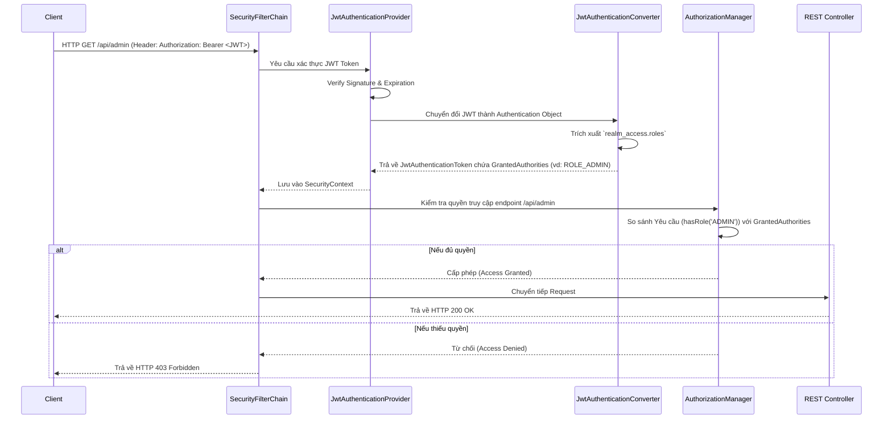

> [!NOTE]
> **Category:** Theory (Lý thuyết)
> **Goal:** Hiểu sâu về cơ chế phân quyền (Authorization) trong Spring Security khi tích hợp với Keycloak (OAuth2/OpenID Connect), cách trích xuất roles/authorities từ JWT và bảo vệ các API endpoints.

## 1. Lý thuyết chuyên sâu (Detailed Theory)
Trong kiến trúc bảo mật của Spring Security, quá trình diễn ra sau khi xác thực (Authentication) thành công là **Phân quyền (Authorization)**. Quá trình này xác định xem một người dùng (đã được định danh) có đủ quyền hạn (roles, scopes, permissions) để truy cập vào một tài nguyên (API endpoint, method) cụ thể hay không.

Khi kết hợp Spring Security với Keycloak đóng vai trò là **Authorization Server**, ứng dụng Spring Boot đóng vai trò là **Resource Server**. Access Token (dưới định dạng JWT) gửi từ Client sẽ mang theo các thông tin quyền (Claims). Spring Security cần:
1. Giải mã và xác minh JWT.
2. Trích xuất thông tin phân quyền từ JWT Claims (thường là `realm_access.roles` hoặc `resource_access.<client_id>.roles` trong Keycloak).
3. Ánh xạ các thông tin đó thành đối tượng `GrantedAuthority` của Spring.
4. Đưa ra quyết định truy cập (Access Decision) dựa trên cấu hình bảo vệ HTTP (`HttpSecurity`) hoặc Method (`@PreAuthorize`).

Sự phức tạp cốt lõi là Keycloak sử dụng cấu trúc Claims lồng nhau cho Roles, trong khi Spring Security mong đợi một danh sách phẳng các chuỗi bắt đầu bằng tiền tố `ROLE_` hoặc `SCOPE_`. Do đó, cần có một bước chuyển đổi (Converter) tùy chỉnh.

## 2. Luồng nội bộ & Cơ chế cấp thấp (Internal Workflow & Low-level Mechanisms)
Quá trình Authorization khi xử lý một Request với JWT:



Khi được cấu hình, `JwtAuthenticationConverter` sẽ đóng vai trò là cầu nối đọc cấu trúc JSON của Keycloak JWT và tạo ra `SimpleGrantedAuthority`. `AuthorizationManager` (trước đây là `AccessDecisionManager`) sẽ thực hiện bước kiểm tra logic cuối cùng.

## 3. Thực hành tốt nhất & Bảo mật (Best Practices & Security)

> [!IMPORTANT]
> Luôn luôn xác minh JWT Signature dựa trên public key (JWKS) của Keycloak để ngăn chặn tấn công giả mạo token. Spring Security tự động xử lý việc này thông qua cấu hình `jwk-set-uri`.

> [!WARNING]
> Không nên phụ thuộc hoàn toàn vào cấu hình URL-based Authorization (trong `HttpSecurity`) đối với các hệ thống lớn. Dễ xảy ra thiếu sót. Hãy kết hợp với Method-based Authorization (`@PreAuthorize`) ở tầng Service để đảm bảo bảo mật sâu (Defense in Depth).

- **Principle of Least Privilege:** Chỉ gán các Roles thực sự cần thiết cho người dùng.
- **Audience Verification:** Đảm bảo cấu hình kiểm tra trường `aud` (Audience) trong JWT để xác nhận rằng Token được phát hành đúng cho Resource Server của bạn, chống lại lỗ hổng Token substitution.
- **Prefix Naming:** Thống nhất việc sử dụng tiền tố (ví dụ: `ROLE_`) để tránh nhầm lẫn giữa Scopes (OAuth2) và Roles (Ứng dụng).

## 4. Cấu hình minh họa thực tế (Configuration Examples)

Đoạn mã cấu hình Spring Security 6+ để trích xuất Roles từ Keycloak và bảo vệ API:

```java
import org.springframework.context.annotation.Bean;
import org.springframework.context.annotation.Configuration;
import org.springframework.core.convert.converter.Converter;
import org.springframework.security.config.annotation.method.configuration.EnableMethodSecurity;
import org.springframework.security.config.annotation.web.builders.HttpSecurity;
import org.springframework.security.config.annotation.web.configuration.EnableWebSecurity;
import org.springframework.security.core.GrantedAuthority;
import org.springframework.security.core.authority.SimpleGrantedAuthority;
import org.springframework.security.oauth2.jwt.Jwt;
import org.springframework.security.oauth2.server.resource.authentication.JwtAuthenticationConverter;
import org.springframework.security.web.SecurityFilterChain;

import java.util.Collection;
import java.util.List;
import java.util.Map;
import java.util.stream.Collectors;

@Configuration
@EnableWebSecurity
@EnableMethodSecurity
public class SecurityConfig {

    @Bean
    public SecurityFilterChain filterChain(HttpSecurity http) throws Exception {
        http
            .authorizeHttpRequests(auth -> auth
                .requestMatchers("/api/public").permitAll()
                .requestMatchers("/api/admin/**").hasRole("ADMIN")
                .anyRequest().authenticated()
            )
            .oauth2ResourceServer(oauth2 -> oauth2
                .jwt(jwt -> jwt.jwtAuthenticationConverter(jwtAuthenticationConverter()))
            );
        return http.build();
    }

    @Bean
    public JwtAuthenticationConverter jwtAuthenticationConverter() {
        JwtAuthenticationConverter converter = new JwtAuthenticationConverter();
        converter.setJwtGrantedAuthoritiesConverter(new KeycloakRoleConverter());
        return converter;
    }
}

// Converter tùy chỉnh để đọc realm_access.roles từ Keycloak JWT
class KeycloakRoleConverter implements Converter<Jwt, Collection<GrantedAuthority>> {
    @Override
    public Collection<GrantedAuthority> convert(Jwt jwt) {
        Map<String, Object> realmAccess = (Map<String, Object>) jwt.getClaims().get("realm_access");
        if (realmAccess == null || realmAccess.isEmpty()) {
            return List.of();
        }
        List<String> roles = (List<String>) realmAccess.get("roles");
        return roles.stream()
                .map(roleName -> "ROLE_" + roleName) // Thêm tiền tố ROLE_ cho Spring
                .map(SimpleGrantedAuthority::new)
                .collect(Collectors.toList());
    }
}
```

Và sử dụng Method-Level Security trên Controller:
```java
@RestController
@RequestMapping("/api/users")
public class UserController {

    @PreAuthorize("hasRole('USER')")
    @GetMapping("/profile")
    public String getProfile() {
        return "User Profile";
    }
}
```

## 5. Trường hợp ngoại lệ (Edge Cases)
- **Token mang theo số lượng lớn Roles (Bloated Token):** Header HTTP có thể vượt quá giới hạn kích thước nếu JWT chứa quá nhiều claim/roles. Khắc phục bằng cách yêu cầu Token có Scope cụ thể thay vì trả về toàn bộ Roles, hoặc lưu mapping ở DB nội bộ.
- **Độ trễ cập nhật quyền (Stale Roles):** Khi quản trị viên thay đổi quyền của user trên Keycloak, các Access Token đang còn hạn vẫn chứa quyền cũ. Cần phải thu hồi Token hoặc áp dụng hạn sử dụng Token (TTL) ngắn.

## 6. Câu hỏi Phỏng vấn (Interview Questions)
1. **[Junior]** Điểm khác biệt giữa Authentication và Authorization là gì?
   - *Đáp án:* Authentication là xác minh "bạn là ai" (Identity), còn Authorization là xác minh "bạn được phép làm gì" (Permissions/Roles).
2. **[Junior]** Authorization Header chuẩn được dùng khi gửi JWT là gì?
   - *Đáp án:* `Authorization: Bearer <token_string>`
3. **[Senior]** Làm thế nào Spring Security trích xuất roles từ cấu trúc phức tạp của Keycloak JWT?
   - *Đáp án:* Bằng cách viết một implement tùy chỉnh cho `Converter<Jwt, Collection<GrantedAuthority>>` và đăng ký nó với `JwtAuthenticationConverter` trong cấu hình `oauth2ResourceServer`.
4. **[Senior]** Phương thức `hasRole("ADMIN")` và `hasAuthority("ROLE_ADMIN")` khác nhau thế nào trong Spring Security?
   - *Đáp án:* `hasRole("ADMIN")` ngầm định thêm tiền tố `ROLE_` vào khi kiểm tra, trong khi `hasAuthority("ROLE_ADMIN")` kiểm tra chính xác chuỗi được cung cấp mà không thêm tiền tố.
5. **[Senior]** Cách triển khai bảo mật cho một endpoint mà yêu cầu người dùng phải có Role 'MANAGER' **VÀ** phải sở hữu tài nguyên đang cố cập nhật?
   - *Đáp án:* Sử dụng `@PreAuthorize("hasRole('MANAGER') and #resource.ownerId == authentication.name")` để đánh giá biểu thức SpEL, kết hợp RBAC và ABAC (Attribute-Based Access Control).

## 7. Tài liệu tham khảo (References)
- [Spring Security Reference: OAuth 2.0 Resource Server](https://docs.spring.io/spring-security/reference/servlet/oauth2/resource-server/jwt.html)
- [Keycloak Documentation: Server Administration Guide](https://www.keycloak.org/docs/latest/server_admin/)
- [RFC 7519: JSON Web Token (JWT)](https://datatracker.ietf.org/doc/html/rfc7519)
