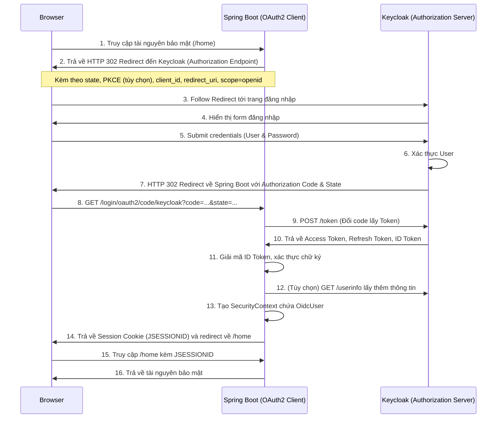

> [!NOTE]
> **Category:** Theory  
> **Goal:** Hiểu rõ cơ chế tích hợp Spring Boot với Keycloak thông qua OAuth2 Login và Client, nắm bắt các thành phần cốt lõi của Spring Security OAuth2 và luồng xác thực OpenID Connect (OIDC).

## 1. Lý thuyết chuyên sâu (Detailed Theory)

Spring Boot hỗ trợ tích hợp với các Identity Provider (IdP) như Keycloak thông qua thư viện `spring-boot-starter-oauth2-client`. Trong mô hình này, ứng dụng Spring Boot đóng vai trò là một **OAuth2 Client** hoặc **Relying Party (RP)** trong OIDC. 

OAuth2 Login là một tính năng của Spring Security cho phép người dùng đăng nhập vào ứng dụng bằng tài khoản đã có trên một Provider bên ngoài (ở đây là Keycloak). Nó sử dụng luồng **Authorization Code Grant** được định nghĩa trong đặc tả OAuth 2.0 và được mở rộng bởi OpenID Connect 1.0 (OIDC) để xác thực danh tính.

Khi tích hợp với Keycloak, Spring Boot sẽ tự động:
- Chuyển hướng người dùng chưa xác thực đến trang đăng nhập của Keycloak.
- Xử lý callback chứa `authorization code`.
- Đổi `authorization code` lấy `Access Token`, `Refresh Token` và `ID Token`.
- Tạo một `Authentication` object (`OAuth2AuthenticationToken`) lưu trữ trong `SecurityContext`.

Bản chất vấn đề giải quyết là: Ủy quyền hoàn toàn việc quản lý người dùng, mật khẩu, và quy trình đăng nhập phức tạp (như MFA) cho Keycloak, ứng dụng Spring Boot chỉ cần tin tưởng vào Token do Keycloak cấp phát.

## 2. Luồng nội bộ & Cơ chế cấp thấp (Internal Workflow & Low-level Mechanisms)

Luồng hoạt động dưới đây mô tả quá trình đăng nhập sử dụng **Authorization Code Flow** với OIDC:



**Các cơ chế cấp thấp đáng chú ý:**
- **State Parameter:** Spring Security tự động sinh ra một chuỗi ngẫu nhiên lưu vào Session và gửi kèm trong yêu cầu Authorization. Khi Keycloak phản hồi, Spring kiểm tra xem `state` trả về có khớp không để ngăn chặn tấn công **CSRF**.
- **OidcUserService:** Sau khi nhận được tokens, lớp `OidcUserService` sẽ đảm nhiệm việc parse `ID Token` (là một JWT), xác minh Issuer, Audience, chữ ký số (sử dụng JWK từ Keycloak), và thời gian hết hạn (exp). Nếu thành công, nó sẽ tạo ra đối tượng `OidcUser`.

## 3. Thực hành tốt nhất & Bảo mật (Best Practices & Security)

> [!IMPORTANT]
> Luôn luôn sử dụng TLS/HTTPS cho mọi giao tiếp giữa Browser, Spring Boot và Keycloak. Nếu không, `authorization code` và Tokens có thể bị đánh cắp qua tấn công Man-in-the-Middle (MitM).

- **Sử dụng PKCE (Proof Key for Code Exchange):** Mặc dù PKCE thường được dùng cho Public Clients (như SPA, Mobile App), nhưng Spring Security 5.2+ cũng hỗ trợ và khuyến khích dùng PKCE cho Confidential Clients.
- **Không bao giờ log Tokens:** `Access Token` và đặc biệt là `Refresh Token` là thông tin nhạy cảm. Tuyệt đối không log ra console.
- **Bảo mật Session:** Cấu hình Cookie của Spring Boot với các cờ `HttpOnly`, `Secure` và `SameSite=Strict` để phòng chống XSS và CSRF.
- **Scope Restriction:** Chỉ yêu cầu các `scope` thực sự cần thiết, thường là `openid`, `profile`, `email`.

## 4. Cấu hình minh họa thực tế (Configuration Examples)

Cấu hình `application.yml` tiêu chuẩn để biến Spring Boot thành OIDC Client của Keycloak:

```yaml
spring:
  security:
    oauth2:
      client:
        registration:
          keycloak:
            client-id: spring-boot-app
            client-secret: YOUR_CLIENT_SECRET
            scope: openid, profile, email
            authorization-grant-type: authorization_code
            redirect-uri: "{baseUrl}/login/oauth2/code/{registrationId}"
        provider:
          keycloak:
            issuer-uri: https://auth.yourdomain.com/realms/your-realm
```

Cấu hình Spring Security Config:

```java
import org.springframework.context.annotation.Bean;
import org.springframework.context.annotation.Configuration;
import org.springframework.security.config.annotation.web.builders.HttpSecurity;
import org.springframework.security.config.annotation.web.configuration.EnableWebSecurity;
import org.springframework.security.web.SecurityFilterChain;

@Configuration
@EnableWebSecurity
public class SecurityConfig {

    @Bean
    public SecurityFilterChain filterChain(HttpSecurity http) throws Exception {
        http
            .authorizeHttpRequests(authorize -> authorize
                .requestMatchers("/public/**").permitAll()
                .anyRequest().authenticated()
            )
            .oauth2Login(oauth2 -> oauth2
                .loginPage("/oauth2/authorization/keycloak") // Tùy chỉnh URL đăng nhập (tùy chọn)
            );
        return http.build();
    }
}
```

## 5. Trường hợp ngoại lệ (Edge Cases)

- **Lỗi `invalid_grant` khi đổi Code lấy Token:** Nguyên nhân phổ biến là do đồng bộ thời gian (Clock Skew) giữa Keycloak server và máy chủ chạy Spring Boot, hoặc `authorization code` đã hết hạn. Khắc phục bằng cách đảm bảo cài đặt NTP trên các servers.
- **Mismatch Redirect URI:** Lỗi xảy ra nếu URL gọi từ trình duyệt lúc đăng nhập khác với URI đăng ký trong Keycloak. Phải thiết lập chính xác các `Valid Redirect URIs` trên giao diện Keycloak Admin Console. Nếu ứng dụng nằm sau Reverse Proxy, cần cấu hình header `X-Forwarded-Proto` và `server.forward-headers-strategy=framework` trong Spring Boot.
- **Client Secret bị lộ:** Đổi lại Client Secret trên Keycloak và cập nhật lại config trên Spring Boot ngay lập tức. Cân nhắc dùng Private Key JWT để thay thế client-secret cho tăng cường bảo mật.

## 6. Câu hỏi Phỏng vấn (Interview Questions)

**Câu 1 (Junior):** Thư viện nào được sử dụng trong Spring Boot để tích hợp tính năng đăng nhập qua Keycloak?
*Đáp án:* `spring-boot-starter-oauth2-client`.

**Câu 2 (Junior):** Tại sao ứng dụng web lại cần thuộc tính `client-secret` nhưng SPA (Single Page Application) lại không cần?
*Đáp án:* Ứng dụng web backend (Confidential Client) có khả năng lưu trữ bí mật an toàn trên server, còn SPA (Public Client) chạy trên trình duyệt của người dùng nên không thể bảo vệ bí mật, do đó phải dựa vào PKCE.

**Câu 3 (Senior):** Giải thích cách Spring Security ngăn chặn tấn công CSRF trong quá trình OAuth2 Login?
*Đáp án:* Bằng cách sử dụng `state` parameter. Spring tạo ra một chuỗi state ngẫu nhiên trước khi redirect tới Keycloak, và kiểm chứng lại `state` này khi trình duyệt redirect lại. Nếu state không khớp, Authentication sẽ thất bại.

**Câu 4 (Senior):** Làm thế nào để giải quyết vấn đề ứng dụng Spring Boot chạy sau Nginx (Reverse Proxy) và `redirect_uri` được gửi tới Keycloak bị nhận nhầm thành HTTP thay vì HTTPS?
*Đáp án:* Nginx cần gửi các header `X-Forwarded-Proto: https`, `X-Forwarded-Host`, v.v. Trên Spring Boot, cấu hình `server.forward-headers-strategy=framework` hoặc đăng ký bean `ForwardedHeaderFilter` để Spring nhận biết đúng giao thức gốc.

**Câu 5 (Senior):** Sự khác biệt giữa `ID Token` và `Access Token` trong bối cảnh ứng dụng Client là gì?
*Đáp án:* `ID Token` chứa thông tin danh tính người dùng (để Client tạo phiên session cục bộ), trong khi `Access Token` là giấy phép vô danh để Client có thể đính kèm khi gọi các Resource Server (APIs) thay mặt cho người dùng.

## 7. Tài liệu tham khảo (References)
- [Spring Security OAuth2 Client Documentation](https://docs.spring.io/spring-security/reference/servlet/oauth2/client/index.html)
- [OAuth 2.0 Authorization Framework - RFC 6749](https://datatracker.ietf.org/doc/html/rfc6749)
- [OpenID Connect Core 1.0](https://openid.net/specs/openid-connect-core-1_0.html)
- [Keycloak Securing Applications](https://www.keycloak.org/docs/latest/securing_apps/)
