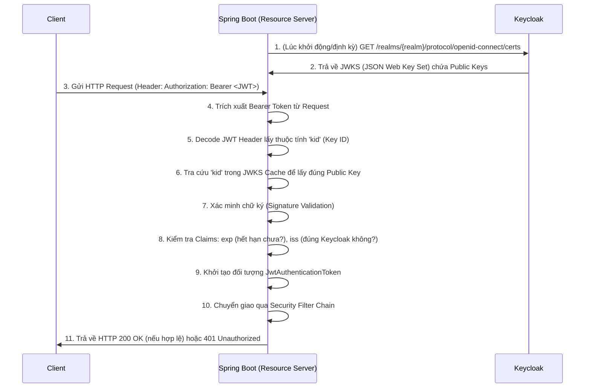

> [!NOTE]
> **Category:** Theory  
> **Goal:** Nắm vững kiến thức và kỹ thuật cấu hình ứng dụng Spring Boot hoạt động với vai trò là Resource Server, xử lý và xác thực JWT (JSON Web Token) cấp phát bởi Keycloak.

## 1. Lý thuyết chuyên sâu (Detailed Theory)

Trong hệ sinh thái OAuth 2.0, **Resource Server** là máy chủ lưu trữ dữ liệu hoặc API cần được bảo vệ. Ứng dụng này không trực tiếp xử lý quá trình đăng nhập của người dùng. Thay vào đó, nó yêu cầu một `Access Token` hợp lệ trong mỗi request HTTP để cấp quyền truy cập.

Spring Boot cung cấp module `spring-boot-starter-oauth2-resource-server` để thực hiện nhiệm vụ này. Khi tích hợp với Keycloak, phương pháp phổ biến nhất là sử dụng `Access Token` định dạng **JWT**. 

Bản chất của JWT Resource Server:
- **Stateless Authentication:** Server không cần lưu trữ bất kỳ trạng thái phiên (session state) nào. Mọi thông tin cần thiết về User, Client, Roles, Expiration time đều đã nằm trong chính nội dung của Payload của JWT.
- **Offline Validation:** Nhờ cấu trúc có chữ ký điện tử (Signature) bằng bất đối xứng (ví dụ: RSA256), Spring Boot Resource Server có thể tự giải mã và xác minh JWT bằng Public Key của Keycloak mà không cần gửi request mạng về Keycloak mỗi khi có request từ Client.

Điều này đặc biệt quan trọng trong kiến trúc Microservices để giảm tải hệ thống (reduce network hop) và loại bỏ điểm thắt cổ chai ở Authorization Server.

## 2. Luồng nội bộ & Cơ chế cấp thấp (Internal Workflow & Low-level Mechanisms)

Quá trình xác thực API Request tại Resource Server sử dụng JWT diễn ra như sau:



**Chi tiết cấp thấp (Low-level Details):**
- **BearerTokenAuthenticationFilter:** Đây là bộ lọc cốt lõi trong Spring Security sẽ đón bắt các Request. Nó tìm kiếm chuỗi bắt đầu bằng `Bearer ` trong header `Authorization`.
- **JwtDecoder:** Spring Security sử dụng `NimbusJwtDecoder` đằng sau hậu trường để xử lý toàn bộ logic phân tích cú pháp (parsing) và xác minh (validation) JWT.
- **JWK Set Cache:** Spring Security tự động thiết lập bộ nhớ cache cho các khóa công khai. Khi Keycloak xoay vòng khóa (Key Rotation), nếu Spring Boot gặp một `kid` lạ, nó sẽ tự động lấy (fetch) lại `JWKS` từ Keycloak một lần nữa.

## 3. Thực hành tốt nhất & Bảo mật (Best Practices & Security)

> [!WARNING]
> Mặc dù `Access Token` được ký tự động (Signed), nhưng nội dung trong đó **KHÔNG BỊ MÃ HÓA (Not Encrypted)**. Bất kỳ ai chặn được token đều đọc được Payload (tên, role, email). Do đó, giao tiếp phải luôn dùng **HTTPS**.

- **Sử dụng Scope và Audience Checking:** Đảm bảo thêm validation để check field `aud` (Audience) của JWT xem token này có thực sự được cấp cho Resource Server hiện tại hay không.
- **Xử lý Thời gian sống (Expiration):** Thiết lập Access Token Lifespan ngắn (vd: 5-15 phút) trong Keycloak. Mọi token bị lộ sẽ có cửa sổ rủi ro cực thấp.
- **Đừng dùng Introspection trừ khi bắt buộc:** Opaque Token + Introspection endpoint sẽ khiến Resource Server phải gọi Keycloak ở mỗi request, làm giảm hiệu năng. Luôn ưu tiên dùng JWT để offline validation.

## 4. Cấu hình minh họa thực tế (Configuration Examples)

Khai báo file `application.yml` cho Spring Boot Resource Server:

```yaml
spring:
  security:
    oauth2:
      resourceserver:
        jwt:
          # Đây là điểm mấu chốt để Spring Boot biết nơi tải Public Keys (JWKS)
          issuer-uri: https://auth.yourdomain.com/realms/your-realm
```

Cấu hình Spring Security:

```java
import org.springframework.context.annotation.Bean;
import org.springframework.context.annotation.Configuration;
import org.springframework.security.config.annotation.web.builders.HttpSecurity;
import org.springframework.security.config.annotation.web.configuration.EnableWebSecurity;
import org.springframework.security.web.SecurityFilterChain;

@Configuration
@EnableWebSecurity
public class ResourceServerConfig {

    @Bean
    public SecurityFilterChain filterChain(HttpSecurity http) throws Exception {
        http
            .authorizeHttpRequests(authorize -> authorize
                .requestMatchers("/api/public/**").permitAll()
                .anyRequest().authenticated()
            )
            .oauth2ResourceServer(oauth2 -> oauth2
                .jwt(jwt -> {}) // Kích hoạt xử lý JWT với cấu hình mặc định từ properties
            );
        return http.build();
    }
}
```

## 5. Trường hợp ngoại lệ (Edge Cases)

- **Lỗi 401 khi Keycloak Restart (Key Rotation):** Nếu Keycloak restart hoặc xoay khóa sinh ra một bộ key mới, và cache của Spring Boot chưa hết hạn hoặc không tra được `kid`. Giải pháp là cấu hình `spring.security.oauth2.resourceserver.jwt.jwk-set-uri` trực tiếp, hoặc điều chỉnh chiến lược cache của `JwkSetUriJwtDecoderBuilder`.
- **Clock Skew (Lệch thời gian):** Nếu đồng hồ máy chủ Spring Boot chạy nhanh hơn Keycloak, một token vừa được phát hành có thể bị coi là `nbf` (not before) lỗi, hoặc báo `exp` (expired). Hãy thiết lập clock skew tolerance trong JwtDecoder.
- **Thiếu "kid" trong Header JWT:** Nếu hệ thống cấp phát token không nhúng `kid` (hiếm gặp ở Keycloak, nhưng có thể do config sai), Spring Boot sẽ không biết dùng khóa nào. Cần kiểm tra lại cấu hình Realm Keys trong Keycloak.

## 6. Câu hỏi Phỏng vấn (Interview Questions)

**Câu 1 (Junior):** Resource Server sử dụng thông tin gì để quyết định có cho phép Request truy cập API không?
*Đáp án:* Sử dụng `Access Token` gửi kèm trong Header `Authorization: Bearer <token>`.

**Câu 2 (Junior):** Phương pháp nào giúp Resource Server giảm thiểu việc phải gọi về Authorization Server liên tục?
*Đáp án:* Sử dụng chuẩn JWT kết hợp thuật toán mã hóa bất đối xứng để có thể tự giải mã (offline validation) bằng Public Key.

**Câu 3 (Senior):** Làm thế nào Spring Boot nhận biết được Keycloak đã xoay vòng khóa (Key Rotation)?
*Đáp án:* JWT mới sẽ chứa thuộc tính `kid` mới. Khi Spring tra cứu cache nội bộ không thấy `kid` này, nó sẽ tự động kích hoạt một cuộc gọi HTTP tới endpoint JWKS của Keycloak để cập nhật lại danh sách Public Keys.

**Câu 4 (Senior):** Phân biệt giữa `issuer-uri` và `jwk-set-uri` trong cấu hình Spring Security OAuth2.
*Đáp án:* `issuer-uri` trỏ đến gốc của Realm, Spring sẽ gọi `.well-known/openid-configuration` để khám phá các endpoint bao gồm JWKS và kiểm tra claim `iss`. `jwk-set-uri` trỏ thẳng tới file cấu hình JWK Set và thường bỏ qua việc validate thông số `iss` nếu không được định cấu hình tường minh.

**Câu 5 (Senior):** Làm cách nào để giới hạn Resource Server chỉ chấp nhận Token có chứa claim "audience" cụ thể?
*Đáp án:* Cần tùy biến `JwtDecoder` bằng cách thêm một `OAuth2TokenValidator` riêng biệt để xác minh danh sách mảng trong field `aud` của Payload JWT.

## 7. Tài liệu tham khảo (References)
- [Spring Security Resource Server Documentation](https://docs.spring.io/spring-security/reference/servlet/oauth2/resource-server/jwt.html)
- [RFC 7519: JSON Web Token (JWT)](https://datatracker.ietf.org/doc/html/rfc7519)
- [RFC 7517: JSON Web Key (JWK)](https://datatracker.ietf.org/doc/html/rfc7517)
- [Keycloak OpenID Connect Endpoints](https://www.keycloak.org/docs/latest/securing_apps/)
