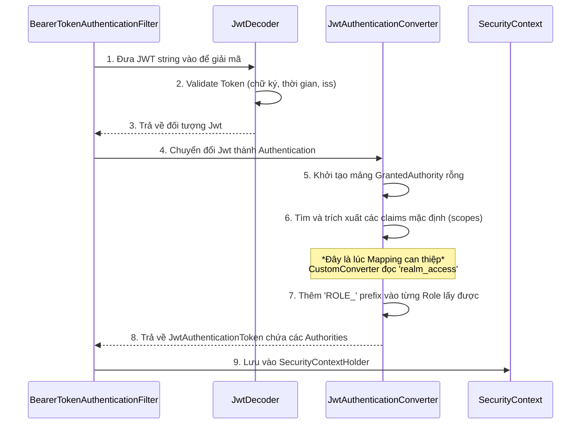

> [!NOTE]
> **Category:** Theory  
> **Goal:** Nắm vững lý thuyết và các kỹ thuật để ánh xạ thông tin (Roles, Attributes) từ Keycloak vào kiến trúc bảo mật của Spring Security, phục vụ kiểm soát truy cập phân quyền.

## 1. Lý thuyết chuyên sâu (Detailed Theory)

Hệ thống bảo mật vững chắc yêu cầu kiểm soát truy cập (Access Control) chi tiết. Có hai mô hình phân quyền phổ biến được áp dụng giữa Keycloak và Spring Boot:

- **RBAC (Role-Based Access Control):** Quyền truy cập được xác định thông qua các vai trò (Roles) gán cho người dùng (ví dụ: `ADMIN`, `USER`). Spring Security hỗ trợ mạnh mẽ thông qua các annotation như `@PreAuthorize("hasRole('ADMIN')")`.
- **ABAC (Attribute-Based Access Control):** Quyền truy cập được quyết định thông qua các thuộc tính (Attributes) của người dùng, đối tượng tài nguyên, hoặc ngữ cảnh (ví dụ: department=`IT`, project=`Alpha`). Linh hoạt hơn nhưng cấu hình phức tạp hơn.

Vấn đề cốt lõi: Mặc định, Keycloak nhúng Roles dưới định dạng phức tạp bên trong chuỗi JSON của `Access Token` (vd: `realm_access.roles` hoặc `resource_access.client_id.roles`). Trong khi đó, Spring Boot mặc định mong đợi các quyền này tồn tại dưới dạng một danh sách chuỗi đơn giản nằm trong trường `scope` hoặc được cấp tiền tố `SCOPE_`. 
Do đó, chúng ta cần thực hiện một bước **Ánh xạ (Mapping)** để dịch ngôn ngữ của Keycloak sang lớp `GrantedAuthority` của Spring Security.

## 2. Luồng nội bộ & Cơ chế cấp thấp (Internal Workflow & Low-level Mechanisms)

Quá trình trích xuất và biến đổi Token thành các Authorities trong Spring Security diễn ra tự động trong tầng Filter:



Trong thực tế, lập trình viên sẽ override `JwtAuthenticationConverter` bằng cách cấu hình cung cấp một bean để tự định nghĩa logic đọc Claim chứa các vai trò từ cấu trúc JSON lồng nhau của Keycloak, gán thêm tiền tố `ROLE_` và chuyển thành `SimpleGrantedAuthority`.

## 3. Thực hành tốt nhất & Bảo mật (Best Practices & Security)

> [!TIP]
> Hãy tận dụng tính năng **Mappers** của Keycloak để chuẩn hóa JWT thay vì viết code parser phức tạp ở Spring Boot. Bạn có thể sử dụng *Audience Mapper* và *Role Mapper* trên Keycloak để đưa hết các role vào một custom claim (vd: `authorities`), giúp code backend cực kỳ gọn nhẹ.

- **Prefix Convention:** Theo quy ước, Spring Security sử dụng `ROLE_` để nhận diện một `Role` so với một `Authority` chung. Luôn đảm bảo Role được mapping qua có tiền tố này (vd: `ROLE_ADMIN`).
- **Phân tách Realm Roles và Client Roles:** Keycloak cho phép định nghĩa Roles ở cấp độ toàn hệ thống (Realm) và cấp độ ứng dụng (Client). Tùy vào tính chất của Microservice mà quyết định ánh xạ loại Role nào cho phù hợp.
- **Kết hợp RBAC và ABAC:** Sử dụng Roles cho chức năng cơ bản, dùng Attributes (như thông tin phòng ban, mức độ bảo mật dự án) thông qua Spring EL (`@PreAuthorize`) để kiểm soát truy cập mức dữ liệu mịn (Fine-Grained).

## 4. Cấu hình minh họa thực tế (Configuration Examples)

Cấu hình custom `JwtAuthenticationConverter` trong cấu hình Spring Security:

```java
import org.springframework.context.annotation.Bean;
import org.springframework.context.annotation.Configuration;
import org.springframework.core.convert.converter.Converter;
import org.springframework.security.authentication.AbstractAuthenticationToken;
import org.springframework.security.config.annotation.method.configuration.EnableMethodSecurity;
import org.springframework.security.config.annotation.web.builders.HttpSecurity;
import org.springframework.security.config.annotation.web.configuration.EnableWebSecurity;
import org.springframework.security.core.GrantedAuthority;
import org.springframework.security.core.authority.SimpleGrantedAuthority;
import org.springframework.security.oauth2.jwt.Jwt;
import org.springframework.security.oauth2.server.resource.authentication.JwtAuthenticationToken;
import org.springframework.security.web.SecurityFilterChain;

import java.util.Collection;
import java.util.Collections;
import java.util.List;
import java.util.Map;
import java.util.stream.Collectors;

@Configuration
@EnableWebSecurity
@EnableMethodSecurity // Cho phép dùng @PreAuthorize
public class SecurityConfig {

    @Bean
    public SecurityFilterChain filterChain(HttpSecurity http) throws Exception {
        http
            .authorizeHttpRequests(auth -> auth
                .requestMatchers("/api/admin/**").hasRole("ADMIN")
                .anyRequest().authenticated()
            )
            .oauth2ResourceServer(oauth2 -> oauth2
                .jwt(jwt -> jwt.jwtAuthenticationConverter(jwtAuthConverter()))
            );
        return http.build();
    }

    private Converter<Jwt, ? extends AbstractAuthenticationToken> jwtAuthConverter() {
        return new Converter<Jwt, AbstractAuthenticationToken>() {
            @Override
            public AbstractAuthenticationToken convert(Jwt jwt) {
                // Đọc custom claim hoặc cấu trúc realm_access
                Map<String, Object> realmAccess = jwt.getClaim("realm_access");
                Collection<GrantedAuthority> authorities = Collections.emptyList();
                
                if (realmAccess != null && realmAccess.containsKey("roles")) {
                    List<String> roles = (List<String>) realmAccess.get("roles");
                    authorities = roles.stream()
                            .map(roleName -> "ROLE_" + roleName)
                            .map(SimpleGrantedAuthority::new)
                            .collect(Collectors.toList());
                }
                return new JwtAuthenticationToken(jwt, authorities);
            }
        };
    }
}
```

Bảo vệ API bằng ABAC thông qua SpEL:
```java
// Chỉ cấp quyền nếu thuộc phòng IT hoặc chức vụ Manager
@PreAuthorize("hasRole('IT_STAFF') or authentication.token.claims['department'] == 'IT'")
@GetMapping("/api/secured/data")
public String getDepartmentData() { ... }
```

## 5. Trường hợp ngoại lệ (Edge Cases)

- **Token Phình To (Token Bloat):** Khi người dùng có quá nhiều quyền (hàng trăm Roles/Attributes), JWT có thể phình to, vượt giới hạn Header HTTP (thường là 8KB). Giải pháp: Hạn chế Role trả về theo từng Client riêng biệt, hoặc chỉ trả về các Roles cốt lõi và buộc Spring ứng dụng gọi API `/userinfo` để nạp thêm ABAC attributes.
- **Roles Bị Sửa Đổi Trực Tiếp (In-Flight Modification):** Do chữ ký (Signature) bảo vệ, không ai can thiệp thêm quyền được. Nhưng nếu Token bị đánh cắp thì kẻ gian có toàn bộ Role đó trong khoảng thời gian hiệu lực.
- **Lỗi ClassCastException khi Mapping:** Nếu Payload token không chuẩn (vd trường `roles` trả về chuỗi thay vì mảng List/Array), logic map của Spring sẽ văng ngoại lệ. Cần kiểm tra kỹ loại dữ liệu trả về và ép kiểu an toàn (Safe type casting).

## 6. Câu hỏi Phỏng vấn (Interview Questions)

**Câu 1 (Junior):** Trong Spring Security, điểm khác biệt cơ bản giữa `hasRole('ADMIN')` và `hasAuthority('ADMIN')` là gì?
*Đáp án:* `hasRole('ADMIN')` ngầm định tìm kiếm quyền có tiền tố `ROLE_` (tức là `ROLE_ADMIN`). `hasAuthority('ADMIN')` sẽ tìm kiếm chính xác chuỗi `ADMIN` không kèm tiền tố.

**Câu 2 (Junior):** ABAC linh hoạt hơn RBAC ở điểm nào?
*Đáp án:* Khả năng xét duyệt quyền không chỉ dựa trên danh tính tĩnh (Role) mà còn dựa trên thuộc tính động từ yêu cầu (vd: thời gian truy cập, vị trí địa lý, thuộc tính phòng ban user).

**Câu 3 (Senior):** Lớp (Class) nào trong Spring Boot đảm nhiệm việc trích xuất thông tin JSON của JWT thành các `GrantedAuthority`?
*Đáp án:* `JwtAuthenticationConverter`. Mặc định nó sử dụng `JwtGrantedAuthoritiesConverter` để đọc field `scope` hoặc `scp`.

**Câu 4 (Senior):** Nếu bạn không muốn viết Code Java để tạo Custom Jwt Converter cho việc Mapping Keycloak Roles, bạn có giải pháp nào thay thế từ phía cấu hình máy chủ Keycloak?
*Đáp án:* Tạo một Protocol Mapper trên Client trong Keycloak, ánh xạ các Role (realm hoặc client roles) gộp chung vào chung claim `scope`. Sau đó Spring Boot sẽ tự động phân tích không cần cấu hình tùy chỉnh.

**Câu 5 (Senior):** Làm thế nào để áp dụng ABAC trong ứng dụng Spring để kiểm tra chủ sở hữu tài nguyên (User chỉ được sửa dữ liệu của chính mình)?
*Đáp án:* Sử dụng Method Security với Spring Expression Language. Ví dụ: `@PreAuthorize("#document.ownerId == authentication.token.subject")` nhận document như một tham số truyền vào hàm.

## 7. Tài liệu tham khảo (References)
- [Spring Security Method Security](https://docs.spring.io/spring-security/reference/servlet/authorization/method-security.html)
- [NIST Attribute-Based Access Control Definition](https://csrc.nist.gov/projects/attribute-based-access-control)
- [Keycloak Server Administration Guide - Mappers](https://www.keycloak.org/docs/latest/server_admin/)
