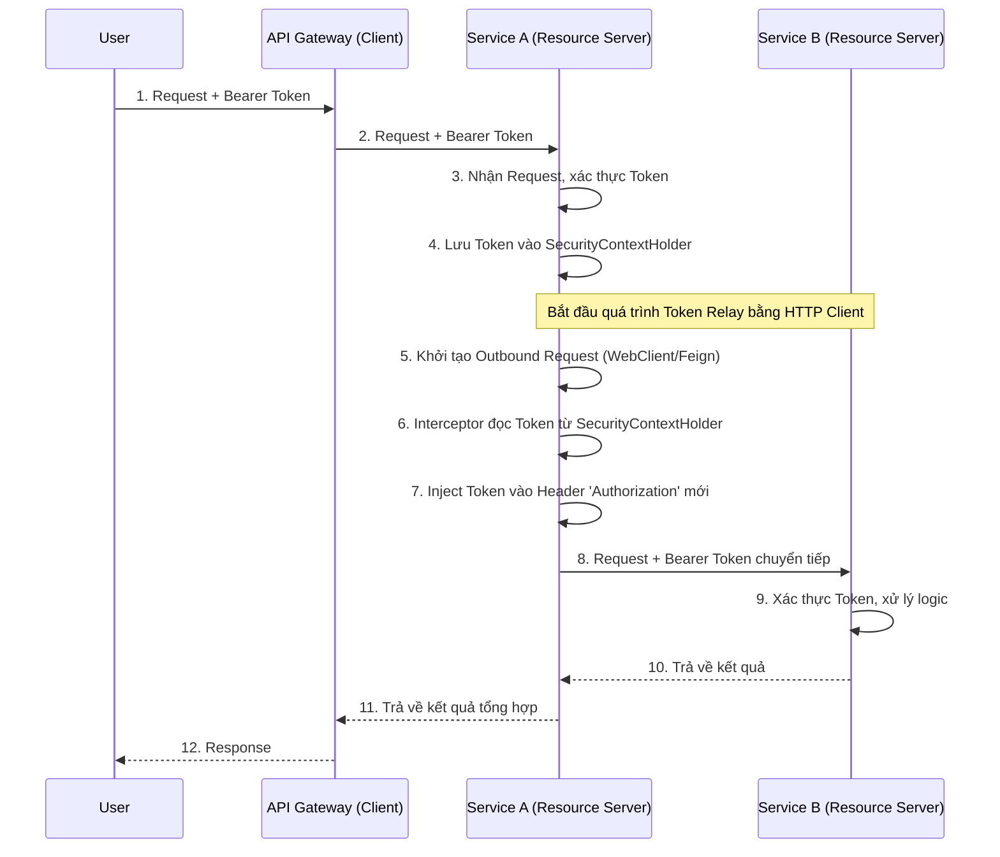

> [!NOTE]
> **Category:** Theory  
> **Goal:** Hiểu và triển khai cơ chế Token Relay (Chuyển tiếp Token) để duy trì định danh và quyền hạn của người dùng khi giao tiếp liên dịch vụ (Microservices) trong hệ sinh thái Spring Boot.

## 1. Lý thuyết chuyên sâu (Detailed Theory)

Trong cấu trúc Microservices, một request từ người dùng thường không chỉ dừng lại ở một service duy nhất. Ví dụ: `Order-Service` sau khi nhận yêu cầu cần gọi sang `Inventory-Service` và `Payment-Service`. 

Vấn đề đặt ra là: Nếu `Inventory-Service` và `Payment-Service` cũng đóng vai trò là **Resource Servers** yêu cầu JWT hợp lệ, làm thế nào để `Order-Service` có thể vượt qua bước kiểm tra bảo mật mà vẫn giữ nguyên được ngữ cảnh (Context) của người dùng gốc?
Đó là lúc khái niệm **Token Relay** ra đời. Token Relay là cơ chế tự động trích xuất chuỗi Access Token từ Request ban đầu (inbound request) và gắn nó vào Request tiếp theo (outbound request) để chuyển tiếp đến dịch vụ hạ nguồn (downstream service).

Cơ chế này bảo đảm:
- **Xác thực toàn trình (End-to-end Authentication):** Dịch vụ cuối cùng vẫn biết chính xác User là ai.
- **Kiểm soát Truy cập (Authorization):** Kế thừa các quyền (Roles) của User để đánh giá quyền hạn ở tất cả các node.
- **Auditing/Logging:** Truy vết hành động của người dùng trên toàn bộ hệ thống phân tán.

## 2. Luồng nội bộ & Cơ chế cấp thấp (Internal Workflow & Low-level Mechanisms)

Cơ chế Token Relay hoạt động thông qua các Interceptors hoặc Filters can thiệp vào HTTP Client (như `RestTemplate`, `WebClient`, hoặc `FeignClient`).



**Cơ chế cấp thấp:**
- Khi Spring Security nhận request ở SvcA, `BearerTokenAuthenticationFilter` sẽ parse Token và tạo `JwtAuthenticationToken`. Thuộc tính `tokenValue` (chuỗi JWT gốc) được bảo lưu bên trong object này.
- Khi sử dụng `ServletBearerExchangeFilterFunction` (cho `WebClient`) hoặc custom RequestInterceptor (cho `FeignClient`), thành phần này sẽ thâm nhập vào luồng (Thread) hiện tại, truy xuất `SecurityContextHolder.getContext().getAuthentication()`, lấy ra chuỗi JWT gốc và set vào HTTP Header `Authorization` cho lời gọi mạng chuẩn bị diễn ra.

## 3. Thực hành tốt nhất & Bảo mật (Best Practices & Security)

> [!WARNING]
> Không nên lan truyền Token đến các dịch vụ External (bên ngoài mạng nội bộ / 3rd party). Việc vô tình Token Relay ra bên ngoài có thể gây lộ lọt thông tin nhạy cảm của hệ thống.

- **Duy trì ThreadLocal:** Spring SecurityContext mặc định liên kết với Thread hiện tại (ThreadLocal). Nếu gọi bất đồng bộ (`@Async`, Reactor, CompletableFuture), Context có thể bị mất. Cần phải truyền (propagate) SecurityContext sang các thread mới sử dụng `DelegatingSecurityContextExecutor` hoặc cấu hình reactor hooks.
- **Token Exchange (RFC 8693) so với Token Relay:** Token Relay sử dụng *nguyên bản* token cũ. Nếu cần thu hẹp quyền (downgrade scope) khi gọi dịch vụ hạ nguồn vì lý do bảo mật, bạn nên dùng luồng **Token Exchange** của OAuth2 để đổi token gốc lấy token mới có quyền thấp hơn, thay vì Relay token cũ.
- **Xử lý Token hết hạn:** Trong chuỗi gọi dài, Token có thể hết hạn giữa chừng. Dịch vụ đứng đầu nên gia hạn hoặc bắt lỗi 401 Unauthorized để yêu cầu lại token mới.

## 4. Cấu hình minh họa thực tế (Configuration Examples)

### Cách 1: Token Relay với Spring WebClient (Reactive HTTP Client)

Thêm bộ lọc được cung cấp sẵn bởi Spring Security:

```java
import org.springframework.context.annotation.Bean;
import org.springframework.context.annotation.Configuration;
import org.springframework.security.oauth2.server.resource.web.reactive.function.client.ServletBearerExchangeFilterFunction;
import org.springframework.web.reactive.function.client.WebClient;

@Configuration
public class WebClientConfig {

    @Bean
    public WebClient webClient() {
        // Tự động lấy Bearer Token từ Security Context hiện tại và tiêm vào Request
        return WebClient.builder()
                .filter(new ServletBearerExchangeFilterFunction())
                .build();
    }
}
```

### Cách 2: Token Relay với OpenFeign

Cần viết một custom Interceptor để truyền Header:

```java
import feign.RequestInterceptor;
import feign.RequestTemplate;
import org.springframework.context.annotation.Bean;
import org.springframework.context.annotation.Configuration;
import org.springframework.security.core.Authentication;
import org.springframework.security.core.context.SecurityContextHolder;
import org.springframework.security.oauth2.server.resource.authentication.JwtAuthenticationToken;

@Configuration
public class FeignConfig {

    @Bean
    public RequestInterceptor requestInterceptor() {
        return new RequestInterceptor() {
            @Override
            public void apply(RequestTemplate template) {
                Authentication authentication = SecurityContextHolder.getContext().getAuthentication();
                
                if (authentication instanceof JwtAuthenticationToken jwtAuthToken) {
                    String tokenValue = jwtAuthToken.getToken().getTokenValue();
                    template.header("Authorization", "Bearer " + tokenValue);
                }
            }
        };
    }
}
```

## 5. Trường hợp ngoại lệ (Edge Cases)

- **Ngữ cảnh Bất đồng bộ (Async/Reactive Streams):** Khi dùng `WebFlux`, `SecurityContextHolder` (dựa trên ThreadLocal) không còn hoạt động. Bạn phải dùng `ReactiveSecurityContextHolder` và truyền context xuyên suốt chuỗi Reactor (Mono/Flux), nếu không sẽ bị lỗi rớt Token khi gọi dịch vụ tiếp theo.
- **Lỗi 401 Liên Hoàn:** Nếu Token hết hạn ngay trước khi dịch vụ A gọi dịch vụ B, dịch vụ B sẽ trả 401. Dịch vụ A cần có Retry logic kết hợp với Circuit Breaker để phản hồi lỗi tinh tế thay vì crash ứng dụng.
- **Vòng lặp Gọi lại (Circular Dependency):** Hãy cẩn thận thiết kế luồng Microservices để không bị lặp vô hạn, Token Relay không làm phát sinh lỗi này nhưng khiến hệ thống lãng phí tài nguyên giải mã JWT vô ích ở mỗi bước lặp.

## 6. Câu hỏi Phỏng vấn (Interview Questions)

**Câu 1 (Junior):** Tại sao cần sử dụng Token Relay trong Microservices?
*Đáp án:* Để duy trì thông tin định danh và quyền hạn của người dùng xuyên suốt các lời gọi giữa các dịch vụ. Không có Token Relay, dịch vụ tiếp theo sẽ từ chối Request do thiếu Header xác thực.

**Câu 2 (Junior):** `ServletBearerExchangeFilterFunction` có tác dụng gì trong Spring WebClient?
*Đáp án:* Nó là bộ lọc tự động trích xuất Bearer Token từ SecurityContext của Request hiện tại và đưa vào header `Authorization` của outbound request.

**Câu 3 (Senior):** Khi nào thì bạn nên sử dụng OAuth2 Token Exchange thay vì Token Relay thông thường?
*Đáp án:* Token Relay gửi Token gốc có toàn bộ quyền đi khắp nơi, vi phạm nguyên tắc "Đặc quyền tối thiểu". Nếu một dịch vụ bị tấn công, token lộ ra là token nguy hiểm. Token Exchange giúp đổi token gốc lấy token có scope/phạm vi nhỏ hẹp hơn dành riêng cho backend service được gọi.

**Câu 4 (Senior):** Bạn cấu hình Token Relay trong một luồng bất đồng bộ sử dụng annotation `@Async`, nhưng JWT luôn bị mất. Nguyên nhân và cách khắc phục?
*Đáp án:* Nguyên nhân là do Context sử dụng ThreadLocal, khi sang Thread mới nó sẽ trống rỗng. Khắc phục bằng cách sử dụng `DelegatingSecurityContextExecutor` cho ThreadPool Task Executor.

**Câu 5 (Senior):** Giao thức Client Credentials Grant thường được dùng để gọi Service-to-Service thay vì Token Relay trong hoàn cảnh nào?
*Đáp án:* Khi logic gọi giữa 2 Service là batch job hệ thống, hoặc một tác vụ backend tự động không liên quan và không phục vụ trực tiếp cho hành vi của một người dùng cụ thể. Token Relay yêu cầu phải có một người dùng khởi tạo request.

## 7. Tài liệu tham khảo (References)
- [Spring Security OAuth2 Client/Resource Server Documentation](https://docs.spring.io/spring-security/reference/servlet/oauth2/index.html)
- [RFC 8693: OAuth 2.0 Token Exchange](https://datatracker.ietf.org/doc/html/rfc8693)
- [OpenFeign Documentation](https://github.com/OpenFeign/feign)
