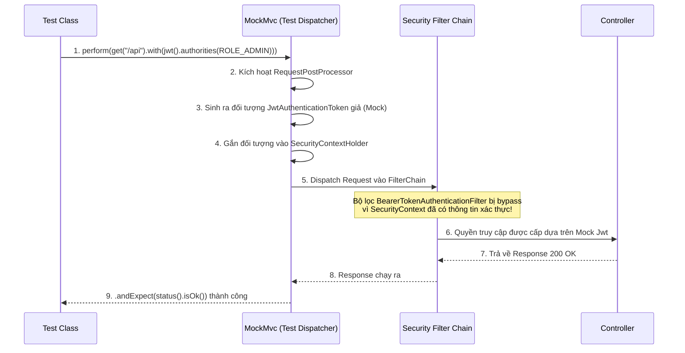

> [!NOTE]
> **Category:** Theory  
> **Goal:** Nắm vững các phương pháp luận, công cụ và kỹ thuật để kiểm thử tự động (Unit Test, Integration Test) cho ứng dụng Spring Boot được bảo mật bằng hệ sinh thái Keycloak/OAuth2.

## 1. Lý thuyết chuyên sâu (Detailed Theory)

Kiểm thử (Testing) một ứng dụng bảo mật bằng OAuth2/Keycloak đặt ra thách thức lớn: Ứng dụng phụ thuộc vào một Authorization Server (Keycloak) ngoại vi. Nếu trong mỗi lần chạy CI/CD Pipeline, các bài test đều gửi HTTP Request thực tế đến Keycloak, hệ thống test sẽ trở nên chậm chạp (Flaky), phụ thuộc kết nối mạng, và rất khó kiểm soát các kịch bản ngoại lệ (ví dụ: mô phỏng Token hết hạn).

Vì vậy, chúng ta áp dụng **Mocking** và **Testcontainers**:
- **Mocking Context (Unit/WebMvc Test):** Cô lập tầng Controller. Bỏ qua hoàn toàn việc gọi Keycloak, trực tiếp tạo ra một đối tượng bảo mật (Authentication / Jwt) giả lập nhúng vào Security Context.
- **Integration Test:** Đánh giá tính kết nối giữa các thành phần. Có thể dựng một Keycloak thật qua Docker bằng `Testcontainers`, hoặc Mock HTTP Client/JWKS server bằng thư viện như `WireMock`.

Spring Security cung cấp module `spring-security-test` chứa các annotation và RequestPostProcessors mạnh mẽ phục vụ riêng cho việc mô phỏng các đối tượng của hệ sinh thái OAuth2/OIDC.

## 2. Luồng nội bộ & Cơ chế cấp thấp (Internal Workflow & Low-level Mechanisms)

Khi sử dụng `@WithMockUser` hoặc `jwt()` mutator trong MockMvc, Spring Security can thiệp vào luồng Test như sau:



**Cơ chế cấp thấp:**
Bình thường `BearerTokenAuthenticationFilter` sẽ tìm Token từ Header, gọi decoder để gọi JWKS lấy key giải mã. Tuy nhiên, nếu bạn tiêm (inject) sẵn `Authentication` object thông qua test framework trước khi request chạm vào Filter này, Filter sẽ tự động bỏ qua công đoạn kiểm tra chữ ký token phức tạp, giúp test chạy tốc độ tính bằng mili-giây.

## 3. Thực hành tốt nhất & Bảo mật (Best Practices & Security)

> [!TIP]
> Việc sử dụng Testcontainers để chạy một bản sao Keycloak trong Integration Test đem lại độ bao phủ cực cao và chuẩn xác nhất cho các bài kiểm tra E2E (End-to-End).

- **Kiểm thử đầy đủ phân quyền:** Phải viết test cho cả trường hợp "Happy path" (Có đủ Role -> 200 OK) và "Sad path" (Thiếu Role -> 403 Forbidden, Không có Token -> 401 Unauthorized).
- **Tránh Mock sai bản chất:** Khi mock JWT, hãy chắc chắn mô phỏng chính xác cấu trúc claim (đặc biệt là Role mapping) giống như cấu hình Converter mà bạn đang viết.
- **Cấu hình Profile độc lập:** Luôn sử dụng profile riêng biệt (như `application-test.yml`) để không ảnh hưởng đến cấu hình Database và Keycloak của môi trường dev/prod.

## 4. Cấu hình minh họa thực tế (Configuration Examples)

Sử dụng `MockMvc` kết hợp với `spring-security-test` để kiểm thử Web Controller:

**Dependencies (pom.xml):**
```xml
<dependency>
    <groupId>org.springframework.boot</groupId>
    <artifactId>spring-boot-starter-test</artifactId>
    <scope>test</scope>
</dependency>
<dependency>
    <groupId>org.springframework.security</groupId>
    <artifactId>spring-security-test</artifactId>
    <scope>test</scope>
</dependency>
```

**Unit Test cho API bảo vệ bằng Resource Server (MockMvc):**

```java
import org.junit.jupiter.api.Test;
import org.springframework.beans.factory.annotation.Autowired;
import org.springframework.boot.test.autoconfigure.web.servlet.AutoConfigureMockMvc;
import org.springframework.boot.test.context.SpringBootTest;
import org.springframework.security.core.authority.SimpleGrantedAuthority;
import org.springframework.test.web.servlet.MockMvc;
import static org.springframework.security.test.web.servlet.request.SecurityMockMvcRequestPostProcessors.jwt;
import static org.springframework.test.web.servlet.request.MockMvcRequestBuilders.get;
import static org.springframework.test.web.servlet.result.MockMvcResultMatchers.status;

@SpringBootTest
@AutoConfigureMockMvc
public class AdminControllerTest {

    @Autowired
    private MockMvc mockMvc;

    @Test
    public void testAdminAccess_WithoutToken_Returns401() throws Exception {
        mockMvc.perform(get("/api/admin/data"))
               .andExpect(status().isUnauthorized());
    }

    @Test
    public void testAdminAccess_WithUserRole_Returns403() throws Exception {
        mockMvc.perform(get("/api/admin/data")
               .with(jwt().authorities(new SimpleGrantedAuthority("ROLE_USER"))))
               .andExpect(status().isForbidden());
    }

    @Test
    public void testAdminAccess_WithAdminRole_Returns200() throws Exception {
        mockMvc.perform(get("/api/admin/data")
               .with(jwt().authorities(new SimpleGrantedAuthority("ROLE_ADMIN"))))
               .andExpect(status().isOk());
    }
}
```

## 5. Trường hợp ngoại lệ (Edge Cases)

- **Test Method Security (`@PreAuthorize` không chạy):** Khi mock thông qua WebMvcTest, thỉnh thoảng Method Security sẽ bị vô hiệu hóa nếu lớp cấu hình `SecurityConfig` (chứa `@EnableMethodSecurity`) không được nạp vào Test context. Cần đảm bảo Import thêm cấu hình bảo mật thông qua `@Import(SecurityConfig.class)`.
- **Lỗi nạp JWKS lúc Test khởi động:** Dù bạn đã mock controller, nhưng khi Application Context khởi động toàn bộ, Spring Security vẫn cố gắng gọi mạng tới Keycloak (thiết lập qua thuộc tính `issuer-uri`) để lấy JWK Set, gây lỗi Connection Refused. Giải pháp là ghi đè thuộc tính bằng giá trị mock trong file test properties, hoặc cung cấp một `@MockBean JwtDecoder jwtDecoder`.
- **Lỗi Parse Claims Custom:** Nếu ứng dụng dựa dẫm sâu vào các Custom Claims trong JWT, dùng `jwt().authorities()` là chưa đủ. Bạn cần thiết lập thủ công các Claims bằng `jwt().jwt(builder -> builder.claim("department", "IT"))`.

## 6. Câu hỏi Phỏng vấn (Interview Questions)

**Câu 1 (Junior):** Package nào được Spring Boot cung cấp để chuyên hỗ trợ kiểm thử các tính năng của Security?
*Đáp án:* `spring-security-test`.

**Câu 2 (Junior):** Để mô phỏng một Token JWT đính kèm trong các request tới Controller trong quá trình Test, bạn sử dụng phương thức nào của `MockMvc`?
*Đáp án:* Sử dụng phương thức `.with(jwt())` được cung cấp từ lớp `SecurityMockMvcRequestPostProcessors`.

**Câu 3 (Senior):** Giải thích lý do tại sao khi dùng `@WebMvcTest`, bạn thường gặp lỗi "Bean creation exception" liên quan đến `JwtDecoder` dù bạn không hề đụng đến nó trong Controller?
*Đáp án:* Spring Security auto-configuration sẽ cố gắng tạo bean `JwtDecoder` để giao tiếp với Authorization server. Trong kịch bản test cắt lát (sliced test), kết nối mạng ngoài bị cô lập hoặc không tồn tại. Giải pháp là khai báo `@MockBean JwtDecoder jwtDecoder;` ở đầu class test để ngắt việc gọi mạng thực tế.

**Câu 4 (Senior):** Trong Integration Test chuẩn, thay vì mock toàn bộ Spring Security, làm sao để test được tính toàn vẹn của chuỗi giải mã Token thực sự mà không cần Keycloak?
*Đáp án:* Sử dụng `WireMock` để dựng lên một máy chủ HTTP giả lập. Máy chủ này đóng vai trò trả về JWKS (file chứa Public Key) cho Spring Security. Sau đó tạo một private/public key tự sinh trong test để tự tạo JWT hợp lệ, và dùng chuỗi JWT thật đó gửi vào MockMvc request.

**Câu 5 (Senior):** Sự khác nhau giữa `@WithMockUser` và `RequestPostProcessor jwt()`?
*Đáp án:* `@WithMockUser` mô phỏng một UserPrincipal dựa trên Username/Password cơ bản. Nó hữu ích cho form-login truyền thống. Đối với Resource Server (OAuth2), ứng dụng mong đợi đối tượng `JwtAuthenticationToken`. Khi dùng `@WithMockUser`, ứng dụng có thể gặp ClassCastException vì cast principal bị sai. Do đó phải dùng `jwt()`.

## 7. Tài liệu tham khảo (References)
- [Spring Security Testing Documentation](https://docs.spring.io/spring-security/reference/servlet/test/index.html)
- [Testcontainers for Java](https://www.testcontainers.org/)
- [MockMvc Documentation](https://docs.spring.io/spring-framework/reference/testing/spring-mvc-test-framework.html)
